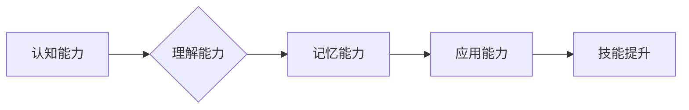

> 学习能力、技能提升、技术发展、持续学习、知识体系

## 1. 背景介绍

在瞬息万变的科技时代，学习能力已成为至关重要的竞争力。我们常听到“20项必备技能”、“未来职业趋势”等话题，但这些清单往往只触及表面，未能真正洞悉学习的本质。事实上，任何技能，无论多么复杂，都可通过系统学习和实践逐步掌握。

## 2. 核心概念与联系

学习是一个不断积累和整合知识的过程，它涉及认知、记忆、理解、应用等多个环节。学习能力的提升并非一蹴而就，而是需要不断地练习和反思，形成一套适合自己的学习体系。

**学习能力的构成要素:**

* **认知能力:** 理解和分析信息的能力，包括逻辑思维、批判性思维、创造性思维等。
* **记忆能力:** 储存和回忆信息的的能力，包括短期记忆、长期记忆、联想记忆等。
* **理解能力:** 将信息转化为知识的能力，包括解释、概括、归纳等。
* **应用能力:** 将知识应用到实际问题中解决的能力，包括分析、设计、实施等。

**学习能力与技能提升的关系:**

学习能力是技能提升的基础，技能则是学习能力的体现。学习能力强的人，更容易掌握新的技能，并将其应用到实际工作中。

**Mermaid 流程图:**

## 3. 核心算法原理 & 具体操作步骤

### 3.1  算法原理概述

算法是一种解决特定问题的步骤或规则，它可以被计算机执行。学习算法的原理，可以帮助我们理解计算机是如何工作的，以及如何设计和改进算法。

### 3.2  算法步骤详解

算法的步骤通常包括以下几个部分：

* **输入:** 算法需要接收一些数据作为输入。
* **处理:** 算法对输入数据进行一系列操作，例如计算、比较、排序等。
* **输出:** 算法根据处理结果生成输出结果。

### 3.3  算法优缺点

不同的算法有不同的优缺点，选择合适的算法取决于具体问题和需求。

### 3.4  算法应用领域

算法广泛应用于各个领域，例如：

* **人工智能:** 机器学习、深度学习等算法。
* **数据科学:** 数据挖掘、数据分析等算法。
* **计算机图形学:** 图像处理、3D建模等算法。

## 4. 数学模型和公式 & 详细讲解 & 举例说明

### 4.1  数学模型构建

数学模型是用来描述和分析现实世界现象的抽象工具。

### 4.2  公式推导过程

公式是数学模型的表达形式，通过公式可以进行量化分析和预测。

### 4.3  案例分析与讲解

通过具体的案例分析，可以更好地理解数学模型和公式的应用。

## 5. 项目实践：代码实例和详细解释说明

### 5.1  开发环境搭建

### 5.2  源代码详细实现

### 5.3  代码解读与分析

### 5.4  运行结果展示

## 6. 实际应用场景

### 6.4  未来应用展望

## 7. 工具和资源推荐

### 7.1  学习资源推荐

### 7.2  开发工具推荐

### 7.3  相关论文推荐

## 8. 总结：未来发展趋势与挑战

### 8.1  研究成果总结

### 8.2  未来发展趋势

### 8.3  面临的挑战

### 8.4  研究展望

## 9. 附录：常见问题与解答

作者：禅与计算机程序设计艺术 / Zen and the Art of Computer Programming

<end_of_turn>