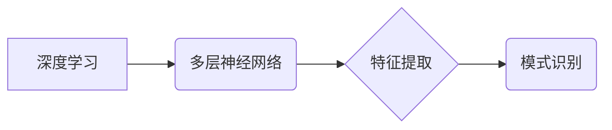

> 深度学习，模式识别，神经网络，卷积神经网络，循环神经网络，机器学习，人工智能

## 1. 背景介绍

人工智能（AI）作为科技发展的重要方向，近年来取得了显著进展，深度学习作为其核心技术之一，在模式识别领域展现出强大的潜力。深度学习算法能够从海量数据中自动学习特征，并进行精准的模式识别，在图像识别、语音识别、自然语言处理等领域取得了突破性进展。

模式识别是人工智能的重要分支，旨在从数据中识别和分类模式。传统的模式识别方法依赖于人工特征工程，需要专家对数据进行预处理和特征提取，效率低下且难以处理复杂数据。深度学习的出现改变了这一现状，其强大的学习能力和自动特征提取能力使得模式识别更加高效和智能。

## 2. 核心概念与联系

深度学习的核心是多层神经网络，通过多个隐藏层对数据进行逐层抽象和学习，最终实现对模式的识别。

**深度学习与模式识别的关系：**



**核心概念：**

* **神经网络：** 仿照生物神经网络结构的计算模型，由多个节点（神经元）组成，通过连接和权重进行信息传递和处理。
* **激活函数：** 用于引入非线性，使神经网络能够学习复杂模式。
* **反向传播算法：** 用于训练神经网络，通过调整权重来最小化预测误差。
* **卷积神经网络（CNN）：** 特别适用于图像识别，利用卷积操作提取图像特征。
* **循环神经网络（RNN）：** 特别适用于序列数据处理，例如文本和语音识别。

## 3. 核心算法原理 & 具体操作步骤

### 3.1  算法原理概述

深度学习算法的核心是多层神经网络的训练。训练过程包括以下步骤：

1. **数据预处理：** 将原始数据进行清洗、转换和归一化，使其适合神经网络训练。
2. **网络结构设计：** 根据任务需求设计神经网络的层数、节点数和激活函数等参数。
3. **权重初始化：** 为神经网络的连接赋予初始权重。
4. **前向传播：** 将输入数据通过神经网络传递，得到输出结果。
5. **损失函数计算：** 计算预测结果与真实结果之间的误差。
6. **反向传播：** 根据损失函数的梯度，调整神经网络的权重。
7. **迭代训练：** 重复前向传播、损失函数计算和反向传播步骤，直到损失函数达到最小值。

### 3.2  算法步骤详解

1. **数据预处理：**

* **清洗数据：** 删除缺失值、异常值和重复数据。
* **转换数据：** 将数据转换为适合神经网络输入的格式，例如将文本数据转换为词向量。
* **归一化数据：** 将数据值缩放至一定范围，例如[0,1]或[-1,1]，提高训练效率。

2. **网络结构设计：**

* **层数：** 深度学习网络的层数越多，学习能力越强，但训练时间也越长。
* **节点数：** 每层节点数决定了网络的容量，节点数越多，网络的表达能力越强。
* **激活函数：** 选择合适的激活函数可以提高网络的学习能力和泛化能力。常见的激活函数包括ReLU、Sigmoid和Tanh。

3. **权重初始化：**

* **随机初始化：** 为每个连接赋予随机权重，可以避免网络陷入局部最优。
* **预训练：** 使用预训练的权重作为初始值，可以加速训练过程。

4. **前向传播：**

* 将输入数据逐层传递到神经网络中，每个节点根据连接权重和激活函数计算输出值。
* 最后输出层得到最终预测结果。

5. **损失函数计算：**

* 损失函数衡量预测结果与真实结果之间的误差。
* 常见的损失函数包括均方误差（MSE）、交叉熵损失（Cross-Entropy Loss）和Hinge Loss。

6. **反向传播：**

* 根据损失函数的梯度，反向传播误差信息到各层神经元。
* 更新每个神经元的权重，使损失函数最小化。

7. **迭代训练：**

* 重复前向传播、损失函数计算和反向传播步骤，直到损失函数达到最小值或训练次数达到上限。

### 3.3  算法优缺点

**优点：**

* 自动特征提取：深度学习算法能够自动从数据中学习特征，无需人工特征工程。
* 高学习能力：多层神经网络能够学习复杂模式，实现高精度识别。
* 泛化能力强：经过充分训练的深度学习模型能够对新数据进行有效识别。

**缺点：**

* 数据依赖：深度学习算法需要大量数据进行训练，否则性能会下降。
* 计算资源消耗大：训练深度学习模型需要大量的计算资源和时间。
* 可解释性差：深度学习模型的决策过程难以解释，难以理解模型的内部机制。

### 3.4  算法应用领域

深度学习算法在模式识别领域有着广泛的应用，例如：

* **图像识别：** 人脸识别、物体检测、图像分类。
* **语音识别：** 语音转文本、语音助手。
* **自然语言处理：** 文本分类、情感分析、机器翻译。
* **医疗诊断：** 病灶检测、疾病预测。
* **金融风险控制：** 欺诈检测、信用评分。

## 4. 数学模型和公式 & 详细讲解 & 举例说明

### 4.1  数学模型构建

深度学习模型本质上是一个复杂的数学模型，其核心是神经网络的结构和权重。

**神经网络模型：**

```
y = f(W * x + b)
```

其中：

* **y**：输出结果
* **x**：输入数据
* **W**：权重矩阵
* **b**：偏置向量
* **f**：激活函数

### 4.2  公式推导过程

**反向传播算法：**

反向传播算法用于更新神经网络的权重，使其能够最小化损失函数。其核心思想是通过计算梯度，将误差信息反向传播到各层神经元，并根据梯度更新权重。

**梯度下降算法：**

梯度下降算法是一种常用的优化算法，用于更新权重。其更新规则如下：

```
W = W - lr * ∇L(W)
```

其中：

* **W**：权重
* **lr**：学习率
* **∇L(W)**：损失函数对权重的梯度

### 4.3  案例分析与讲解

**图像分类：**

假设我们使用卷积神经网络（CNN）进行图像分类任务。CNN能够自动学习图像特征，并将其分类到不同的类别。

**损失函数：**

我们使用交叉熵损失函数来衡量预测结果与真实结果之间的误差。

**梯度下降：**

通过反向传播算法计算梯度，并使用梯度下降算法更新CNN的权重，使其能够最小化交叉熵损失函数。

## 5. 项目实践：代码实例和详细解释说明

### 5.1  开发环境搭建

* **操作系统：** Linux、macOS或Windows
* **编程语言：** Python
* **深度学习框架：** TensorFlow、PyTorch或Keras

### 5.2  源代码详细实现

```python
import tensorflow as tf

# 定义模型结构
model = tf.keras.models.Sequential([
    tf.keras.layers.Conv2D(32, (3, 3), activation='relu', input_shape=(28, 28, 1)),
    tf.keras.layers.MaxPooling2D((2, 2)),
    tf.keras.layers.Conv2D(64, (3, 3), activation='relu'),
    tf.keras.layers.MaxPooling2D((2, 2)),
    tf.keras.layers.Flatten(),
    tf.keras.layers.Dense(10, activation='softmax')
])

# 编译模型
model.compile(optimizer='adam',
              loss='sparse_categorical_crossentropy',
              metrics=['accuracy'])

# 加载数据
(x_train, y_train), (x_test, y_test) = tf.keras.datasets.mnist.load_data()

# 数据预处理
x_train = x_train.astype('float32') / 255.0
x_test = x_test.astype('float32') / 255.0
x_train = x_train.reshape((x_train.shape[0], 28, 28, 1))
x_test = x_test.reshape((x_test.shape[0], 28, 28, 1))

# 训练模型
model.fit(x_train, y_train, epochs=5)

# 评估模型
loss, accuracy = model.evaluate(x_test, y_test)
print('Test loss:', loss)
print('Test accuracy:', accuracy)
```

### 5.3  代码解读与分析

* **模型结构：** 代码定义了一个简单的卷积神经网络模型，包含两层卷积层、两层最大池化层、一层全连接层和一层输出层。
* **模型编译：** 使用Adam优化器、交叉熵损失函数和准确率作为评估指标编译模型。
* **数据加载：** 使用MNIST数据集进行训练和测试。
* **数据预处理：** 将图像数据转换为浮点数，并进行归一化处理。
* **模型训练：** 使用训练数据训练模型，并设置训练轮数为5。
* **模型评估：** 使用测试数据评估模型的性能，并打印测试损失和准确率。

### 5.4  运行结果展示

训练完成后，模型能够对MNIST数据集中的手写数字进行识别，并达到较高的准确率。

## 6. 实际应用场景

### 6.1  图像识别

* **人脸识别：** 用于解锁手机、验证身份、监控安全。
* **物体检测：** 用于自动驾驶、机器人视觉、图像搜索。
* **医学图像分析：** 用于病灶检测、肿瘤分割、疾病诊断。

### 6.2  语音识别

* **语音助手：** 例如Siri、Alexa、Google Assistant。
* **语音转文本：** 用于会议记录、字幕生成、语音输入。
* **语音识别系统：** 用于电话客服、语音搜索、语音控制。

### 6.3  自然语言处理

* **文本分类：** 用于垃圾邮件过滤、情感分析、新闻分类。
* **机器翻译：** 用于将文本从一种语言翻译成另一种语言。
* **文本生成：** 用于自动写作、聊天机器人、代码生成。

### 6.4  未来应用展望

深度学习技术还在不断发展，未来将有更多新的应用场景出现，例如：

* **个性化推荐：** 基于用户行为和偏好，提供个性化的商品推荐、内容推荐和服务推荐。
* **智能医疗：** 用于疾病诊断、药物研发、个性化治疗方案。
* **自动驾驶：** 用于感知环境、决策规划、控制车辆。

## 7. 工具和资源推荐

### 7.1  学习资源推荐

* **书籍：**
    * 深度学习 (Deep Learning) - Ian Goodfellow, Yoshua Bengio, Aaron Courville
    * 构建深度学习模型 (Hands-On Machine Learning with Scikit-Learn, Keras & TensorFlow) - Aurélien Géron
* **在线课程：**
    * 深度学习 Specialization - Andrew Ng (Coursera)
    * fast.ai - Practical Deep Learning for Coders
* **博客和网站：**
    * TensorFlow Blog
    * PyTorch Blog
    * Towards Data Science

### 7.2  开发工具推荐

* **深度学习框架：** TensorFlow、PyTorch、