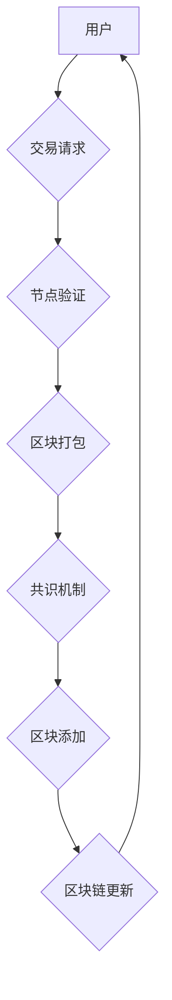

> 区块链，加密货币，去中心化，分布式账本，共识机制，智能合约

## 1. 背景介绍

区块链技术近年来备受关注，其底层原理和应用场景引发了广泛的讨论和探索。从比特币的诞生到以太坊的兴起，区块链技术已经从最初的加密货币应用领域扩展到金融、供应链、医疗、政务等多个领域。

区块链技术的出现，标志着一种全新的数据存储和管理方式的诞生。它打破了传统中心化数据库的局限性，实现了数据分布式存储和共享，具有不可篡改、透明、安全等特点，为构建信任和协作提供了新的可能性。

## 2. 核心概念与联系

**2.1 区块链的基本概念**

区块链是一种分布式、去中心化的、公开透明的账本技术。它由一系列相互连接的“区块”组成，每个区块包含一组交易记录，并通过加密算法与前一个区块链接在一起，形成一个不可篡改的链条。

**2.2 区块链的结构**

* **区块 (Block):** 存储交易数据的基本单元，包含交易记录、时间戳、前一个区块的哈希值等信息。
* **链 (Chain):** 由多个区块链接而成的序列，形成一个不可篡改的账本。
* **节点 (Node):** 网络中的参与者，每个节点都拥有完整的区块链副本，并参与验证和维护区块链的完整性。
* **共识机制 (Consensus Mechanism):** 确保所有节点达成一致，验证交易并添加区块到链上的机制。

**2.3 区块链的特性**

* **去中心化 (Decentralization):** 区块链没有中心控制机构，数据分布在所有节点中，任何单一节点都不能控制整个网络。
* **透明公开 (Transparency):** 所有交易记录都公开透明，任何人都可以查看区块链上的历史数据。
* **不可篡改 (Immutability):** 由于区块链的加密算法和链接机制，一旦交易记录被添加到区块链中，就无法被修改或删除。
* **安全可靠 (Security):** 区块链的加密算法和分布式特性，使得它具有很高的安全性，难以被攻击者篡改或破坏。

**2.4 区块链的架构**



## 3. 核心算法原理 & 具体操作步骤

**3.1 算法原理概述**

区块链的核心算法包括哈希算法、加密算法和共识机制。

* **哈希算法:** 用于生成区块的唯一标识，确保数据不可篡改。
* **加密算法:** 用于保护交易数据和区块链的安全性。
* **共识机制:** 用于确保所有节点达成一致，验证交易并添加区块到链上。

**3.2 算法步骤详解**

1. **交易请求:** 用户发起交易请求，包含交易方、交易金额、交易内容等信息。
2. **交易广播:** 节点将交易请求广播到整个网络。
3. **节点验证:** 节点验证交易的合法性，例如交易金额是否充足、交易方是否合法等。
4. **区块打包:** 验证通过的交易被打包成一个区块。
5. **共识机制:** 节点通过共识机制达成一致，验证区块的合法性并将其添加到区块链中。
6. **区块链更新:** 所有节点的区块链副本都会更新，包含新的区块。

**3.3 算法优缺点**

* **优点:**
    * 不可篡改性强
    * 透明公开
    * 安全可靠
* **缺点:**
    * 性能有限
    * 隐私性不足
    * 开发成本高

**3.4 算法应用领域**

* **加密货币:** 比特币、以太坊等
* **供应链管理:** 追踪商品的来源和流通路径
* **医疗保健:** 安全存储和共享患者医疗记录
* **政务服务:** 提供透明、可信的政务服务

## 4. 数学模型和公式 & 详细讲解 & 举例说明

**4.1 数学模型构建**

区块链的数学模型主要基于哈希函数、密码学和概率论。

* **哈希函数:** 将任意长度的数据映射到固定长度的哈希值，具有单向性和抗碰撞性。
* **密码学:** 用于加密和解密数据，确保交易数据的安全性。
* **概率论:** 用于构建共识机制，确保网络的稳定性和安全性。

**4.2 公式推导过程**

* **哈希函数:**  H(x) = y，其中 x 是输入数据，y 是哈希值。
* **加密算法:** E(k, m) = c，其中 k 是密钥，m 是明文，c 是密文。
* **共识机制:** 概率论公式用于计算节点达成一致的概率。

**4.3 案例分析与讲解**

* **哈希函数应用:** 在区块链中，每个区块的哈希值取决于该区块的所有数据，包括交易记录、时间戳、前一个区块的哈希值等。当区块中的任何数据发生改变时，其哈希值也会发生改变，从而保证区块链的不可篡改性。
* **加密算法应用:** 区块链中的交易数据使用加密算法进行加密，确保交易数据的安全性。只有拥有私钥的交易方才能解密交易数据。
* **共识机制应用:** 以太坊区块链使用 Proof-of-Stake (PoS) 共识机制，节点通过质押 ETH 来获得参与验证交易和添加区块的权利。节点的质押量越大，获得验证权的概率越高。

## 5. 项目实践：代码实例和详细解释说明

**5.1 开发环境搭建**

* 安装 Go 语言环境
* 安装区块链开发工具，例如 Hyperledger Fabric 或 Ethereum

**5.2 源代码详细实现**

```go
package main

import (
\t"fmt"
\t"crypto/sha256"
)

type Block struct {
\tTimestamp string
\tData      string
\tHash      string
\tPrevHash  string
}

func NewBlock(timestamp string, data string, prevHash string) *Block {
\tblock := &Block{
\t\tTimestamp: timestamp,
\t\tData:      data,
\t\tPrevHash:  prevHash,
\t\tHash:      calculateHash(timestamp, data, prevHash),
\t}
\treturn block
}

func calculateHash(timestamp string, data string, prevHash string) string {
\th := sha256.New()
\th.Write([]byte(timestamp + data + prevHash))
\treturn fmt.Sprintf("%x", h.Sum(nil))
}

func main() {
\t// 创建第一个区块
\tgenesisBlock := NewBlock("2023-03-01", "Genesis Block", "")

\t// 创建第二个区块
\tsecondBlock := NewBlock("2023-03-02", "Second Block", genesisBlock.Hash)

\t// 打印区块信息
\tfmt.Println("Genesis Block:")
\tfmt.Println(genesisBlock)
\tfmt.Println("Second Block:")
\tfmt.Println(secondBlock)
}
```

**5.3 代码解读与分析**

* 该代码实现了一个简单的区块链示例，包含了区块结构、哈希函数和区块创建函数。
* 每个区块包含时间戳、数据、哈希值和前一个区块的哈希值。
* 哈希函数用于生成区块的唯一标识，确保数据不可篡改。
* 代码演示了如何创建两个区块，并打印区块信息。

**5.4 运行结果展示**

运行代码后，将输出两个区块的信息，包括时间戳、数据、哈希值和前一个区块的哈希值。

## 6. 实际应用场景

**6.1 金融领域**

* **跨境支付:** 区块链可以简化跨境支付流程，降低成本和时间。
* **数字资产管理:** 区块链可以安全地存储和管理数字资产，例如加密货币和代币。
* **金融合规性:** 区块链可以帮助金融机构提高合规性，例如反洗钱和反恐融资。

**6.2 供应链管理**

* **商品追溯:** 区块链可以追踪商品的来源和流通路径，提高供应链透明度。
* **库存管理:** 区块链可以帮助企业实时监控库存水平，优化库存管理。
* **物流跟踪:** 区块链可以跟踪货物运输过程，提高物流效率。

**6.3 医疗保健**

* **电子病历:** 区块链可以安全存储和共享患者电子病历，提高医疗数据安全性和隐私性。
* **药物溯源:** 区块链可以追踪药物的生产、流通和使用过程，防止假药流通。
* **临床试验:** 区块链可以提高临床试验的透明度和安全性。

**6.4 其他领域**

* **政务服务:** 区块链可以提供透明、可信的政务服务，例如身份认证和投票。
* **教育:** 区块链可以用于颁发数字证书和记录学业成绩。
* **艺术品交易:** 区块链可以帮助艺术家证明作品的版权和 provenance。

**6.5 未来应用展望**

区块链技术的发展潜力巨大，未来将应用于更多领域，例如：

* **元宇宙:** 区块链可以为元宇宙提供底层基础设施，例如数字资产管理和身份认证。
* **人工智能:** 区块链可以用于训练和部署人工智能模型，提高模型的安全性和透明度。
* **物联网:** 区块链可以连接和管理物联网设备，提高物联网的安全性和可靠性。

## 7. 工具和资源推荐

**7.1 学习资源推荐**

* **书籍:**
    * 《区块链：从原理到实践》
    * 《Mastering Bitcoin》
* **在线课程:**
    * Coursera: Blockchain Specialization
    * edX: Blockchain Fundamentals
* **博客和网站:**
    * Bitcoin.org
    * Ethereum.org
    * CoinDesk

**7.2 开发工具推荐**

* **Hyperledger Fabric:** 开源区块链平台，适合企业级应用。
* **Ethereum:** 开源区块链平台，支持智能合约。
* **Corda:** 开源区块链平台，专注于金融应用。

**7.3 相关论文推荐**

* **Bitcoin: A Peer-to-Peer Electronic Cash System**
* **Ethereum: A Secure Scalable and Flexible Blockchain**
* **Hyperledger Fabric: A Distributed Operating System for Permissioned Blockchains**

## 8. 总结：未来发展趋势与挑战

**8.1 研究成果总结**

区块链技术已经取得了显著的进展，在金融、供应链、医疗保健等领域取得了成功应用。

**8.2 未来发展趋势**

* **性能提升:** 研究者们正在探索提高区块链性能的方法，例如分片技术和闪电网络。
* **隐私保护:** 研究者们正在开发隐私保护机制，例如零知识证明和同态加密。
* **跨链互操作性:** 研究者们正在开发跨链互操作性协议，使不同区块链之间可以互通。

**8.3 面临的挑战**

* **可扩展性:** 区块链的处理能力有限，难以满足大规模应用的需求。
* **监管环境:** 区块链技术的监管环境尚不完善，需要制定相应的法律法规。
* **技术复杂性:** 区块链技术复杂，需要专业的技术人员进行开发和维护。

**8.4 研究展望**

未来，区块链技术将继续发展，并应用于更多领域。研究者们将继续探索区块链技术的潜力，解决其面临的挑战，推动区块链技术向更安全、更可靠、更可扩展的方向发展。

## 9. 附录：常见问题与解答

**9.1 区块链和数据库有什么区别？**

区块链是一种分布式、去中心化的账本技术，而数据库是一种集中式的数据存储系统。区块链的数据分布在所有