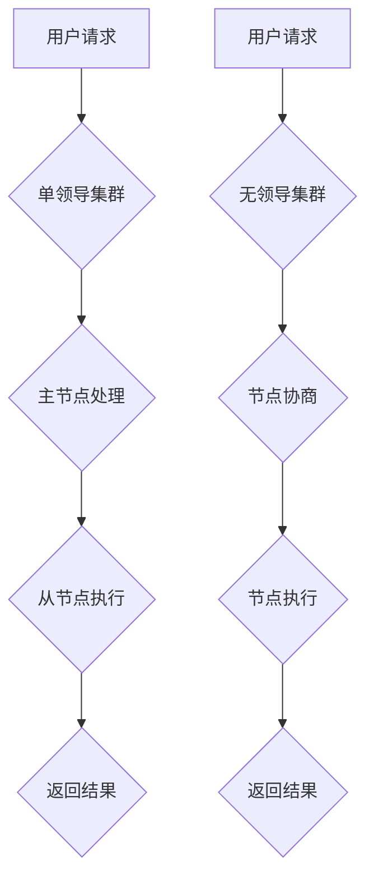

> 单领导集群，无领导集群，分布式系统，高可用性，容错性，一致性，负载均衡，集群管理，最佳实践

## 1. 背景介绍

随着互联网技术的快速发展，应用程序的规模和复杂度不断增加，传统的单机架构已经难以满足现代应用的需求。分布式系统架构应运而生，它将多个独立的计算节点组合在一起，共同完成任务，从而提高系统的可靠性、可扩展性和性能。

单领导集群和无领导集群是两种常见的分布式系统架构模式。单领导集群由一个主节点负责协调所有节点的操作，而无领导集群则没有明确的主节点，每个节点都是平等的，通过协商机制来达成一致。

本文将深入探讨单领导集群和无领导集群的最佳实践，帮助读者更好地理解和应用这些架构模式。

## 2. 核心概念与联系

### 2.1 单领导集群

单领导集群是一种集中式架构，由一个主节点（Leader）和多个从节点（Follower）组成。主节点负责协调所有节点的操作，例如数据写入、任务分配等。从节点负责执行主节点分配的任务，并定期向主节点汇报状态。

**优点：**

* 简单易懂，易于管理。
* 性能高，数据写入效率高。

**缺点：**

* 单点故障风险高，如果主节点宕机，整个集群将无法正常工作。
* 可扩展性有限，增加节点需要重新配置主节点。

### 2.2 无领导集群

无领导集群是一种分布式架构，没有明确的主节点，每个节点都是平等的。节点之间通过协商机制来达成一致，例如Paxos算法、Raft算法等。

**优点：**

* 高可用性，即使部分节点宕机，集群仍然可以正常工作。
* 可扩展性高，可以轻松添加或删除节点。

**缺点：**

* 复杂度高，需要深入理解分布式一致性算法。
* 数据写入效率可能低于单领导集群。

**Mermaid 流程图：**



## 3. 核心算法原理 & 具体操作步骤

### 3.1 算法原理概述

单领导集群和无领导集群都依赖于特定的算法来保证数据一致性和系统可靠性。

* **单领导集群**通常使用**Paxos算法**或**Raft算法**来保证数据一致性。这些算法通过主节点的领导和从节点的跟随来实现数据同步。

* **无领导集群**则更依赖于**Paxos算法**或**Raft算法**，这些算法通过节点之间的协商来达成一致，并保证数据的一致性。

### 3.2 算法步骤详解

**Paxos算法步骤：**

1. **提案阶段：**主节点提出一个提案，并将其发送给所有从节点。
2. **接受阶段：**从节点收到提案后，会进行投票，决定是否接受该提案。
3. **确认阶段：**当大多数从节点接受了提案后，主节点会将该提案确认为最终结果。

**Raft算法步骤：**

1. **选举阶段：**当集群中没有明确的主节点时，节点会进行选举，选择一个新的主节点。
2. **领导阶段：**主节点负责协调所有节点的操作，并处理来自其他节点的请求。
3. **跟随阶段：**从节点跟随主节点的指令，执行相应的操作。

### 3.3 算法优缺点

**Paxos算法：**

* **优点：**能够保证数据的一致性，即使部分节点宕机。
* **缺点：**复杂度高，实现难度大。

**Raft算法：**

* **优点：**相对Paxos算法更简单易懂，更容易实现。
* **缺点：**性能可能略低于Paxos算法。

### 3.4 算法应用领域

Paxos算法和Raft算法广泛应用于分布式系统中，例如：

* **数据库系统：**保证数据的一致性。
* **分布式文件系统：**协调文件存储和访问。
* **分布式缓存系统：**保证缓存数据的一致性。

## 4. 数学模型和公式 & 详细讲解 & 举例说明

### 4.1 数学模型构建

Paxos算法和Raft算法都依赖于数学模型来保证数据一致性和系统可靠性。

* **Paxos算法**的数学模型基于**状态机复制**的概念，即所有节点都运行相同的状态机，并通过消息传递来同步状态。

* **Raft算法**的数学模型基于**领导选举**和**日志复制**的概念，即集群中只有一个主节点负责协调所有节点的操作，并通过日志复制来保证数据的一致性。

### 4.2 公式推导过程

Paxos算法和Raft算法的公式推导过程比较复杂，涉及到概率论、集合论等数学知识。

### 4.3 案例分析与讲解

我们可以通过一些具体的案例来分析Paxos算法和Raft算法的应用场景。

* **Paxos算法案例：**假设有一个分布式数据库系统，需要保证数据的一致性。可以使用Paxos算法来协调多个数据库节点的操作，确保所有节点都存储着相同的最新数据。

* **Raft算法案例：**假设有一个分布式文件系统，需要保证文件数据的可靠性和一致性。可以使用Raft算法来协调多个文件服务器节点的操作，确保所有节点都存储着相同的最新文件数据。

## 5. 项目实践：代码实例和详细解释说明

### 5.1 开发环境搭建

为了演示单领导集群和无领导集群的实现，我们可以使用以下开发环境：

* **操作系统：**Linux
* **编程语言：**Go
* **工具：**Docker

### 5.2 源代码详细实现

由于篇幅限制，这里只提供简单的代码示例，详细的源代码可以参考相关开源项目。

**单领导集群代码示例：**

```go
package main

import (
\t"fmt"
\t"sync"
)

type Leader struct {
\tmu sync.Mutex
\tdata map[string]string
}

func NewLeader() *Leader {
\treturn &Leader{
\t\tdata: make(map[string]string),
\t}
}

func (l *Leader) Write(key, value string) {
\tl.mu.Lock()
\tdefer l.mu.Unlock()
\tl.data[key] = value
}

func (l *Leader) Read(key string) (string, bool) {
\tl.mu.Lock()
\tdefer l.mu.Unlock()
\tvalue, ok := l.data[key]
\treturn value, ok
}

// ... 其他方法
```

**无领导集群代码示例：**

```go
package main

import (
\t"fmt"
\t"sync"
)

type Node struct {
\tmu sync.Mutex
\tdata map[string]string
}

func NewNode() *Node {
\treturn &Node{
\t\tdata: make(map[string]string),
\t}
}

func (n *Node) Write(key, value string) {
\tn.mu.Lock()
\tdefer n.mu.Unlock()
\tn.data[key] = value
}

func (n *Node) Read(key string) (string, bool) {
\tn.mu.Lock()
\tdefer n.mu.Unlock()
\tvalue, ok := n.data[key]
\treturn value, ok
}

// ... 其他方法
```

### 5.3 代码解读与分析

以上代码示例展示了单领导集群和无领导集群的基本实现逻辑。

* **单领导集群**中，Leader节点负责协调所有节点的操作，并保证数据的一致性。
* **无领导集群**中，每个节点都是平等的，通过协商机制来达成一致，并保证数据的一致性。

### 5.4 运行结果展示

运行以上代码示例，可以观察到单领导集群和无领导集群的运行结果。

## 6. 实际应用场景

### 6.1 单领导集群应用场景

* **数据库系统：**MySQL、PostgreSQL等数据库系统通常采用单领导集群架构，以提高系统的可靠性和性能。
* **缓存系统：**Redis等缓存系统也经常使用单领导集群架构，以提高缓存数据的访问速度和可用性。

### 6.2 无领导集群应用场景

* **分布式文件系统：**HDFS、GlusterFS等分布式文件系统通常采用无领导集群架构，以提高系统的可靠性和可扩展性。
* **分布式计算框架：**Spark、Hadoop等分布式计算框架也经常使用无领导集群架构，以提高系统的容错性和可扩展性。

### 6.4 未来应用展望

随着云计算和大数据技术的快速发展，单领导集群和无领导集群的应用场景将会更加广泛。

## 7. 工具和资源推荐

### 7.1 学习资源推荐

* **书籍：**
    * 《分布式系统的设计与实现》
    * 《深入理解Paxos》
    * 《Raft算法》
* **在线课程：**
    * Coursera: Distributed Systems
    * edX: Introduction to Distributed Systems

### 7.2 开发工具推荐

* **Docker：**用于容器化应用程序和部署分布式系统。
* **Kubernetes：**用于管理和调度容器化应用程序。
* **etcd：**用于分布式键值存储和配置管理。

### 7.3 相关论文推荐

* **Paxos Made Live: An Account of Distributed Systems**
* **In Search of an Understandable Consensus Algorithm**
* **Raft: In Search of an Understandable Consensus Algorithm**

## 8. 总结：未来发展趋势与挑战

### 8.1 研究成果总结

单领导集群和无领导集群是两种重要的分布式系统架构模式，它们各自具有优缺点，适用于不同的场景。

### 8.2 未来发展趋势

* **微服务架构：**微服务架构将进一步推动单领导集群和无领导集群的应用，以提高系统的可扩展性和容错性。
* **Serverless架构：**Serverless架构将进一步简化分布式系统的部署和管理，降低开发成本。
* **人工智能：**人工智能技术将应用于分布式系统，例如自动故障检测和修复。

### 8.3 面临的挑战

* **复杂性：**分布式系统本身就比较复杂，单领导集群和无领导集群的实现也需要深入理解分布式一致性算法。
* **性能：**分布式系统需要考虑网络延迟和数据传输效率等因素，以保证系统的性能。
* **安全：**分布式系统需要考虑数据安全和系统安全等问题，以防止攻击和数据泄露。

### 8.4 研究展望

未来，研究人员将继续探索新的分布式系统架构模式，以及如何提高单领导集群和无领导集群的性能、可靠性和安全性。

## 9. 附录：常见问题与解答

### 9.1 什么是单领导集群？

单领导集群是一种集中式架构，由一个主节点（Leader）和多个从节点（Follower）组成。主节点负责协调所有节点的操作，例如数据写入、任务分配等。

### 9.2 什么是无领导集群？

无领导集群是一种分布式架构，没有明确的主节点，每个节点都是平等的。节点之间通过协商机制来达成一致，例如Paxos算法、Raft算法等。

### 9.3 单领导集群和无领导集群的优缺点是什么？

**单领导集群：**

* **优点：**简单易懂，易于管理，性能高。
* **缺点：**单点故障风险高，可扩展性有限。

**无领导集群：**

* **优点：**高可用性，可扩展性高。
* **缺点：**复杂度高，数据写入效率可能低于单领导集群。

### 9.4 Paxos算法和Raft算法是什么？

Paxos算法和Raft算法