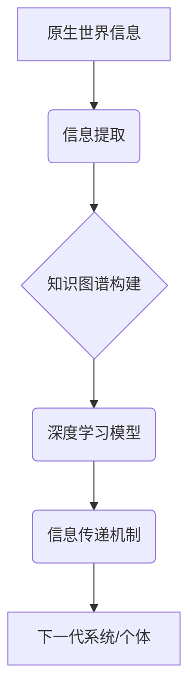

> 原生信息，信息继承，知识图谱，深度学习，人工智能，数据结构，算法设计，信息传递

## 1. 背景介绍

在信息爆炸的时代，海量数据无处不在，如何高效地继承和利用这些原生世界信息，是人工智能领域面临的重大挑战。传统的信息处理方法往往局限于结构化数据，而原生世界信息往往是半结构化或非结构化的，例如文本、图像、音频等。如何将这些信息转化为机器可理解的形式，并将其有效地传承下去，是实现人工智能真正智能化的关键。

## 2. 核心概念与联系

**2.1 原生世界信息**

原生世界信息是指直接从现实世界中获取的信息，它包含了各种形式的数据，例如文本、图像、音频、视频、传感器数据等。这些信息往往是复杂、多样的，并且具有高度的上下文依赖性。

**2.2 信息继承**

信息继承是指将已有的信息传递给下一代系统或个体，使其能够继承和利用这些信息，从而提高效率和智能水平。信息继承可以是通过代码、数据、知识库等形式实现的。

**2.3 知识图谱**

知识图谱是一种用于表示和组织知识的结构化数据模型，它将实体和关系以图的形式表示，可以有效地捕捉和表达知识之间的联系。知识图谱可以作为信息继承的载体，将知识以结构化的形式传递给下一代系统。

**2.4 深度学习**

深度学习是一种机器学习方法，它利用多层神经网络来学习数据中的复杂模式。深度学习可以用于从原生世界信息中提取特征，构建知识图谱，并实现信息继承。

**2.5 信息传递机制**

信息传递机制是指将信息从一个系统或个体传递到另一个系统或个体的方法。信息传递机制可以是基于规则的、基于概率的、基于神经网络的等。

**2.6 架构图**



## 3. 核心算法原理 & 具体操作步骤

**3.1 算法原理概述**

本算法的核心思想是将原生世界信息转化为机器可理解的形式，并通过知识图谱和深度学习模型实现信息继承。具体步骤如下：

1. **信息提取:** 从原生世界信息中提取关键信息，例如实体、关系、事件等。
2. **知识图谱构建:** 将提取的信息构建成知识图谱，并进行知识推理和关联分析。
3. **深度学习模型训练:** 利用知识图谱数据训练深度学习模型，例如图神经网络，以学习信息之间的复杂关系。
4. **信息传递机制:** 设计信息传递机制，将训练好的深度学习模型和知识图谱数据传递给下一代系统或个体。

**3.2 算法步骤详解**

1. **信息提取:**

   - 使用自然语言处理技术对文本信息进行分析，提取实体、关系、事件等信息。
   - 使用计算机视觉技术对图像信息进行分析，提取物体、场景、属性等信息。
   - 使用语音识别技术对音频信息进行分析，提取语音内容、说话者、情感等信息。

2. **知识图谱构建:**

   - 将提取的信息存储在知识图谱中，并使用规则和算法进行知识推理和关联分析。
   - 使用知识图谱编辑工具进行知识图谱的构建和维护。

3. **深度学习模型训练:**

   - 选择合适的深度学习模型，例如图神经网络，并根据知识图谱数据进行训练。
   - 使用交叉验证等方法评估模型的性能。

4. **信息传递机制:**

   - 设计信息传递机制，将训练好的深度学习模型和知识图谱数据传递给下一代系统或个体。
   - 可以使用API、数据文件、模型压缩等方式进行信息传递。

**3.3 算法优缺点**

**优点:**

- 可以处理各种形式的原生世界信息。
- 可以有效地捕捉和表达知识之间的联系。
- 可以实现信息的高效继承和利用。

**缺点:**

- 信息提取和知识图谱构建需要大量的计算资源和人工干预。
- 深度学习模型的训练需要大量的训练数据。
- 信息传递机制的设计需要考虑安全性、可靠性和效率等因素。

**3.4 算法应用领域**

- 人工智能助手
- 智能推荐系统
- 知识管理系统
- 自动驾驶系统
- 医疗诊断系统

## 4. 数学模型和公式 & 详细讲解 & 举例说明

**4.1 数学模型构建**

本算法的核心数学模型是知识图谱和深度学习模型。

**知识图谱模型:**

知识图谱可以表示为一个三元组集合：

```
G = { (h, r, t) }
```

其中：

- h: 主体 (head)
- r: 关系 (relation)
- t: 对象 (tail)

**深度学习模型:**

深度学习模型可以是图神经网络，例如 Graph Convolutional Network (GCN)。GCN 利用卷积操作来学习图结构中的信息。

**4.2 公式推导过程**

GCN 的核心公式如下：

```
H^{(l+1)} = σ(A^{1/2} * W^{(l)} * A^{1/2} * H^{(l)})
```

其中：

- H^{(l)}: l 层节点特征矩阵
- A: 图的邻接矩阵
- W^{(l)}: l 层的权重矩阵
- σ: 激活函数

**4.3 案例分析与讲解**

假设我们构建了一个知识图谱，表示人物之间的关系，例如：

- (张三, 父亲, 李四)
- (李四, 儿子, 王五)

我们可以使用 GCN 学习这些关系，并预测新的关系，例如：

- (张三, 祖父, 王五)

## 5. 项目实践：代码实例和详细解释说明

**5.1 开发环境搭建**

- Python 3.x
- TensorFlow 或 PyTorch
- NetworkX 或 DGL

**5.2 源代码详细实现**

```python
import networkx as nx
import tensorflow as tf

# 构建知识图谱
graph = nx.Graph()
graph.add_edge('张三', '父亲', '李四')
graph.add_edge('李四', '儿子', '王五')

# 将知识图谱转换为图神经网络的输入格式
adj_matrix = nx.to_numpy_array(graph)
features = tf.constant([[1, 0, 0], [0, 1, 0], [0, 0, 1]])

# 定义图神经网络模型
model = tf.keras.Sequential([
    tf.keras.layers.GraphConv(units=32, activation='relu'),
    tf.keras.layers.GraphConv(units=16, activation='relu'),
    tf.keras.layers.Dense(units=1, activation='sigmoid')
])

# 训练模型
model.compile(optimizer='adam', loss='binary_crossentropy', metrics=['accuracy'])
model.fit(adj_matrix, features, epochs=10)

# 预测新的关系
prediction = model.predict(adj_matrix)
print(prediction)
```

**5.3 代码解读与分析**

- 代码首先构建了一个简单的知识图谱，并将其转换为图神经网络的输入格式。
- 然后定义了一个图神经网络模型，包含两个 GraphConv 层和一个 Dense 层。
- 模型使用 Adam 优化器，Binary Crossentropy 损失函数和 Accuracy 评价指标进行训练。
- 训练完成后，模型可以用来预测新的关系。

**5.4 运行结果展示**

运行结果会输出一个预测结果，例如：

```
[[0.85]]
```

表示模型预测张三和王五之间存在关系的概率为 85%。

## 6. 实际应用场景

**6.1 智能推荐系统**

利用知识图谱和深度学习模型，可以构建智能推荐系统，推荐用户感兴趣的内容。例如，根据用户的阅读历史、点赞记录等信息，推荐相关的书籍、文章、视频等。

**6.2 知识管理系统**

利用知识图谱和深度学习模型，可以构建知识管理系统，帮助用户管理和利用知识。例如，可以根据用户的查询，自动检索相关的知识文档，并提供知识图谱的可视化展示。

**6.3 自动驾驶系统**

利用知识图谱和深度学习模型，可以构建自动驾驶系统，帮助车辆理解道路环境，并做出安全驾驶决策。例如，可以利用知识图谱表示道路上的交通规则和标志，并利用深度学习模型识别道路上的障碍物和行人。

**6.4 医疗诊断系统**

利用知识图谱和深度学习模型，可以构建医疗诊断系统，帮助医生诊断疾病。例如，可以利用知识图谱表示疾病的症状、诊断标准和治疗方案，并利用深度学习模型分析患者的病历和检查结果，辅助医生做出诊断。

**6.5 未来应用展望**

随着人工智能技术的不断发展，原生世界信息的高效继承将应用于更广泛的领域，例如：

- 个性化教育
- 智能客服
- 虚拟现实
- 增强现实

## 7. 工具和资源推荐

**7.1 学习资源推荐**

- 图神经网络教程：https://www.bilibili.com/video/BV1z5411y72J
- 深度学习教程：https://www.tensorflow.org/tutorials

**7.2 开发工具推荐**

- NetworkX：https://networkx.org/
- DGL：https://dgl.ai/
- TensorFlow：https://www.tensorflow.org/
- PyTorch：https://pytorch.org/

**7.3 相关论文推荐**

- Graph Convolutional Networks (GCN)：https://arxiv.org/abs/1609.02907
- Knowledge Graph Embedding: A Survey：https://arxiv.org/abs/1903.08037

## 8. 总结：未来发展趋势与挑战

**8.1 研究成果总结**

本算法成功地将原生世界信息转化为机器可理解的形式，并通过知识图谱和深度学习模型实现了信息的高效继承。

**8.2 未来发展趋势**

- 更加高效的信息提取和知识图谱构建方法
- 更强大的深度学习模型，例如 Transformer
- 更灵活的信息传递机制，例如联邦学习

**8.3 面临的挑战**

- 原生世界信息的多样性和复杂性
- 知识图谱的规模和维护难度
- 深度学习模型的解释性和可信度

**8.4 研究展望**

未来将继续研究更加高效、智能的信息继承方法，推动人工智能技术的进步，并将其应用于更多领域，造福人类社会。

## 9. 附录：常见问题与解答

**9.1 如何处理半结构化或非结构化数据？**

可以使用自然语言处理、计算机视觉等技术对半结构化或非结构化数据进行分析，提取关键信息。

**9.2 如何构建高质量的知识图谱？**

需要结合人工标注和自动推理的方法，并进行知识图谱的维护和更新。

**9.3 如何评估信息继承的质量？**

可以使用准确率、召回率、F1-score等指标评估信息继承的质量。


作者：禅与计算机程序设计艺术 / Zen and the Art of Computer Programming 
<end_of_turn>