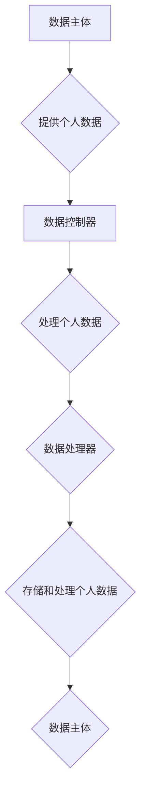

> 数据隐私，GDPR，国际化，数据保护，隐私政策，数据安全，数据治理，合规性

## 1. 背景介绍

在全球化时代，数据已成为重要的生产要素，其跨境流动日益频繁。然而，数据跨境流动也带来了新的挑战，特别是数据隐私和保护问题。不同国家和地区对数据隐私的理解和保护标准存在差异，这使得企业在进行跨境数据处理时面临着复杂的合规性挑战。

欧盟通用数据保护条例（GDPR）于2018年5月25日正式生效，标志着全球数据隐私保护进入了一个新的时代。GDPR对个人数据处理的范围、主体权利、数据安全和跨境数据传输等方面都做出了严格规定，对全球企业的数据处理活动产生了深远影响。

## 2. 核心概念与联系

GDPR的核心概念包括：

* **个人数据：**任何可以识别特定自然人的信息，包括姓名、地址、电子邮件地址、IP地址等。
* **数据主体：**拥有个人数据的自然人。
* **数据控制器：**决定个人数据处理目的和方式的实体。
* **数据处理器：**为数据控制器处理个人数据的实体。
* **数据安全：**采取适当的技术和组织措施，保护个人数据免受未经授权的访问、使用、披露、修改或销毁。

**GDPR流程图**



## 3. 核心算法原理 & 具体操作步骤

GDPR本身并不涉及具体的算法原理，而是通过制定法律法规和标准，规范数据处理活动。然而，在实际操作中，一些算法和技术可以帮助企业实现GDPR合规。

### 3.1  算法原理概述

* **数据匿名化：**通过删除或修改个人识别信息，使数据无法识别特定自然人。
* **数据加密：**使用加密算法对个人数据进行加密，防止未经授权的访问。
* **访问控制：**通过身份验证和授权机制，控制对个人数据的访问权限。
* **日志记录：**记录所有对个人数据的访问和操作，以便进行审计和追溯。

### 3.2  算法步骤详解

* **数据匿名化：**
    1. 识别个人识别信息。
    2. 删除或修改个人识别信息。
    3. 对匿名化后的数据进行验证，确保无法识别特定自然人。
* **数据加密：**
    1. 选择合适的加密算法。
    2. 生成密钥对。
    3. 对个人数据进行加密。
    4. 使用密钥解密数据。
* **访问控制：**
    1. 设置用户身份验证机制。
    2. 定义角色和权限。
    3. 控制对个人数据的访问权限。
* **日志记录：**
    1. 记录所有对个人数据的访问和操作。
    2. 保存日志记录。
    3. 定期审计日志记录。

### 3.3  算法优缺点

* **数据匿名化：**
    * 优点：可以有效保护个人隐私。
    * 缺点：可能会导致数据价值降低。
* **数据加密：**
    * 优点：可以防止未经授权的访问。
    * 缺点：可能会增加数据处理成本。
* **访问控制：**
    * 优点：可以确保数据安全。
    * 缺点：需要复杂的管理机制。
* **日志记录：**
    * 优点：可以进行审计和追溯。
    * 缺点：可能会产生大量的日志数据。

### 3.4  算法应用领域

* **医疗保健：**保护患者医疗信息隐私。
* **金融服务：**保护客户财务信息安全。
* **电子商务：**保护客户个人信息和交易数据。
* **社交媒体：**保护用户个人信息和隐私。

## 4. 数学模型和公式 & 详细讲解 & 举例说明

GDPR涉及到一些数学模型和公式，例如：

* **风险评估：**GDPR要求数据控制器进行风险评估，以确定处理个人数据可能带来的风险。风险评估通常使用数学模型来量化风险。
* **数据加密：**数据加密算法通常使用数学公式来实现加密和解密。

### 4.1  数学模型构建

风险评估模型通常基于以下因素：

* **数据敏感性：**不同类型的个人数据具有不同的敏感性。
* **数据处理目的：**数据处理的目的也会影响风险水平。
* **数据处理方式：**数据处理的方式也会影响风险水平。
* **安全措施：**数据控制器采取的安全措施也会影响风险水平。

### 4.2  公式推导过程

风险评估模型的公式推导过程通常比较复杂，涉及到概率论、统计学和风险管理等多个领域。

### 4.3  案例分析与讲解

例如，假设一个电商平台处理用户姓名、地址、电话号码等个人数据。

* 数据敏感性：这些数据属于中等敏感性。
* 数据处理目的：用于订单处理、物流配送和客户服务。
* 数据处理方式：数据存储在安全的数据库中，并使用加密技术保护。
* 安全措施：平台采取了多重安全措施，例如防火墙、入侵检测系统和数据备份。

根据以上因素，可以进行风险评估，并制定相应的安全措施。

## 5. 项目实践：代码实例和详细解释说明

以下是一个简单的代码实例，演示如何使用Python实现数据匿名化：

### 5.1  开发环境搭建

* Python 3.x
* Pandas 库

### 5.2  源代码详细实现

```python
import pandas as pd

# 读取数据
df = pd.read_csv('data.csv')

# 匿名化数据
df['姓名'] = '匿名'
df['地址'] = '匿名'
df['电话号码'] = '匿名'

# 保存匿名化数据
df.to_csv('anonymized_data.csv', index=False)
```

### 5.3  代码解读与分析

* `pd.read_csv('data.csv')`: 读取数据文件。
* `df['姓名'] = '匿名'`: 将姓名列中的所有值替换为“匿名”。
* `df.to_csv('anonymized_data.csv', index=False)`: 保存匿名化后的数据文件。

### 5.4  运行结果展示

运行以上代码后，将生成一个名为`anonymized_data.csv`的文件，其中姓名、地址和电话号码列中的所有值都被替换为“匿名”。

## 6. 实际应用场景

GDPR对全球企业的数据处理活动产生了深远影响，例如：

* **数据收集和使用：**企业需要明确收集和使用个人数据的目的，并获得数据主体的明确同意。
* **数据安全：**企业需要采取适当的技术和组织措施，保护个人数据免受未经授权的访问、使用、披露、修改或销毁。
* **数据主体权利：**数据主体有权访问、更正、删除和限制处理其个人数据的权利。
* **跨境数据传输：**企业需要遵守GDPR对跨境数据传输的规定。

## 7. 工具和资源推荐

### 7.1  学习资源推荐

* **欧盟官方网站：**https://gdpr.eu/
* **国际数据保护联盟：**https://www.dataprotection.org/
* **GDPR指南：**https://ico.org.uk/for-organisations/guide-to-data-protection/guide-to-the-general-data-protection-regulation-gdpr/

### 7.2  开发工具推荐

* **数据匿名化工具：**https://www.anonymizer.com/
* **数据加密工具：**https://www.openssl.org/
* **访问控制工具：**https://www.okta.com/

### 7.3  相关论文推荐

* **GDPR：A Comprehensive Overview：**https://arxiv.org/abs/1805.09478
* **The Impact of GDPR on Data Privacy：**https://www.researchgate.net/publication/326931334_The_Impact_of_GDPR_on_Data_Privacy

## 8. 总结：未来发展趋势与挑战

GDPR的实施标志着全球数据隐私保护进入了一个新的时代。未来，数据隐私保护将继续受到重视，并可能出现以下发展趋势：

* **更加严格的监管：**各国可能会出台更加严格的数据隐私保护法规。
* **更加先进的技术：**新的技术，例如人工智能和区块链，可能会被用于加强数据隐私保护。
* **更加重视数据主体的权利：**数据主体将拥有更多的数据隐私权利。

然而，数据隐私保护也面临着一些挑战：

* **技术发展速度快：**新的技术可能会带来新的数据隐私风险。
* **跨境数据流动：**不同国家和地区的法律法规存在差异，跨境数据流动可能会带来合规性挑战。
* **公众意识不足：**公众对数据隐私的了解和重视程度仍然不够高。

## 9. 附录：常见问题与解答

**常见问题：**

* GDPR适用于哪些企业？
* GDPR对数据处理活动有哪些要求？
* 如何实现GDPR合规？

**解答：**

* GDPR适用于所有处理欧盟公民个人数据的企业，无论其位于何处。
* GDPR对数据收集、使用、存储、传输和删除等数据处理活动都有严格规定。
* 实现GDPR合规需要企业制定数据隐私政策、进行风险评估、采取安全措施、保障数据主体权利等。


作者：禅与计算机程序设计艺术 / Zen and the Art of Computer Programming 
<end_of_turn>