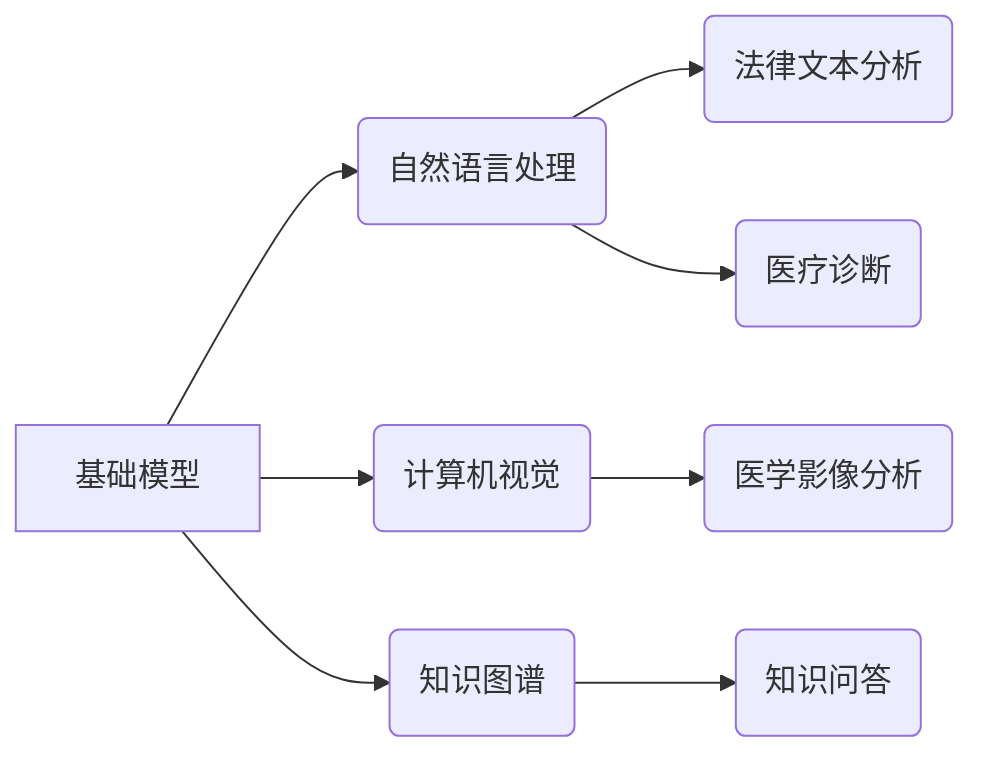

> 基础模型、法律、医疗、教育、人工智能、自然语言处理、计算机视觉、深度学习

## 1. 背景介绍

近年来，人工智能（AI）技术取得了飞速发展，特别是深度学习算法的突破，使得基础模型在各个领域展现出强大的应用潜力。基础模型是指在海量数据上预训练的通用模型，具备强大的泛化能力和适应性，能够在不同的下游任务中进行微调，实现高效的性能提升。

基础模型在法律、医疗、教育等领域有着广泛的应用前景。例如，在法律领域，基础模型可以用于法律文本分析、合同智能审查、法律意见生成等，提高法律工作效率和准确性；在医疗领域，基础模型可以用于疾病诊断、药物研发、患者画像分析等，促进医疗服务质量提升；在教育领域，基础模型可以用于个性化学习、智能辅导、自动批改等，推动教育教学方式的革新。

## 2. 核心概念与联系

**2.1 基础模型**

基础模型是近年来人工智能领域兴起的一种新型模型，其特点是：

* **规模庞大:** 基础模型通常拥有数亿甚至数十亿的参数，需要海量数据进行训练。
* **预训练:** 基础模型在大量通用数据上进行预训练，学习到语言、图像、音频等多模态数据的通用表示能力。
* **可迁移性强:** 基础模型可以迁移到不同的下游任务中进行微调，实现高效的性能提升。

**2.2 核心概念联系**

基础模型的应用需要结合其他人工智能技术，例如自然语言处理（NLP）、计算机视觉（CV）、知识图谱等，才能发挥其最大潜力。



## 3. 核心算法原理 & 具体操作步骤

**3.1 算法原理概述**

基础模型的训练主要基于深度学习算法，例如Transformer、BERT、GPT等。这些算法通过多层神经网络结构，学习数据之间的复杂关系，并生成相应的输出。

**3.2 算法步骤详解**

1. **数据预处理:** 将原始数据进行清洗、格式化、编码等操作，使其适合模型训练。
2. **模型构建:** 根据任务需求选择合适的深度学习模型架构，并设置模型参数。
3. **模型训练:** 使用训练数据对模型进行训练，调整模型参数，使其能够准确地预测输出。
4. **模型评估:** 使用测试数据评估模型的性能，例如准确率、召回率、F1-score等。
5. **模型微调:** 根据评估结果，对模型进行微调，进一步提高其性能。

**3.3 算法优缺点**

**优点:**

* 泛化能力强：预训练模型在不同任务上表现出色。
* 效率高：微调成本低，训练时间短。
* 可解释性高：模型结构透明，易于理解。

**缺点:**

* 数据依赖性强：模型性能受训练数据质量影响。
* 计算资源需求高：训练大型模型需要大量计算资源。
* 伦理风险：模型可能存在偏见、歧视等问题。

**3.4 算法应用领域**

基础模型在各个领域都有广泛的应用，例如：

* **自然语言处理:** 文本分类、情感分析、机器翻译、对话系统等。
* **计算机视觉:** 图像识别、物体检测、图像分割、视频分析等。
* **语音识别:** 语音转文本、语音合成、语音助手等。
* **推荐系统:** 商品推荐、内容推荐、用户画像等。

## 4. 数学模型和公式 & 详细讲解 & 举例说明

**4.1 数学模型构建**

基础模型通常采用神经网络作为数学模型，其结构由多个层组成，每层包含多个神经元。神经元之间通过权重连接，并使用激活函数进行非线性变换。

**4.2 公式推导过程**

模型训练的目标是最小化预测值与真实值的误差。常用的损失函数包括均方误差（MSE）、交叉熵损失（Cross-Entropy Loss）等。

**4.3 案例分析与讲解**

例如，在文本分类任务中，可以使用BERT模型进行微调。BERT模型在预训练阶段学习了语言的语义表示，可以将文本序列映射到一个低维向量空间。然后，将这个向量输入到一个分类器中，进行分类预测。

## 5. 项目实践：代码实例和详细解释说明

**5.1 开发环境搭建**

使用Python语言和相关的深度学习框架，例如TensorFlow、PyTorch等，搭建开发环境。

**5.2 源代码详细实现**

```python
# 使用BERT模型进行文本分类
from transformers import BertTokenizer, BertForSequenceClassification

# 加载预训练模型和词典
tokenizer = BertTokenizer.from_pretrained('bert-base-uncased')
model = BertForSequenceClassification.from_pretrained('bert-base-uncased', num_labels=2)

# 文本预处理
text = "This is a sample text."
inputs = tokenizer(text, return_tensors="pt")

# 模型预测
outputs = model(**inputs)
logits = outputs.logits
predicted_class = torch.argmax(logits, dim=1).item()

# 输出结果
print(f"Predicted class: {predicted_class}")
```

**5.3 代码解读与分析**

代码首先加载预训练的BERT模型和词典。然后，对输入文本进行预处理，将其转换为模型可识别的格式。最后，使用模型进行预测，并输出预测结果。

**5.4 运行结果展示**

运行代码后，会输出预测的文本类别。

## 6. 实际应用场景

**6.1 法律领域**

* **法律文本分析:** 基于基础模型，可以对法律法规、判例书等法律文本进行分析，提取关键信息，识别法律条款，并进行法律风险评估。
* **合同智能审查:** 基于基础模型，可以对合同文本进行智能审查，识别潜在风险，并提供法律建议。
* **法律意见生成:** 基于基础模型，可以根据用户提供的法律问题，生成相应的法律意见。

**6.2 医疗领域**

* **疾病诊断:** 基于基础模型，可以对患者的病历、检查结果等信息进行分析，辅助医生进行疾病诊断。
* **药物研发:** 基于基础模型，可以分析药物的结构和作用机制，加速药物研发过程。
* **患者画像分析:** 基于基础模型，可以分析患者的医疗历史、生活习惯等信息，构建患者画像，为个性化医疗服务提供支持。

**6.3 教育领域**

* **个性化学习:** 基于基础模型，可以根据学生的学习进度、知识掌握情况等信息，提供个性化的学习内容和学习路径。
* **智能辅导:** 基于基础模型，可以为学生提供智能辅导，解答学生疑问，帮助学生理解学习内容。
* **自动批改:** 基于基础模型，可以对学生的作业进行自动批改，提高教师的工作效率。

**6.4 未来应用展望**

随着基础模型技术的不断发展，其在法律、医疗、教育等领域的应用将更加广泛和深入。例如，未来可能出现基于基础模型的智能法律顾问、智能医疗诊断系统、智能教育平台等。

## 7. 工具和资源推荐

**7.1 学习资源推荐**

* **书籍:**
    * 《深度学习》
    * 《自然语言处理》
    * 《计算机视觉》
* **在线课程:**
    * Coursera
    * edX
    * Udacity

**7.2 开发工具推荐**

* **深度学习框架:** TensorFlow、PyTorch
* **自然语言处理库:** NLTK、spaCy
* **计算机视觉库:** OpenCV、Pillow

**7.3 相关论文推荐**

* BERT: Pre-training of Deep Bidirectional Transformers for Language Understanding
* GPT-3: Language Models are Few-Shot Learners
* Vision Transformer: An Image Transformer

## 8. 总结：未来发展趋势与挑战

**8.1 研究成果总结**

基础模型在法律、医疗、教育等领域取得了显著的成果，为人工智能技术的应用提供了新的思路和方法。

**8.2 未来发展趋势**

* 模型规模进一步扩大，性能进一步提升。
* 多模态基础模型的开发，融合文本、图像、音频等多模态数据。
* 基于基础模型的个性化服务，满足用户多样化的需求。

**8.3 面临的挑战**

* 数据安全和隐私保护问题。
* 模型可解释性和透明度问题。
* 模型公平性和伦理问题。

**8.4 研究展望**

未来，基础模型的研究将继续深入，探索更强大的模型架构、更有效的训练方法和更广泛的应用场景。


## 9. 附录：常见问题与解答

**9.1 如何选择合适的基础模型？**

选择合适的基础模型需要根据具体的应用场景和任务需求进行考虑。例如，对于文本分类任务，可以选择BERT、RoBERTa等预训练语言模型；对于图像识别任务，可以选择Vision Transformer、ResNet等预训练图像模型。

**9.2 如何进行基础模型的微调？**

基础模型的微调需要使用少量标记数据，调整模型参数，使其能够适应具体的应用场景。常用的微调方法包括全量微调、参数冻结微调等。

**9.3 如何解决基础模型的伦理问题？**

基础模型的伦理问题需要从多个方面进行考虑，例如数据来源、模型偏见、模型应用场景等。需要制定相应的规范和制度，确保基础模型的合理应用。


作者：禅与计算机程序设计艺术 / Zen and the Art of Computer Programming 
<end_of_turn>