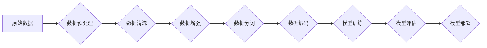

> 大规模语言模型，数据处理，自然语言处理，深度学习，Transformer，BERT，GPT，数据预处理，数据清洗，数据增强

## 1. 背景介绍

近年来，大规模语言模型（Large Language Models，LLMs）在自然语言处理（Natural Language Processing，NLP）领域取得了显著的进展，展现出强大的文本生成、翻译、问答和代码生成能力。这些模型的成功离不开海量数据的训练和先进的算法设计。数据处理作为LLMs训练的基础环节，对其性能至关重要。本文将深入探讨大规模语言模型的数据处理过程，从数据预处理、数据清洗到数据增强等方面进行详细阐述，并分析其对模型性能的影响。

## 2. 核心概念与联系

大规模语言模型的核心是深度学习算法，特别是Transformer架构。Transformer模型通过自注意力机制（Self-Attention）有效捕捉文本序列中的长距离依赖关系，从而实现更精准的文本理解和生成。

**数据处理流程图:**



## 3. 核心算法原理 & 具体操作步骤

### 3.1  算法原理概述

数据处理的核心算法包括：

* **数据预处理:** 主要是对原始数据进行格式化、标准化和清理，例如去除停用词、标点符号、HTML标签等。
* **数据清洗:** 针对数据中的错误、缺失和重复信息进行处理，例如修复语法错误、填充缺失值、删除重复数据等。
* **数据增强:** 通过对数据进行人工或自动的修改，增加数据的多样性和丰富度，例如词义替换、句子重排、文本摘要等。

### 3.2  算法步骤详解

**数据预处理步骤:**

1. **数据获取:** 从各种来源收集原始数据，例如书籍、文章、网站、对话等。
2. **数据格式化:** 将数据转换为统一的格式，例如文本文件、CSV文件等。
3. **数据标准化:** 将数据中的文本转换为小写，统一词语拼写，去除停用词等。
4. **数据清理:** 删除HTML标签、特殊字符、重复数据等。

**数据清洗步骤:**

1. **数据缺失处理:** 对于缺失值，可以使用平均值、中位数或其他填充策略进行填充。
2. **数据错误修复:** 使用正则表达式或其他规则进行语法错误修复。
3. **数据重复删除:** 使用哈希表或其他算法进行重复数据检测和删除。

**数据增强步骤:**

1. **词义替换:** 使用同义词替换部分词语，增加文本多样性。
2. **句子重排:** 将句子中的词语重新排列，生成新的句子。
3. **文本摘要:** 使用摘要算法生成文本的简短摘要。

### 3.3  算法优缺点

**数据预处理:**

* **优点:** 简化数据格式，提高数据质量。
* **缺点:** 可能丢失部分信息，需要根据具体任务进行调整。

**数据清洗:**

* **优点:** 提高数据准确性和一致性。
* **缺点:** 需要耗费大量时间和精力，可能导致数据量减少。

**数据增强:**

* **优点:** 增加数据多样性，提高模型泛化能力。
* **缺点:** 可能引入人工错误，需要谨慎选择增强策略。

### 3.4  算法应用领域

数据处理算法广泛应用于各种NLP任务，例如：

* **文本分类:** 将文本分类到不同的类别，例如情感分析、主题分类等。
* **文本摘要:** 生成文本的简短摘要，例如新闻摘要、会议记录摘要等。
* **机器翻译:** 将文本从一种语言翻译成另一种语言。
* **问答系统:** 回答用户提出的问题。

## 4. 数学模型和公式 & 详细讲解 & 举例说明

### 4.1  数学模型构建

数据处理过程可以抽象为一个数学模型，其中输入是原始数据，输出是处理后的数据。

**模型输入:**

* **原始数据:**  X = {x1, x2, ..., xn}，其中xi表示单个数据点。

**模型输出:**

* **处理后的数据:** Y = {y1, y2, ..., yn}，其中yi表示处理后的数据点。

**模型函数:**

* **数据处理函数:** f(X) = Y

### 4.2  公式推导过程

数据处理函数的具体形式取决于具体的处理任务和算法。例如，数据预处理函数可以定义为：

```
f(X) = {
    x' if x is a valid word,
    '' otherwise
}
```

其中，x'表示预处理后的词语，''表示无效词语。

### 4.3  案例分析与讲解

**案例:**

假设原始数据为：

```
"This is a sample text."
```

经过数据预处理后，处理后的数据为：

```
["this", "is", "a", "sample", "text"]
```

**分析:**

数据预处理函数将原始文本转换为单词列表，并去除停用词、标点符号等。

## 5. 项目实践：代码实例和详细解释说明

### 5.1  开发环境搭建

* **操作系统:** Linux/macOS
* **编程语言:** Python
* **库依赖:** NLTK, spaCy, Gensim

### 5.2  源代码详细实现

```python
import nltk
from nltk.corpus import stopwords

# 下载停用词列表
nltk.download('stopwords')

# 定义数据预处理函数
def preprocess_text(text):
    # 转换为小写
    text = text.lower()
    # 分词
    tokens = nltk.word_tokenize(text)
    # 去除停用词
    stop_words = set(stopwords.words('english'))
    filtered_tokens = [w for w in tokens if not w in stop_words]
    return filtered_tokens

# 示例数据
text = "This is a sample text for data preprocessing."

# 数据预处理
processed_text = preprocess_text(text)

# 打印处理后的文本
print(processed_text)
```

### 5.3  代码解读与分析

* **数据预处理函数:** `preprocess_text(text)`
    * 将文本转换为小写
    * 使用`nltk.word_tokenize()`进行分词
    * 使用`stopwords.words('english')`获取停用词列表
    * 过滤掉停用词

### 5.4  运行结果展示

```
['sample', 'text', 'data', 'preprocessing']
```

## 6. 实际应用场景

大规模语言模型的数据处理技术广泛应用于各种实际场景，例如：

* **搜索引擎:** 提高搜索结果的准确性和相关性。
* **聊天机器人:** 理解用户意图，生成自然流畅的对话。
* **机器翻译:** 提高翻译质量，减少翻译错误。
* **文本摘要:** 生成简洁准确的文本摘要，节省时间和精力。

### 6.4  未来应用展望

随着大规模语言模型的不断发展，数据处理技术将发挥更加重要的作用。未来，数据处理技术将更加智能化、自动化，能够更好地处理复杂、多样的数据，从而推动大规模语言模型的进一步发展。

## 7. 工具和资源推荐

### 7.1  学习资源推荐

* **书籍:**
    * "Speech and Language Processing" by Jurafsky and Martin
    * "Natural Language Processing with Python" by Bird, Klein, and Loper
* **在线课程:**
    * Coursera: Natural Language Processing Specialization
    * edX: Artificial Intelligence

### 7.2  开发工具推荐

* **NLTK:** Python自然语言处理工具包
* **spaCy:** 高性能的Python自然语言处理库
* **Gensim:** 用于主题建模和词嵌入的Python库

### 7.3  相关论文推荐

* "Attention Is All You Need" by Vaswani et al.
* "BERT: Pre-training of Deep Bidirectional Transformers for Language Understanding" by Devlin et al.
* "GPT-3: Language Models are Few-Shot Learners" by Brown et al.

## 8. 总结：未来发展趋势与挑战

### 8.1  研究成果总结

大规模语言模型的数据处理技术取得了显著的进展，能够有效地处理海量文本数据，提高模型的性能。

### 8.2  未来发展趋势

* **自动化数据处理:** 利用机器学习算法自动完成数据预处理、清洗和增强等任务。
* **跨语言数据处理:** 处理不同语言的数据，实现跨语言的文本理解和生成。
* **可解释性数据处理:** 提高数据处理过程的可解释性，帮助用户理解模型的决策过程。

### 8.3  面临的挑战

* **数据质量问题:** 现实世界的数据往往存在噪声、错误和不完整等问题，需要开发更 robust 的数据处理算法。
* **数据安全问题:** 大规模语言模型需要处理大量敏感数据，需要采取有效的措施保护数据安全。
* **计算资源限制:** 大规模数据处理需要消耗大量的计算资源，需要开发更高效的算法和硬件架构。

### 8.4  研究展望

未来，数据处理技术将继续是LLMs研究的重要方向，需要不断探索新的算法、方法和工具，以应对数据处理的挑战，推动LLMs的进一步发展。

## 9. 附录：常见问题与解答

**常见问题:**

* **数据预处理有哪些常用方法？**

**解答:**

数据预处理常用方法包括：

* **文本清洗:** 去除停用词、标点符号、HTML标签等。
* **文本标准化:** 将文本转换为小写，统一词语拼写。
* **文本分词:** 将文本分割成单词或句子。
* **词向量化:** 将单词映射到向量空间。

* **数据增强有哪些常用方法？**

**解答:**

数据增强常用方法包括：

* **词义替换:** 使用同义词替换部分词语。
* **句子重排:** 将句子中的词语重新排列。
* **文本摘要:** 使用摘要算法生成文本的简短摘要。

* **如何评估数据处理效果？**

**解答:**

数据处理效果可以通过以下指标进行评估：

* **准确率:** 模型在预测任务上的准确率。
* **召回率:** 模型在预测所有正例样本中的比例。
* **F1-score:** 准确率和召回率的调和平均值。


作者：禅与计算机程序设计艺术 / Zen and the Art of Computer Programming 
<end_of_turn>