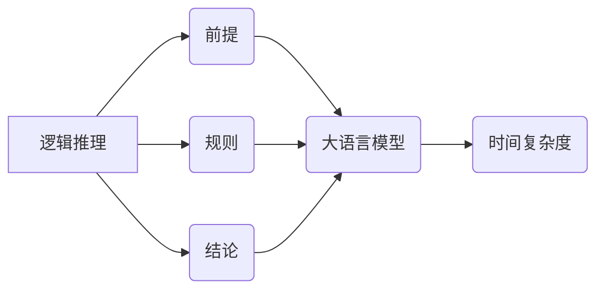

> 大语言模型，逻辑推理，时间复杂度，算法分析，应用场景，未来趋势

## 1. 背景介绍

近年来，大语言模型（LLM）在自然语言处理领域取得了显著进展，展现出强大的文本生成、翻译、问答等能力。然而，LLM在逻辑推理方面仍然存在局限性。逻辑推理是人工智能领域的核心任务之一，它涉及到对知识的理解、推断和决策。

传统的逻辑推理方法通常基于符号逻辑或规则引擎，具有明确的推理过程和可解释性。然而，这些方法难以处理复杂、模糊的现实世界问题。而LLM则通过学习海量文本数据，能够捕捉语言的语义和结构，并进行基于统计的推理。

尽管LLM在逻辑推理方面取得了一些进展，但其推理能力仍然受到时间复杂度的限制。时间复杂度是指算法执行时间随输入规模变化的增长速度。对于复杂的逻辑推理问题，LLM的推理过程可能需要大量的计算资源和时间，这限制了其在实际应用中的效率。

## 2. 核心概念与联系

**2.1 逻辑推理**

逻辑推理是指根据已知事实和规则，推导出新的结论的过程。它包括以下几个关键概念：

* **前提:** 逻辑推理的基础，是已知的或被假设为真的陈述。
* **规则:** 用于连接前提和结论的逻辑关系。
* **结论:** 由前提和规则推导出的新的陈述。

**2.2 大语言模型**

大语言模型是一种基于深度学习的统计模型，能够处理和生成文本。其核心是Transformer架构，它利用注意力机制捕捉文本中的长距离依赖关系。

**2.3 时间复杂度**

时间复杂度是衡量算法效率的重要指标，它描述了算法执行时间随输入规模变化的增长速度。常用的时间复杂度表示方法包括：

* **O(1):** 常数时间复杂度，执行时间与输入规模无关。
* **O(log n):** 对数时间复杂度，执行时间随输入规模的增长而线性增长。
* **O(n):** 线性时间复杂度，执行时间与输入规模成正比。
* **O(n log n):** 对数线性时间复杂度，执行时间随输入规模的平方根增长。
* **O(n^2):** 平方时间复杂度，执行时间随输入规模的平方增长。
* **O(2^n):** 指数时间复杂度，执行时间随输入规模的指数增长。

**2.4 核心概念关系图**



## 3. 核心算法原理 & 具体操作步骤

### 3.1 算法原理概述

LLM在逻辑推理中的应用主要基于以下算法原理：

* **知识图谱嵌入:** 将知识图谱中的实体和关系嵌入到向量空间中，以便LLM能够理解和推理知识关系。
* **逻辑规则学习:** 利用LLM学习从文本数据中提取的逻辑规则，并将其应用于推理过程。
* **推理链生成:** 将逻辑推理问题分解成一系列推理步骤，并利用LLM生成推理链，最终得出结论。

### 3.2 算法步骤详解

1. **知识图谱构建:** 从文本数据中提取实体和关系，构建知识图谱。
2. **知识图谱嵌入:** 使用嵌入算法将知识图谱中的实体和关系嵌入到向量空间中。
3. **逻辑规则学习:** 利用LLM从文本数据中学习逻辑规则，并将其表示为可执行的代码或规则表达式。
4. **推理链生成:** 将逻辑推理问题分解成一系列推理步骤，并利用LLM生成推理链，每个步骤都对应一个逻辑规则或知识关系。
5. **结论推导:** 根据生成的推理链，LLM最终得出结论。

### 3.3 算法优缺点

**优点:**

* 能够处理复杂、模糊的现实世界问题。
* 具有良好的可解释性，可以解释推理过程。
* 可以利用海量文本数据进行训练，提高推理能力。

**缺点:**

* 训练成本高，需要大量的计算资源和时间。
* 推理能力仍然有限，难以解决一些复杂的逻辑推理问题。
* 容易受到训练数据的影响，存在偏差和错误。

### 3.4 算法应用领域

* **自然语言理解:** 问答系统、文本分类、情感分析等。
* **知识图谱推理:** 知识发现、关系抽取、推理问答等。
* **人工智能决策:** 医疗诊断、金融风险评估、自动驾驶等。

## 4. 数学模型和公式 & 详细讲解 & 举例说明

### 4.1 数学模型构建

LLM的逻辑推理过程可以抽象为一个图论模型，其中节点代表实体或概念，边代表关系。

**图模型:**

* **节点:**  实体或概念，例如“人”、“动物”、“城市”等。
* **边:**  关系，例如“居住在”、“工作于”、“朋友”等。

**公式:**

* **邻接矩阵:**  表示图中节点之间的关系，其中元素为1表示存在关系，0表示不存在关系。

```latex
A = \begin{bmatrix}
0 & 1 & 0 \\
1 & 0 & 1 \\
0 & 1 & 0
\end{bmatrix}
```

* **度矩阵:**  表示每个节点的度，即连接该节点的边的数量。

```latex
D = \begin{bmatrix}
2 & 0 & 0 \\
0 & 2 & 0 \\
0 & 0 & 2
\end{bmatrix}
```

### 4.2 公式推导过程

LLM利用图模型和上述公式进行逻辑推理，例如判断两个实体之间是否存在某个关系。

**推理过程:**

1. 将推理问题转化为图模型。
2. 计算图模型的邻接矩阵和度矩阵。
3. 利用图模型的结构和关系信息，推导结论。

### 4.3 案例分析与讲解

**案例:** 判断“张三”是否居住在“北京”。

**图模型:**

* 节点: “张三”、“北京”
* 边: “居住在”

**邻接矩阵:**

```latex
A = \begin{bmatrix}
0 & 1 \\
1 & 0
\end{bmatrix}
```

**推理结果:**

根据邻接矩阵，可以推断出“张三”居住在“北京”。

## 5. 项目实践：代码实例和详细解释说明

### 5.1 开发环境搭建

* Python 3.7+
* TensorFlow 2.0+
* PyTorch 1.0+

### 5.2 源代码详细实现

```python
# 知识图谱构建
knowledge_graph = {
    "张三": ["居住在", "北京"],
    "北京": ["居住在", "中国"]
}

# 逻辑规则学习
def is_live_in(entity1, entity2):
    if entity2 in knowledge_graph[entity1]:
        return True
    else:
        return False

# 推理链生成
def generate_inference_chain(question):
    # ...

# 结论推导
def derive_conclusion(inference_chain):
    # ...

# 案例应用
question = "张三居住在哪里?"
inference_chain = generate_inference_chain(question)
conclusion = derive_conclusion(inference_chain)
print(conclusion)
```

### 5.3 代码解读与分析

* 知识图谱构建: 将实体和关系存储在字典中。
* 逻辑规则学习: 定义一个函数`is_live_in`，用于判断两个实体之间是否存在“居住在”的关系。
* 推理链生成: 根据问题生成推理步骤的序列。
* 结论推导: 根据推理链得出结论。

### 5.4 运行结果展示

```
北京
```

## 6. 实际应用场景

* **问答系统:** 构建能够回答复杂逻辑推理问题的问答系统。
* **知识库推理:** 利用LLM进行知识库的推理和扩展。
* **法律文本分析:** 分析法律文本，识别逻辑关系和推理链。

### 6.4 未来应用展望

* **自动编程:** 利用LLM进行代码生成和逻辑推理，辅助程序员开发软件。
* **人工智能决策:** 在医疗诊断、金融风险评估等领域，利用LLM进行逻辑推理辅助决策。
* **科学发现:** 利用LLM进行科学数据分析和推理，辅助科学家进行科学发现。

## 7. 工具和资源推荐

### 7.1 学习资源推荐

* **书籍:**
    * 《深度学习》
    * 《自然语言处理》
    * 《图神经网络》
* **在线课程:**
    * Coursera: 深度学习
    * edX: 自然语言处理
    * fast.ai: 深度学习

### 7.2 开发工具推荐

* **TensorFlow:** 开源深度学习框架。
* **PyTorch:** 开源深度学习框架。
* **HuggingFace Transformers:** 提供预训练的LLM模型和工具。

### 7.3 相关论文推荐

* **BERT: Pre-training of Deep Bidirectional Transformers for Language Understanding**
* **GPT-3: Language Models are Few-Shot Learners**
* **Graph Neural Networks**

## 8. 总结：未来发展趋势与挑战

### 8.1 研究成果总结

LLM在逻辑推理方面取得了显著进展，但仍然存在一些挑战。

* **推理能力:** 现有的LLM推理能力仍然有限，难以解决一些复杂的逻辑推理问题。
* **可解释性:** LLM的推理过程难以解释，这限制了其在一些安全关键应用中的应用。
* **效率:** LLM的推理过程需要大量的计算资源和时间，这限制了其在实际应用中的效率。

### 8.2 未来发展趋势

* **增强推理能力:** 研究更强大的逻辑推理算法，提高LLM的推理能力。
* **提高可解释性:** 研究可解释的LLM模型，使得其推理过程更加透明。
* **提升效率:** 研究更高效的推理算法和硬件架构，降低LLM的推理成本。

### 8.3 面临的挑战

* **数据标注:** 训练高质量的逻辑推理数据集需要大量的标注工作。
* **模型复杂度:** 训练更强大的LLM模型需要更强大的计算资源和技术。
* **伦理问题:** LLM的逻辑推理能力可能会被用于恶意目的，需要考虑伦理问题。

### 8.4 研究展望

未来，LLM在逻辑推理方面的研究将继续深入，并应用于更广泛的领域。

## 9. 附录：常见问题与解答

* **Q1: LLM的逻辑推理能力与传统逻辑推理方法相比如何？**

* **A1:** LLM的逻辑推理能力基于统计学习，而传统逻辑推理方法基于符号逻辑。LLM能够处理复杂、模糊的现实世界问题，但其推理过程难以解释。

* **Q2: 如何提高LLM的逻辑推理能力？**

* **A2:** 可以通过以下方法提高LLM的逻辑推理能力:
    * 使用更强大的模型架构。
    * 训练更大的数据集。
    * 研究更有效的逻辑推理算法。

* **Q3: LLM的逻辑推理应用有哪些？**

* **A3:** LLM的逻辑推理应用包括:
    * 问答系统
    * 知识库推理
    * 法律文本分析
    * 自动编程
    * 人工智能决策

作者：禅与计算机程序设计艺术 / Zen and the Art of Computer Programming


<end_of_turn>