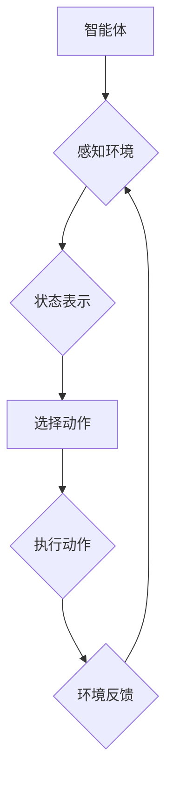

> 强化学习，智慧农业，农业生产，智能机器人，数据分析，模型预测，资源优化

## 1. 背景介绍

农业作为人类文明的基石，一直以来都面临着诸多挑战，例如资源短缺、环境污染、气候变化等。随着科技的进步，智慧农业应运而生，旨在通过信息技术、传感器网络、数据分析等手段，提高农业生产效率、降低生产成本、保障粮食安全。

强化学习（Reinforcement Learning，RL）作为一种机器学习范式，在解决复杂决策问题方面展现出强大的潜力。它通过建立“智能体-环境”的交互系统，让智能体通过与环境的互动学习最优策略，从而实现目标。

将强化学习应用于智慧农业，可以有效解决传统农业面临的诸多难题。例如，利用强化学习算法可以实现精准灌溉、智能施肥、精准病虫害防治等，从而提高农业生产效率和资源利用率。

## 2. 核心概念与联系

**2.1 强化学习核心概念**

* **智能体 (Agent):**  在强化学习系统中，智能体是做出决策的实体，例如无人驾驶汽车、机器人、智能农业设备等。
* **环境 (Environment):**  智能体所处的外部世界，环境会根据智能体的动作做出相应的反馈，例如农业田地、气候条件、作物生长状态等。
* **状态 (State):**  智能体在环境中所处的状态，例如田地湿度、土壤肥力、作物生长阶段等。
* **动作 (Action):**  智能体可以采取的动作，例如浇水、施肥、喷洒农药等。
* **奖励 (Reward):**  环境对智能体动作的反馈，奖励可以是正向的（例如作物生长良好）或负向的（例如作物病虫害）。
* **策略 (Policy):**  智能体根据当前状态选择动作的策略，例如根据田地湿度决定是否浇水。

**2.2 强化学习与智慧农业的联系**

强化学习可以帮助智慧农业实现智能化决策，例如：

* **精准灌溉:**  根据土壤湿度、作物生长需求等信息，智能体可以制定最优的灌溉策略，避免过度浇水或缺水。
* **智能施肥:**  根据土壤肥力、作物生长阶段等信息，智能体可以制定最优的施肥策略，提高肥料利用率，减少环境污染。
* **精准病虫害防治:**  根据作物生长状态、病虫害发生情况等信息，智能体可以制定最优的病虫害防治策略，减少农药使用，保护环境。

**2.3 强化学习架构**



## 3. 核心算法原理 & 具体操作步骤

### 3.1 算法原理概述

强化学习的核心算法是Q-learning算法，它通过学习一个Q-table来存储每个状态下采取每个动作的期望回报。Q-table是一个表格，其中每一行代表一个状态，每一列代表一个动作，每个单元格的值代表采取该动作在该状态下的期望回报。

Q-learning算法通过迭代更新Q-table，最终学习到最优策略。更新规则如下：

```
Q(s, a) = Q(s, a) + α * [r + γ * max(Q(s', a')) - Q(s, a)]
```

其中：

* Q(s, a) 是状态s下采取动作a的期望回报
* α 是学习率，控制着学习速度
* r 是环境对动作a的奖励
* γ 是折扣因子，控制着未来回报的权重
* s' 是采取动作a后进入的下一个状态
* max(Q(s', a')) 是下一个状态s'下所有动作的期望回报的最大值

### 3.2 算法步骤详解

1. 初始化Q-table，将所有单元格的值设置为0。
2. 选择一个初始状态s。
3. 在状态s下随机选择一个动作a。
4. 执行动作a，观察环境的反馈，得到奖励r和下一个状态s'。
5. 更新Q-table：

```
Q(s, a) = Q(s, a) + α * [r + γ * max(Q(s', a')) - Q(s, a)]
```

6. 将s'作为新的状态，重复步骤3-5，直到达到终止条件。

### 3.3 算法优缺点

**优点:**

* 能够学习最优策略，即使环境是动态变化的。
* 适用于离散状态和动作空间。

**缺点:**

* 学习过程可能很慢，需要大量的样本数据。
* 对于连续状态和动作空间，Q-table会变得非常庞大，难以存储和更新。

### 3.4 算法应用领域

* 机器人控制
* 游戏人工智能
* 自动驾驶
* 医疗诊断
* 智慧农业

## 4. 数学模型和公式 & 详细讲解 & 举例说明

### 4.1 数学模型构建

在强化学习中，我们通常使用马尔可夫决策过程（MDP）来建模智能体与环境的交互。MDP由以下五个要素组成：

* 状态空间 S：智能体可能处于的所有状态的集合。
* 动作空间 A：智能体在每个状态下可以采取的所有动作的集合。
* 转移概率矩阵 P：描述从一个状态到另一个状态的概率，取决于采取的动作。
* 奖励函数 R：描述在每个状态采取每个动作后获得的奖励。
* 折扣因子 γ：控制着未来回报的权重。

### 4.2 公式推导过程

Q-learning算法的目标是学习一个策略 π，使得智能体在与环境交互的过程中获得最大的累积奖励。策略 π 可以表示为一个映射关系，将每个状态映射到一个动作。

Q-learning算法使用Bellman方程来更新Q-table：

```
Q(s, a) = Q(s, a) + α * [r + γ * max(Q(s', a')) - Q(s, a)]
```

其中：

* Q(s, a) 是状态s下采取动作a的期望回报
* α 是学习率，控制着学习速度
* r 是环境对动作a的奖励
* γ 是折扣因子，控制着未来回报的权重
* s' 是采取动作a后进入的下一个状态
* max(Q(s', a')) 是下一个状态s'下所有动作的期望回报的最大值

### 4.3 案例分析与讲解

假设我们有一个简单的强化学习问题，智能体在一个二维网格世界中移动，目标是到达终点。网格世界中有一些障碍物，智能体在障碍物上不能移动。

我们可以使用Q-learning算法来训练智能体学习最优路径到达终点。

* 状态空间 S：网格世界的每个单元格。
* 动作空间 A：向上、向下、向左、向右四个方向。
* 转移概率矩阵 P：如果智能体在某个单元格上采取一个动作，那么它将以一定的概率进入相邻的单元格，如果相邻单元格是障碍物，那么智能体将不会移动。
* 奖励函数 R：到达终点时获得最大奖励，在障碍物上或移动时获得较小的奖励。
* 折扣因子 γ：设置为0.9，表示未来回报的权重较高。

通过训练Q-learning算法，智能体可以学习到一个策略，使得它能够在网格世界中找到最优路径到达终点。

## 5. 项目实践：代码实例和详细解释说明

### 5.1 开发环境搭建

* Python 3.x
* TensorFlow 或 PyTorch 等深度学习框架
* NumPy、Pandas 等数据处理库

### 5.2 源代码详细实现

```python
import numpy as np

# 定义状态空间和动作空间
state_space = np.arange(10)
action_space = ['left', 'right']

# 初始化Q-table
q_table = np.zeros((len(state_space), len(action_space)))

# 设置学习参数
alpha = 0.1
gamma = 0.9

# 训练Q-learning算法
for episode in range(1000):
    state = np.random.choice(state_space)
    while state != 9:  # 终止条件：到达终点
        action = np.argmax(q_table[state, :])  # 选择最优动作
        next_state = state + 1 if action == 'right' else state - 1
        reward = 1 if next_state == 9 else 0  # 奖励
        q_table[state, action] = q_table[state, action] + alpha * (reward + gamma * np.max(q_table[next_state, :]) - q_table[state, action])
        state = next_state

# 打印Q-table
print(q_table)
```

### 5.3 代码解读与分析

* 代码首先定义了状态空间和动作空间。
* 然后初始化Q-table，将所有单元格的值设置为0。
* 设置学习参数，例如学习率α和折扣因子γ。
* 训练Q-learning算法，通过迭代更新Q-table，最终学习到最优策略。
* 最后打印Q-table，展示智能体在每个状态下采取每个动作的期望回报。

### 5.4 运行结果展示

运行代码后，会输出一个Q-table，其中每个单元格的值代表智能体在该状态下采取该动作的期望回报。

## 6. 实际应用场景

### 6.1 精准灌溉

利用传感器监测土壤湿度、作物生长需求等信息，智能体可以根据这些信息制定最优的灌溉策略，避免过度浇水或缺水，提高水资源利用率。

### 6.2 智能施肥

根据土壤肥力、作物生长阶段等信息，智能体可以制定最优的施肥策略，提高肥料利用率，减少环境污染。

### 6.3 精准病虫害防治

利用图像识别技术和传感器监测作物生长状态、病虫害发生情况等信息，智能体可以制定最优的病虫害防治策略，减少农药使用，保护环境。

### 6.4 未来应用展望

* **无人驾驶农业机械:** 利用强化学习算法训练无人驾驶农业机械，实现自动耕种、播种、收获等操作，提高农业生产效率。
* **智慧温室:** 利用强化学习算法控制温室环境，例如温度、湿度、光照等，优化作物生长条件，提高产量。
* **精准农业数据分析:** 利用强化学习算法分析农业数据，例如土壤信息、气象数据、作物生长数据等，预测作物产量、病虫害发生情况等，为农业决策提供支持。

## 7. 工具和资源推荐

### 7.1 学习资源推荐

* **书籍:**
    * Reinforcement Learning: An Introduction by Richard S. Sutton and Andrew G. Barto
    * Deep Reinforcement Learning Hands-On by Maxim Lapan
* **在线课程:**
    * Coursera: Reinforcement Learning Specialization by David Silver
    * Udacity: Deep Reinforcement Learning Nanodegree

### 7.2 开发工具推荐

* **TensorFlow:** 开源深度学习框架，支持强化学习算法的实现。
* **PyTorch:** 开源深度学习框架，支持强化学习算法的实现。
* **OpenAI Gym:** 强化学习环境库，提供各种标准的强化学习任务。

### 7.3 相关论文推荐

* Deep Q-Network (DQN)
* Proximal Policy Optimization (PPO)
* Asynchronous Advantage Actor-Critic (A3C)

## 8. 总结：未来发展趋势与挑战

### 8.1 研究成果总结

强化学习在智慧农业领域取得了显著的成果，例如精准灌溉、智能施肥、精准病虫害防治等。

### 8.2 未来发展趋势

* **更复杂的农业场景:** 将强化