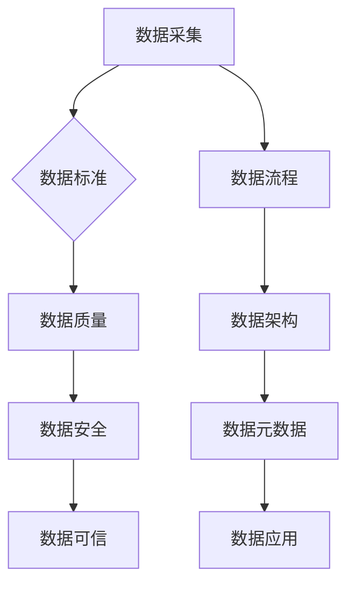

> 数据治理、数据质量、数据标准、数据安全、数据可信、数据流程、数据架构、数据元数据、数据生命周期

## 1. 背景介绍

在当今数据爆炸的时代，数据已成为企业最重要的资产之一。然而，海量数据的积累也带来了新的挑战，如何有效地管理和利用数据成为了企业发展的关键问题。数据治理应运而生，它旨在建立一套规范、标准和流程，确保数据的质量、安全、一致性和可信度。

数据治理并非一蹴而就，它需要企业从多个方面进行全面的规划和实施。从数据采集、存储、处理到分析和应用，每个环节都需要严格的控制和管理。只有这样，才能保证数据的准确性、完整性和安全性，最终实现数据的价值最大化。

## 2. 核心概念与联系

数据治理的核心概念包括：

* **数据质量：** 指数据的准确性、完整性、一致性和及时性等方面。
* **数据标准：** 指数据格式、编码、定义和命名等方面的规范。
* **数据安全：** 指保护数据免受未授权访问、使用、披露和修改等威胁。
* **数据可信：** 指数据真实可靠，能够被信任和依赖。
* **数据流程：** 指数据从采集到应用的全生命周期过程。
* **数据架构：** 指数据存储、组织和管理的结构。
* **数据元数据：** 指描述数据的元信息，例如数据定义、来源、格式等。

这些概念相互关联，共同构成了数据治理的框架。



## 3. 核心算法原理 & 具体操作步骤

数据治理中涉及到许多算法和技术，例如数据清洗、数据匹配、数据分类等。

### 3.1  算法原理概述

数据清洗算法旨在消除数据中的噪声、错误和重复数据，提高数据质量。常见的算法包括：

* **缺失值处理：** 使用平均值、中位数或其他方法填充缺失值。
* **异常值处理：** 使用统计方法或机器学习算法识别异常值，并进行处理。
* **重复数据删除：** 使用哈希表或其他算法识别重复数据，并进行删除。

### 3.2  算法步骤详解

以数据清洗为例，其具体操作步骤如下：

1. **数据预处理：** 对数据进行格式转换、编码转换等预处理操作。
2. **缺失值处理：** 使用合适的算法填充缺失值。
3. **异常值处理：** 使用统计方法或机器学习算法识别异常值，并进行处理。
4. **重复数据删除：** 使用哈希表或其他算法识别重复数据，并进行删除。
5. **数据验证：** 对清洗后的数据进行验证，确保数据质量符合要求。

### 3.3  算法优缺点

数据清洗算法各有优缺点，需要根据实际情况选择合适的算法。

* **优点：** 可以有效提高数据质量，为后续数据分析和应用提供可靠的数据基础。
* **缺点：** 算法的复杂度较高，需要一定的技术支持。

### 3.4  算法应用领域

数据清洗算法广泛应用于各个领域，例如：

* **金融行业：** 用于清洗客户数据、交易数据等。
* **医疗行业：** 用于清洗患者数据、医疗记录等。
* **电商行业：** 用于清洗商品数据、用户数据等。

## 4. 数学模型和公式 & 详细讲解 & 举例说明

数据治理中涉及到许多数学模型和公式，例如：

* **数据质量度量：** 使用数学公式计算数据的准确性、完整性、一致性和及时性等指标。
* **数据关联分析：** 使用数学模型分析数据之间的关联关系，发现隐藏的模式和趋势。

### 4.1  数学模型构建

数据质量度量模型可以采用以下公式：

```latex
数据质量 = (准确率 * 完整性 * 一致性 * 时效性) / 4
```

其中：

* **准确率：** 指数据与真实值之间的匹配度。
* **完整性：** 指数据是否包含所有必要的信息。
* **一致性：** 指数据在不同来源和不同时间点上的一致性。
* **时效性：** 指数据是否及时更新。

### 4.2  公式推导过程

数据关联分析模型可以采用以下公式：

```latex
关联度 = (支持度 * 置信度) / 提升度
```

其中：

* **支持度：** 指关联项在数据集中的出现频率。
* **置信度：** 指在关联项出现的情况下，另一个项出现的概率。
* **提升度：** 指关联项出现的概率与独立出现的概率的比值。

### 4.3  案例分析与讲解

假设我们有一份客户数据，其中包含客户姓名、年龄、性别和购买记录等信息。我们可以使用数据质量度量模型计算客户数据的准确性、完整性和一致性等指标。

我们可以使用数据关联分析模型分析客户的购买行为，发现哪些客户具有相似的购买习惯，从而进行精准营销。

## 5. 项目实践：代码实例和详细解释说明

以下是一个简单的代码实例，演示了如何使用Python语言进行数据清洗。

### 5.1  开发环境搭建

需要安装Python语言和相关库，例如pandas、numpy等。

### 5.2  源代码详细实现

```python
import pandas as pd

# 读取数据
data = pd.read_csv('customer_data.csv')

# 缺失值处理
data['age'].fillna(data['age'].mean(), inplace=True)

# 异常值处理
data = data[(data['age'] >= 18) & (data['age'] <= 80)]

# 重复数据删除
data.drop_duplicates(inplace=True)

# 保存数据
data.to_csv('cleaned_data.csv', index=False)
```

### 5.3  代码解读与分析

这段代码首先读取了客户数据，然后使用pandas库中的方法进行数据清洗。

* `fillna()`方法用于填充缺失值。
* `[(data['age'] >= 18) & (data['age'] <= 80)]`表达式用于过滤异常值。
* `drop_duplicates()`方法用于删除重复数据。

最后，代码将清洗后的数据保存到新的CSV文件中。

### 5.4  运行结果展示

运行代码后，将生成一个名为`cleaned_data.csv`的文件，其中包含了清洗后的客户数据。

## 6. 实际应用场景

数据治理在各个行业都有广泛的应用场景，例如：

* **金融行业：** 用于管理客户数据、交易数据、风险数据等，提高金融服务的质量和安全性。
* **医疗行业：** 用于管理患者数据、医疗记录、药品信息等，提高医疗服务的效率和准确性。
* **电商行业：** 用于管理商品数据、用户数据、订单数据等，提高电商平台的运营效率和用户体验。

### 6.4  未来应用展望

随着数据量的不断增长和数据分析技术的不断发展，数据治理将变得更加重要。未来，数据治理将更加注重：

* **自动化：** 使用自动化工具和技术进行数据治理，提高效率和准确性。
* **智能化：** 使用人工智能技术进行数据治理，提高智能化水平。
* **可视化：** 使用可视化工具和技术展示数据治理情况，提高透明度和可理解性。

## 7. 工具和资源推荐

### 7.1  学习资源推荐

* **书籍：** 《数据治理：从概念到实践》
* **网站：** 数据治理联盟 (DAMA)

### 7.2  开发工具推荐

* **数据清洗工具：** Trifacta Wrangler、Paxata
* **数据标准化工具：** Apache Camel、MuleSoft Anypoint Platform

### 7.3  相关论文推荐

* **数据治理的理论基础和实践应用**
* **数据质量管理方法研究**

## 8. 总结：未来发展趋势与挑战

数据治理是一个不断发展和完善的过程，未来将面临以下挑战：

* **数据量的爆炸式增长：** 如何有效地管理和利用海量数据。
* **数据的多样性和复杂性：** 如何处理不同类型和格式的数据。
* **数据安全和隐私保护：** 如何保障数据的安全性和隐私性。

## 9. 附录：常见问题与解答

* **什么是数据治理？**
* **数据治理有哪些核心概念？**
* **数据治理有哪些应用场景？**
* **如何进行数据治理？**


作者：禅与计算机程序设计艺术 / Zen and the Art of Computer Programming 
<end_of_turn>