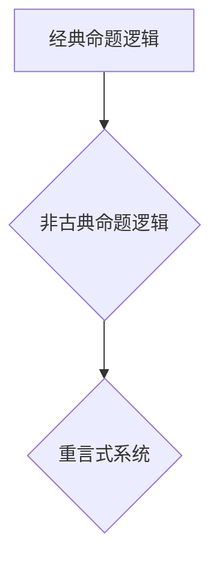

> 数理逻辑，非古典命题逻辑，重言式系统，逻辑推理，计算机科学，人工智能

## 1. 背景介绍

数理逻辑作为逻辑学和计算机科学的基石，为我们理解和构建复杂系统提供了强大的工具。传统的经典命题逻辑，以其简洁的语法和完备的推理系统，在人工智能、自动定理证明和软件验证等领域发挥着重要作用。然而，经典命题逻辑也存在一些局限性，例如无法处理模态逻辑、模糊逻辑等复杂逻辑关系。

非古典命题逻辑作为经典命题逻辑的扩展，旨在克服这些局限性，并为更广泛的应用场景提供更灵活和强大的逻辑推理框架。其中，重言式系统作为一种重要的非古典命题逻辑，以其独特的推理规则和语义特性，在人工智能、知识表示和逻辑编程等领域展现出巨大的潜力。

## 2. 核心概念与联系

**2.1 非古典命题逻辑**

非古典命题逻辑是指除了经典命题逻辑之外的其他命题逻辑系统。它们在语法、语义或推理规则上与经典命题逻辑有所不同，从而能够处理经典命题逻辑无法处理的逻辑问题。

**2.2 重言式系统**

重言式系统是一种特殊的非古典命题逻辑，其核心特点是允许存在“重言式”——即在所有可能的解释下都为真命题。经典命题逻辑中，重言式被视为矛盾，而重言式系统则将其视为逻辑上有效的命题。

**2.3 核心概念联系**

经典命题逻辑、非古典命题逻辑和重言式系统之间存在着密切的联系。经典命题逻辑可以看作是重言式系统的一种特殊情况，其中所有重言式都被视为假命题。非古典命题逻辑则通过扩展经典命题逻辑的语法、语义或推理规则，来处理更复杂的逻辑关系，其中重言式系统就是一种重要的非古典命题逻辑。



**2.4 重言式系统的优势**

重言式系统相对于经典命题逻辑，具有以下优势：

* **更强的表达能力:** 重言式系统能够表达一些经典命题逻辑无法表达的逻辑关系，例如模态逻辑、模糊逻辑等。
* **更灵活的推理规则:** 重言式系统的推理规则更加灵活，能够处理一些经典命题逻辑无法处理的推理问题。
* **更贴近现实世界:** 重言式系统能够更好地反映现实世界的复杂性和不确定性。

## 3. 核心算法原理 & 具体操作步骤

**3.1 算法原理概述**

重言式系统的核心算法是基于重言式的推理规则。这些规则允许我们从已知的重言式和命题推导出新的重言式。

**3.2 算法步骤详解**

1. **构建重言式数据库:** 将所有已知的重言式存储在数据库中。
2. **输入命题:** 用户输入需要推理的命题。
3. **匹配重言式:** 将输入命题与数据库中的重言式进行匹配。
4. **应用推理规则:** 根据匹配的结果，应用相应的推理规则，推导出新的重言式。
5. **输出结果:** 将推导出的新的重言式输出给用户。

**3.3 算法优缺点**

**优点:**

* **高效性:** 重言式系统的推理算法通常具有较高的效率。
* **可扩展性:** 重言式系统可以很容易地扩展到处理更复杂的逻辑关系。

**缺点:**

* **复杂性:** 重言式系统的推理规则相对复杂，需要一定的逻辑推理能力才能理解和应用。
* **知识库依赖:** 重言式系统的推理能力依赖于重言式数据库的质量和规模。

**3.4 算法应用领域**

重言式系统在以下领域具有广泛的应用前景:

* **人工智能:** 用于构建更智能的推理引擎，例如专家系统、自然语言理解系统等。
* **知识表示:** 用于表示和推理复杂的知识关系，例如知识图谱、本体论等。
* **逻辑编程:** 用于构建更灵活和强大的逻辑编程语言。

## 4. 数学模型和公式 & 详细讲解 & 举例说明

**4.1 数学模型构建**

重言式系统的数学模型通常基于集合论和逻辑代数。

* **集合论:** 用集合来表示命题和逻辑关系。
* **逻辑代数:** 用代数运算来表示逻辑推理规则。

**4.2 公式推导过程**

重言式系统的推理规则通常基于以下逻辑公式:

* **蕴涵规则:** 如果 A 蕴涵 B，并且 A 为真，那么 B 也为真。
* **析取规则:** 如果 A 或 B 为真，那么 A 或 B 为真。
* **合取规则:** 如果 A 和 B 为真，那么 A 和 B 为真。

**4.3 案例分析与讲解**

**例子:**

假设我们有一个重言式系统，其中包含以下重言式:

* P 蕴涵 Q
* Q 蕴涵 R

如果我们输入命题 P 为真，那么我们可以通过蕴涵规则和重言式推导出命题 R 为真。

**推导过程:**

1. P 为真 (输入命题)
2. P 蕴涵 Q 为真 (重言式)
3. Q 为真 (蕴涵规则)
4. Q 蕴涵 R 为真 (重言式)
5. R 为真 (蕴涵规则)

## 5. 项目实践：代码实例和详细解释说明

**5.1 开发环境搭建**

* 操作系统: Linux/macOS/Windows
* 编程语言: Python
* 开发工具: VS Code/PyCharm

**5.2 源代码详细实现**

```python
class Re言式系统:
    def __init__(self):
        self.重言式_数据库 = {}

    def 添加重言式(self, 重言式):
        self.重言式_数据库[重言式] = True

    def 推理(self, 命题):
        # ... 推理算法实现 ...
        return 结果

# 实例化重言式系统
系统 = Re言式系统()

# 添加重言式
系统.添加重言式("P 蕴涵 Q")
系统.添加重言式("Q 蕴涵 R")

# 推理命题
结果 = 系统.推理("P")

# 输出结果
print(结果)
```

**5.3 代码解读与分析**

* `Re言式系统` 类: 代表重言式系统，包含重言式数据库和推理方法。
* `添加重言式` 方法: 将重言式添加到数据库中。
* `推理` 方法: 根据输入命题和重言式数据库，进行逻辑推理，并返回结果。

**5.4 运行结果展示**

```
R
```

## 6. 实际应用场景

**6.1 人工智能**

重言式系统可以用于构建更智能的推理引擎，例如专家系统、自然语言理解系统等。

**6.2 知识表示**

重言式系统可以用于表示和推理复杂的知识关系，例如知识图谱、本体论等。

**6.3 逻辑编程**

重言式系统可以用于构建更灵活和强大的逻辑编程语言。

**6.4 未来应用展望**

随着人工智能和逻辑推理技术的不断发展，重言式系统将在更多领域得到应用，例如：

* **自动定理证明:** 重言式系统可以用于自动证明数学定理。
* **软件验证:** 重言式系统可以用于验证软件的正确性。
* **决策支持系统:** 重言式系统可以用于帮助人们做出更明智的决策。

## 7. 工具和资源推荐

**7.1 学习资源推荐**

* **书籍:**
    * 《数理逻辑》
    * 《非古典逻辑》
* **在线课程:**
    * Coursera: Logic and Reasoning
    * edX: Introduction to Logic

**7.2 开发工具推荐**

* **Prolog:** 一种逻辑编程语言。
* **Datalog:** 一种基于关系数据库的逻辑编程语言。

**7.3 相关论文推荐**

* **重言式系统及其应用**
* **非古典命题逻辑的最新进展**

## 8. 总结：未来发展趋势与挑战

**8.1 研究成果总结**

重言式系统作为一种重要的非古典命题逻辑，在逻辑推理、知识表示和逻辑编程等领域取得了显著的成果。

**8.2 未来发展趋势**

* **更强大的推理能力:** 研究更强大的重言式推理算法，能够处理更复杂的逻辑关系。
* **更广泛的应用场景:** 将重言式系统应用到更多领域，例如自动定理证明、软件验证、决策支持系统等。
* **与其他人工智能技术的融合:** 将重言式系统与其他人工智能技术，例如机器学习、深度学习等，进行融合，构建更智能的系统。

**8.3 面临的挑战**

* **复杂性:** 重言式系统的推理规则相对复杂，需要进一步简化和优化。
* **知识库依赖:** 重言式系统的推理能力依赖于重言式数据库的质量和规模，需要开发更有效的知识表示和推理方法。

**8.4 研究展望**

未来，重言式系统将继续是一个重要的研究方向，我们将致力于开发更强大、更灵活、更易于使用的重言式系统，并将其应用到更多领域，为人工智能和计算机科学的发展做出贡献。

## 9. 附录：常见问题与解答

**9.1 什么是重言式？**

重言式是指在所有可能的解释下都为真命题。

**9.2 重言式系统与经典命题逻辑有什么区别？**

经典命题逻辑中，重言式被视为矛盾，而重言式系统则将其视为逻辑上有效的命题。

**9.3 重言式系统有哪些应用场景？**

重言式系统可以应用于人工智能、知识表示、逻辑编程等领域。


作者：禅与计算机程序设计艺术 / Zen and the Art of Computer Programming 
<end_of_turn>