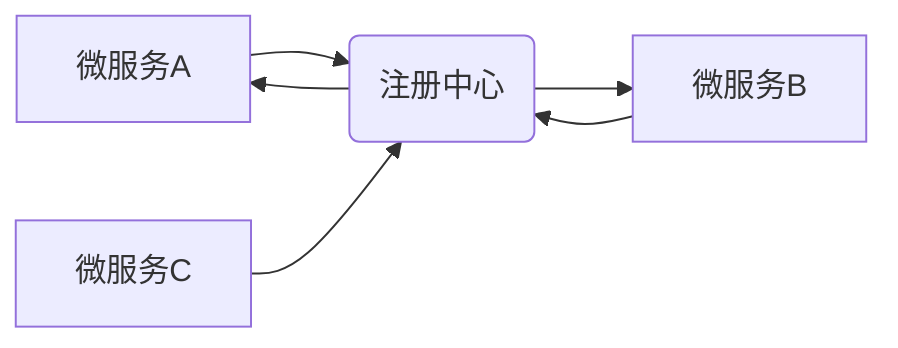

> 服务注册中心、微服务架构、服务发现、负载均衡、API 网关、注册中心实现、案例分析

## 1. 背景介绍

随着互联网技术的不断发展，软件系统架构也经历了从单体应用到微服务架构的演变。微服务架构将大型应用程序拆分成多个小型、独立的服务，每个服务负责特定的业务功能，并通过轻量级的通信协议进行交互。这种架构模式具有许多优点，例如：

* **松耦合:** 微服务之间相互独立，降低了系统间的依赖关系，提高了系统的可维护性和扩展性。
* **独立部署:** 每个微服务可以独立部署和更新，无需影响其他服务，提高了开发和运维效率。
* **弹性伸缩:** 根据业务需求，可以动态地增加或减少服务的实例数量，提高系统的资源利用率和响应能力。

然而，微服务架构也带来了新的挑战，其中之一就是服务发现。在微服务架构中，每个服务都需要知道其他服务的地址和端口信息，以便进行通信。传统的硬编码方式难以满足微服务架构的需求，因此需要引入服务注册中心来解决这个问题。

## 2. 核心概念与联系

服务注册中心是一个集中式的服务发现和管理平台，它负责维护所有微服务的元数据信息，例如服务名称、地址、端口、健康状态等。微服务可以通过注册中心注册自身信息，其他微服务可以通过注册中心查询服务信息，从而实现服务发现。

**服务注册中心架构**



**核心概念:**

* **服务发现:** 微服务通过注册中心查询其他服务的地址和端口信息。
* **服务注册:** 微服务将自身信息注册到注册中心。
* **服务健康检查:** 注册中心定期检查服务的健康状态，并更新服务信息。
* **负载均衡:** 注册中心可以根据服务健康状态和负载情况，将请求分配到不同的服务实例。

## 3. 核心算法原理 & 具体操作步骤

### 3.1  算法原理概述

服务注册中心通常采用基于哈希的算法来实现服务发现。

**哈希算法原理:**

1. 将服务名称或ID作为输入，通过哈希函数计算出一个哈希值。
2. 将哈希值映射到一个特定的服务实例上。
3. 当微服务需要访问某个服务时，它会根据服务名称或ID计算哈希值，然后根据哈希值找到对应的服务实例。

**优点:**

* **高效:** 哈希算法的计算速度很快，可以快速定位服务实例。
* **分布式:** 哈希算法可以分布式地部署，提高系统的容错性和可用性。

**缺点:**

* **数据倾斜:** 如果服务名称或ID的分布不均匀，可能会导致某些服务实例承载过多的请求，而其他服务实例则闲置。

### 3.2  算法步骤详解

1. **服务注册:** 当微服务启动时，它会将自身信息（服务名称、地址、端口等）注册到注册中心。
2. **服务发现:** 当微服务需要访问其他服务时，它会向注册中心查询目标服务的地址和端口信息。
3. **负载均衡:** 注册中心可以根据服务健康状态和负载情况，将请求分配到不同的服务实例。

### 3.3  算法优缺点

**优点:**

* **高效:** 哈希算法的计算速度很快，可以快速定位服务实例。
* **分布式:** 哈希算法可以分布式地部署，提高系统的容错性和可用性。

**缺点:**

* **数据倾斜:** 如果服务名称或ID的分布不均匀，可能会导致某些服务实例承载过多的请求，而其他服务实例则闲置。

### 3.4  算法应用领域

哈希算法广泛应用于各种领域，例如：

* **数据库索引:** 哈希算法可以用于构建数据库索引，提高查询效率。
* **缓存:** 哈希算法可以用于构建缓存，提高数据访问速度。
* **网络路由:** 哈希算法可以用于网络路由，提高网络流量的传输效率。

## 4. 数学模型和公式 & 详细讲解 & 举例说明

### 4.1  数学模型构建

假设我们有一个服务注册中心，它维护着N个微服务的元数据信息。每个微服务都有一个唯一的ID，以及一个对应的地址和端口信息。我们可以用一个字典来表示服务注册中心的状态：

```
service_registry = {
    service_id1: {
        "address": "192.168.1.1",
        "port": 8080,
        "health_status": "UP"
    },
    service_id2: {
        "address": "192.168.1.2",
        "port": 8081,
        "health_status": "DOWN"
    },
    ...
}
```

### 4.2  公式推导过程

哈希函数的目的是将服务ID映射到一个特定的服务实例上。一个简单的哈希函数可以定义为：

```
hash(service_id) = service_id % num_instances
```

其中：

* `service_id` 是服务的ID。
* `num_instances` 是注册中心中服务实例的数量。

### 4.3  案例分析与讲解

假设我们有一个注册中心，维护着3个服务实例，服务ID分别为service_id1、service_id2、service_id3。如果我们使用上述哈希函数，则：

* `hash(service_id1)` = `service_id1 % 3` = 0
* `hash(service_id2)` = `service_id2 % 3` = 1
* `hash(service_id3)` = `service_id3 % 3` = 2

因此，服务ID为`service_id1`的服务实例将被映射到第一个实例上，服务ID为`service_id2`的服务实例将被映射到第二个实例上，服务ID为`service_id3`的服务实例将被映射到第三个实例上。

## 5. 项目实践：代码实例和详细解释说明

### 5.1  开发环境搭建

* **操作系统:** Linux (Ubuntu 20.04)
* **编程语言:** Go
* **数据库:** Redis

### 5.2  源代码详细实现

```go
package main

import (
\t"fmt"
\t"net/http"
\t"time"

\t"github.com/gomodule/redigo/redis"
)

// 服务注册中心结构体
type ServiceRegistry struct {
\tclient redis.Conn
}

// 新建服务注册中心实例
func NewServiceRegistry(address string) (*ServiceRegistry, error) {
\tclient, err := redis.Dial("tcp", address)
\tif err != nil {
\t\treturn nil, err
\t}
\treturn &ServiceRegistry{client: client}, nil
}

// 注册服务
func (s *ServiceRegistry) RegisterService(serviceID string, address string, port int) error {
\tkey := fmt.Sprintf("service:%s", serviceID)
\t_, err := s.client.Do("SET", key, fmt.Sprintf("%s:%d", address, port))
\treturn err
}

// 查询服务
func (s *ServiceRegistry) GetService(serviceID string) (string, int, error) {
\tkey := fmt.Sprintf("service:%s", serviceID)
\tval, err := redis.String(s.client.Do("GET", key))
\tif err != nil {
\t\treturn "", 0, err
\t}
\tparts := strings.Split(val, ":")
\tif len(parts) != 2 {
\t\treturn "", 0, fmt.Errorf("invalid service address format")
\t}
\taddress := parts[0]
\tport, err := strconv.Atoi(parts[1])
\tif err != nil {
\t\treturn "", 0, fmt.Errorf("invalid service port format")
\t}
\treturn address, port, nil
}

func main() {
\t// 创建服务注册中心实例
\tregistry, err := NewServiceRegistry("localhost:6379")
\tif err != nil {
\t\tfmt.Println("Error creating service registry:", err)
\t\treturn
\t}

\t// 注册服务
\terr = registry.RegisterService("service1", "127.0.0.1", 8080)
\tif err != nil {
\t\tfmt.Println("Error registering service:", err)
\t\treturn
\t}

\t// 查询服务
\taddress, port, err := registry.GetService("service1")
\tif err != nil {
\t\tfmt.Println("Error getting service:", err)
\t\treturn
\t}
\tfmt.Printf("Service address: %s:%d\
", address, port)

\t// 等待服务运行
\ttime.Sleep(time.Second * 10)
}
```

### 5.3  代码解读与分析

* **服务注册中心结构体:** `ServiceRegistry` 结构体包含一个 `redis.Conn` 连接，用于连接到 Redis 数据库。
* **新建服务注册中心实例:** `NewServiceRegistry` 函数用于创建新的服务注册中心实例，并连接到 Redis 数据库。
* **注册服务:** `RegisterService` 函数用于注册服务，将服务ID、地址和端口信息存储到 Redis 数据库中。
* **查询服务:** `GetService` 函数用于查询服务，根据服务ID从 Redis 数据库中获取服务地址和端口信息。
* **主函数:** `main` 函数演示了如何使用服务注册中心注册和查询服务。

### 5.4  运行结果展示

运行代码后，将输出以下结果：

```
Service address: 127.0.0.1:8080
```

## 6. 实际应用场景

### 6.1  API 网关

API 网关可以作为微服务架构的入口，负责接收外部请求，并转发到相应的微服务。服务注册中心可以帮助 API 网关发现和管理微服务，从而实现动态路由和负载均衡。

### 6.2  服务监控

服务注册中心可以收集微服务的元数据信息，例如健康状态、CPU 使用率、内存使用率等，并将其发送到监控系统，以便进行服务监控和故障诊断。

### 6.3  服务治理

服务注册中心可以提供服务治理功能，例如服务限流、熔断降级、服务降级等，帮助提高微服务的可靠性和稳定性。

### 6.4  未来应用展望

随着微服务架构的不断发展，服务注册中心将发挥越来越重要的作用。未来，服务注册中心可能会具备以下功能：

* **动态服务发现:** 根据业务需求动态地发现和注册服务。
* **智能路由:** 基于服务健康状态、性能指标等信息，智能地路由请求到最佳的服务实例。
* **服务编排:** 支持服务之间的编排和管理，实现复杂的业务流程。

## 7. 工具和资源推荐

### 7.1  学习资源推荐

* **微服务架构实践:** https://www.alibabacloud.com/blog/microservices-architecture-practice_596949
* **Spring Cloud:** https://spring.io/projects/spring-cloud
* **Kubernetes:** https://kubernetes.io/

### 7.2  开发工具推荐

* **Docker:** https://www.docker.com/
* **Kubernetes:** https://kubernetes.io/
* **Consul:** https://www.consul.io/

### 7.3  相关论文推荐

* **Microservices: Architectural Style and Patterns:** https://martinfowler.com/articles/microservices.html
* **Building Microservices: Designing Fine-Grained Systems:** https://www.oreilly.com/library/view/building-microservices/9781491969697/

## 8. 总结：未来发展趋势与挑战

### 8.1  研究成果总结

服务注册中心是微服务架构中不可或缺的一部分，它提供了服务发现、负载均衡、服务治理等功能，帮助提高微服务的可靠性和稳定性。

### 8.2  未来