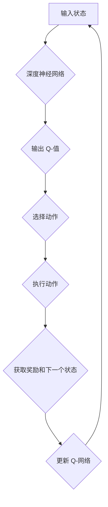

> 深度学习，强化学习，Q-learning，深度Q-learning，神经网络，价值函数，策略梯度

## 1. 背景介绍

在人工智能领域，强化学习 (Reinforcement Learning, RL) 作为一种模仿人类学习的算法，近年来取得了显著进展。它通过让智能体在环境中与环境交互，学习最优策略来最大化奖励，从而解决复杂决策问题。

深度强化学习 (Deep Reinforcement Learning, DRL) 将深度学习技术与强化学习相结合，通过深度神经网络学习复杂的价值函数和策略，从而能够处理更复杂的环境和任务。

Q-learning 是一种经典的强化学习算法，它通过学习一个 Q-表来估计每个状态-动作对的价值，并根据该价值选择最优动作。然而，传统的 Q-learning 算法在处理高维状态空间时效率低下，难以扩展。

深度 Q-learning 则通过使用深度神经网络来逼近 Q-函数，从而能够有效地处理高维状态空间，并取得了显著的成果。

## 2. 核心概念与联系

**2.1 强化学习基本概念**

强化学习的核心概念包括：

* **智能体 (Agent):** 与环境交互并采取行动的实体。
* **环境 (Environment):** 智能体所处的外部世界，它会根据智能体的行动产生新的状态和奖励。
* **状态 (State):** 环境的当前描述。
* **动作 (Action):** 智能体在特定状态下可以采取的行动。
* **奖励 (Reward):** 环境对智能体采取的行动给予的反馈，可以是正向奖励或负向惩罚。
* **策略 (Policy):** 智能体在不同状态下选择动作的规则。
* **价值函数 (Value Function):** 评估状态或状态-动作对的价值，即未来获得奖励的期望总和。

**2.2 Q-learning 算法原理**

Q-learning 算法的目标是学习一个 Q-表，其中每个条目表示在特定状态下采取特定动作的价值。

Q-learning 算法的基本原理是：

* **迭代更新 Q-表:** 通过不断与环境交互，根据获得的奖励和下一个状态的价值，更新 Q-表中的条目。
* **贪婪策略:** 在每个时间步，智能体选择 Q-表中最大值的行动。

**2.3 深度 Q-learning 算法原理**

深度 Q-learning 算法将深度神经网络用于逼近 Q-函数，从而能够处理高维状态空间。

深度 Q-learning 算法的基本原理是：

* **使用深度神经网络逼近 Q-函数:** 将状态作为输入，输出每个动作对应的 Q-值。
* **使用梯度下降算法训练神经网络:** 通过最小化预测 Q-值与实际奖励的误差，更新神经网络的权重。
* **使用经验回放 (Experience Replay) 技术:** 将过去的经验存储在缓冲池中，并随机采样经验进行训练，从而提高训练效率。

**2.4 深度 Q-learning 流程图**



## 3. 核心算法原理 & 具体操作步骤

### 3.1 算法原理概述

深度 Q-learning 算法的核心思想是利用深度神经网络来逼近 Q-函数，从而能够学习复杂环境下的最优策略。

算法的基本流程如下：

1. 初始化深度神经网络，并设置学习率和折扣因子。
2. 在环境中与环境交互，收集经验数据 (状态、动作、奖励、下一个状态)。
3. 将经验数据存储在经验回放缓冲池中。
4. 从缓冲池中随机采样经验数据进行训练。
5. 使用梯度下降算法更新神经网络的权重，使得预测 Q-值与实际奖励的误差最小化。
6. 重复步骤 3-5，直到算法收敛或达到预设的训练次数。

### 3.2 算法步骤详解

1. **初始化:**

* 初始化深度神经网络，其输入层维度为状态空间的维度，输出层维度为动作空间的维度。
* 设置学习率 (learning rate) 和折扣因子 (discount factor)。学习率控制着权重更新的幅度，折扣因子控制着未来奖励的权重。

2. **环境交互:**

* 智能体与环境交互，根据当前状态选择动作。
* 环境根据智能体的动作产生新的状态和奖励。

3. **经验存储:**

* 将当前状态、动作、奖励和下一个状态存储在经验回放缓冲池中。

4. **经验采样:**

* 从经验回放缓冲池中随机采样多个经验数据。

5. **Q-值预测:**

* 将每个采样的经验数据中的状态作为输入，让深度神经网络预测对应的 Q-值。

6. **目标 Q-值计算:**

* 计算每个经验数据的目标 Q-值，即最大化未来奖励的期望值。

7. **损失函数计算:**

* 计算预测 Q-值与目标 Q-值之间的误差，即损失函数的值。

8. **梯度下降更新:**

* 使用梯度下降算法更新深度神经网络的权重，使得损失函数最小化。

9. **重复步骤 2-8:**

* 重复以上步骤，直到算法收敛或达到预设的训练次数。

### 3.3 算法优缺点

**优点:**

* 可以处理高维状态空间。
* 学习能力强，能够学习复杂策略。
* 能够应用于各种强化学习任务。

**缺点:**

* 训练时间长，需要大量的训练数据。
* 容易陷入局部最优解。
* 需要设置合适的超参数，例如学习率和折扣因子。

### 3.4 算法应用领域

深度 Q-learning 算法在以下领域有广泛的应用:

* **游戏 AI:** 训练游戏 AI 玩家，例如 AlphaGo 和 AlphaStar。
* **机器人控制:** 训练机器人执行复杂的任务，例如导航和抓取。
* **推荐系统:** 建立个性化的推荐系统，例如电影推荐和商品推荐。
* **医疗诊断:** 辅助医生进行疾病诊断和治疗方案制定。

## 4. 数学模型和公式 & 详细讲解 & 举例说明

### 4.1 数学模型构建

深度 Q-learning 算法的核心是 Q-函数，它表示在特定状态下采取特定动作的价值。

Q-函数的数学定义如下:

$$
Q(s, a) = E[\sum_{t=0}^{\infty} \gamma^t r_{t+1} | s_t = s, a_t = a]
$$

其中:

* $s$ 表示状态。
* $a$ 表示动作。
* $r_{t+1}$ 表示在时间步 $t+1$ 获得的奖励。
* $\gamma$ 表示折扣因子，控制着未来奖励的权重。
* $E$ 表示期望值。

### 4.2 公式推导过程

深度 Q-learning 算法的目标是最大化 Q-函数的值，即找到最优策略。

为了实现这个目标，算法使用梯度下降算法更新 Q-函数的值。

梯度下降算法的基本原理是：

* 计算 Q-函数的梯度。
* 根据梯度更新 Q-函数的值。

Q-函数的梯度可以表示为：

$$
\nabla Q(s, a) = \alpha [r + \gamma \max_{a'} Q(s', a') - Q(s, a)]
$$

其中:

* $\alpha$ 表示学习率。
* $s'$ 表示下一个状态。
* $a'$ 表示在下一个状态下采取的动作。

### 4.3 案例分析与讲解

假设有一个简单的环境，智能体可以采取两种动作：向上和向下。

在初始状态下，智能体采取向上动作，获得奖励 1，并进入下一个状态。

在下一个状态下，智能体采取向下动作，获得奖励 -1，并返回初始状态。

使用深度 Q-learning 算法，可以学习到在初始状态下采取向上动作的价值为 1，在下一个状态下采取向下动作的价值为 -1。

## 5. 项目实践：代码实例和详细解释说明

### 5.1 开发环境搭建

* Python 3.x
* TensorFlow 或 PyTorch 深度学习框架
* OpenAI Gym 环境库

### 5.2 源代码详细实现

```python
import tensorflow as tf
import numpy as np
from tensorflow.keras.models import Sequential
from tensorflow.keras.layers import Dense

# 定义深度神经网络模型
model = Sequential()
model.add(Dense(64, activation='relu', input_shape=(state_size,)))
model.add(Dense(64, activation='relu'))
model.add(Dense(action_size))

# 定义损失函数和优化器
optimizer = tf.keras.optimizers.Adam(learning_rate=0.001)
loss_fn = tf.keras.losses.MeanSquaredError()

# 定义经验回放缓冲池
experience_replay_buffer = []

# 训练循环
for episode in range(num_episodes):
    state = env.reset()
    done = False
    total_reward = 0

    while not done:
        # 选择动作
        action = np.argmax(model.predict(state.reshape(1, -1)))

        # 执行动作
        next_state, reward, done, _ = env.step(action)

        # 存储经验
        experience_replay_buffer.append((state, action, reward, next_state, done))

        # 更新状态
        state = next_state

        # 计算总奖励
        total_reward += reward

    # 从经验回放缓冲池中采样经验数据
    batch_size = 32
    batch = random.sample(experience_replay_buffer, batch_size)

    # 计算目标 Q-值
    targets = []
    for state, action, reward, next_state, done in batch:
        if done:
            target = reward
        else:
            target = reward + gamma * np.max(model.predict(next_state.reshape(1, -1)))
        targets.append(target)

    # 更新 Q-网络
    with tf.GradientTape() as tape:
        predictions = model.predict(np.array([state for state, action, reward, next_state, done in batch]))
        loss = loss_fn(targets, predictions)

    gradients = tape.gradient(loss, model.trainable_variables)
    optimizer.apply_gradients(zip(gradients, model.trainable_variables))

# 保存训练好的模型
model.save('deep_q_learning_model.h5')
```

### 5.3 代码解读与分析

* 代码首先定义了深度神经网络模型，并使用 Adam 优化器和均方误差损失函数进行训练。
* 然后，代码定义了一个经验回放缓冲池，用于存储训练数据。
* 训练循环中，智能体与环境交互，收集经验数据并存储在缓冲池中。
* 在每个时间步，智能体从缓冲池中采样经验数据，并使用梯度下降算法更新 Q-网络的权重。
* 最后，训练好的模型被保存为文件。

### 5.4 运行结果展示

训练好的模型可以用于预测在给定状态下采取不同动作的价值，从而帮助智能体做出最优决策。

## 6. 实际应用场景

### 6.1 游戏 AI

深度 Q-learning 算法在游戏 AI 领域取得了显著的成果，例如 AlphaGo 和 AlphaStar。

AlphaGo 使用深度 Q-learning 算法学习围棋，并战胜了世界冠军。

AlphaStar 使用深度 Q-learning 算法学习星际争霸 II，并战胜了职业玩家。

### 6.2 机器人控制

深度 Q-learning 算法可以用于训练机器人执行复杂的任务，例如导航和抓取。

例如，可以使用深度 Q-learning 算法训练机器人