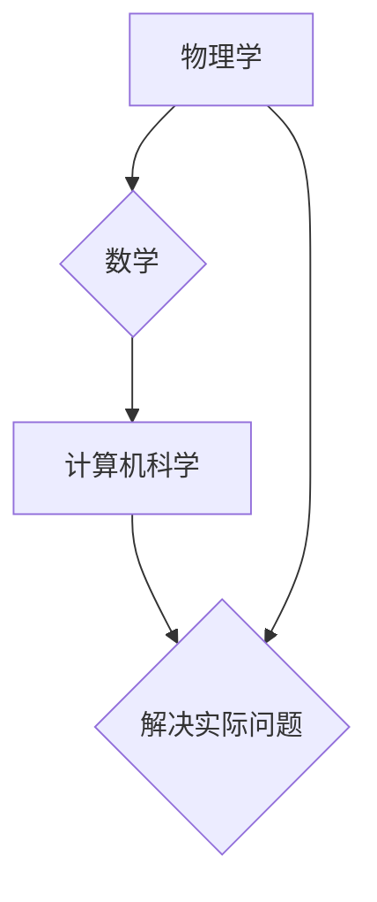

> 物理学、数学、计算机科学、算法、数据结构、编程语言、人工智能、机器学习、深度学习

## 1. 背景介绍

在当今科技飞速发展的时代，物理学、数学和计算机科学三大学科扮演着至关重要的角色。它们相互交织，相互促进，共同推动着人类文明的进步。物理学探索着宇宙的奥秘，数学为科学研究提供了一套严谨的逻辑体系，而计算机科学则将数学和物理学的理论应用于实际问题，为我们创造了便捷高效的生活方式。

从古老的算盘到现代的超级计算机，从简单的算法到复杂的深度学习模型，计算机科学的发展离不开物理学和数学的支撑。物理学为计算机硬件的发展提供了基础理论，例如半导体物理学、光学等；数学为计算机软件的发展提供了逻辑框架和算法设计方法，例如数据结构、算法分析、概率论等。

## 2. 核心概念与联系

**2.1 物理学与计算机科学**

物理学研究自然界的基本规律，而计算机科学则试图模拟和解决现实世界中的问题。两者之间的联系主要体现在以下几个方面：

* **硬件基础:** 计算机硬件的运作原理基于物理学中的基本规律，例如电磁学、量子力学等。例如，CPU的运算过程依赖于电子的流动，内存的存储原理基于电荷的存储和释放。
* **信息处理:** 物理学中的信息传递原理为计算机科学的信息处理提供基础。例如，光纤通信利用光子的传播特性进行信息传输，无线通信利用电磁波进行信息传输。
* **模拟与建模:** 计算机科学可以利用物理学模型来模拟现实世界中的现象，例如天气预报、气候变化、疾病传播等。

**2.2 数学与计算机科学**

数学为计算机科学提供了逻辑框架和算法设计方法。

* **逻辑推理:** 计算机程序的执行过程本质上是逻辑推理的过程，而数学逻辑为计算机程序的正确性提供了保证。
* **算法设计:** 算法是计算机科学的核心，而数学提供了算法设计和分析的理论基础。例如，排序算法、搜索算法、图论等都是数学概念的应用。
* **数据结构:** 数据结构是计算机程序中数据组织和存储的方式，而数学提供了数据结构的理论基础，例如树形结构、图结构、链表等。

**2.3 三大学科的相互作用**

物理学、数学和计算机科学相互联系，共同推动着科技进步。

* **物理学为数学和计算机科学提供基础理论:** 物理学研究自然界的基本规律，为数学和计算机科学提供了研究对象和理论基础。
* **数学为物理学和计算机科学提供逻辑框架和工具:** 数学提供了逻辑推理、算法设计和数据结构等工具，帮助物理学家和计算机科学家解决问题。
* **计算机科学将物理学和数学的理论应用于实际问题:** 计算机科学利用物理学和数学的理论，开发出各种软件和硬件，解决现实世界中的问题。

**Mermaid 流程图**



## 3. 核心算法原理 & 具体操作步骤

**3.1 算法原理概述**

算法是一种解决特定问题的步骤序列，它可以被计算机理解和执行。算法的本质是将问题分解成一系列简单的操作，并通过明确的步骤描述这些操作的执行顺序。

**3.2 算法步骤详解**

1. **问题分析:** 首先需要明确要解决的问题是什么，以及问题的输入和输出是什么。
2. **算法设计:** 根据问题的特点，设计出解决问题的算法步骤。
3. **算法实现:** 将算法步骤用编程语言实现，使其能够被计算机执行。
4. **算法测试:** 对实现的算法进行测试，验证其正确性和效率。
5. **算法优化:** 根据测试结果，对算法进行优化，提高其效率和性能。

**3.3 算法优缺点**

不同的算法具有不同的优缺点，选择合适的算法取决于具体问题的特点。

* **时间复杂度:** 算法执行的时间与输入数据量之间的关系。
* **空间复杂度:** 算法执行所需的内存空间大小。
* **稳定性:** 算法对输入数据的变化是否敏感。
* **易读性:** 算法的代码是否易于理解和维护。

**3.4 算法应用领域**

算法广泛应用于各个领域，例如：

* **人工智能:** 机器学习、深度学习、自然语言处理等。
* **数据科学:** 数据挖掘、数据分析、数据可视化等。
* **软件工程:** 软件设计、软件测试、软件维护等。
* **生物信息学:** 基因组测序、蛋白质结构预测等。

## 4. 数学模型和公式 & 详细讲解 & 举例说明

**4.1 数学模型构建**

数学模型是利用数学语言和符号来描述现实世界现象的抽象表示。构建数学模型的关键是选择合适的变量、建立关系式和约束条件。

**4.2 公式推导过程**

公式推导过程是利用数学逻辑和推理方法，从已知条件出发，逐步推导出未知结论的过程。公式推导过程需要严谨的逻辑推理和数学知识。

**4.3 案例分析与讲解**

**案例:** 计算一个圆的面积

**数学模型:** 圆的面积公式为：S = πr²，其中S表示圆的面积，π表示圆周率，r表示圆的半径。

**公式推导:**

* 圆的面积可以看作是由无数个微小的扇形组成。
* 每个扇形的面积为： (1/2) * r * dr，其中dr表示微小的弧长。
* 将所有扇形的面积加起来，就得到了圆的面积。
* 通过积分计算，可以得到圆的面积公式：S = ∫(1/2) * r * dr = πr²。

**举例说明:**

如果一个圆的半径为5厘米，那么它的面积为：S = π * 5² = 25π 厘米²。

## 5. 项目实践：代码实例和详细解释说明

**5.1 开发环境搭建**

* 操作系统: Ubuntu 20.04 LTS
* 编程语言: Python 3.8
* 开发工具: VS Code

**5.2 源代码详细实现**

```python
import math

def calculate_circle_area(radius):
  """
  计算圆的面积。

  Args:
    radius: 圆的半径。

  Returns:
    圆的面积。
  """
  return math.pi * radius**2

# 获取圆的半径
radius = float(input("请输入圆的半径: "))

# 计算圆的面积
area = calculate_circle_area(radius)

# 打印结果
print(f"圆的面积为: {area:.2f}")
```

**5.3 代码解读与分析**

* `import math`: 导入数学库，以便使用圆周率π。
* `calculate_circle_area(radius)`: 定义一个函数，用于计算圆的面积。函数接受圆的半径作为参数，并返回圆的面积。
* `math.pi`: 圆周率的数学常量。
* `radius**2`: 计算圆的半径的平方。
* `input("请输入圆的半径: ")`: 提示用户输入圆的半径。
* `float()`: 将用户输入的字符串转换为浮点数。
* `print(f"圆的面积为: {area:.2f}")`: 打印圆的面积，保留两位小数。

**5.4 运行结果展示**

```
请输入圆的半径: 5
圆的面积为: 78.54
```

## 6. 实际应用场景

**6.1 天气预报:**

利用物理学模型和数学算法，对大气层中的温度、湿度、气压等数据进行分析，预测未来天气状况。

**6.2 股票预测:**

利用数学模型和机器学习算法，分析股票市场的历史数据，预测股票价格的走势。

**6.3 医疗诊断:**

利用计算机视觉和机器学习算法，分析医学图像，辅助医生进行疾病诊断。

**6.4 未来应用展望:**

随着人工智能、机器学习和深度学习技术的不断发展，物理学、数学和计算机科学的融合将带来更多创新应用，例如：

* **自动驾驶:** 利用计算机视觉、传感器数据和机器学习算法，实现自动驾驶汽车。
* **个性化医疗:** 利用基因组测序和机器学习算法，为每个患者提供个性化的医疗方案。
* **量子计算:** 利用量子力学原理，开发出更加强大的计算能力，解决目前传统计算机无法解决的复杂问题。

## 7. 工具和资源推荐

**7.1 学习资源推荐:**

* **书籍:**
    * 《物理学》 - 费曼
    * 《数学分析》 - 华罗庚
    * 《算法导论》 - 
* **在线课程:**
    * Coursera: 物理学、数学、计算机科学课程
    * edX: 物理学、数学、计算机科学课程
    * MIT OpenCourseWare: 物理学、数学、计算机科学课程

**7.2 开发工具推荐:**

* **编程语言:** Python, C++, Java
* **IDE:** VS Code, PyCharm, Eclipse
* **版本控制系统:** Git

**7.3 相关论文推荐:**

* **人工智能:**
    * 《深度学习》 - Ian Goodfellow
    * 《强化学习》 - Richard S. Sutton
* **数据科学:**
    * 《数据挖掘》 - Jiawei Han
    * 《数据可视化》 - Kieran Healy
* **量子计算:**
    * 《量子计算与量子信息》 - Michael Nielsen

## 8. 总结：未来发展趋势与挑战

**8.1 研究成果总结:**

物理学、数学和计算机科学三大学科的融合，为科技进步带来了巨大推动。从人工智能到量子计算，从医疗诊断到自动驾驶，这些领域都受益于三大学科的交叉融合。

**8.2 未来发展趋势:**

* **人工智能的进一步发展:** 人工智能将更加智能化、自动化，并应用于更多领域。
* **量子计算的突破:** 量子计算将突破传统计算机的计算极限，解决目前无法解决的复杂问题。
* **生物信息学的快速发展:** 生物信息学将利用计算机科学和数学方法，解析生物信息，推动生物医学研究的进步。

**8.3 面临的挑战:**

* **伦理问题:** 人工智能的快速发展引发了伦理问题，例如算法偏见、数据隐私等。
* **安全问题:** 量子计算的强大计算能力也可能被用于攻击现有安全系统。
* **人才短缺:** 三大学科的交叉融合需要具备多学科背景的人才，而人才短缺是一个普遍的挑战。

**8.4 研究展望:**

未来，物理学、数学和计算机科学将继续相互促进，共同推动科技进步。我们需要加强跨学科合作，解决伦理和安全问题，培养更多复合型人才，为人类社会创造更加美好的未来。

## 9. 附录：常见问题与解答

**9.1 如何学习物理学、数学和计算机科学?**

* 选择合适的学习资源，例如书籍、在线课程、实践项目。
* 坚持学习，并不断练习。
* 积极参与社区活动，与其他学习者交流学习经验。

**9.2 如何选择合适的算法?**

* 了解算法的时间复杂度和空间复杂度。
* 考虑算法的稳定性和易读性。
* 根据具体问题的特点选择合适的算法。

**9.3 如何解决算法的优化问题?**

* 分析算法的执行过程，找出瓶颈。
* 尝试使用更优的算法或数据结构。
* 优化算法的代码实现。


作者：禅与计算机程序设计艺术 / Zen and the Art of Computer Programming 
<end_of_turn>