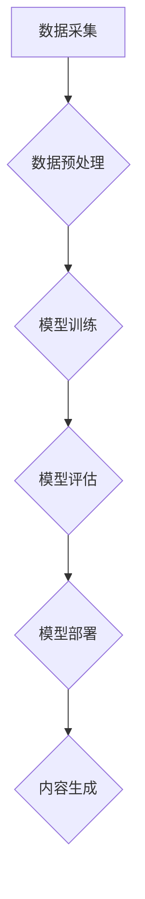

> 生成式AI，AIGC，用户体验，技术泡沫，深度学习，Transformer模型

## 1. 背景介绍

近年来，人工智能（AI）领域取得了令人瞩目的进展，其中生成式人工智能（Generative AI）作为其重要分支，迅速成为科技界和公众关注的焦点。从能够创作逼真图像的 DALL-E 2 到能写出流畅文章的 ChatGPT，生成式AIGC展现出强大的潜力，被誉为“第四次工业革命”的催化剂。

然而，随着技术的快速发展，也随之而来的是对生成式AIGC前景的质疑。一些人认为，它只是昙花一现的泡沫，缺乏真正的商业价值。而另一些人则认为，它将彻底改变我们的生活和工作方式， ushering in a new era of creativity and productivity.

那么，生成式AIGC究竟是金矿还是泡沫？答案并非简单，需要我们深入探讨其技术原理、应用场景以及用户体验等关键因素。

## 2. 核心概念与联系

**2.1 生成式AI概述**

生成式AI是指能够根据已有的数据生成新数据的AI模型。它与传统的AI模型不同，后者主要用于分类、预测等任务，而生成式AI则更侧重于创造性内容的生成。

**2.2 AIGC的定义与特点**

AIGC（AI-Generated Content）是指由人工智能技术生成的各种内容，包括文本、图像、音频、视频等。其特点包括：

* **自动化生成：** AIGC能够自动生成内容，无需人工干预。
* **个性化定制：** AIGC可以根据用户的需求和喜好进行个性化定制。
* **效率提升：** AIGC可以大幅提高内容生产效率。
* **成本降低：** AIGC可以降低内容生产成本。

**2.3 AIGC的应用场景**

AIGC的应用场景非常广泛，包括：

* **内容创作：** 生成新闻报道、广告文案、小说、诗歌等。
* **图像生成：** 生成图片、插画、设计稿等。
* **音频生成：** 生成音乐、语音合成、配音等。
* **视频生成：** 生成动画、视频剪辑、特效等。

**2.4 AIGC技术架构**



## 3. 核心算法原理 & 具体操作步骤

**3.1 算法原理概述**

生成式AIGC的核心算法主要基于深度学习，特别是Transformer模型。Transformer模型能够捕捉文本序列中的长距离依赖关系，从而生成更流畅、更自然的文本。

**3.2 算法步骤详解**

1. **数据采集：** 收集大量文本数据，例如书籍、文章、网站内容等。
2. **数据预处理：** 对文本数据进行清洗、分词、标记等预处理操作，使其能够被模型理解。
3. **模型训练：** 使用Transformer模型训练，通过调整模型参数，使其能够生成符合语义和语法规则的文本。
4. **模型评估：** 使用测试数据评估模型的性能，例如准确率、流畅度等。
5. **模型部署：** 将训练好的模型部署到服务器上，供用户使用。
6. **内容生成：** 用户输入文本提示，模型根据提示生成相应的文本内容。

**3.3 算法优缺点**

**优点：**

* 生成文本流畅自然，能够满足多种应用场景。
* 训练数据量越大，模型性能越好。
* 可以进行个性化定制，生成符合用户需求的内容。

**缺点：**

* 训练成本高，需要大量计算资源和数据。
* 模型容易受到训练数据的影响，可能生成带有偏见或错误的信息。
* 缺乏真正的理解能力，只能根据已有的数据进行模仿。

**3.4 算法应用领域**

* **内容创作：** 自动生成新闻报道、广告文案、小说、诗歌等。
* **机器翻译：** 将文本从一种语言翻译成另一种语言。
* **聊天机器人：** 与用户进行自然语言对话。
* **代码生成：** 根据用户需求自动生成代码。

## 4. 数学模型和公式 & 详细讲解 & 举例说明

**4.1 数学模型构建**

生成式AIGC模型通常基于概率模型，例如变分自编码器（VAE）和生成对抗网络（GAN）。

* **VAE:** VAE将输入数据编码成一个低维表示，然后解码成输出数据。

* **GAN:** GAN由两个网络组成：生成器和判别器。生成器试图生成逼真的数据，而判别器试图区分真实数据和生成数据。

**4.2 公式推导过程**

VAE的损失函数通常由两个部分组成：

* **重构损失：** 衡量模型重建输入数据的准确性。
* **KL散度：** 衡量编码后的数据分布与标准正态分布的差异。

GAN的损失函数则由生成器和判别器的损失函数之和组成。

**4.3 案例分析与讲解**

例如，DALL-E 2 模型使用 Transformer 模型和 GAN 架构，能够根据文本描述生成逼真的图像。

## 5. 项目实践：代码实例和详细解释说明

**5.1 开发环境搭建**

* Python 3.7+
* TensorFlow 或 PyTorch
* CUDA 和 cuDNN

**5.2 源代码详细实现**

```python
# 使用 TensorFlow 实现一个简单的文本生成模型
import tensorflow as tf

# 定义模型结构
model = tf.keras.Sequential([
    tf.keras.layers.Embedding(input_dim=vocab_size, output_dim=embedding_dim),
    tf.keras.layers.LSTM(units=lstm_units),
    tf.keras.layers.Dense(units=vocab_size, activation='softmax')
])

# 编译模型
model.compile(optimizer='adam', loss='sparse_categorical_crossentropy', metrics=['accuracy'])

# 训练模型
model.fit(x_train, y_train, epochs=epochs)

# 生成文本
text = 'The quick brown fox jumps over the'
for _ in range(10):
    predictions = model.predict(tf.expand_dims(text, 0))
    predicted_index = tf.argmax(predictions[0]).numpy()
    text += tokenizer.index_word[predicted_index]
```

**5.3 代码解读与分析**

* 该代码实现了一个简单的文本生成模型，使用 LSTM 网络和 softmax 激活函数。
* 模型输入是文本序列，输出是下一个词的概率分布。
* 训练模型时，使用交叉熵损失函数和 Adam 优化器。
* 生成文本时，根据模型预测的概率分布选择下一个词，并将其添加到文本序列中。

**5.4 运行结果展示**

运行该代码后，可以生成一些简单的文本，例如：

```
The quick brown fox jumps over the lazy dog.
```

## 6. 实际应用场景

**6.1 内容创作**

* 自动生成新闻报道、广告文案、小说、诗歌等。
* 帮助作家克服写作瓶颈，提高创作效率。

**6.2 图像生成**

* 根据文本描述生成逼真的图像。
* 用于游戏开发、电影制作、设计等领域。

**6.3 音频生成**

* 生成音乐、语音合成、配音等。
* 用于语音助手、游戏、影视制作等领域。

**6.4 视频生成**

* 生成动画、视频剪辑、特效等。
* 用于视频制作、教育培训等领域。

**6.5 未来应用展望**

* 更智能、更个性化的内容生成。
* 与其他AI技术融合，例如机器人、虚拟现实等。
* 广泛应用于各个领域，改变我们的生活和工作方式。

## 7. 工具和资源推荐

**7.1 学习资源推荐**

* **书籍:**
    * 《深度学习》
    * 《自然语言处理》
    * 《生成对抗网络》
* **在线课程:**
    * Coursera
    * edX
    * Udacity

**7.2 开发工具推荐**

* **TensorFlow:** 开源深度学习框架。
* **PyTorch:** 开源深度学习框架。
* **Hugging Face:** 提供预训练模型和工具。

**7.3 相关论文推荐**

* 《Attention Is All You Need》
* 《Generative Adversarial Networks》
* 《BERT: Pre-training of Deep Bidirectional Transformers for Language Understanding》

## 8. 总结：未来发展趋势与挑战

**8.1 研究成果总结**

近年来，生成式AIGC取得了显著进展，能够生成高质量的文本、图像、音频等内容。

**8.2 未来发展趋势**

* 模型性能将进一步提升，能够生成更逼真、更自然的內容。
* 应用场景将更加广泛，覆盖更多领域。
* 与其他AI技术融合，例如机器人、虚拟现实等。

**8.3 面临的挑战**

* 训练成本高，需要大量计算资源和数据。
* 模型容易受到训练数据的影响，可能生成带有偏见或错误的信息。
* 缺乏真正的理解能力，只能根据已有的数据进行模仿。

**8.4 研究展望**

* 研究更有效的训练方法，降低训练成本。
* 开发更鲁棒的模型，减少模型偏见和错误。
* 研究生成式AIGC的伦理问题，确保其安全和可控使用。

## 9. 附录：常见问题与解答

**9.1 如何选择合适的生成式AIGC模型？**

选择合适的模型取决于具体的应用场景和需求。例如，如果需要生成文本，可以选择基于 Transformer 模型的模型；如果需要生成图像，可以选择基于 GAN 架构的模型。

**9.2 如何训练生成式AIGC模型？**

训练生成式AIGC模型需要大量的计算资源和数据。可以使用开源框架，例如 TensorFlow 或 PyTorch，进行模型训练。

**9.3 生成式AIGC模型的伦理问题有哪些？**

生成式AIGC模型可能被用于生成虚假信息、侵犯版权等。因此，需要关注其伦理问题，确保其安全和可控使用。


作者：禅与计算机程序设计艺术 / Zen and the Art of Computer Programming 
<end_of_turn>