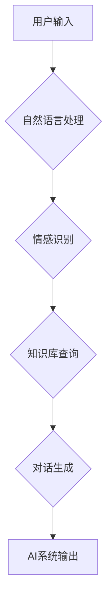

> 人工智能，自然语言处理，深度学习，情感识别，对话系统，电影分析，技术伦理

## 1. 背景介绍

2013年上映的电影《她》讲述了一个孤独的程序员Theodore与一个先进的AI操作系统Samantha之间的爱情故事。Samantha拥有高度的智能和情感感知能力，能够理解和回应Theodore的情感，并与他进行深入的对话。这部电影引发了人们对人工智能发展趋势和伦理问题的广泛思考。

近年来，人工智能技术取得了飞速发展，特别是深度学习的突破，使得AI系统在自然语言处理、图像识别、语音合成等领域取得了令人瞩目的成就。电影《她》中描绘的AI技术，虽然在某些方面还处于未来展望阶段，但它也反映了人工智能发展方向的某些趋势。

## 2. 核心概念与联系

### 2.1 自然语言处理 (NLP)

自然语言处理是人工智能领域的核心子领域之一，旨在使计算机能够理解、处理和生成人类语言。电影《她》中，Samantha能够理解Theodore的语音输入，并以自然流畅的语言进行回复，这体现了NLP技术的应用。

### 2.2 深度学习 (Deep Learning)

深度学习是一种机器学习的子领域，它利用多层神经网络来模拟人类大脑的学习过程。深度学习算法在处理复杂数据，例如文本和语音，方面表现出优异的性能。Samantha的智能和情感感知能力很可能基于深度学习算法的训练。

### 2.3 情感识别 (Emotion Recognition)

情感识别是指识别文本、语音或图像中表达的情感。Samantha能够识别Theodore的情感，并根据他的情绪进行相应的回应，这体现了情感识别技术的应用。

### 2.4 对话系统 (Dialogue System)

对话系统是指能够与人类进行自然对话的计算机系统。Samantha是一个高度智能的对话系统，它能够与Theodore进行深入的对话，并根据对话内容进行相应的理解和回应。

**Mermaid 流程图**



## 3. 核心算法原理 & 具体操作步骤

### 3.1 算法原理概述

Samantha的智能和情感感知能力很可能基于以下核心算法原理：

* **深度神经网络:** 用于处理文本和语音数据，学习语言模式和情感特征。
* **循环神经网络 (RNN):** 用于处理序列数据，例如对话文本，能够捕捉对话中的上下文信息。
* **长短期记忆网络 (LSTM):** 是一种RNN的变体，能够更好地处理长序列数据，例如长篇对话。
* **注意力机制:** 用于聚焦对话中的重要信息，提高对话理解和生成质量。

### 3.2 算法步骤详解

1. **数据预处理:** 收集大量文本和语音数据，进行清洗、标注和格式转换。
2. **模型训练:** 使用深度神经网络模型，例如LSTM，对数据进行训练，学习语言模式和情感特征。
3. **对话生成:** 当用户输入文本或语音时，模型会首先进行自然语言处理，提取关键信息。然后，模型会利用LSTM和注意力机制，分析对话上下文，并生成相应的回复文本或语音。
4. **情感识别:** 模型会分析用户输入中的情感特征，并根据情感进行相应的回应。

### 3.3 算法优缺点

**优点:**

* 能够理解和生成自然流畅的语言。
* 能够捕捉对话中的上下文信息。
* 能够识别和回应用户的感情。

**缺点:**

* 需要大量的训练数据。
* 训练过程复杂，需要强大的计算资源。
* 仍然存在理解和生成不准确的文本或语音的情况。

### 3.4 算法应用领域

* **聊天机器人:** 用于提供客户服务、进行娱乐互动等。
* **虚拟助手:** 用于帮助用户完成日常任务，例如设置提醒、查询信息等。
* **教育领域:** 用于提供个性化学习辅导、进行智能问答等。
* **医疗领域:** 用于辅助医生诊断疾病、提供患者咨询等。

## 4. 数学模型和公式 & 详细讲解 & 举例说明

### 4.1 数学模型构建

深度学习模型通常使用神经网络结构，其中每个神经元都接收来自其他神经元的输入，并进行加权求和和激活函数处理。

**神经网络模型:**

```
y = f(W * x + b)
```

其中：

* y 是输出值
* x 是输入值
* W 是权重矩阵
* b 是偏置向量
* f 是激活函数

### 4.2 公式推导过程

深度学习模型的训练过程是通过反向传播算法来进行的。反向传播算法利用梯度下降法来更新模型参数，使得模型的输出值与真实值之间的误差最小化。

**梯度下降法:**

```
W = W - α * ∇J(W)
```

其中：

* α 是学习率
* ∇J(W) 是损失函数J(W)关于权重W的梯度

### 4.3 案例分析与讲解

例如，在情感识别任务中，我们可以使用深度神经网络模型来学习文本与情感之间的映射关系。训练数据包括文本样本和对应的情感标签。模型通过训练，学习到将文本映射到情感标签的映射规则。

## 5. 项目实践：代码实例和详细解释说明

### 5.1 开发环境搭建

* Python 3.x
* TensorFlow 或 PyTorch 深度学习框架
* NLTK 自然语言处理库
* 其他必要的库，例如pandas、numpy等

### 5.2 源代码详细实现

```python
import tensorflow as tf

# 定义模型结构
model = tf.keras.Sequential([
    tf.keras.layers.Embedding(input_dim=vocab_size, output_dim=embedding_dim),
    tf.keras.layers.LSTM(units=128),
    tf.keras.layers.Dense(units=num_classes, activation='softmax')
])

# 编译模型
model.compile(optimizer='adam',
              loss='sparse_categorical_crossentropy',
              metrics=['accuracy'])

# 训练模型
model.fit(x_train, y_train, epochs=10)

# 评估模型
loss, accuracy = model.evaluate(x_test, y_test)
print('Loss:', loss)
print('Accuracy:', accuracy)
```

### 5.3 代码解读与分析

* **Embedding层:** 将单词映射到低维向量空间，捕捉单词之间的语义关系。
* **LSTM层:** 处理文本序列数据，捕捉对话中的上下文信息。
* **Dense层:** 全连接层，用于将LSTM输出映射到情感类别。
* **softmax激活函数:** 将输出值映射到概率分布，用于预测情感类别。

### 5.4 运行结果展示

训练完成后，我们可以使用模型对新的文本进行情感识别。模型的输出结果是一个概率分布，表示文本属于不同情感类别的概率。

## 6. 实际应用场景

### 6.1 客户服务

聊天机器人可以用于处理客户咨询、订单查询、售后服务等，提高客户服务效率。

### 6.2 教育领域

智能问答系统可以帮助学生解答学习问题，提供个性化学习辅导。

### 6.3 医疗领域

AI系统可以辅助医生诊断疾病、提供患者咨询，提高医疗服务质量。

### 6.4 未来应用展望

随着人工智能技术的不断发展，AI系统将在更多领域得到应用，例如自动驾驶、金融分析、科学研究等。

## 7. 工具和资源推荐

### 7.1 学习资源推荐

* **斯坦福大学CS224N课程:** 自然语言处理
* **DeepLearning.AI课程:** 深度学习
* **Hugging Face:** 开源自然语言处理模型库

### 7.2 开发工具推荐

* **TensorFlow:** 开源深度学习框架
* **PyTorch:** 开源深度学习框架
* **NLTK:** 自然语言处理库

### 7.3 相关论文推荐

* **Attention Is All You Need:** Transformer模型
* **BERT: Pre-training of Deep Bidirectional Transformers for Language Understanding:** BERT模型
* **GPT-3: Language Models are Few-Shot Learners:** GPT-3模型

## 8. 总结：未来发展趋势与挑战

### 8.1 研究成果总结

近年来，人工智能技术取得了飞速发展，特别是深度学习算法的突破，使得AI系统在自然语言处理、图像识别、语音合成等领域取得了令人瞩目的成就。

### 8.2 未来发展趋势

* **更强大的计算能力:** 随着硬件技术的进步，AI模型将能够处理更大规模的数据，学习更复杂的知识。
* **更有效的算法:** 研究人员将继续开发更有效的深度学习算法，提高AI系统的性能和效率。
* **更广泛的应用场景:** AI系统将应用于更多领域，例如自动驾驶、医疗保健、金融服务等。

### 8.3 面临的挑战

* **数据安全和隐私保护:** AI系统需要大量数据进行训练，如何保证数据安全和隐私保护是一个重要的挑战。
* **算法偏见:** AI系统可能存在算法偏见，导致不公平的结果。如何解决算法偏见是一个重要的研究课题。
* **伦理问题:** AI技术的快速发展引发了伦理问题，例如AI系统的责任和义务、AI与人类的关系等。

### 8.4 研究展望

未来，人工智能研究将继续朝着更智能、更安全、更可解释的方向发展。


## 9. 附录：常见问题与解答

**Q1: 如何评估AI系统的性能？**

**A1:** AI系统的性能可以根据具体任务进行评估。例如，对于情感识别任务，可以使用准确率、召回率、F1-score等指标进行评估。

**Q2: 如何解决AI系统中的算法偏见？**

**A2:** 

* 使用更公平的训练数据。
* 开发算法去偏见的方法。
* 对AI系统的输出进行监控和评估，及时发现和解决偏见问题。

**Q3: AI系统会取代人类工作吗？**

**A3:** AI系统可以自动化一些重复性工作，但它并不会完全取代人类工作。人类仍然需要发挥创造力、解决问题和进行决策等方面的优势。


作者：禅与计算机程序设计艺术 / Zen and the Art of Computer Programming 
<end_of_turn>