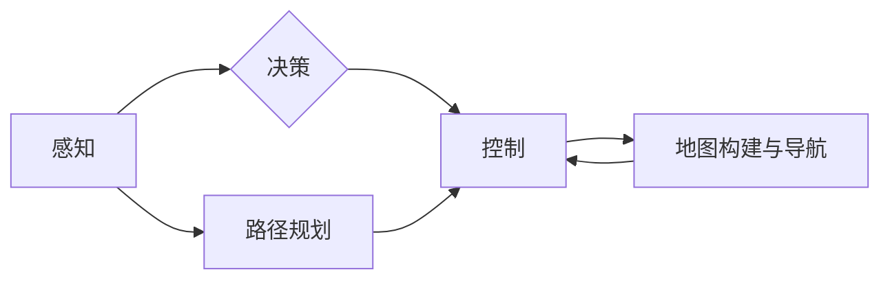

> 自动驾驶, 端到端, 接送客, 机器学习, 深度学习, 计算机视觉, 路网规划, 安全保障

## 1. 背景介绍

随着人工智能技术的飞速发展，自动驾驶技术已成为一个备受关注的领域。自动驾驶汽车能够自主感知周围环境、做出决策并控制车辆行驶，具有极大的潜力改变交通出行方式，提升出行效率和安全性。

自主接送客服务作为自动驾驶技术的应用场景之一，旨在利用自动驾驶汽车为乘客提供便捷、安全、高效的接送服务。该服务可以应用于多种场景，例如：

* **城市公共交通：**自动驾驶出租车或巴士可以提供灵活、便捷的接送服务，缓解城市交通拥堵问题。
* **机场接送：**自动驾驶汽车可以为乘客提供从机场到目的地或反向的接送服务，提高出行效率和舒适度。
* **老年人或残疾人接送：**自动驾驶汽车可以为行动不便的人群提供安全可靠的接送服务，提升他们的生活质量。

## 2. 核心概念与联系

端到端自动驾驶的自主接送客服务是一个复杂的系统，涉及多个核心概念和技术，包括：

* **感知：**自动驾驶汽车需要通过传感器（如摄像头、雷达、激光雷达等）感知周围环境，获取车辆位置、速度、周围障碍物等信息。
* **决策：**根据感知到的环境信息，自动驾驶汽车需要做出决策，例如转向、加速、减速等，以实现安全、高效的驾驶。
* **控制：**自动驾驶汽车需要通过控制系统控制车辆的各个部件，例如转向系统、制动系统、加速系统等，执行决策指令。
* **路径规划：**自动驾驶汽车需要规划一条安全、高效的路径，从起点到达目的地。
* **地图构建与导航：**自动驾驶汽车需要构建地图并进行导航，以确定车辆的位置和行驶路线。

这些核心概念相互关联，共同构成端到端自动驾驶系统的整体框架。

**Mermaid 流程图**



## 3. 核心算法原理 & 具体操作步骤

### 3.1  算法原理概述

端到端自动驾驶的自主接送客服务依赖于多种机器学习算法，例如：

* **深度学习：**用于感知、决策和路径规划等任务。
* **强化学习：**用于训练自动驾驶汽车的决策策略，使其能够在复杂环境中做出最优决策。
* **图神经网络：**用于处理路网信息，进行路径规划和导航。

### 3.2  算法步骤详解

**感知模块：**

1. **数据采集：**传感器收集车辆周围环境的信息，例如图像、激光点云等。
2. **数据预处理：**对采集到的数据进行预处理，例如图像增强、点云去噪等。
3. **特征提取：**利用深度学习模型提取感知数据中的特征，例如物体检测、语义分割等。

**决策模块：**

1. **环境建模：**根据感知到的环境信息，构建车辆周围环境的模型。
2. **决策策略：**利用强化学习算法训练决策策略，使其能够在不同场景下做出最优决策。
3. **动作规划：**根据决策策略，规划车辆的动作，例如转向、加速、减速等。

**控制模块：**

1. **动作执行：**将决策模块生成的动作指令发送到车辆的控制系统。
2. **状态反馈：**车辆控制系统反馈车辆的状态信息，例如速度、转向角度等。

**路径规划模块：**

1. **路网构建：**利用地图数据构建路网模型。
2. **路径搜索：**根据起点和终点，利用图神经网络算法搜索一条安全、高效的路径。
3. **路径优化：**对搜索到的路径进行优化，例如避开拥堵路段、减少行驶距离等。

### 3.3  算法优缺点

**优点：**

* **高精度：**深度学习算法能够实现高精度的感知和决策。
* **鲁棒性强：**强化学习算法能够训练出鲁棒的决策策略，使其能够应对复杂环境。
* **可扩展性强：**端到端架构能够方便地扩展到新的场景和任务。

**缺点：**

* **数据依赖：**深度学习算法需要大量的训练数据，数据质量直接影响算法性能。
* **计算资源消耗大：**训练深度学习模型需要大量的计算资源。
* **安全问题：**自动驾驶系统存在安全风险，需要进行严格的安全测试和验证。

### 3.4  算法应用领域

端到端自动驾驶的自主接送客服务算法可以应用于多种领域，例如：

* **智能交通：**优化交通流量，缓解交通拥堵。
* **物流运输：**提高物流效率，降低运输成本。
* **城市规划：**规划更便捷、更安全的城市交通系统。

## 4. 数学模型和公式 & 详细讲解 & 举例说明

### 4.1  数学模型构建

端到端自动驾驶的自主接送客服务可以抽象为一个状态空间模型，其中：

* **状态变量：**车辆的位置、速度、方向、周围环境信息等。
* **输入变量：**传感器数据、地图信息等。
* **输出变量：**车辆的控制指令（转向、加速、减速等）。

### 4.2  公式推导过程

**路径规划：**

可以使用 Dijkstra 算法或 A* 算法进行路径规划，目标是找到从起点到终点的最短路径。

**决策策略：**

可以使用强化学习算法，例如 Q-learning 或 Deep Q-Network (DQN)，训练决策策略。

**目标函数：**

强化学习算法的目标函数通常是奖励函数，奖励函数根据车辆的行为和环境状态进行评估。

### 4.3  案例分析与讲解

**举例说明：**

假设车辆需要从起点 A 到达终点 B，路网中存在多个道路和交叉口。可以使用 Dijkstra 算法计算出从 A 到 B 的最短路径，然后根据路径信息，规划车辆的转向、加速、减速指令。

## 5. 项目实践：代码实例和详细解释说明

### 5.1  开发环境搭建

* **操作系统：** Ubuntu 18.04 或更高版本
* **编程语言：** Python 3.6 或更高版本
* **深度学习框架：** TensorFlow 或 PyTorch
* **传感器模拟器：** Gazebo 或 CARLA

### 5.2  源代码详细实现

```python
# 感知模块示例代码
import cv2
import numpy as np

# 读取图像数据
image = cv2.imread("image.jpg")

# 进行图像预处理
image = cv2.cvtColor(image, cv2.COLOR_BGR2RGB)
image = cv2.resize(image, (640, 480))

# 使用深度学习模型进行物体检测
# ...

# 输出检测结果
print(detection_results)
```

### 5.3  代码解读与分析

* 感知模块示例代码使用 OpenCV 库进行图像处理，并使用深度学习模型进行物体检测。
* 代码中使用了 `cv2.imread()` 函数读取图像数据，`cv2.cvtColor()` 函数将图像颜色空间转换为 RGB，`cv2.resize()` 函数对图像进行缩放。
* 物体检测部分需要使用预训练的深度学习模型，例如 YOLO 或 Faster R-CNN。

### 5.4  运行结果展示

运行代码后，将输出检测到的物体的位置和类别信息。

## 6. 实际应用场景

### 6.1  城市公共交通

自动驾驶出租车或巴士可以提供灵活、便捷的接送服务，缓解城市交通拥堵问题。

### 6.2  机场接送

自动驾驶汽车可以为乘客提供从机场到目的地或反向的接送服务，提高出行效率和舒适度。

### 6.3  老年人或残疾人接送

自动驾驶汽车可以为行动不便的人群提供安全可靠的接送服务，提升他们的生活质量。

### 6.4  未来应用展望

端到端自动驾驶的自主接送客服务有广阔的应用前景，未来将应用于更多场景，例如：

* **校园接送：**为学生提供安全、便捷的接送服务。
* **医疗接送：**为病人提供便捷的医疗接送服务。
* **旅游接送：**为游客提供个性化的旅游接送服务。

## 7. 工具和资源推荐

### 7.1  学习资源推荐

* **书籍：**
    * 《深度学习》
    * 《强化学习：原理、算法和应用》
* **在线课程：**
    * Coursera 上的深度学习课程
    * Udacity 上的自动驾驶课程

### 7.2  开发工具推荐

* **深度学习框架：** TensorFlow、PyTorch
* **传感器模拟器：** Gazebo、CARLA
* **地图构建工具：** ROS、OpenStreetMap

### 7.3  相关论文推荐

* **端到端自动驾驶论文：**
    * End to End Learning for Self-Driving Cars
    * Learning to Drive with Deep Reinforcement Learning

## 8. 总结：未来发展趋势与挑战

### 8.1  研究成果总结

端到端自动驾驶的自主接送客服务技术取得了显著进展，但仍面临一些挑战。

### 8.2  未来发展趋势

* **算法性能提升：**继续提高算法的精度、鲁棒性和效率。
* **数据安全保障：**加强数据安全保护，防止数据泄露和滥用。
* **法规政策完善：**制定完善的自动驾驶法规政策，规范自动驾驶汽车的应用。

### 8.3  面临的挑战

* **安全问题：**自动驾驶系统存在安全风险，需要进行严格的安全测试和验证。
* **伦理问题：**自动驾驶系统可能面临伦理困境，需要进行深入的伦理研究和讨论。
* **社会影响：**自动驾驶汽车的普及可能对就业市场和社会结构产生影响，需要进行相应的社会适应和调整。

### 8.4  研究展望

未来，端到端自动驾驶的自主接送客服务技术将继续发展，为人们提供更加便捷、安全、高效的出行体验。

## 9. 附录：常见问题与解答

**常见问题：**

* **自动驾驶汽车的安全可靠性如何保证？**
* **自动驾驶汽车的成本如何？**
* **自动驾驶汽车的法律法规如何？**

**解答：**

* 自动驾驶汽车的安全可靠性通过严格的测试和验证来保证。
* 自动驾驶汽车的成本正在下降，未来将更加普及。
* 自动驾驶汽车的法律法规正在逐步完善，各国政府都在制定相关政策。


作者：禅与计算机程序设计艺术 / Zen and the Art of Computer Programming 
<end_of_turn>