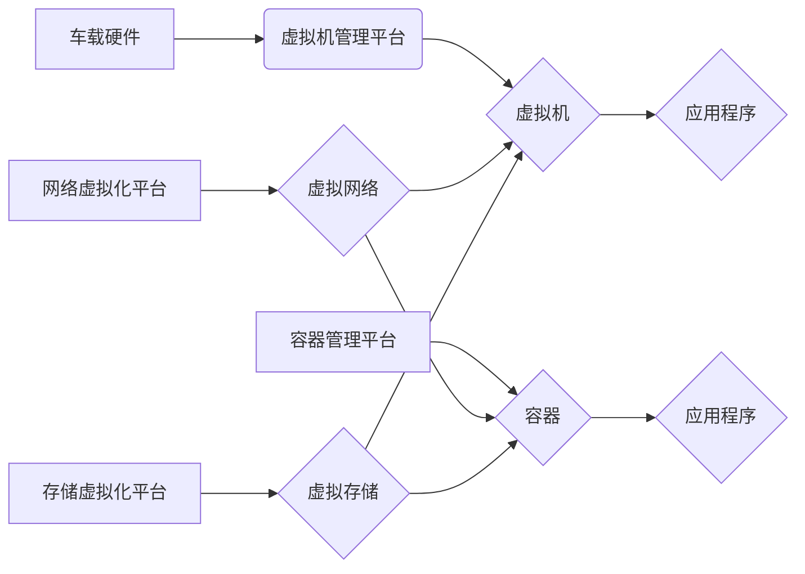

> 自动驾驶、车载计算平台、虚拟化、容器化、微服务、实时性、安全性、可靠性

## 1. 背景介绍

自动驾驶技术作为未来交通运输的重要发展方向，其核心是实现车辆感知、决策和控制的智能化。而车载计算平台作为自动驾驶系统的核心硬件基础，承担着海量数据处理、复杂算法执行和实时控制等关键任务。随着自动驾驶功能的不断丰富和复杂度提升，车载计算平台面临着越来越高的性能、效率和可靠性要求。

传统的车载计算平台通常采用单一硬件架构，难以满足多样化应用场景的需求。同时，软件开发和部署流程较为复杂，难以实现快速迭代和灵活扩展。为了解决这些问题，虚拟化技术逐渐被应用于车载计算平台，为自动驾驶系统提供了更灵活、高效、可靠的计算资源管理方案。

## 2. 核心概念与联系

**2.1 虚拟化技术**

虚拟化技术通过软件模拟硬件资源，将物理硬件资源分割成多个虚拟资源，每个虚拟资源可以独立运行不同的操作系统和应用程序。车载计算平台的虚拟化可以将物理硬件资源虚拟化成多个独立的计算环境，从而实现资源隔离、动态分配和弹性扩展。

**2.2 容器化技术**

容器化技术将应用程序及其依赖环境打包成一个独立的单元，可以方便地在不同环境中运行。容器化技术可以简化应用程序的部署和管理，提高应用程序的移植性和可复用性。

**2.3 微服务架构**

微服务架构将大型应用程序拆分成多个小型、独立的服务，每个服务负责特定的功能，通过API进行通信和交互。微服务架构可以提高应用程序的开发效率、可维护性和扩展性。

**2.4 车载计算平台虚拟化架构**

车载计算平台虚拟化架构通常由以下几个关键组件组成：

* **虚拟机管理平台 (VMM)**：负责管理虚拟机资源，包括创建、启动、停止、迁移等操作。
* **容器管理平台 (CM)**：负责管理容器资源，包括创建、启动、停止、部署等操作。
* **网络虚拟化平台 (NV)**：负责虚拟化网络资源，实现虚拟机和容器之间的网络通信。
* **存储虚拟化平台 (SV)**：负责虚拟化存储资源，提供虚拟机和容器共享存储服务。

**2.5 架构流程图**



## 3. 核心算法原理 & 具体操作步骤

**3.1 算法原理概述**

车载计算平台虚拟化技术主要依赖于以下核心算法：

* **虚拟化技术**: 通过模拟硬件资源，将物理资源分割成多个虚拟资源，实现资源隔离和动态分配。
* **容器化技术**: 将应用程序及其依赖环境打包成一个独立的单元，方便在不同环境中运行。
* **微服务架构**: 将大型应用程序拆分成多个小型、独立的服务，提高应用程序的开发效率和扩展性。

**3.2 算法步骤详解**

1. **硬件虚拟化**: 通过虚拟机管理平台 (VMM)，将物理硬件资源虚拟化成多个虚拟机，每个虚拟机拥有独立的 CPU、内存、存储等资源。
2. **容器化部署**: 将应用程序打包成容器，并通过容器管理平台 (CM) 部署到虚拟机或物理机上。
3. **微服务架构**: 将应用程序拆分成多个微服务，每个微服务负责特定的功能，通过 API 进行通信和交互。
4. **资源调度**: 通过虚拟机管理平台和容器管理平台，根据应用程序需求动态分配资源，实现资源的优化利用。
5. **网络虚拟化**: 通过网络虚拟化平台 (NV)，实现虚拟机和容器之间的网络通信，构建虚拟网络环境。
6. **存储虚拟化**: 通过存储虚拟化平台 (SV)，提供虚拟机和容器共享存储服务，实现数据存储和管理。

**3.3 算法优缺点**

**优点**:

* **资源利用率高**: 通过虚拟化技术，可以将物理资源充分利用，提高资源利用率。
* **灵活性强**: 可以根据应用程序需求动态分配资源，实现灵活的资源管理。
* **可扩展性好**: 可以通过增加虚拟机或容器数量，轻松扩展计算能力。
* **安全性高**: 通过资源隔离，可以提高系统安全性，防止应用程序之间相互干扰。

**缺点**:

* **性能损耗**: 虚拟化技术会带来一定的性能损耗，需要根据实际应用场景进行权衡。
* **复杂度高**: 虚拟化平台的部署和管理较为复杂，需要专业的技术人员进行维护。
* **成本较高**: 虚拟化平台的硬件和软件成本较高，需要进行成本评估。

**3.4 算法应用领域**

车载计算平台虚拟化技术广泛应用于以下领域:

* **自动驾驶**: 提供虚拟化环境，支持不同自动驾驶算法的开发和测试。
* **车联网**: 提供虚拟化资源，支持车联网应用的部署和运行。
* **智能座舱**: 提供虚拟化环境，支持智能座舱应用的开发和运行。
* **远程诊断**: 提供虚拟化平台，支持远程诊断和维修。

## 4. 数学模型和公式 & 详细讲解 & 举例说明

**4.1 数学模型构建**

车载计算平台虚拟化资源分配可以建模为一个优化问题，目标是最大化资源利用率，同时满足应用程序的性能需求。

**4.2 公式推导过程**

假设有 N 个虚拟机，每个虚拟机拥有 M 个 CPU 核，K 个内存单位。有 P 个应用程序，每个应用程序需要 x_i 个 CPU 核，y_i 个内存单位。

资源分配的目标函数可以定义为：

```latex
max \sum_{i=1}^{P} w_i * (x_i * M_i + y_i * K_i)
```

其中，w_i 是应用程序 i 的权重，表示其重要性。

约束条件包括：

* 每个虚拟机的 CPU 核资源和内存资源不能超过其最大容量。
* 每个应用程序的 CPU 核资源和内存资源需求必须得到满足。

**4.3 案例分析与讲解**

假设有 3 个虚拟机，每个虚拟机拥有 4 个 CPU 核，8 个内存单位。有 2 个应用程序，应用程序 1 需要 2 个 CPU 核，4 个内存单位，应用程序 2 需要 3 个 CPU 核，6 个内存单位。

通过优化算法，可以找到最佳的资源分配方案，例如：

* 虚拟机 1 分配给应用程序 1，虚拟机 2 分配给应用程序 2。

**4.4 举例说明**

通过上述数学模型和公式，可以对车载计算平台虚拟化资源分配进行优化，提高资源利用率，满足应用程序的性能需求。

## 5. 项目实践：代码实例和详细解释说明

**5.1 开发环境搭建**

* 操作系统：Ubuntu 20.04 LTS
* 虚拟机管理平台：KVM
* 容器管理平台：Docker
* 网络虚拟化平台：OVS
* 存储虚拟化平台：GlusterFS

**5.2 源代码详细实现**

```python
# 虚拟机管理脚本
import subprocess

def create_vm(vm_name, image_path):
    command = f"qemu-img create -f qcow2 {vm_name}.qcow2 {image_path}"
    subprocess.run(command, shell=True)

def start_vm(vm_name):
    command = f"qemu-system-x86_64 -m 2G -hda {vm_name}.qcow2"
    subprocess.run(command, shell=True)

# 容器管理脚本
import docker

client = docker.from_env()

def create_container(image_name, container_name):
    client.containers.run(image_name, name=container_name)

def start_container(container_name):
    client.containers.get(container_name).start()

# 网络虚拟化脚本
# ...

# 存储虚拟化脚本
# ...
```

**5.3 代码解读与分析**

* 虚拟机管理脚本：使用 `qemu-img` 和 `qemu-system-x86_64` 命令创建和启动虚拟机。
* 容器管理脚本：使用 Docker 库创建和启动容器。
* 网络虚拟化脚本：使用 OVS 命令配置虚拟网络。
* 存储虚拟化脚本：使用 GlusterFS 命令配置虚拟存储。

**5.4 运行结果展示**

通过上述代码，可以实现车载计算平台的虚拟化部署，并运行应用程序。

## 6. 实际应用场景

**6.1 自动驾驶测试平台**

车载计算平台虚拟化技术可以构建自动驾驶测试平台，模拟各种复杂路况和场景，进行自动驾驶算法的测试和验证。

**6.2 车联网应用开发平台**

车载计算平台虚拟化技术可以提供虚拟化环境，支持车联网应用的开发和测试，加速车联网应用的落地。

**6.3 智能座舱开发平台**

车载计算平台虚拟化技术可以提供虚拟化环境，支持智能座舱应用的开发和测试，提升智能座舱体验。

**6.4 未来应用展望**

随着自动驾驶技术的发展和应用场景的拓展，车载计算平台虚拟化技术将发挥越来越重要的作用，例如：

* **边缘计算**: 将虚拟化技术部署到车载边缘设备，实现数据本地处理和决策，提高自动驾驶系统的实时性和可靠性。
* **云计算**: 将车载计算平台与云计算平台进行融合，利用云端的计算资源和数据服务，提升自动驾驶系统的性能和智能化水平。
* **人工智能**: 将人工智能技术与车载计算平台虚拟化技术结合，实现自动驾驶系统的智能化升级，例如：自动驾驶决策、路径规划、目标识别等。

## 7. 工具和资源推荐

**7.1 学习资源推荐**

* **书籍**:
    * 《深入理解 Linux 内核》
    * 《Docker 入门指南》
    * 《Kubernetes 入门指南》
* **在线课程**:
    * Coursera: Linux Kernel Development
    * Udemy: Docker and Kubernetes for Beginners
* **博客**:
    * https://www.kernel.org/
    * https://www.docker.com/blog/
    * https://kubernetes.io/blog/

**7.2 开发工具推荐**

* **虚拟机管理平台**: KVM, VMware Workstation
* **容器管理平台**: Docker, Podman
* **网络虚拟化平台**: OVS, Open vSwitch
* **存储虚拟化平台**: GlusterFS, Ceph

**7.3 相关论文推荐**

* **车载计算平台虚拟化**:
    * "A Survey of Virtualization Techniques for Automotive Embedded Systems"
    * "Virtualization for Automotive Applications: Challenges and Opportunities"
* **自动驾驶**:
    * "End-to-End Learning for Self-Driving Cars"
    * "Deep Reinforcement Learning for Autonomous Driving"

## 8. 总结：未来发展趋势与挑战

**8.1 研究成果总结**

车载计算平台虚拟化技术已经取得了显著的进展，为自动驾驶系统提供了更灵活、高效、可靠的计算资源管理方案。

**8.2 未来发展趋势**

* **边缘计算**: 将虚拟化技术部署到车载边缘设备，实现数据本地处理和决策，提高自动驾驶系统的实时性和可靠性。
* **云计算**: 将车载计算平台与云计算平台进行融合，利用云端的计算资源和数据服务，提升自动驾驶系统的性能和智能化水平。
* **人工智能**: 将人工智能技术与车载计算平台虚拟化技术结合，实现自动驾驶系统的智能化升级，例如：自动驾驶决策、路径规划、目标识别等。

**8.3 面临的挑战**

