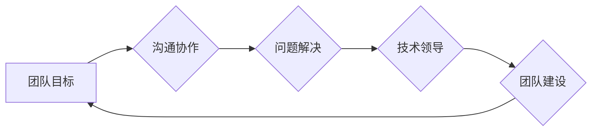

> IT团队管理, 团队目标, 沟通协作, 问题解决, 技术领导, 项目管理, 持续改进, 人才培养

## 1. 背景介绍

在当今数字化时代，IT团队扮演着至关重要的角色，他们负责构建、维护和改进公司的数字化基础设施，并推动业务创新。然而，高效地管理IT团队，并带领他们完成目标并非易事。 

IT团队的成员通常拥有不同的技能、背景和工作风格，如何协调他们的工作，激发他们的潜能，并确保团队朝着共同的目标前进，是IT领导者面临的重大挑战。

## 2. 核心概念与联系

### 2.1  团队目标与个人目标的统一

一个成功的IT团队需要明确的目标，这些目标应该与公司的整体战略目标相一致。同时，每个团队成员的个人目标也应该与团队目标相结合，这样才能确保每个人都朝着同一个方向努力。

### 2.2  沟通协作的有效机制

良好的沟通是IT团队成功的关键。团队成员之间需要能够清晰、及时地沟通，分享信息和想法。同时，领导者也需要能够有效地传达团队目标和期望，并及时反馈成员的工作成果。

### 2.3  问题解决能力的提升

IT行业瞬息万变，团队成员经常会遇到各种各样的问题。因此，提升团队成员的问题解决能力至关重要。领导者需要鼓励团队成员积极思考，提出解决方案，并共同解决问题。

### 2.4  技术领导与团队建设

技术领导者需要具备深厚的技术背景和管理能力。他们需要能够引领团队学习新技术，并将其应用到实际工作中。同时，他们还需要关注团队成员的成长和发展，并提供必要的支持和指导。

**Mermaid 流程图**



## 3. 核心算法原理 & 具体操作步骤

### 3.1  算法原理概述

**Agile开发**是一种迭代式软件开发方法，它强调灵活性和快速响应变化的能力。Agile开发的核心思想是将项目分解成多个小的迭代周期，每个迭代周期都包含需求分析、设计、开发、测试和部署等环节。

### 3.2  算法步骤详解

1. **需求分析:** 在每个迭代周期开始之前，团队需要对需求进行分析，并确定迭代周期内需要完成的功能。
2. **设计:** 根据需求分析结果，团队需要设计相应的软件架构和功能模块。
3. **开发:** 团队成员根据设计文档进行代码开发。
4. **测试:** 开发完成后，需要进行测试，确保软件功能正常工作。
5. **部署:** 测试通过后，将软件部署到测试环境或生产环境。
6. **回顾:** 每个迭代周期结束后，团队需要进行回顾，总结经验教训，并改进后续迭代过程。

### 3.3  算法优缺点

**优点:**

* 灵活性和适应性强，能够快速响应变化的需求。
* 能够提高软件质量，因为每个迭代周期都包含测试环节。
* 能够提高团队成员的参与度和士气。

**缺点:**

* 需要团队成员具备较高的沟通和协作能力。
* 需要对项目需求有较清晰的理解。
* 对于大型复杂项目，可能需要更多的迭代周期。

### 3.4  算法应用领域

Agile开发方法广泛应用于软件开发领域，尤其适用于快速迭代、需求变化频繁的项目。

## 4. 数学模型和公式 & 详细讲解 & 举例说明

### 4.1  数学模型构建

在IT团队管理中，可以使用数学模型来分析团队效率、项目进度等指标。例如，可以使用**甘特图**来表示项目进度，并计算项目完成所需的时间。

### 4.2  公式推导过程

**甘特图**中，每个任务的完成时间可以用公式表示：

```latex
T = \sum_{i=1}^{n} t_i
```

其中：

* T：任务完成时间
* n：任务数量
* t_i：第i个任务的完成时间

### 4.3  案例分析与讲解

假设一个IT项目需要完成三个任务，任务1完成时间为2天，任务2完成时间为3天，任务3完成时间为4天。

则项目总完成时间为：

```latex
T = 2 + 3 + 4 = 9 天
```

## 5. 项目实践：代码实例和详细解释说明

### 5.1  开发环境搭建

IT团队需要搭建一个合适的开发环境，以便团队成员能够高效地进行代码开发和测试。开发环境通常包括以下组件：

* **操作系统:** Linux、Windows等
* **编程语言:** Java、Python、C++等
* **开发工具:** IDE、版本控制系统等
* **数据库:** MySQL、PostgreSQL等

### 5.2  源代码详细实现

以下是一个简单的Python代码示例，用于计算两个数字的和：

```python
def sum_two_numbers(a, b):
  """
  计算两个数字的和。

  Args:
    a: 第一个数字。
    b: 第二个数字。

  Returns:
    两个数字的和。
  """
  return a + b

# 获取用户输入
num1 = int(input("请输入第一个数字: "))
num2 = int(input("请输入第二个数字: "))

# 计算和
sum = sum_two_numbers(num1, num2)

# 打印结果
print("两个数字的和为:", sum)
```

### 5.3  代码解读与分析

这段代码定义了一个名为`sum_two_numbers`的函数，该函数接受两个数字作为参数，并返回它们的和。

代码还包含了用户输入和输出的逻辑。

### 5.4  运行结果展示

当用户输入两个数字，例如5和3，程序将输出：

```
两个数字的和为: 8
```

## 6. 实际应用场景

### 6.1  软件开发项目

Agile开发方法广泛应用于软件开发项目，例如开发移动应用、网站、企业软件等。

### 6.2  产品迭代

Agile开发方法也适用于产品迭代，例如根据用户反馈不断改进产品功能和体验。

### 6.3  IT基础设施建设

Agile开发方法也可以应用于IT基础设施建设，例如部署云计算平台、构建自动化运维系统等。

### 6.4  未来应用展望

随着数字化转型加速，Agile开发方法将继续在更多领域得到应用，例如数据分析、人工智能等。

## 7. 工具和资源推荐

### 7.1  学习资源推荐

* **书籍:**《敏捷软件开发》
* **网站:**Agile Alliance

### 7.2  开发工具推荐

* **版本控制系统:** Git
* **项目管理工具:** Jira, Trello

### 7.3  相关论文推荐

* **Scrum: A Lightweight Framework for Managing Complex Projects**

## 8. 总结：未来发展趋势与挑战

### 8.1  研究成果总结

Agile开发方法已经成为软件开发领域的主流方法，它有效地提高了软件开发效率和质量。

### 8.2  未来发展趋势

未来，Agile开发方法将更加注重自动化、人工智能等技术的应用，以进一步提高开发效率和降低成本。

### 8.3  面临的挑战

Agile开发方法的实施需要团队成员具备较高的沟通和协作能力，以及对方法论的理解和掌握。

### 8.4  研究展望

未来研究将更加关注Agile开发方法在不同领域和项目类型的应用，以及如何更好地解决Agile开发方法实施过程中遇到的挑战。

## 9. 附录：常见问题与解答

### 9.1  Agile开发方法适合所有项目吗？

Agile开发方法更适合于需求变化频繁、迭代周期短的项目。对于大型复杂项目，需要根据实际情况选择合适的开发方法。

### 9.2  如何评估Agile开发方法的成功？

Agile开发方法的成功需要从多个方面进行评估，例如项目进度、软件质量、团队士气等。

### 9.3  如何培养团队成员的Agile开发能力？

可以通过培训、实践和经验分享等方式培养团队成员的Agile开发能力。


作者：禅与计算机程序设计艺术 / Zen and the Art of Computer Programming 
<end_of_turn>