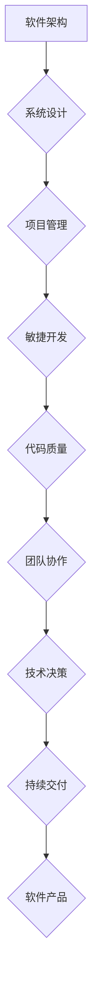

> 软件架构、系统设计、项目管理、敏捷开发、代码质量、团队协作、技术决策、持续交付

## 1. 背景介绍

在当今科技日新月异的时代，软件系统正以惊人的速度发展，从简单的应用程序到复杂的云平台，软件无处不在，深刻地影响着我们的生活和工作。然而，软件开发并非一蹴而就，它需要严谨的规划、高效的执行和持续的改进。就像管理艺术一样，软件开发也需要一套完整的理论体系和实践方法，才能将复杂的技术难题转化为成功的软件产品。

本书将从软件架构、系统设计、项目管理、敏捷开发、代码质量、团队协作、技术决策、持续交付等多个方面，探讨软件开发的管理艺术，帮助读者掌握软件开发的精髓，提升软件开发的效率和质量。

## 2. 核心概念与联系

软件开发的管理艺术，本质上是将技术策略与执行实践相结合的过程。它需要从宏观的系统设计到微观的代码实现，从团队协作到技术决策，各个环节都需精心设计和管理。

**核心概念：**

* **软件架构：** 软件系统的骨架，决定了软件系统的整体结构、组件之间的关系和数据流。
* **系统设计：** 将软件架构转化为具体的实现方案，包括功能模块设计、数据模型设计、接口设计等。
* **项目管理：**  规划、组织、协调和控制软件开发项目，确保项目按时、按预算、按质量完成。
* **敏捷开发：**  一种迭代开发方法，强调快速反馈、持续改进和团队协作。
* **代码质量：**  软件代码的可靠性、可读性、可维护性和可扩展性。
* **团队协作：**  软件开发是一个团队协作的过程，需要良好的沟通、协作和信任。
* **技术决策：**  选择合适的技术方案，需要考虑技术成熟度、成本效益、团队能力等因素。
* **持续交付：**  将软件开发流程自动化，实现快速、频繁的软件发布。

**Mermaid 流程图：**



## 3. 核心算法原理 & 具体操作步骤

### 3.1  算法原理概述

在软件开发中，算法是解决特定问题的逻辑步骤，它决定了软件的效率和性能。常见的软件开发算法包括排序算法、搜索算法、数据结构算法等。

### 3.2  算法步骤详解

以排序算法为例，常见的排序算法包括冒泡排序、插入排序、快速排序等。

* **冒泡排序：** 比较相邻元素，如果顺序错误则交换位置，重复此过程直到整个数组有序。
* **插入排序：** 将一个元素插入到已排序的子数组中，保持子数组有序。
* **快速排序：** 选择一个元素作为基准，将小于基准的元素放在左边，大于基准的元素放在右边，递归地对左右子数组进行排序。

### 3.3  算法优缺点

不同的排序算法具有不同的时间复杂度和空间复杂度，需要根据实际情况选择合适的算法。

* **冒泡排序：** 时间复杂度为O(n^2)，空间复杂度为O(1)，简单易懂，但效率较低。
* **插入排序：** 时间复杂度为O(n^2)，空间复杂度为O(1)，适用于小规模数据排序，效率中等。
* **快速排序：** 平均时间复杂度为O(n log n)，空间复杂度为O(log n)，效率较高，但最坏情况时间复杂度为O(n^2)。

### 3.4  算法应用领域

排序算法广泛应用于各种软件系统，例如数据库管理系统、搜索引擎、操作系统等。

## 4. 数学模型和公式 & 详细讲解 & 举例说明

### 4.1  数学模型构建

在软件开发中，数学模型可以用来描述软件系统的行为和性能，例如：

* **时间复杂度：** 描述算法运行时间随输入数据规模变化的规律。
* **空间复杂度：** 描述算法运行过程中使用的内存空间大小。
* **吞吐量：** 描述系统处理数据的速率。
* **延迟：** 描述系统响应用户的延迟时间。

### 4.2  公式推导过程

例如，时间复杂度可以用大O符号表示，例如：

* O(n) 表示时间复杂度线性增长，例如线性搜索算法。
* O(n log n) 表示时间复杂度为对数增长，例如快速排序算法。

### 4.3  案例分析与讲解

例如，假设一个算法的时间复杂度为O(n^2)，如果输入数据规模从100到1000增长，则运行时间将从100^2 = 10000到1000^2 = 1000000增长，增长速度非常快。

## 5. 项目实践：代码实例和详细解释说明

### 5.1  开发环境搭建

使用常用的开发工具和环境，例如：

* **IDE:** IntelliJ IDEA, Eclipse, Visual Studio Code
* **编程语言:** Java, Python, C++, JavaScript
* **版本控制系统:** Git

### 5.2  源代码详细实现

以一个简单的排序算法为例，展示代码实现：

```java
public class BubbleSort {

    public static void bubbleSort(int[] arr) {
        int n = arr.length;
        for (int i = 0; i < n - 1; i++) {
            for (int j = 0; j < n - i - 1; j++) {
                if (arr[j] > arr[j + 1]) {
                    int temp = arr[j];
                    arr[j] = arr[j + 1];
                    arr[j + 1] = temp;
                }
            }
        }
    }

    public static void main(String[] args) {
        int[] arr = {64, 34, 25, 12, 22, 11, 90};
        bubbleSort(arr);
        System.out.println("排序后的数组:");
        for (int i : arr) {
            System.out.print(i + " ");
        }
    }
}
```

### 5.3  代码解读与分析

代码实现了一个冒泡排序算法，它通过多次比较相邻元素，将元素逐步排序。

### 5.4  运行结果展示

运行代码后，输出结果为：

```
排序后的数组:
11 12 22 25 34 64 90
```

## 6. 实际应用场景

### 6.1  软件架构设计

软件架构设计需要考虑系统的规模、复杂度、性能要求等因素，选择合适的架构模式，例如：

* **微服务架构：** 将系统分解为多个独立的服务，每个服务负责特定的功能，提高系统的可扩展性和容错性。
* **云原生架构：** 基于云计算平台构建的系统，具有弹性、可伸缩、高可用等特点。

### 6.2  项目管理实践

项目管理需要制定详细的计划、分配任务、跟踪进度、控制风险，确保项目按时、按预算、按质量完成。

### 6.3  敏捷开发实践

敏捷开发强调迭代开发、快速反馈、持续改进，通过短周期迭代，快速交付软件功能，并根据用户反馈进行调整。

### 6.4  未来应用展望

随着人工智能、云计算、大数据等技术的快速发展，软件开发的管理艺术将更加重要，需要不断探索新的技术和方法，提升软件开发的效率和质量。

## 7. 工具和资源推荐

### 7.1  学习资源推荐

* **书籍:** 《软件工程导论》、《软件架构》、《敏捷软件开发》
* **在线课程:** Coursera, Udemy, edX
* **博客:** Martin Fowler, Jeff Atwood, Joel Spolsky

### 7.2  开发工具推荐

* **IDE:** IntelliJ IDEA, Eclipse, Visual Studio Code
* **版本控制系统:** Git
* **持续集成/持续交付工具:** Jenkins, GitLab CI, CircleCI

### 7.3  相关论文推荐

* **软件架构论文:** 《软件架构的十个原则》
* **敏捷开发论文:** 《敏捷软件开发宣言》
* **持续交付论文:** 《持续交付实践指南》

## 8. 总结：未来发展趋势与挑战

### 8.1  研究成果总结

本书探讨了软件开发的管理艺术，从软件架构、系统设计、项目管理、敏捷开发、代码质量、团队协作、技术决策、持续交付等多个方面，提供了丰富的理论知识和实践经验。

### 8.2  未来发展趋势

未来软件开发的管理艺术将更加注重：

* **人工智能的应用:** 利用人工智能技术自动生成代码、测试代码、优化代码，提高软件开发效率。
* **云原生开发:** 基于云计算平台构建的软件系统，具有弹性、可伸缩、高可用等特点。
* **持续交付的自动化:** 将软件开发流程自动化，实现快速、频繁的软件发布。

### 8.3  面临的挑战

未来软件开发的管理艺术也面临着一些挑战：

* **技术复杂性:** 软件系统越来越复杂，需要更先进的技术和方法来管理。
* **人才短缺:** 软件开发人才需求量大，但供给不足。
* **安全风险:** 软件系统面临着越来越多的安全威胁，需要加强安全防护。

### 8.4  研究展望

未来，我们将继续研究软件开发的管理艺术，探索新的技术和方法，帮助软件开发人员更高效、更高质量地开发软件产品。

## 9. 附录：常见问题与解答

### 9.1  常见问题

* 如何选择合适的软件架构？
* 如何进行有效的项目管理？
* 如何提高代码质量？
* 如何进行敏捷开发？

### 9.2  解答

...

作者：禅与计算机程序设计艺术 / Zen and the Art of Computer Programming


<end_of_turn>