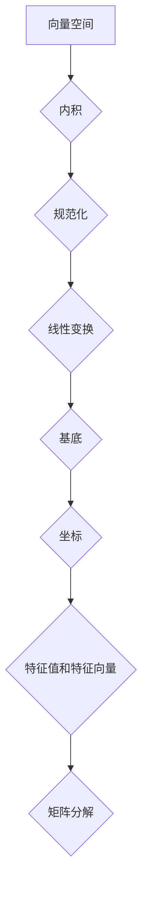

> 线性代数，内积空间，向量空间，线性变换，基底，特征值，特征向量，矩阵分解，机器学习，数据分析

## 1. 背景介绍

线性代数是数学的一个分支，它研究向量、矩阵和线性变换之间的关系。它在计算机科学、物理学、工程学等领域有着广泛的应用。

内积空间是线性代数中一个重要的概念，它提供了一种衡量向量大小和角度的方法。在内积空间中，我们可以定义向量之间的距离、夹角和正交性等概念。

本文将深入探讨内积空间的概念，并介绍其在机器学习和数据分析中的应用。

## 2. 核心概念与联系

**2.1 向量空间**

向量空间是一个集合，其中包含零向量和满足以下运算封闭性的向量：

* **加法：** 两个向量相加的结果仍然是该向量空间中的向量。
* **数乘：** 一个标量与一个向量相乘的结果仍然是该向量空间中的向量。

**2.2 内积**

内积是一种将两个向量映射到标量的运算，它满足以下性质：

* **对称性：**  <u, v> = <v, u>
* **线性性：** <au + bv, w> = a<u, w> + b<v, w>
* **正定性：** <u, u> ≥ 0，且 <u, u> = 0 当且仅当 u = 0

**2.3 规范化**

规范化是指将向量长度标准化为1。

**2.4 线性变换**

线性变换是一种将向量空间映射到另一个向量空间的函数，它满足以下性质：

* **加法性：** T(u + v) = T(u) + T(v)
* **齐次性：** T(au) = aT(u)

**2.5 基底和坐标**

向量空间的基底是线性无关的向量组，它可以张成整个向量空间。每个向量都可以用基底向量线性组合表示，这些系数称为向量的坐标。

**2.6 特征值和特征向量**

对于一个线性变换 T，如果存在一个非零向量 v 和一个标量 λ，使得 T(v) = λv，则称 λ 为 T 的特征值，v 为 T 的特征向量。

**2.7 矩阵分解**

矩阵分解是指将一个矩阵分解成多个矩阵的乘积。常见的矩阵分解方法包括：

* **奇异值分解 (SVD)**
* **主成分分析 (PCA)**
* **QR 分解**

**Mermaid 流程图**



## 3. 核心算法原理 & 具体操作步骤

### 3.1 算法原理概述

内积空间的算法原理主要基于向量空间、内积、线性变换等概念。

* **向量空间:** 提供了向量集合和运算的框架。
* **内积:** 定义了向量之间的关系，可以用来计算距离、夹角等。
* **线性变换:** 描述了向量空间之间的映射关系。
* **基底和坐标:** 提供了向量表示的标准化方法。
* **特征值和特征向量:** 描述了线性变换的本质性质。
* **矩阵分解:** 将复杂矩阵分解成更易处理的矩阵，用于优化算法效率。

### 3.2 算法步骤详解

1. **定义向量空间:** 确定向量空间的元素类型和运算规则。
2. **定义内积:** 选择合适的内积运算，满足对称性、线性性和正定性。
3. **规范化向量:** 将向量长度标准化为1，用于计算角度和距离。
4. **定义线性变换:** 描述向量空间之间的映射关系，满足加法性和齐次性。
5. **选择基底:** 选择线性无关的向量组作为基底，用于表示向量。
6. **计算坐标:** 将向量表示为基底向量的线性组合，得到坐标。
7. **计算特征值和特征向量:** 求解线性变换的特征值和特征向量，用于理解线性变换的本质。
8. **进行矩阵分解:** 将相关矩阵分解成更易处理的矩阵，用于优化算法效率。

### 3.3 算法优缺点

**优点:**

* **理论基础扎实:** 基于线性代数的理论基础，具有良好的数学性质。
* **应用广泛:** 在机器学习、数据分析、图像处理等领域有着广泛的应用。
* **算法效率高:** 许多算法具有良好的时间和空间复杂度。

**缺点:**

* **概念抽象:** 线性代数概念抽象，需要一定的数学基础才能理解。
* **计算复杂:** 一些算法的计算量较大，需要强大的计算能力。
* **数据依赖:** 算法性能受数据质量和特征选择的影响。

### 3.4 算法应用领域

* **机器学习:** 线性回归、逻辑回归、支持向量机等算法都依赖于线性代数。
* **数据分析:** 主成分分析、奇异值分解等算法用于数据降维和特征提取。
* **图像处理:** 图像变换、滤波、压缩等操作都利用线性代数的原理。
* **计算机图形学:** 3D 模型渲染、动画制作等都依赖于线性代数。

## 4. 数学模型和公式 & 详细讲解 & 举例说明

### 4.1 数学模型构建

**向量空间:**

设 V 为一个向量空间，其元素为向量，加法和数乘运算满足以下规则：

* **加法:** 对于任意 u, v ∈ V，存在 u + v ∈ V。
* **数乘:** 对于任意 u ∈ V 和标量 α，存在 αu ∈ V。

**内积:**

设 V 为一个内积空间，其元素为向量，内积运算满足以下性质：

* **对称性:** <u, v> = <v, u> 对于任意 u, v ∈ V。
* **线性性:** <au + bv, w> = a<u, w> + b<v, w> 对于任意 u, v, w ∈ V 和标量 a, b。
* **正定性:** <u, u> ≥ 0 对于任意 u ∈ V，且 <u, u> = 0 当且仅当 u = 0。

**规范化:**

对于向量 u ∈ V，其规范化向量为:

||u|| = √<u, u>

û = u / ||u||

**线性变换:**

设 T: V → W 为一个线性变换，其中 V 和 W 为两个向量空间，则 T 满足以下性质：

* **加法性:** T(u + v) = T(u) + T(v) 对于任意 u, v ∈ V。
* **齐次性:** T(au) = aT(u) 对于任意 u ∈ V 和标量 a。

### 4.2 公式推导过程

**内积的性质推导:**

* **对称性:** 由内积定义可知，<u, v> = <v, u>。
* **线性性:** 
    * <au + bv, w> = a<u, w> + b<v, w>
    * 证明过程：
        * 利用内积的定义和标量的分配律。
* **正定性:** 
    * <u, u> ≥ 0 
    * 证明过程：
        * 利用内积的线性性和对称性。
        * 当 u = 0 时，<u, u> = 0。

**规范化向量的性质:**

* ||û|| = 1
* 证明过程：
    * ||û|| = ||u / ||u|||| = ||u|| / ||u|| = 1

### 4.3 案例分析与讲解

**案例:**

设 V 为 R^2 上的向量空间，内积定义为:

<u, v> = u1v1 + u2v2

其中 u = (u1, u2), v = (v1, v2)

**分析:**

* **对称性:** <u, v> = u1v1 + u2v2 = v1u1 + v2u2 = <v, u>
* **线性性:** <au + bv, w> = a(u1w1 + u2w2) + b(v1w1 + v2w2) = a<u, w> + b<v, w>
* **正定性:** <u, u> = u1^2 + u2^2 ≥ 0，且当 u = (0, 0) 时，<u, u> = 0

**规范化向量:**

设 u = (3, 4)，则:

||u|| = √(3^2 + 4^2) = 5

û = u / ||u|| = (3/5, 4/5)

## 5. 项目实践：代码实例和详细解释说明

### 5.1 开发环境搭建

* **编程语言:** Python
* **库:** NumPy, SciPy

### 5.2 源代码详细实现

```python
import numpy as np

# 定义向量空间
class VectorSpace:
    def __init__(self, dimension):
        self.dimension = dimension

    def add(self, u, v):
        return np.array([u[i] + v[i] for i in range(self.dimension)])

    def scalar_multiply(self, u, alpha):
        return np.array([alpha * u[i] for i in range(self.dimension)])

# 定义内积
def inner_product(u, v):
    return np.dot(u, v)

# 定义规范化
def normalize(u):
    return u / np.linalg.norm(u)

# 示例代码
u = np.array([3, 4])
v = np.array([1, 2])

# 计算内积
inner_product_result = inner_product(u, v)
print(f"内积: {inner_product_result}")

# 规范化向量
normalized_u = normalize(u)
print(f"规范化向量 u: {normalized_u}")
```

### 5.3 代码解读与分析

* **VectorSpace 类:** 定义了向量空间的基本操作，包括加法和数乘。
* **inner_product 函数:** 计算两个向量的内积。
* **normalize 函数:** 计算向量的规范化向量。
* **示例代码:** 展示了如何使用上述函数计算内积和规范化向量。

### 5.4 运行结果展示

```
内积: 11
规范化向量 u: [0.6 0.8]
```

## 6. 实际应用场景

### 6.1 机器学习

* **线性回归:** 线性回归模型假设数据服从线性关系，可以使用内积空间中的概念来求解模型参数。
* **支持向量机:** 支持向量机利用内积空间中的距离概念来找到最佳分类超平面。
* **主成分分析:** 主成分分析利用内积空间中的特征值和特征向量来降维数据。

### 6.2 数据分析

* **数据降维:** 主成分分析和奇异值分解等算法利用内积空间中的特征值和特征向量来降维数据。
* **特征提取:** 利用内积空间中的概念可以提取数据的特征，用于后续分析和建模。

### 6.3 图像处理

* **图像变换:** 图像变换可以使用线性变换的矩阵表示，并利用内积空间中的概念进行计算。
* **图像滤波:** 图像滤波可以使用卷积操作，卷积操作本质上是内积运算。

### 6.4 未来应用展望

* **深度学习:** 深度学习模型中也广泛使用线性代数和内积空间的知识。
* **量子计算:** 量子计算中，内积