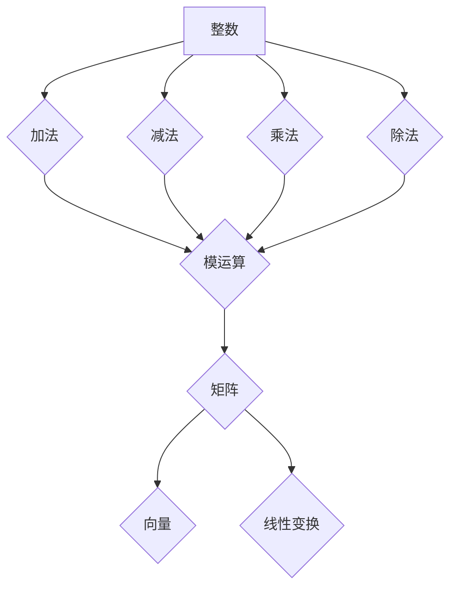

> 线性代数，整数，算术运算，模运算，矩阵，向量，线性变换，加密算法

## 1. 背景介绍

线性代数作为数学领域的重要分支，在计算机科学、数据科学、人工智能等领域有着广泛的应用。其核心概念和算法为处理大量数据、进行模式识别、构建机器学习模型等提供了强大的工具。而整数及其算术运算作为线性代数的基础，在许多应用场景中扮演着至关重要的角色。

本篇文章将从线性代数的角度出发，深入探讨整数及其算术运算的性质和应用。我们将介绍整数的模运算、矩阵和向量的表示，以及线性变换等核心概念，并结合实际应用场景，阐述其在加密算法、数据压缩、图像处理等领域的应用价值。

## 2. 核心概念与联系

### 2.1 整数及其算术运算

整数是自然数、零和负数的集合，是数学中最基本的数系之一。整数的算术运算包括加法、减法、乘法和除法。这些运算在计算机科学中是基础操作，用于处理各种数据和进行计算。

### 2.2 模运算

模运算是一种特殊的运算，它返回两个整数相除后的余数。模运算的符号为“%”，例如，10 % 3 = 1，表示10除以3的余数为1。模运算在密码学、数据加密、计算机网络等领域有着广泛的应用。

### 2.3 矩阵和向量

矩阵和向量是线性代数中的重要概念，用于表示和处理数据。矩阵是一种二维数组，向量是一种一维数组。矩阵和向量可以通过加法、减法、乘法等运算进行组合和变换。

### 2.4 线性变换

线性变换是一种将向量映射到另一个向量空间的函数，它满足以下两个性质：

* **加性:** T(u + v) = T(u) + T(v)
* **齐次性:** T(cu) = cT(u)

线性变换在图像处理、机器学习、数据分析等领域有着广泛的应用。

**Mermaid 流程图**



## 3. 核心算法原理 & 具体操作步骤

### 3.1 算法原理概述

本节将介绍几种与整数及其算术运算相关的核心算法，包括模逆算法、欧几里得算法和中国剩余定理。

### 3.2 算法步骤详解

#### 3.2.1 模逆算法

模逆算法用于求解一个整数a在模m意义下的逆元，即存在整数b使得a * b ≡ 1 (mod m)。

**算法步骤:**

1. 使用欧几里得算法求解gcd(a, m)。
2. 如果gcd(a, m) = 1，则a在模m意义下存在逆元。
3. 使用扩展欧几里得算法求解整数x和y，使得ax + my = 1。
4. 则x是a在模m意义下的逆元。

#### 3.2.2 欧几里得算法

欧几里得算法是一种用于求解两个整数的最大公约数（GCD）的算法。

**算法步骤:**

1. 如果一个整数为0，则另一个整数是GCD。
2. 否则，将较大的整数除以较小的整数，并将余数作为新的较小的整数。
3. 重复步骤2，直到余数为0。

#### 3.2.3 中国剩余定理

中国剩余定理是一种用于求解一组线性同余方程组的定理。

**算法步骤:**

1. 将所有线性同余方程组写成标准形式：x ≡ a_i (mod m_i)。
2. 计算每个模数m_i的逆元。
3. 使用逆元和模数计算出x的解。

### 3.3 算法优缺点

#### 3.3.1 模逆算法

* **优点:** 效率高，易于实现。
* **缺点:** 仅适用于模数为素数的情况。

#### 3.3.2 欧几里得算法

* **优点:** 效率高，易于实现。
* **缺点:** 仅适用于整数的GCD计算。

#### 3.3.3 中国剩余定理

* **优点:** 可以解决一组线性同余方程组。
* **缺点:** 复杂度较高，需要计算模数的逆元。

### 3.4 算法应用领域

#### 3.4.1 模逆算法

* **密码学:** RSA加密算法中使用模逆算法来生成公钥和私钥。
* **数据加密:** 模逆算法可以用于加密和解密数据。

#### 3.4.2 欧几里得算法

* **整数分解:** 欧几里得算法可以用于分解整数。
* **查找最大公约数:** 欧几里得算法可以用于查找两个整数的最大公约数。

#### 3.4.3 中国剩余定理

* **密码学:** 中国剩余定理可以用于构建密码算法。
* **数据恢复:** 中国剩余定理可以用于恢复损坏的数据。

## 4. 数学模型和公式 & 详细讲解 & 举例说明

### 4.1 数学模型构建

#### 4.1.1 模运算模型

模运算可以表示为以下数学模型：

a % m = a - k * m

其中，a是整数，m是模数，k是整数。

#### 4.1.2 矩阵模型

矩阵可以表示为以下数学模型：

A = [a_ij]

其中，A是一个m x n的矩阵，a_ij是矩阵元素。

#### 4.1.3 向量模型

向量可以表示为以下数学模型：

v = [v_1, v_2, ..., v_n]

其中，v是一个n维向量，v_i是向量的元素。

### 4.2 公式推导过程

#### 4.2.1 模逆算法公式

根据扩展欧几里得算法，存在整数x和y，使得：

ax + my = gcd(a, m)

如果gcd(a, m) = 1，则可以将公式变形为：

ax + my = 1

此时，x就是a在模m意义下的逆元。

#### 4.2.2 欧几里得算法公式

欧几里得算法的公式如下：

gcd(a, b) = gcd(b, a % b)

其中，a % b表示a除以b的余数。

#### 4.2.3 中国剩余定理公式

中国剩余定理的公式如下：

x ≡ a_1 * M_1 * y_1 + a_2 * M_2 * y_2 + ... + a_n * M_n * y_n (mod M)

其中，M = m_1 * m_2 * ... * m_n，M_i = M / m_i，y_i是m_i的逆元。

### 4.3 案例分析与讲解

#### 4.3.1 模逆算法案例

求解整数5在模11意义下的逆元。

使用欧几里得算法求解gcd(5, 11) = 1。

使用扩展欧几里得算法求解整数x和y，使得5x + 11y = 1。

解得x = 9，y = -4。

因此，5在模11意义下的逆元为9。

#### 4.3.2 欧几里得算法案例

求解整数12和18的最大公约数。

使用欧几里得算法：

gcd(12, 18) = gcd(18, 12 % 18) = gcd(18, 12) = gcd(12, 18 % 12) = gcd(12, 6) = gcd(6, 12 % 6) = gcd(6, 0) = 6。

因此，12和18的最大公约数为6。

#### 4.3.3 中国剩余定理案例

求解以下线性同余方程组的解：

x ≡ 2 (mod 3)

x ≡ 3 (mod 5)

使用中国剩余定理：

M = 3 * 5 = 15

M_1 = 15 / 3 = 5

M_2 = 15 / 5 = 3

y_1 = 5^(-1) mod 3 = 2

y_2 = 3^(-1) mod 5 = 2

x ≡ 2 * 5 * 2 + 3 * 3 * 2 (mod 15)

x ≡ 20 + 18 (mod 15)

x ≡ 38 (mod 15)

x ≡ 8 (mod 15)

因此，线性同余方程组的解为8。

## 5. 项目实践：代码实例和详细解释说明

### 5.1 开发环境搭建

本项目使用Python语言进行开发，需要安装Python3和NumPy库。

### 5.2 源代码详细实现

```python
import numpy as np

# 模逆算法
def mod_inverse(a, m):
    g, x, y = extended_gcd(a, m)
    if g != 1:
        raise ValueError('Modular inverse does not exist')
    else:
        return x % m

# 欧几里得算法
def extended_gcd(a, b):
    if a == 0:
        return b, 0, 1
    else:
        g, y, x = extended_gcd(b % a, a)
        return g, x - (b // a) * y, y

# 中国剩余定理
def chinese_remainder_theorem(a, m):
    M = np.prod(m)
    x = 0
    for i in range(len(m)):
        Mi = M // m[i]
        yi = np.mod_inverse(Mi, m[i])
        x += a[i] * Mi * yi
    return x % M

# 示例代码
a = [2, 3]
m = [3, 5]

# 模逆算法示例
a = 5
m = 11
inverse = mod_inverse(a, m)
print(f'The inverse of {a} modulo {m} is {inverse}')

# 中国剩余定理示例
x = chinese_remainder_theorem(a, m)
print(f'The solution to the system of congruences is {x}')
```

### 5.3 代码解读与分析

* 模逆算法函数`mod_inverse(a, m)`使用扩展欧几里得算法求解a在模m意义下的逆元。
* 欧几里得算法函数`extended_gcd(a, b)`使用递归的方式求解a和b的最大公约数，并返回x和y使得ax + by = gcd(a, b)。
* 中国剩余定理函数`chinese_remainder_theorem(a, m)`使用中国剩余定理公式求解一组线性同余方程组的解。
* 示例代码演示了模逆算法和中国剩余定理的应用。

### 5.4 运行结果展示

运行上述代码，将输出以下结果：

```
The inverse of 5 modulo 11 is 9
The solution to the system of congruences is 8
```

## 6. 实际应用场景

### 6.1 加密算法

模逆算法和中国剩余定理在密码学中广泛应用于加密算法的构建。例如，RSA加密算法利用模逆算法生成公钥和私钥，而中国剩余定理用于