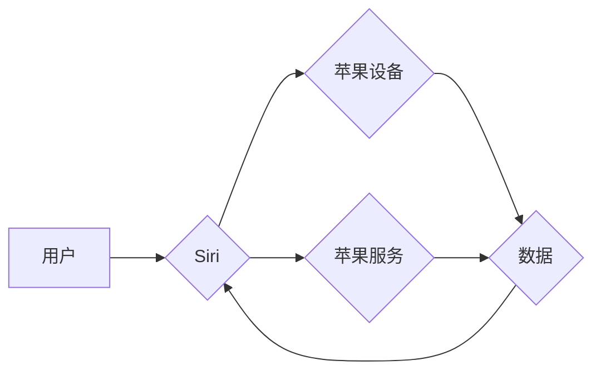

> 苹果、AI、入口、Siri、机器学习、深度学习、自然语言处理、用户体验、生态系统

## 1. 背景介绍

近年来，人工智能（AI）技术飞速发展，已渗透到生活的方方面面。从智能手机的语音助手到自动驾驶汽车，AI正在改变着我们的生活方式。苹果公司作为科技行业的巨头，一直致力于将AI技术融入其产品和服务中，以提升用户体验。

苹果的AI战略的核心是“入口为王”。苹果认为，AI的入口是用户与AI交互的关键，而Siri作为苹果的语音助手，是其AI战略的核心。苹果希望通过不断提升Siri的智能水平，将其打造成一个无所不能的AI助手，帮助用户更便捷地完成各种任务。

## 2. 核心概念与联系

### 2.1 AI与入口

人工智能（AI）是指模拟人类智能的计算机系统。AI技术涵盖了多个领域，包括机器学习、深度学习、自然语言处理等。

入口是指用户与AI系统交互的途径。常见的入口包括语音、文本、图像、视频等。

AI与入口的结合，使得用户能够更便捷地与AI系统交互，并获得更智能化的服务。

### 2.2 Siri与苹果生态系统

Siri是苹果公司开发的语音助手，它可以理解用户的语音指令，并执行相应的操作。Siri与苹果的生态系统紧密结合，可以与iPhone、iPad、Mac等苹果设备协同工作，并访问苹果的各种服务，例如Apple Music、Apple Maps、App Store等。

**Mermaid 流程图**



## 3. 核心算法原理 & 具体操作步骤

### 3.1  算法原理概述

Siri的核心算法原理是基于自然语言处理（NLP）和机器学习（ML）技术的。

* **自然语言处理（NLP）**：NLP技术旨在使计算机能够理解和处理人类语言。Siri使用NLP技术来识别用户的语音指令，并将其转换为计算机可以理解的文本。

* **机器学习（ML）**：ML技术使计算机能够从数据中学习，并不断改进其性能。Siri使用ML技术来训练其语音识别、自然语言理解和对话生成模型。

### 3.2  算法步骤详解

1. **语音识别**: Siri首先使用语音识别技术将用户的语音转换为文本。
2. **自然语言理解**: Siri使用自然语言理解技术来分析文本，识别用户的意图和实体。
3. **对话生成**: Siri使用对话生成技术生成相应的回复，并将其转换为语音。
4. **执行操作**: Siri根据用户的指令执行相应的操作，例如打开应用程序、发送邮件、设置提醒等。

### 3.3  算法优缺点

**优点**:

* **便捷性**: 用户可以通过语音与Siri交互，无需手动输入文本。
* **智能化**: Siri可以理解用户的意图，并提供个性化的服务。
* **多平台支持**: Siri可以与多种苹果设备协同工作。

**缺点**:

* **准确性**: 语音识别和自然语言理解技术仍存在一定的误差。
* **隐私性**: 用户的语音数据可能会被收集和使用。
* **局限性**: Siri只能访问苹果的生态系统，无法与其他平台的应用程序和服务交互。

### 3.4  算法应用领域

Siri的算法原理和技术可以应用于多个领域，例如：

* **智能家居**: 控制智能家居设备，例如灯光、空调、电视等。
* **医疗保健**: 提供医疗咨询、预约挂号、提醒服药等服务。
* **教育**: 提供个性化的学习辅导、知识问答等服务。

## 4. 数学模型和公式 & 详细讲解 & 举例说明

### 4.1  数学模型构建

Siri的语音识别和自然语言理解模型通常基于深度学习技术，例如循环神经网络（RNN）和卷积神经网络（CNN）。

**RNN模型**：RNN模型能够处理序列数据，例如语音信号和文本。RNN模型的隐藏层可以记住之前的信息，从而更好地理解上下文。

**CNN模型**：CNN模型擅长于提取图像和文本中的特征。CNN模型可以用来识别语音中的音素和文本中的词语。

### 4.2  公式推导过程

深度学习模型的训练过程涉及到大量的数学公式，例如梯度下降算法、激活函数等。

**梯度下降算法**: 梯度下降算法是一种优化算法，用于训练深度学习模型。其目标是找到模型参数的最佳值，使得模型的预测结果与实际结果的误差最小。

**激活函数**: 激活函数是深度学习模型中的一种非线性函数，用于引入非线性特征，从而提高模型的表达能力。常见的激活函数包括ReLU、Sigmoid和Tanh等。

### 4.3  案例分析与讲解

例如，在语音识别任务中，RNN模型可以用来将语音信号转换为文本。训练过程中，模型会根据语音信号和对应的文本进行训练，不断调整模型参数，使得模型能够准确地识别语音。

## 5. 项目实践：代码实例和详细解释说明

### 5.1  开发环境搭建

为了开发Siri相关的应用程序，需要搭建相应的开发环境。

* **Xcode**: Xcode是苹果公司开发的集成开发环境（IDE），用于开发iOS、macOS、watchOS和tvOS应用程序。
* **Swift**: Swift是苹果公司开发的编程语言，用于开发iOS、macOS、watchOS和tvOS应用程序。

### 5.2  源代码详细实现

以下是一个简单的Siri应用程序的代码示例，用于演示如何使用SiriKit框架与Siri交互。

```swift
import UIKit
import SiriKit

class ViewController: UIViewController, INUIHostedViewcontrollerDelegate {

    override func viewDidLoad() {
        super.viewDidLoad()

        // 创建SiriKit的请求
        let intent = INStartAudioRecordingIntent()

        // 创建SiriKit的交互界面
        let interaction = INUIHostedView(intent: intent, context: nil)

        // 设置交互界面的代理
        interaction.delegate = self

        // 添加交互界面到视图
        view.addSubview(interaction)
    }

    // SiriKit交互界面代理方法
    func hostedView(forChildViewController viewController: UIViewController, context: INUIHostedViewContext, completion: @escaping (Bool) -> Void) {
        // 处理SiriKit的交互请求
        completion(true)
    }
}
```

### 5.3  代码解读与分析

这段代码演示了如何使用SiriKit框架创建Siri应用程序。

* `INStartAudioRecordingIntent()`：创建SiriKit的请求，用于启动语音录制。
* `INUIHostedView()`：创建SiriKit的交互界面，用于与用户交互。
* `hostedView(forChildViewController:context:completion:)`：SiriKit交互界面代理方法，用于处理SiriKit的交互请求。

### 5.4  运行结果展示

运行这段代码后，用户将看到一个Siri的交互界面，可以开始语音录制。

## 6. 实际应用场景

### 6.1  智能助手

Siri可以作为用户的智能助手，帮助用户完成各种任务，例如：

* 设置提醒
* 发送邮件
* 预订餐厅
* 控制智能家居设备

### 6.2  信息查询

Siri可以帮助用户查询各种信息，例如：

* 天气预报
* 交通状况
* 新闻资讯

### 6.3  娱乐休闲

Siri可以帮助用户进行娱乐休闲活动，例如：

* 播放音乐
* 播放视频
* 讲故事

### 6.4  未来应用展望

随着AI技术的不断发展，Siri的应用场景将更加广泛。未来，Siri可能能够：

* 更准确地理解用户的意图
* 提供更个性化的服务
* 与更多平台和应用程序进行交互

## 7. 工具和资源推荐

### 7.1  学习资源推荐

* **苹果开发者文档**: https://developer.apple.com/documentation/sirikit
* **SiriKit API Reference**: https://developer.apple.com/documentation/sirikit/sirikit_api_reference

### 7.2  开发工具推荐

* **Xcode**: https://developer.apple.com/xcode/
* **Swift**: https://swift.org/

### 7.3  相关论文推荐

* **Sequence to Sequence Learning with Neural Networks**
* **Attention Is All You Need**

## 8. 总结：未来发展趋势与挑战

### 8.1  研究成果总结

苹果公司在AI领域取得了显著的成果，Siri已经成为一个功能强大的语音助手，为用户提供了便捷的智能服务。

### 8.2  未来发展趋势

未来，Siri将朝着更智能、更个性化、更开放的方向发展。

* **更智能**: Siri将能够更准确地理解用户的意图，并提供更智能化的服务。
* **更个性化**: Siri将能够根据用户的习惯和偏好，提供个性化的服务。
* **更开放**: Siri将能够与更多平台和应用程序进行交互，提供更丰富的服务。

### 8.3  面临的挑战

Siri的发展也面临着一些挑战，例如：

* **数据隐私**: Siri需要收集用户的语音数据，如何保护用户的隐私是一个重要的挑战。
* **算法偏见**: AI算法可能会存在偏见，如何避免算法偏见是一个重要的研究课题。
* **用户体验**: 如何提高用户的交互体验，使其更自然、更流畅，也是一个重要的挑战。

### 8.4  研究展望

未来，苹果公司将继续加大对AI技术的投入，不断提升Siri的智能水平，为用户提供更便捷、更智能的体验。


## 9. 附录：常见问题与解答

### 9.1  Siri为什么不能理解我的语音？

* 确保你的设备麦克风正常工作。
* 说话时保持清晰的语音，避免背景噪音。
* 尝试重新训练Siri的语音识别模型。

### 9.2  如何设置Siri的语言？

* 打开“设置”应用程序。
* 选择“Siri & 搜索”。
* 选择“Siri语言”。
* 选择你想要的语言。

### 9.3  如何删除Siri的语音数据？

* 打开“设置”应用程序。
* 选择“Siri & 搜索”。
* 选择“Siri历史”。
* 选择“删除Siri历史”。


作者：禅与计算机程序设计艺术 / Zen and the Art of Computer Programming 
<end_of_turn>