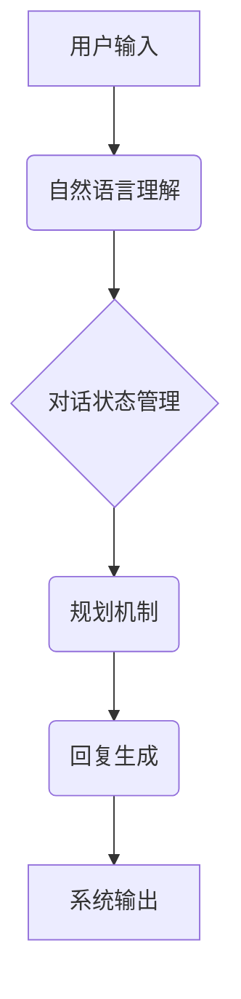

> 智能客服系统，规划机制，对话管理，自然语言处理，机器学习，用户体验

## 1. 背景介绍

随着人工智能技术的快速发展，智能客服系统已成为企业服务客户的重要手段。传统的客服系统依赖人工客服，存在响应速度慢、成本高、服务质量不稳定等问题。智能客服系统通过自然语言处理（NLP）、机器学习（ML）等技术，能够自动理解用户需求，并提供快速、准确、个性化的服务。

然而，现有的智能客服系统在处理复杂对话场景时仍然存在局限性。例如，用户可能提出多轮对话、嵌套问题或开放式问题，而传统的基于规则的对话系统难以应对这些复杂场景。为了解决这一问题，规划机制应运而生。

规划机制是指在对话过程中，系统根据用户输入和对话上下文，预先规划出最佳的对话路径和回复策略，从而引导对话走向预期的目标。规划机制能够使智能客服系统更加智能化、人性化，提升用户体验。

## 2. 核心概念与联系

**2.1 核心概念**

* **对话管理:** 指的是在对话过程中，系统如何组织和控制对话流程，引导对话走向预期的目标。
* **自然语言处理 (NLP):** 指的是计算机理解和处理人类语言的技术。
* **机器学习 (ML):** 指的是通过算法学习数据，并从中提取规律，从而进行预测或决策的技术。
* **规划机制:** 指的是在对话过程中，系统根据用户输入和对话上下文，预先规划出最佳的对话路径和回复策略。

**2.2 架构关系**



**2.3 核心联系**

规划机制是对话管理系统的重要组成部分，它与自然语言处理、机器学习和对话状态管理密切相关。

* 自然语言处理模块负责理解用户的输入，将其转换为系统可理解的格式。
* 对话状态管理模块负责记录对话的历史信息，并根据对话上下文进行决策。
* 规划机制根据用户输入和对话上下文，预先规划出最佳的对话路径和回复策略，并将其传递给回复生成模块。
* 回复生成模块根据规划机制的输出，生成合适的回复，并将其发送给用户。

## 3. 核心算法原理 & 具体操作步骤

**3.1 算法原理概述**

规划机制的核心算法通常基于搜索算法或强化学习算法。

* **搜索算法:** 

搜索算法通过穷举所有可能的对话路径，并根据预设的评估函数选择最优的路径。例如，A*算法是一种常用的搜索算法，它利用启发式函数来加速搜索过程。

* **强化学习算法:** 

强化学习算法通过训练一个代理，使其在对话过程中不断学习和优化对话策略。代理通过与环境交互，获得奖励或惩罚，并根据这些反馈调整自己的策略。

**3.2 算法步骤详解**

**搜索算法:**

1. **构建对话状态空间:** 将所有可能的对话状态和对话转移规则表示为一个状态空间图。
2. **定义评估函数:** 根据对话目标和用户满意度等因素，定义一个评估函数，用于评估不同对话路径的优劣。
3. **使用搜索算法搜索最优路径:** 从初始状态出发，使用A*算法等搜索算法，搜索出评估函数值最高的对话路径。
4. **生成回复:** 根据搜索到的最优路径，生成相应的回复。

**强化学习算法:**

1. **定义奖励函数:** 根据对话目标和用户满意度等因素，定义一个奖励函数，用于评估代理在对话过程中的行为。
2. **训练代理:** 使用强化学习算法，例如Q学习或深度强化学习，训练一个代理，使其在对话过程中不断学习和优化对话策略。
3. **生成回复:** 根据训练好的代理策略，生成相应的回复。

**3.3 算法优缺点**

**搜索算法:**

* **优点:** 能够找到最优的对话路径，保证对话质量。
* **缺点:** 计算复杂度高，难以处理复杂对话场景。

**强化学习算法:**

* **优点:** 能够学习到更复杂的对话策略，适应更复杂的对话场景。
* **缺点:** 训练时间长，需要大量的训练数据。

**3.4 算法应用领域**

规划机制在智能客服系统、聊天机器人、虚拟助理等领域都有广泛的应用。

## 4. 数学模型和公式 & 详细讲解 & 举例说明

**4.1 数学模型构建**

规划机制可以抽象为一个状态空间搜索问题。

* **状态空间:** 表示所有可能的对话状态。
* **状态转移函数:** 表示从一个状态到另一个状态的规则。
* **评估函数:** 用于评估不同状态的价值。

**4.2 公式推导过程**

假设我们使用A*算法进行规划，则A*算法的搜索过程可以表示为以下公式：

```
g(n) + h(n)
```

其中：

* g(n) 表示从初始状态到当前状态n的路径长度。
* h(n) 表示从当前状态n到目标状态的估计距离。

A*算法选择路径长度最短的路径，即选择g(n) + h(n)值最小的路径。

**4.3 案例分析与讲解**

例如，一个智能客服系统需要帮助用户查询订单状态。

* **状态空间:** 包括用户输入的查询信息、系统查询到的订单信息等。
* **状态转移函数:** 根据用户输入，系统查询相应的订单信息。
* **评估函数:** 根据用户查询的订单信息是否准确，以及对话的流畅度等因素进行评估。

使用A*算法，系统可以根据用户输入和订单信息，规划出最优的对话路径，并提供准确的订单状态信息。

## 5. 项目实践：代码实例和详细解释说明

**5.1 开发环境搭建**

* Python 3.x
* TensorFlow 或 PyTorch
* NLTK 或 SpaCy

**5.2 源代码详细实现**

```python
# 使用A*算法进行规划
import heapq

class Node:
    def __init__(self, state, parent=None, cost=0, heuristic=0):
        self.state = state
        self.parent = parent
        self.cost = cost
        self.heuristic = heuristic

    def __lt__(self, other):
        return (self.cost + self.heuristic) < (other.cost + other.heuristic)

def astar_search(start_state, goal_state, heuristic_function):
    open_list = []
    closed_list = set()
    start_node = Node(start_state, cost=0, heuristic=heuristic_function(start_state))
    heapq.heappush(open_list, start_node)

    while open_list:
        current_node = heapq.heappop(open_list)
        closed_list.add(current_node.state)

        if current_node.state == goal_state:
            return reconstruct_path(current_node)

        for neighbor_state in get_neighbors(current_node.state):
            if neighbor_state in closed_list:
                continue

            neighbor_cost = current_node.cost + 1  # 假设每个状态转移的成本为1
            neighbor_node = Node(neighbor_state, parent=current_node, cost=neighbor_cost, heuristic=heuristic_function(neighbor_state))
            heapq.heappush(open_list, neighbor_node)

    return None

def reconstruct_path(node):
    path = []
    while node:
        path.append(node.state)
        node = node.parent
    return path[::-1]

# ... 其他函数和代码 ...
```

**5.3 代码解读与分析**

* `Node` 类表示对话状态节点，包含状态信息、父节点信息、路径成本和启发式函数值。
* `astar_search` 函数使用A*算法进行规划，从起始状态到目标状态搜索最优路径。
* `reconstruct_path` 函数根据规划好的路径，重建对话路径。

**5.4 运行结果展示**

运行代码后，系统将根据用户输入和规划机制，生成相应的回复，并引导对话走向预期的目标。

## 6. 实际应用场景

**6.1 电商客服**

智能客服系统可以帮助电商平台处理客户咨询、订单查询、退换货等问题，提高客户服务效率。

**6.2 金融客服**

智能客服系统可以帮助银行、保险公司等金融机构处理客户咨询、账户查询、理财建议等问题，提升客户体验。

**6.3 医疗客服**

智能客服系统可以帮助医院、诊所等医疗机构处理患者咨询、预约挂号、缴费等问题，提高医疗服务效率。

**6.4 未来应用展望**

随着人工智能技术的不断发展，规划机制在智能客服系统中的应用将更加广泛和深入。例如，未来智能客服系统将能够：

* 更准确地理解用户需求，提供更个性化的服务。
* 更智能地处理复杂对话场景，提供更人性化的服务。
* 与其他系统集成，提供更全面的服务。

## 7. 工具和资源推荐

**7.1 学习资源推荐**

* **书籍:**
    * 《对话系统》
    * 《人工智能》
* **在线课程:**
    * Coursera: 自然语言处理
    * edX: 机器学习

**7.2 开发工具推荐**

* **Rasa:** 开源对话平台
* **Dialogflow:** Google提供的对话平台
* **Microsoft Bot Framework:** Microsoft提供的对话平台

**7.3 相关论文推荐**

* **《基于强化学习的对话系统规划》**
* **《A*算法在对话系统中的应用》**

## 8. 总结：未来发展趋势与挑战

**8.1 研究成果总结**

规划机制在智能客服系统中的应用取得了显著的成果，能够有效提升对话质量和用户体验。

**8.2 未来发展趋势**

未来规划机制将朝着以下方向发展：

* 更智能的对话策略学习
* 更强大的多模态交互能力
* 更个性化的用户体验

**8.3 面临的挑战**

规划机制在实际应用中仍然面临一些挑战：

* 复杂对话场景的处理
* 用户意图理解的准确性
* 数据标注和训练成本

**8.4 研究展望**

未来研究将重点关注以下方面：

* 开发更强大的对话策略学习算法
* 研究更有效的多模态交互机制
* 探索更低成本的数据标注和训练方法

## 9. 附录：常见问题与解答

**9.1 如何选择合适的规划算法？**

选择合适的规划算法取决于具体的应用场景和需求。

* 如果对话场景相对简单，可以使用搜索算法，例如A*算法。
* 如果对话场景复杂，需要学习更复杂的对话策略，可以使用强化学习算法。

**9.2 如何评估规划机制的性能？**

规划机制的性能可以评估指标包括：

* 对话成功率
* 用户满意度
* 对话流畅度

**9.3 如何提高规划机制的准确性？**

提高规划机制的准确性可以通过以下方法：

* 提高用户意图理解的准确性
* 丰富对话数据，进行更充分的训练
* 使用更强大的规划算法


作者：禅与计算机程序设计艺术 / Zen and the Art of Computer Programming 
<end_of_turn>