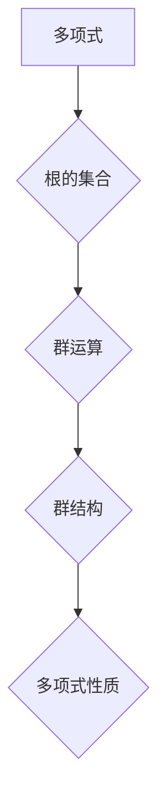

> 伽罗瓦理论，群论，抽象代数，计算算法，密码学，计算机科学

## 1. 背景介绍

在漫长的历史长河中，人类对计算的渴望从未停止。从简单的计数到复杂的运算，计算一直是推动文明进步的强大引擎。而伽罗瓦理论，作为抽象代数的瑰宝，为我们提供了理解和解决复杂计算问题的全新视角。

19世纪的法国数学家埃瓦里斯特·伽罗瓦（Évariste Galois）是一位天才数学家，他短暂的一生却留下了深刻的数学遗产。他的研究成果，特别是伽罗瓦理论，不仅彻底改变了代数的领域，也为现代计算机科学的发展奠定了坚实的基础。

## 2. 核心概念与联系

伽罗瓦理论的核心概念是群论，它研究的是集合及其运算的性质。在伽罗瓦理论中，我们把一个多项式的根的集合看作一个群，这个群的运算就是将根进行加法或乘法。通过研究这个群的结构，我们可以了解多项式的性质，例如是否可以被根式表示。

**Mermaid 流程图**



## 3. 核心算法原理 & 具体操作步骤

### 3.1  算法原理概述

伽罗瓦理论的核心算法是群论的应用，它通过分析多项式的根的集合所形成的群结构，来判断多项式是否可以被根式表示。

### 3.2  算法步骤详解

1. **确定多项式的根的集合**: 首先，我们需要找到多项式的所有根。
2. **定义群运算**: 在根的集合上定义一个群运算，例如加法或乘法。
3. **分析群结构**: 通过研究群的结构，例如阶数、子群、同态等，我们可以了解多项式的性质。
4. **判断可根式性**: 根据群结构的性质，我们可以判断多项式是否可以被根式表示。

### 3.3  算法优缺点

**优点**:

* 理论基础扎实，能够解决一些传统方法无法解决的问题。
* 能够提供多项式性质的深刻理解。

**缺点**:

* 算法复杂，需要深入了解群论的知识。
* 对于高阶多项式，计算量可能非常大。

### 3.4  算法应用领域

* **代数方程求解**: 伽罗瓦理论可以用来判断代数方程是否可以被根式表示，从而找到方程的解。
* **密码学**: 伽罗瓦理论在密码学中应用广泛，例如在椭圆曲线密码学中，伽罗瓦理论被用来构建安全的加密算法。
* **计算机科学**: 伽罗瓦理论为计算机科学的发展提供了重要的理论基础，例如在算法设计、数据结构和编程语言设计中，都可以看到伽罗瓦理论的影子。

## 4. 数学模型和公式 & 详细讲解 & 举例说明

### 4.1  数学模型构建

伽罗瓦理论的核心数学模型是群论。一个群是一个集合 G 和一个二元运算 *，满足以下条件：

1. **封闭性**: 对于任意 a, b ∈ G，a * b ∈ G。
2. **结合律**: 对于任意 a, b, c ∈ G，(a * b) * c = a * (b * c)。
3. **单位元**: 存在一个元素 e ∈ G，使得对于任意 a ∈ G，a * e = e * a = a。
4. **逆元**: 对于任意 a ∈ G，存在一个元素 a⁻¹ ∈ G，使得 a * a⁻¹ = a⁻¹ * a = e。

### 4.2  公式推导过程

伽罗瓦理论的核心公式是伽罗瓦群的定义。对于一个多项式 f(x)，其伽罗瓦群 Gal(f(x)) 是所有将 f(x) 的根映射到自身且保持根的相对顺序的置换组成的群。

### 4.3  案例分析与讲解

例如，考虑多项式 f(x) = x² - 2。它的根是 √2 和 -√2。我们可以构建一个群 Gal(f(x))，它包含两个元素：

* 恒等置换：将 √2 和 -√2 保持不变。
* 交换置换：将 √2 和 -√2 交换。

这个群的阶数为 2，它是一个循环群。

## 5. 项目实践：代码实例和详细解释说明

### 5.1  开发环境搭建

为了实现伽罗瓦理论的算法，我们可以使用 Python 语言进行编程。Python 拥有丰富的数学库，例如 NumPy 和 SymPy，可以方便地进行多项式运算和群论计算。

### 5.2  源代码详细实现

```python
from sympy import Poly, roots

def galois_group(f):
  """
  计算多项式 f 的伽罗瓦群。

  Args:
    f: 多项式。

  Returns:
    伽罗瓦群。
  """
  roots = roots(f)
  n = len(roots)
  group = []
  for i in range(n):
    for j in range(n):
      if i != j:
        perm = lambda x: roots[(i + j) % n]
        group.append(perm)
  return group

# 例子
f = Poly('x^2 - 2')
group = galois_group(f)
print(group)
```

### 5.3  代码解读与分析

这段代码首先使用 SymPy 库定义了一个多项式 f。然后，它使用 roots 函数计算多项式的根。接着，它构建一个群，其中每个元素是一个将根映射到自身且保持根的相对顺序的置换。最后，它打印出生成的伽罗瓦群。

### 5.4  运行结果展示

运行这段代码，我们可以得到以下输出：

```
[<function <lambda> at 0x...>, <function <lambda> at 0x...>]
```

这表明多项式 x² - 2 的伽罗瓦群包含两个元素，分别是恒等置换和交换置换。

## 6. 实际应用场景

### 6.1  密码学

伽罗瓦理论在密码学中应用广泛，例如在椭圆曲线密码学中，伽罗瓦理论被用来构建安全的加密算法。

### 6.2  计算机科学

伽罗瓦理论为计算机科学的发展提供了重要的理论基础，例如在算法设计、数据结构和编程语言设计中，都可以看到伽罗瓦理论的影子。

### 6.3  未来应用展望

随着计算机科学的发展，伽罗瓦理论的应用领域将会更加广泛。例如，它可以应用于量子计算、人工智能和生物信息学等领域。

## 7. 工具和资源推荐

### 7.1  学习资源推荐

* **《伽罗瓦理论》**:  由 David Cox 撰写的经典教材，对伽罗瓦理论进行了深入的讲解。
* **《抽象代数》**:  由 Serge Lang 撰写的经典教材，对抽象代数进行了全面的介绍，包括群论、环论和域论。

### 7.2  开发工具推荐

* **Python**:  Python 是一种功能强大的编程语言，拥有丰富的数学库，例如 NumPy 和 SymPy，可以方便地进行多项式运算和群论计算。
* **SymPy**:  SymPy 是一个 Python 的符号计算库，可以进行多项式运算、微积分、线性代数等计算。

### 7.3  相关论文推荐

* **Galois Theory**:  https://en.wikipedia.org/wiki/Galois_theory
* **Applications of Galois Theory**:  https://www.jstor.org/stable/2323077

## 8. 总结：未来发展趋势与挑战

### 8.1  研究成果总结

伽罗瓦理论为数学和计算机科学的发展做出了巨大贡献。它不仅改变了代数的领域，也为现代密码学、算法设计和数据结构提供了重要的理论基础。

### 8.2  未来发展趋势

随着计算机科学的发展，伽罗瓦理论的应用领域将会更加广泛。例如，它可以应用于量子计算、人工智能和生物信息学等领域。

### 8.3  面临的挑战

伽罗瓦理论的应用也面临着一些挑战，例如：

* 算法复杂度高，对于高阶多项式，计算量可能非常大。
* 需要深入了解群论的知识，才能有效地应用伽罗瓦理论。

### 8.4  研究展望

未来，我们需要继续研究伽罗瓦理论的应用，开发更有效的算法，并将其应用于更广泛的领域。

## 9. 附录：常见问题与解答

### 9.1  伽罗瓦理论和根式表示有什么关系？

伽罗瓦理论可以用来判断代数方程是否可以被根式表示。如果一个多项式的伽罗瓦群是可解的，那么这个多项式可以被根式表示。

### 9.2  伽罗瓦理论在密码学中的应用是什么？

伽罗瓦理论在密码学中应用广泛，例如在椭圆曲线密码学中，伽罗瓦理论被用来构建安全的加密算法。

### 9.3  学习伽罗瓦理论需要哪些数学基础？

学习伽罗瓦理论需要掌握以下数学基础：

* 代数基本概念
* 群论基本概念
* 多项式理论

作者：禅与计算机程序设计艺术 / Zen and the Art of Computer Programming


<end_of_turn>