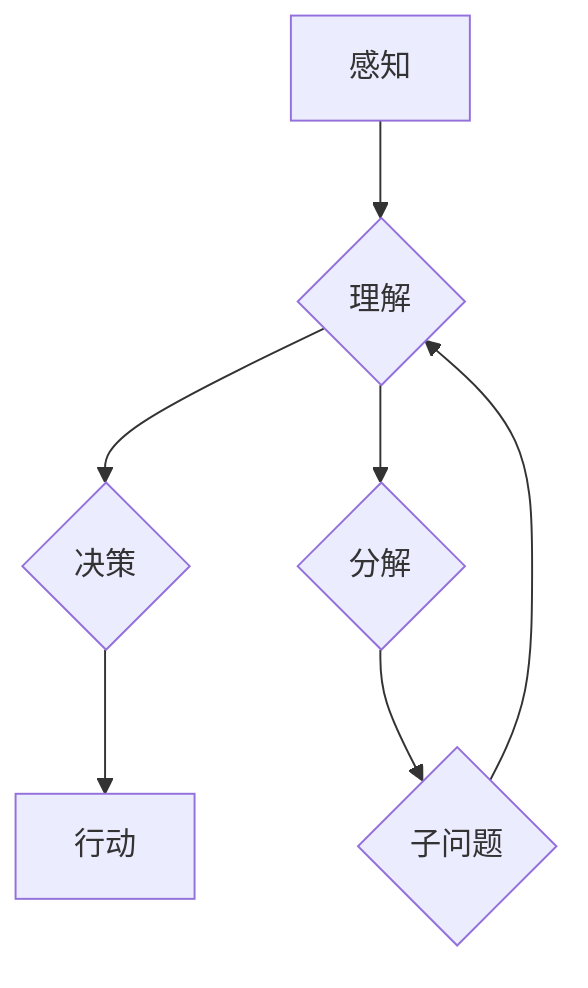

> 认知、形式化、递归、层次性、人工智能、算法、数学模型、代码实现

## 1. 背景介绍

认知，作为人类最核心的能力之一，一直是哲学、心理学和计算机科学等多个领域的关注焦点。如何将人类的认知过程形式化，并将其转化为计算机能够理解和执行的算法，是人工智能领域的一项重大挑战。

递归层次性，作为一种认知模式，在人类思维中扮演着至关重要的角色。它指的是将复杂问题分解成更小的、相互关联的子问题，并通过重复解决这些子问题来最终解决原问题。这种层次化的分解和组合方式，使得人类能够处理复杂的信息和进行抽象思考。

## 2. 核心概念与联系

**2.1 认知的层次性**

人类的认知过程并非线性，而是具有层次性的结构。从感知到理解，再到决策和行动，每个阶段都包含着多个子过程，这些子过程相互关联，并以递归的方式进行。例如，理解一个句子需要识别单词、理解词义、分析语法结构，而识别单词又需要识别字母、理解字母组合的规则等等。

**2.2 递归的本质**

递归是一种函数定义的方式，其中函数自身在定义中被调用。这种自引用机制使得递归能够处理具有重复结构的问题，并以简洁高效的方式表达复杂逻辑。

**2.3 认知与递归的联系**

人类的认知过程本质上就是一种递归的过程。我们通过将复杂问题分解成更小的子问题，并通过重复解决这些子问题来最终解决原问题。这种递归的思维模式，正是人类能够处理复杂信息和进行抽象思考的关键。

**Mermaid 流程图**



## 3. 核心算法原理 & 具体操作步骤

**3.1 算法原理概述**

递归算法的核心思想是将问题分解成与原问题结构相同的子问题，并通过重复解决这些子问题来最终解决原问题。

**3.2 算法步骤详解**

1. **基线条件:** 设定一个终止条件，当问题规模达到一定程度时，不再进行递归分解，直接返回结果。
2. **递归分解:** 将问题分解成若干个与原问题结构相同的子问题。
3. **递归调用:** 对每个子问题进行递归调用，直到达到基线条件。
4. **结果组合:** 将子问题的结果组合起来，得到最终的答案。

**3.3 算法优缺点**

**优点:**

* 简洁高效：递归算法能够以简洁的代码表达复杂的逻辑。
* 适用于树形结构：递归算法非常适合处理树形结构的数据。

**缺点:**

* 可能会导致栈溢出：递归调用过多可能会导致栈溢出错误。
* 效率较低：对于某些问题，递归算法的效率可能不如迭代算法。

**3.4 算法应用领域**

* **树形结构的遍历:** 比如二叉树的深度优先遍历和广度优先遍历。
* **分治算法:** 比如快速排序、归并排序等。
* **数据结构的实现:** 比如栈、队列等。

## 4. 数学模型和公式 & 详细讲解 & 举例说明

**4.1 数学模型构建**

我们可以用递归关系式来描述递归算法的计算过程。

假设我们有一个函数 f(n)，它接受一个整数 n 作为输入，并返回一个整数。如果 f(n) 是一个递归函数，那么它可以被表示为：

```
f(n) = base_case(n) 
      or 
      f(n) = recursive_step(f(n-1), n)
```

其中：

* base_case(n) 是递归函数的基线条件，当 n 达到某个特定值时，函数返回一个固定的值。
* recursive_step(f(n-1), n) 是递归函数的递归步骤，它调用自身函数，并传入 n-1 作为参数。

**4.2 公式推导过程**

我们可以通过反复应用递归步骤，最终得到函数 f(n) 的计算结果。

例如，假设我们有一个递归函数 f(n) = 2 * f(n-1) + 1，并且 f(0) = 0。

我们可以通过以下步骤推导 f(n) 的计算结果：

```
f(1) = 2 * f(0) + 1 = 2 * 0 + 1 = 1
f(2) = 2 * f(1) + 1 = 2 * 1 + 1 = 3
f(3) = 2 * f(2) + 1 = 2 * 3 + 1 = 7
f(4) = 2 * f(3) + 1 = 2 * 7 + 1 = 15
```

我们可以发现，f(n) 的计算结果是一个递增的序列，并且满足以下公式：

```
f(n) = 2^n - 1
```

**4.3 案例分析与讲解**

**斐波那契数列**

斐波那契数列是一个经典的递归算法例子。

```
f(0) = 0
f(1) = 1
f(n) = f(n-1) + f(n-2) (n > 1)
```

这个公式表示，每个斐波那契数都是前两个斐波那契数的和。

我们可以通过递归调用 f(n) 函数，计算出任意一个斐波那契数。

## 5. 项目实践：代码实例和详细解释说明

**5.1 开发环境搭建**

我们使用 Python 语言进行代码实现。

**5.2 源代码详细实现**

```python
def fibonacci(n):
  if n <= 1:
    return n
  else:
    return fibonacci(n-1) + fibonacci(n-2)

# 测试代码
for i in range(10):
  print(fibonacci(i))
```

**5.3 代码解读与分析**

* 函数 `fibonacci(n)` 接受一个整数 `n` 作为输入，并返回第 `n` 个斐波那契数。
* 函数内部包含两个条件语句：
    * 如果 `n` 小于等于 1，则直接返回 `n`，这是基线条件。
    * 如果 `n` 大于 1，则调用自身函数 `fibonacci(n-1)` 和 `fibonacci(n-2)`，并将结果相加，返回最终结果。

**5.4 运行结果展示**

```
0
1
1
2
3
5
8
13
21
34
```

## 6. 实际应用场景

**6.1 数学建模**

递归算法在数学建模中应用广泛，例如解决分治算法、组合数学问题等。

**6.2 数据结构**

递归算法可以用于实现各种数据结构，例如树、图等。

**6.3 图像处理**

递归算法可以用于图像处理，例如图像分割、边缘检测等。

**6.4 未来应用展望**

随着人工智能的发展，递归算法在更广泛的领域中将发挥越来越重要的作用，例如自然语言处理、机器学习等。

## 7. 工具和资源推荐

**7.1 学习资源推荐**

* 《算法导论》
* 《深入理解计算机系统》
* 在线课程：Coursera、edX 等平台

**7.2 开发工具推荐**

* Python
* Java
* C++

**7.3 相关论文推荐**

* 《递归算法的理论基础》
* 《递归算法在人工智能中的应用》

## 8. 总结：未来发展趋势与挑战

**8.1 研究成果总结**

递归算法是一种强大的工具，能够解决许多复杂问题。

**8.2 未来发展趋势**

* 更加高效的递归算法
* 适用于更广泛领域应用的递归算法

**8.3 面临的挑战**

* 递归算法的效率问题
* 递归算法的复杂性问题

**8.4 研究展望**

* 研究更加高效的递归算法
* 研究如何将递归算法应用于更广泛的领域


## 9. 附录：常见问题与解答

**9.1 递归算法的基线条件是什么？**

基线条件是递归函数终止的条件，当问题规模达到一定程度时，不再进行递归分解，直接返回结果。

**9.2 递归算法可能会导致栈溢出，如何避免？**

可以通过使用迭代算法或尾递归优化来避免递归算法导致的栈溢出。

**9.3 递归算法的效率如何？**

递归算法的效率取决于具体问题和实现方式。对于某些问题，递归算法的效率可能不如迭代算法。


作者：禅与计算机程序设计艺术 / Zen and the Art of Computer Programming 
<end_of_turn>