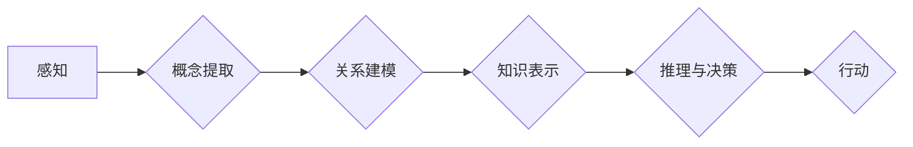

> 认知形式化，数学建模，函数，泛函，人工智能，认知科学，自然语言处理

## 1. 背景介绍

人类认知世界的方式是通过感知、理解和建模。我们用语言、图像、概念等形式来表达和组织对世界的理解。然而，这些形式往往是模糊的、主观的，难以被计算机精确理解和处理。因此，将人类认知形式化，用数学语言和逻辑表达，成为人工智能领域的重要课题。

认知形式化的目标是建立一个能够精确描述和模拟人类认知过程的数学框架。通过这种框架，我们可以将人类的知识、经验和推理能力转化为计算机可理解的形式，从而实现人工智能的真正发展。

## 2. 核心概念与联系

**2.1 函数与泛函**

函数和泛函是数学中描述关系和映射的重要工具。

* **函数**：将一个集合的元素映射到另一个集合的元素。例如，f(x) = x^2 是一个将实数映射到非负实数的函数。
* **泛函**：将一个函数映射到另一个函数或实数。例如，积分算子是一个泛函，它将一个函数映射到它的积分值。

**2.2 认知形式化框架**

我们可以将认知形式化框架构建为一个基于函数和泛函的网络结构。

* **节点**：代表认知单元，例如概念、事件、关系等。
* **边**：代表认知关系，例如“包含”、“导致”、“相似”等。
* **函数**：描述节点之间的关系，例如“概念的定义”、“事件的因果关系”等。
* **泛函**：描述节点集之间的关系，例如“知识的推理”、“决策的优化”等。

**2.3 认知形式化流程图**



## 3. 核心算法原理 & 具体操作步骤

**3.1 算法原理概述**

认知形式化算法的核心是将人类认知过程中的各个环节转化为数学模型和算法。

* **感知处理**：利用机器学习算法从传感器数据中提取特征，构建感知模型。
* **概念提取**：利用自然语言处理技术从文本数据中提取概念，构建概念网络。
* **关系建模**：利用知识图谱技术构建概念之间的关系网络。
* **知识表示**：利用逻辑推理和符号系统将知识表示为形式化的符号结构。
* **推理与决策**：利用逻辑推理和决策算法进行知识推理和决策。

**3.2 算法步骤详解**

1. **数据收集和预处理**：收集感知数据、文本数据等，并进行预处理，例如文本清洗、特征提取等。
2. **感知模型构建**：利用机器学习算法，例如深度神经网络，构建感知模型，能够从感知数据中提取特征。
3. **概念提取和关系建模**：利用自然语言处理技术，例如词嵌入、句法分析、语义解析等，从文本数据中提取概念，并构建概念之间的关系网络。
4. **知识表示**：将概念和关系表示为形式化的符号结构，例如逻辑公式、知识图谱等。
5. **推理与决策**：利用逻辑推理和决策算法，进行知识推理和决策，例如回答问题、预测未来等。

**3.3 算法优缺点**

* **优点**：能够精确描述和模拟人类认知过程，为人工智能的真正发展提供理论基础。
* **缺点**：构建认知形式化框架和算法非常复杂，需要大量的计算资源和数据支持。

**3.4 算法应用领域**

* **自然语言处理**：理解和生成自然语言，例如机器翻译、文本摘要、对话系统等。
* **知识图谱**：构建和管理知识图谱，例如知识问答、推理推演等。
* **人工智能决策**：为人工智能系统提供决策支持，例如医疗诊断、金融投资等。

## 4. 数学模型和公式 & 详细讲解 & 举例说明

**4.1 数学模型构建**

我们可以用图论、逻辑学、概率论等数学工具构建认知形式化模型。

* **图论**：用于表示概念和关系之间的网络结构。
* **逻辑学**：用于描述知识和推理规则。
* **概率论**：用于处理不确定性和推理。

**4.2 公式推导过程**

例如，我们可以用逻辑公式来描述概念之间的关系。

* **概念A包含概念B**: A ⊃ B
* **概念A与概念B相等**: A ≡ B
* **概念A导致概念B**: A → B

**4.3 案例分析与讲解**

例如，我们可以用认知形式化模型来描述“猫”的概念。

* **概念**: 猫
* **属性**: 哺乳动物、有毛、会喵喵叫
* **关系**: 猫是哺乳动物，猫是动物

我们可以用逻辑公式来表达这些关系：

* 猫 ⊃ 哺乳动物
* 猫 ⊃ 动物

## 5. 项目实践：代码实例和详细解释说明

**5.1 开发环境搭建**

* 操作系统：Linux
* 编程语言：Python
* 工具：TensorFlow、PyTorch、NLTK、SpaCy

**5.2 源代码详细实现**

```python
# 导入必要的库
import tensorflow as tf
from nltk.corpus import stopwords

# 定义一个简单的感知模型
class Perceptron:
    def __init__(self, input_size, output_size):
        self.weights = tf.Variable(tf.random.normal([input_size, output_size]))
        self.bias = tf.Variable(tf.zeros([output_size]))

    def forward(self, x):
        return tf.sigmoid(tf.matmul(x, self.weights) + self.bias)

# 定义一个简单的概念提取模型
class ConceptExtractor:
    def __init__(self):
        self.stop_words = set(stopwords.words('english'))

    def extract_concepts(self, text):
        # 这里实现文本预处理和概念提取的逻辑
        pass

# 定义一个简单的关系建模模型
class RelationModeler:
    def __init__(self):
        # 这里实现关系建模的逻辑
        pass

# 定义一个简单的知识表示模型
class KnowledgeRepresenter:
    def __init__(self):
        # 这里实现知识表示的逻辑
        pass

# 定义一个简单的推理与决策模型
class InferenceAndDecisionMaker:
    def __init__(self):
        # 这里实现推理与决策的逻辑
        pass

# 实例化模型
perceptron = Perceptron(input_size=10, output_size=1)
concept_extractor = ConceptExtractor()
relation_modeler = RelationModeler()
knowledge_representer = KnowledgeRepresenter()
inference_and_decision_maker = InferenceAndDecisionMaker()

# 使用模型进行推理和决策
```

**5.3 代码解读与分析**

代码示例展示了认知形式化算法的基本框架。

* **感知模型**：使用神经网络进行特征提取。
* **概念提取模型**：使用自然语言处理技术提取概念。
* **关系建模模型**：使用知识图谱技术构建概念之间的关系网络。
* **知识表示模型**：将概念和关系表示为形式化的符号结构。
* **推理与决策模型**：使用逻辑推理和决策算法进行知识推理和决策。

**5.4 运行结果展示**

运行结果将根据输入数据和模型参数的不同而有所不同。

## 6. 实际应用场景

**6.1 自然语言理解**

认知形式化技术可以用于构建更智能的自然语言理解系统，例如：

* **机器翻译**：将一种语言翻译成另一种语言。
* **文本摘要**：提取文本的关键信息，生成简短的摘要。
* **对话系统**：与人类进行自然语言对话。

**6.2 知识图谱构建**

认知形式化技术可以用于构建更丰富的知识图谱，例如：

* **知识问答**：根据知识图谱回答用户的问题。
* **推理推演**：根据知识图谱进行逻辑推理和推演。
* **知识发现**：从知识图谱中发现新的知识和模式。

**6.3 人工智能决策**

认知形式化技术可以用于为人工智能系统提供决策支持，例如：

* **医疗诊断**：根据患者的症状和病史，辅助医生进行诊断。
* **金融投资**：根据市场数据和投资策略，进行投资决策。
* **自动驾驶**：根据路况和交通规则，进行自动驾驶决策。

**6.4 未来应用展望**

认知形式化技术在未来将有更广泛的应用场景，例如：

* **个性化教育**：根据学生的学习情况，提供个性化的学习方案。
* **智能家居**：根据用户的需求，自动控制家居设备。
* **虚拟现实**：构建更逼真的虚拟世界。

## 7. 工具和资源推荐

**7.1 学习资源推荐**

* **书籍**：
    * 《认知科学导论》
    * 《人工智能：现代方法》
    * 《深度学习》
* **在线课程**：
    * Coursera：认知科学、人工智能、深度学习
    * edX：认知科学、人工智能、机器学习

**7.2 开发工具推荐**

* **编程语言**：Python
* **机器学习框架**：TensorFlow、PyTorch
* **自然语言处理库**：NLTK、SpaCy
* **知识图谱工具**：Neo4j、GraphDB

**7.3 相关论文推荐**

* **《深度学习》**
* **《自然语言处理》**
* **《知识图谱》**

## 8. 总结：未来发展趋势与挑战

**8.1 研究成果总结**

认知形式化技术取得了显著的进展，例如：

* **自然语言理解**：机器翻译、文本摘要、对话系统等取得了突破性进展。
* **知识图谱构建**：构建了规模庞大、结构复杂的知识图谱。
* **人工智能决策**：为人工智能系统提供了更智能的决策支持。

**8.2 未来发展趋势**

* **更强大的认知模型**：构建更强大、更智能的认知模型，能够更好地模拟人类认知过程。
* **更广泛的应用场景**：将认知形式化技术应用到更多领域，例如教育、医疗、金融等。
* **更有效的学习方法**：开发更有效的学习方法，使人工智能系统能够更快速、更有效地学习和成长。

**8.3 面临的挑战**

* **数据获取和处理**：认知形式化技术需要大量的训练数据，获取和处理这些数据是一个挑战。
* **模型复杂度**：认知模型的复杂度很高，训练和推理都需要大量的计算资源。
* **解释性和可信度**：认知模型的决策过程往往难以解释，这降低了模型的可信度。

**8.4 研究展望**

未来，我们将继续致力于认知形式化技术的研发，努力构建更智能、更强大的人工智能系统，为人类社会带来更多福祉。

## 9. 附录：常见问题与解答

**9.1 什么是认知形式化？**

认知形式化是指将人类认知过程中的各个环节转化为数学模型和算法，使其能够被计算机理解和处理。

**9.2 认知形式化技术有哪些应用场景？**

认知形式化技术可以应用于自然语言理解、知识图谱构建、人工智能决策等领域。

**9.3 认知形式化技术有哪些挑战？**

认知形式化技术面临着数据获取和处理、模型复杂度、解释性和可信度等挑战。

**9.4 认知形式化技术未来的发展趋势是什么？**

未来，认知形式化技术将朝着更强大的认知模型、更广泛的