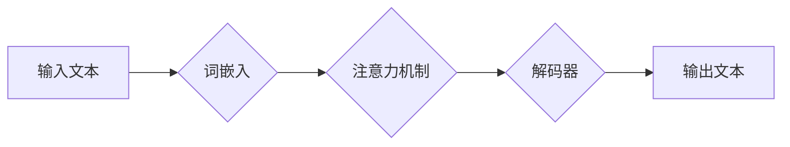

> 大语言模型，认知误解，语言理解，思维模拟，人工智能，深度学习，自然语言处理

## 1. 背景介绍

近年来，大语言模型（LLM）的蓬勃发展，让人们对人工智能的认知能力有了新的认识。这些模型能够以惊人的速度和准确率处理和生成人类语言，在文本生成、翻译、问答等领域展现出强大的能力。然而，尽管LLM取得了令人瞩目的成就，但我们仍然需要谨慎对待其“认知”能力。

LLM本质上是复杂的统计机器，它们通过学习海量文本数据，建立了语言之间的概率关系。它们能够根据输入的文本，预测下一个最可能的词，从而生成流畅的文本。然而，这种预测机制并不等同于真正的理解和思考。LLM缺乏人类的常识、世界观和情感体验，它们生成的文本虽然看似合理，但可能存在逻辑错误、偏见和缺乏深度。

## 2. 核心概念与联系

**2.1 语言与思维的本质区别**

语言是人类交流和表达思想的工具，而思维则是人类思考、判断和决策的过程。两者之间存在着密切的联系，但本质上是不同的。

* **语言**是一种符号系统，它通过词汇、语法和语义来表达信息。语言是人类创造的，它具有结构性和规则性。
* **思维**则是人类大脑进行的抽象、逻辑和推理过程。思维是无形的，它不受语言的限制，可以跨越语言的边界。

**2.2 LLM的认知机制**

LLM通过深度学习算法，学习语言的统计规律，并将其应用于文本生成和理解任务。

* **深度学习**是一种机器学习方法，它利用多层神经网络来模拟人类大脑的学习过程。
* **Transformer**是一种深度学习架构，它能够有效地处理序列数据，例如文本。Transformer模型的核心是**注意力机制**，它能够学习文本中不同词语之间的关系，从而更好地理解文本的语义。

**2.3 认知误解的来源**

LLM的“认知”能力虽然令人惊叹，但它仍然存在着认知误解的风险。

* **数据偏差:** LLM的训练数据可能存在偏差，导致模型生成带有偏见或错误的信息。
* **缺乏常识:** LLM缺乏人类的常识和世界观，它可能无法理解一些看似简单的推理问题。
* **局限性思维:** LLM的思维模式是基于统计规律的，它可能难以进行创造性思考和解决开放性问题。

**Mermaid 流程图**



## 3. 核心算法原理 & 具体操作步骤

### 3.1  算法原理概述

LLM的核心算法是基于Transformer架构的深度学习模型。Transformer模型通过多层编码器和解码器结构，学习文本的语义表示和生成能力。

* **编码器:** 负责将输入文本转换为语义表示。
* **解码器:** 负责根据语义表示生成输出文本。

Transformer模型的核心是注意力机制，它能够学习文本中不同词语之间的关系，从而更好地理解文本的语义。

### 3.2  算法步骤详解

1. **词嵌入:** 将输入文本中的每个词语转换为向量表示。
2. **编码器:** 将词向量输入到多层编码器中，通过注意力机制和前馈神经网络，学习文本的语义表示。
3. **解码器:** 将编码器的输出作为输入，通过注意力机制和解码器网络，生成输出文本。
4. **输出:** 将生成的输出文本解码成人类可读的形式。

### 3.3  算法优缺点

**优点:**

* **强大的文本生成能力:** LLM能够生成流畅、自然的文本。
* **可迁移性强:** LLM可以应用于多种自然语言处理任务。
* **不断进步:** LLM的性能随着训练数据的增加和模型架构的改进而不断提升。

**缺点:**

* **数据依赖性强:** LLM的性能取决于训练数据的质量和数量。
* **缺乏常识和推理能力:** LLM难以理解复杂的逻辑关系和推理问题。
* **容易受到攻击:** LLM可能被恶意攻击，生成不准确或有害的文本。

### 3.4  算法应用领域

* **文本生成:** 写作、翻译、对话系统
* **文本理解:** 文本分类、情感分析、问答系统
* **代码生成:** 自动生成代码片段
* **数据分析:** 从文本数据中提取信息

## 4. 数学模型和公式 & 详细讲解 & 举例说明

### 4.1  数学模型构建

LLM的数学模型主要基于概率论和统计学。

* **概率分布:** LLM使用概率分布来表示词语的出现概率。例如，在训练数据中，词语“猫”出现的概率可能比词语“狗”高。
* **语言模型:** LLM构建了一个语言模型，该模型能够根据输入的文本序列，预测下一个词语的概率。

### 4.2  公式推导过程

LLM的训练过程是一个优化过程，目标是找到一个能够最大化语言模型似然性的参数。

* **似然函数:** 似然函数表示模型参数下，观察到的训练数据出现的概率。
* **交叉熵损失函数:** 交叉熵损失函数用于衡量模型预测结果与真实结果之间的差异。
* **梯度下降算法:** 梯度下降算法用于优化模型参数，使其能够最小化交叉熵损失函数。

### 4.3  案例分析与讲解

例如，假设我们有一个训练数据，包含以下句子：

“The cat sat on the mat.”

LLM会学习到以下概率关系：

* “The” 作为文章开头的概率很高。
* “cat” 在 “The” 之后出现的概率很高。
* “sat” 在 “cat” 之后出现的概率很高。

当输入 “The cat” 时，LLM可以预测下一个词语是 “sat” 的概率很高。

## 5. 项目实践：代码实例和详细解释说明

### 5.1  开发环境搭建

* **操作系统:** Linux/macOS
* **编程语言:** Python
* **深度学习框架:** TensorFlow/PyTorch
* **其他工具:** Git, Jupyter Notebook

### 5.2  源代码详细实现

```python
# 使用 TensorFlow 构建一个简单的 Transformer 模型

import tensorflow as tf

# 定义词嵌入层
embedding_layer = tf.keras.layers.Embedding(vocab_size, embedding_dim)

# 定义编码器层
encoder_layer = tf.keras.layers.TransformerEncoderLayer(num_heads=8, d_model=512)
encoder = tf.keras.layers.TransformerEncoder(encoder_layer, num_layers=6)

# 定义解码器层
decoder_layer = tf.keras.layers.TransformerDecoderLayer(num_heads=8, d_model=512)
decoder = tf.keras.layers.TransformerDecoder(decoder_layer, num_layers=6)

# 定义模型
model = tf.keras.Model(inputs=encoder_input, outputs=decoder_output)

# 编译模型
model.compile(optimizer='adam', loss='sparse_categorical_crossentropy', metrics=['accuracy'])

# 训练模型
model.fit(train_data, train_labels, epochs=10)
```

### 5.3  代码解读与分析

* **词嵌入层:** 将词语转换为向量表示。
* **编码器层:** 学习文本的语义表示。
* **解码器层:** 根据编码器的输出生成输出文本。
* **模型:** 将编码器和解码器连接起来，构成完整的LLM模型。
* **编译模型:** 设置优化器、损失函数和评价指标。
* **训练模型:** 使用训练数据训练模型，使其能够生成准确的文本。

### 5.4  运行结果展示

训练完成后，可以使用模型对新的文本进行预测。例如，输入 “The cat sat on the”，模型可以预测下一个词语是 “mat”。

## 6. 实际应用场景

LLM在各个领域都有着广泛的应用场景。

* **聊天机器人:** LLM可以用于构建更智能、更自然的聊天机器人。
* **文本摘要:** LLM可以自动生成文本摘要，节省时间和精力。
* **机器翻译:** LLM可以实现更准确、更流畅的机器翻译。
* **代码生成:** LLM可以帮助程序员自动生成代码片段，提高开发效率。

### 6.4  未来应用展望

随着LLM技术的不断发展，其应用场景将会更加广泛。例如，LLM可以用于个性化教育、医疗诊断、法律咨询等领域。

## 7. 工具和资源推荐

### 7.1  学习资源推荐

* **书籍:**
    * 《深度学习》
    * 《自然语言处理》
* **在线课程:**
    * Coursera: 深度学习
    * edX: 自然语言处理
* **博客:**
    * The Gradient
    * Towards Data Science

### 7.2  开发工具推荐

* **深度学习框架:** TensorFlow, PyTorch
* **文本处理工具:** NLTK, SpaCy
* **代码托管平台:** GitHub

### 7.3  相关论文推荐

* 《Attention Is All You Need》
* 《BERT: Pre-training of Deep Bidirectional Transformers for Language Understanding》
* 《GPT-3: Language Models are Few-Shot Learners》

## 8. 总结：未来发展趋势与挑战

### 8.1  研究成果总结

LLM取得了令人瞩目的成就，但仍然存在着许多挑战。

* **数据规模:** LLM的训练需要海量数据，数据获取和处理成本很高。
* **计算资源:** LLM的训练需要大量的计算资源，训练成本高昂。
* **模型可解释性:** LLM的决策过程难以理解，缺乏透明度。

### 8.2  未来发展趋势

* **模型效率:** 研究更小、更快的LLM模型，降低训练和部署成本。
* **数据增强:** 研究新的数据增强技术，提高训练数据的质量和数量。
* **模型可解释性:** 研究更可解释的LLM模型，提高模型的透明度和信任度。

### 8.3  面临的挑战

* **伦理问题:** LLM可能被用于生成虚假信息、进行网络攻击等恶意活动。
* **公平性问题:** LLM可能存在偏见，导致不公平的结果。
* **隐私问题:** LLM可能泄露用户隐私信息。

### 8.4  研究展望

未来，LLM的研究将更加注重模型的效率、可解释性和安全性。

## 9. 附录：常见问题与解答

* **什么是LLM？**

LLM是指大型语言模型，是一种能够理解和生成人类语言的深度学习模型。

* **LLM的训练数据是什么？**

LLM的训练数据通常是海量文本数据，例如书籍、文章、网站内容等。

* **LLM的应用场景有哪些？**

LLM的应用场景非常广泛，例如聊天机器人、文本摘要、机器翻译、代码生成等。

* **LLM的未来发展趋势是什么？**

LLM的未来发展趋势是更加高效、可解释和安全。

作者：禅与计算机程序设计艺术 / Zen and the Art of Computer Programming


<end_of_turn>