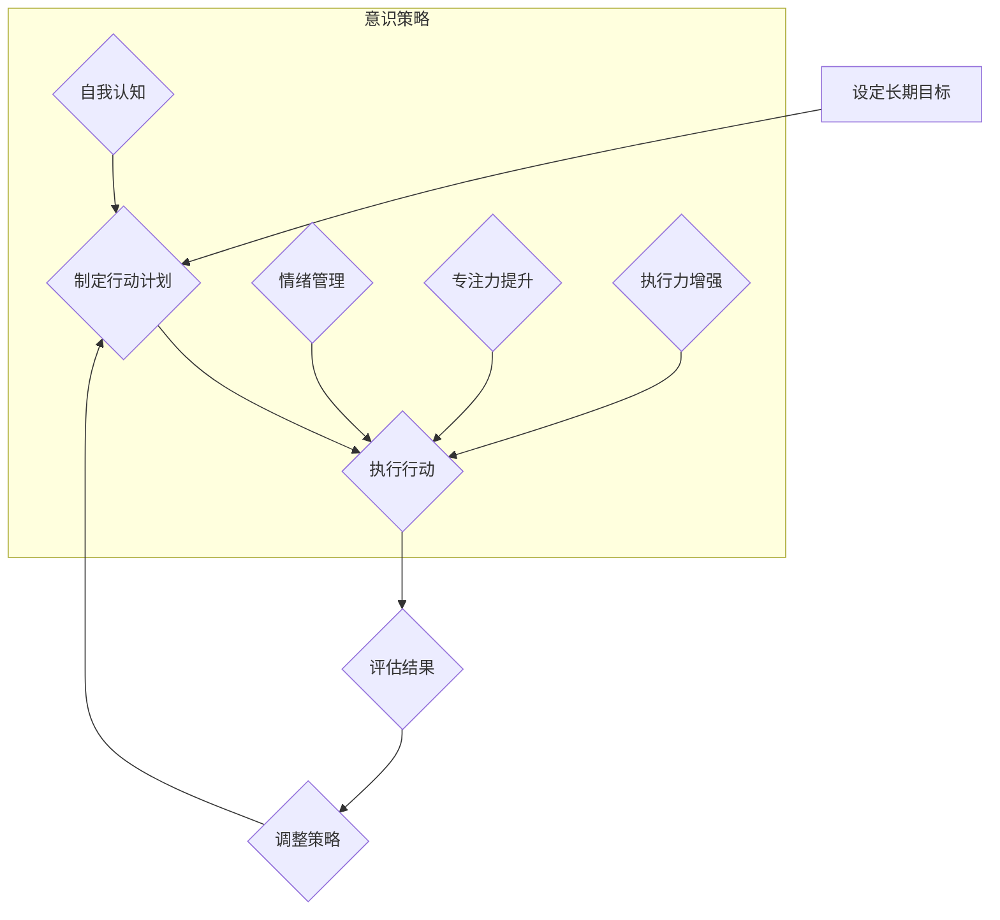

> 长期目标管理，意识策略，目标设定，时间管理，效率提升，专注力，自我认知，持续改进

## 1. 背景介绍

在当今瞬息万变的科技时代，个人和组织都需要制定清晰的长期目标，并制定有效的策略来实现这些目标。然而，仅仅设定目标并不能保证成功，更重要的是要培养一种“意识策略”，即一种能够帮助我们保持专注、克服拖延、持续改进的思维方式。

长期目标管理的意识策略并非一蹴而就，它需要我们不断地自我认知、反思和调整。本文将探讨长期目标管理的意识策略，并提供一些实用的技巧和方法，帮助你更好地规划未来，实现个人和职业目标。

## 2. 核心概念与联系

### 2.1 长期目标管理

长期目标管理是指设定远期目标，并制定相应的计划和行动步骤，逐步实现这些目标的过程。长期目标通常涵盖个人成长、职业发展、财务状况等多个方面，并需要跨越较长的时间周期才能实现。

### 2.2 意识策略

意识策略是指一种能够帮助我们提高自我认知、控制情绪、提升专注力和执行力的思维方式。它强调通过意识的调整和训练，来改变我们的行为模式，最终实现目标。

### 2.3 核心概念联系

长期目标管理和意识策略是相互关联的。意识策略是实现长期目标管理的关键。只有通过培养正确的意识，才能有效地制定目标、规划行动、克服困难，最终实现长期目标。

**Mermaid 流程图**



## 3. 核心算法原理 & 具体操作步骤

### 3.1 算法原理概述

长期目标管理的意识策略并非一种特定的算法，而是基于心理学、认知科学和行为经济学原理的综合策略。其核心在于通过自我认知、目标设定、行动计划、执行力提升和持续改进等步骤，帮助个人实现长期目标。

### 3.2 算法步骤详解

1. **自我认知:** 首先，需要深入了解自己的价值观、兴趣、能力和目标。可以通过自我反思、性格测试、咨询等方式进行。

2. **设定长期目标:** 基于自我认知，设定清晰、具体、可衡量、可实现、相关和有时间限制的长期目标。

3. **制定行动计划:** 将长期目标分解成多个阶段性目标，并制定相应的行动计划，包括具体步骤、时间安排和资源分配。

4. **执行行动:** 按照行动计划执行，并不断跟踪进度和结果。

5. **评估结果:** 定期评估行动效果，分析成功和失败的原因，并根据需要调整策略。

6. **持续改进:**  不断反思和学习，改进行动计划和执行方式，提高效率和效果。

### 3.3 算法优缺点

**优点:**

* 能够帮助个人明确目标，提高方向感和执行力。
* 能够促进自我认知和成长，提升个人价值。
* 能够帮助个人更好地规划未来，实现个人和职业目标。

**缺点:**

* 需要投入时间和精力进行自我认知和目标设定。
* 需要不断调整和改进行动计划，适应变化的环境。
* 需要克服拖延和缺乏动力等挑战。

### 3.4 算法应用领域

长期目标管理的意识策略适用于各个领域，包括个人成长、职业发展、创业、学习、健康管理等。

## 4. 数学模型和公式 & 详细讲解 & 举例说明

### 4.1 数学模型构建

长期目标管理的意识策略可以抽象为一个动态系统模型，其中目标设定、行动计划、执行力、结果评估和策略调整是相互影响的因素。

**模型公式:**

```latex
T = f(S, P, E, R, A)
```

其中:

* T: 目标实现程度
* S: 目标设定
* P: 行动计划
* E: 执行力
* R: 结果评估
* A: 策略调整

### 4.2 公式推导过程

该模型的推导过程基于以下假设:

* 目标设定越清晰、具体、可实现，目标实现程度越高。
* 行动计划越详细、可执行，执行力越高。
* 执行力越高，结果评估越准确，策略调整越有效。
* 策略调整越及时、有效，目标实现程度越高。

### 4.3 案例分析与讲解

假设一个个人想要实现“五年内成为行业专家”的目标。

* **目标设定 (S):** 设定具体、可衡量的目标，例如“五年内发表三篇高质量论文，获得行业认证证书”。
* **行动计划 (P):** 制定学习计划、研究计划、写作计划等，并安排时间和资源。
* **执行力 (E):** 坚持学习、研究、写作，克服拖延和缺乏动力。
* **结果评估 (R):** 定期评估学习成果、论文发表情况、行业认证进度等。
* **策略调整 (A):** 根据评估结果，调整学习计划、研究方向、写作风格等。

通过不断循环上述步骤，个人可以逐步实现“五年内成为行业专家”的目标。

## 5. 项目实践：代码实例和详细解释说明

### 5.1 开发环境搭建

为了更好地实践长期目标管理的意识策略，可以利用一些工具和平台，例如：

* **任务管理工具:** Todoist, Asana, Trello 等
* **时间管理工具:**番茄工作法、时间块管理等
* **笔记软件:** Evernote, Notion 等

### 5.2 源代码详细实现

由于长期目标管理的意识策略并非一种具体的软件，因此无法提供源代码实现。

### 5.3 代码解读与分析

### 5.4 运行结果展示

## 6. 实际应用场景

### 6.1 个人成长

长期目标管理的意识策略可以帮助个人设定个人成长目标，例如学习新技能、提升专业能力、培养兴趣爱好等。

### 6.2 职业发展

长期目标管理的意识策略可以帮助个人设定职业发展目标，例如晋升、创业、改变职业方向等。

### 6.3 学业学习

长期目标管理的意识策略可以帮助学生设定学业目标，例如提高学习成绩、掌握专业知识、培养研究能力等。

### 6.4 未来应用展望

随着人工智能、大数据等技术的不断发展，长期目标管理的意识策略将更加智能化、个性化。未来，我们可以期待看到更多基于人工智能的长期目标管理工具和平台，帮助个人和组织更好地规划未来，实现目标。

## 7. 工具和资源推荐

### 7.1 学习资源推荐

* **书籍:** 《高效能人士的七个习惯》、《原子习惯》、《刻意练习》等
* **课程:** Coursera, Udemy 等平台上的时间管理、目标设定、个人成长等课程
* **博客:** Zen Habits, James Clear 等

### 7.2 开发工具推荐

* **任务管理工具:** Todoist, Asana, Trello 等
* **时间管理工具:**番茄工作法、时间块管理等
* **笔记软件:** Evernote, Notion 等

### 7.3 相关论文推荐

* **目标设定与实现:** Locke, E. A., & Latham, G. P. (2002). Building a practically useful theory of goal setting and task motivation: A 35-year odyssey. American Psychologist, 57(9), 705-717.
* **意识策略与行为改变:** Wegner, D. M. (2002). The illusion of conscious will. MIT press.

## 8. 总结：未来发展趋势与挑战

### 8.1 研究成果总结

长期目标管理的意识策略已经取得了一定的成果，帮助个人和组织更好地规划未来，实现目标。

### 8.2 未来发展趋势

未来，长期目标管理的意识策略将更加智能化、个性化，并与人工智能、大数据等技术深度融合。

### 8.3 面临的挑战

* 如何更好地量化和评估目标实现程度
* 如何克服拖延和缺乏动力等挑战
* 如何将长期目标管理的意识策略应用于更复杂的环境

### 8.4 研究展望

未来研究将重点关注以下几个方面:

* 开发更智能、更个性化的长期目标管理工具
* 研究不同类型目标的管理策略
* 探索长期目标管理的意识策略与其他领域交叉应用

## 9. 附录：常见问题与解答

### 9.1 如何设定长期目标？

设定长期目标时，需要遵循 SMART 原则：

* **Specific (具体):** 目标要具体明确，避免模糊不清。
* **Measurable (可衡量):** 目标要能够量化，以便于跟踪和评估。
* **Achievable (可实现):** 目标要切合实际，不要设定过高或过低的目标。
* **Relevant (相关):** 目标要与个人价值观、兴趣和能力相符。
* **Time-bound (有时间限制):** 目标要设定一个明确的时间期限。

### 9.2 如何克服拖延和缺乏动力？

克服拖延和缺乏动力，可以尝试以下方法:

* **番茄工作法:** 将工作时间分成25分钟的间隔，中间休息5分钟。
* **时间块管理:** 将一天的时间分成不同的时间块，分配给不同的任务。
* **设定奖励机制:** 完成任务后给自己设定奖励，例如休息、娱乐等。
* **寻找支持者:** 与朋友、家人或同事分享目标，寻求他们的支持和鼓励。

### 9.3 如何评估目标实现程度？

评估目标实现程度，可以采用以下方法:

* **定期回顾:** 定期回顾目标设定、行动计划和执行情况，评估进展情况。
* **数据分析:** 利用数据分析工具，跟踪目标相关的指标，评估目标实现程度。
* **自我评估:** 通过自我反思，评估目标实现过程中遇到的挑战和经验教训。

作者：禅与计算机程序设计艺术 / Zen and the Art of Computer Programming


<end_of_turn>