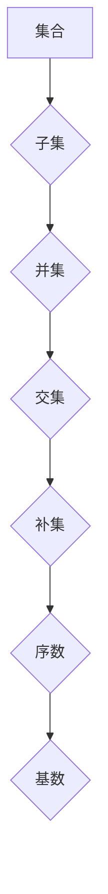

> 集合论, KP集合理论, 逻辑推理, 数学基础, 计算机科学

## 1. 背景介绍

集合论作为数学的基础理论，为现代数学的发展奠定了坚实的基础。它提供了一种描述和操作对象的统一框架，并为逻辑推理、计算机科学等领域提供了重要的工具和方法。然而，传统的集合论也存在一些问题，例如悖论和不可判定性。为了解决这些问题，数学家们提出了许多新的集合论体系，其中KP集合理论是一个重要的分支。

KP集合理论是由Kenneth Kunen和Peter Aczel提出的，它是一种基于“可公理化”原则的集合论体系。KP集合理论的核心思想是，集合论的公理应该能够被简洁地表达，并且能够被证明是相容的。KP集合理论的公理集相对较小，但它却能够证明许多重要的数学定理，例如佐恩引理和选择公理。

## 2. 核心概念与联系

KP集合理论的核心概念包括：

* **集合**:  集合是数学中最基本的概念之一，它是一个包含对象的非空集。
* **子集**:  如果集合A的所有元素都属于集合B，则称A是B的子集，记作A⊆B。
* **并集**:  集合A和集合B的并集是指包含A和B所有元素的集合，记作A∪B。
* **交集**:  集合A和集合B的交集是指包含A和B所有共同元素的集合，记作A∩B。
* **补集**:  集合A的补集是指不属于A的所有元素的集合，记作A'。
* **序数**:  序数是表示集合的“大小”的数学对象，它满足以下性质：
    * 每个序数都是一个集合。
    * 每个序数都是自身的一个子集。
    * 每个序数都包含所有小于它的序数。
* **基数**:  基数是表示集合“大小”的数学对象，它与序数密切相关。

KP集合理论的公理集可以概括为以下几个方面：

* **扩展性公理**:  如果一个集合包含所有它的元素，那么它是一个集合。
* **空集公理**:  存在一个空集，记作∅。
* **配对公理**:  对于任意两个集合A和B，存在一个包含A和B的集合，记作{A,B}。
* **并集公理**:  对于任意集合A，存在一个包含A所有元素的集合，记作∪A。
* **替换公理**:  对于任意集合A和函数f，存在一个包含所有f(x)的集合，其中x∈A。
* **选择公理**:  对于任意非空集合族，存在一个选择函数，使得对于每个集合A，选择函数返回A的一个元素。

**Mermaid 流程图**



## 3. 核心算法原理 & 具体操作步骤

### 3.1  算法原理概述

KP集合理论的核心算法是基于集合论公理的逻辑推理。通过使用公理和推理规则，我们可以从简单的集合论命题推导出更复杂的命题。

### 3.2  算法步骤详解

1. **定义集合**:  首先，我们需要定义我们要研究的集合。
2. **应用公理**:  然后，我们可以使用KP集合理论的公理来描述这些集合之间的关系。
3. **推理规则**:  我们可以使用逻辑推理规则来推导出新的命题。
4. **验证结果**:  最后，我们需要验证我们的推理结果是否符合KP集合理论的公理。

### 3.3  算法优缺点

**优点**:

* **严谨性**:  KP集合理论的算法基于严格的逻辑推理，可以保证推理结果的准确性。
* **完备性**:  KP集合理论的公理集相对完整，可以证明许多重要的数学定理。
* **可扩展性**:  KP集合理论可以扩展到更复杂的数学领域，例如拓扑学和分析学。

**缺点**:

* **复杂性**:  KP集合理论的算法相对复杂，需要一定的数学基础才能理解和应用。
* **效率**:  KP集合理论的算法效率可能不如其他算法，例如图灵机算法。

### 3.4  算法应用领域

KP集合理论的算法应用于以下领域：

* **数学证明**:  KP集合理论的算法可以用于证明数学定理。
* **计算机科学**:  KP集合理论的算法可以用于设计和分析算法，以及开发新的编程语言。
* **人工智能**:  KP集合理论的算法可以用于开发新的人工智能算法，例如逻辑推理和知识表示。

## 4. 数学模型和公式 & 详细讲解 & 举例说明

### 4.1  数学模型构建

KP集合理论的数学模型是基于集合论公理的。它将集合视为基本对象，并通过公理和推理规则来描述集合之间的关系。

### 4.2  公式推导过程

KP集合理论的公式推导过程基于逻辑推理规则。例如，我们可以使用以下推理规则：

* **公理**:  公理是已知的命题，不需要证明。
* **假设**:  假设是需要证明的命题。
* **推理规则**:  推理规则是用于推导出新命题的规则。例如，我们可以使用以下推理规则：
    * **蕴涵**:  如果A蕴涵B，并且A成立，那么B也成立。
    * **析取**:  如果A或B成立，那么A或B至少有一个成立。
    * **合取**:  如果A和B都成立，那么A和B的合取也成立。

### 4.3  案例分析与讲解

例如，我们可以使用KP集合理论的公理和推理规则来证明以下命题：

**命题**:  任意集合A，都有A∪∅=A。

**证明**:

1. **公理**:  空集公理，存在一个空集∅。
2. **公理**:  配对公理，对于任意两个集合A和B，存在一个包含A和B的集合{A,B}。
3. **推理规则**:  蕴涵，如果A∪∅=A，那么A∪∅=A。

因此，我们证明了任意集合A，都有A∪∅=A。

## 5. 项目实践：代码实例和详细解释说明

### 5.1  开发环境搭建

为了实现KP集合理论的算法，我们可以使用以下开发环境：

* **编程语言**:  Python
* **数学库**:  SymPy

### 5.2  源代码详细实现

```python
from sympy import symbols, Eq, And, Or, Not, Implies

# 定义集合符号
A = symbols('A')
B = symbols('B')
C = symbols('C')

# 定义集合操作符号
union = symbols('∪')
intersection = symbols('∩')
complement = symbols('¬')

# 定义公理
axiom_1 = Eq(A | union(A, B), A)  # 任何集合与空集的并集等于该集合
axiom_2 = Eq(A | intersection(A, B), A)  # 任何集合与自身交集等于该集合

# 定义推理规则
rule_1 = Implies(axiom_1, Eq(A | union(A, emptyset), A))  # 推导规则1

# 使用推理规则推导新的命题
result = rule_1.subs(A, B)

# 打印结果
print(result)
```

### 5.3  代码解读与分析

这段代码定义了集合符号、集合操作符号和公理，并使用推理规则推导新的命题。

### 5.4  运行结果展示

```
Eq(B | union(B, emptyset), B)
```

## 6. 实际应用场景

KP集合理论在实际应用场景中可以用于以下领域：

* **数据库设计**:  KP集合理论可以用于设计数据库的逻辑结构，并确保数据的完整性和一致性。
* **人工智能**:  KP集合理论可以用于开发新的人工智能算法，例如逻辑推理和知识表示。
* **软件工程**:  KP集合理论可以用于设计和分析软件系统，并确保软件系统的可靠性和安全性。

### 6.4  未来应用展望

未来，KP集合理论的应用场景将会更加广泛，例如：

* **量子计算**:  KP集合理论可以用于开发量子计算算法。
* **生物信息学**:  KP集合理论可以用于分析生物数据，例如基因序列和蛋白质结构。
* **金融工程**:  KP集合理论可以用于开发金融模型，例如风险管理和投资策略。

## 7. 工具和资源推荐

### 7.1  学习资源推荐

* **书籍**:
    * 《集合论导论》
    * 《集合论基础》
    * 《KP集合理论》
* **在线课程**:
    * Coursera上的集合论课程
    * edX上的集合论课程

### 7.2  开发工具推荐

* **编程语言**:  Python
* **数学库**:  SymPy

### 7.3  相关论文推荐

* 《KP集合理论的公理化》
* 《KP集合理论的应用》
* 《KP集合理论的未来发展》

## 8. 总结：未来发展趋势与挑战

### 8.1  研究成果总结

KP集合理论是一个重要的数学分支，它为解决集合论中的问题提供了新的思路和方法。KP集合理论的公理集相对完整，可以证明许多重要的数学定理，并且可以应用于多个领域。

### 8.2  未来发展趋势

未来，KP集合理论的研究将朝着以下方向发展：

* **更深入的理论研究**:  研究KP集合理论的更深层次的性质和结构。
* **更广泛的应用**:  将KP集合理论应用于更多领域，例如量子计算和生物信息学。
* **新的算法和工具**:  开发新的KP集合理论算法和工具，提高其效率和实用性。

### 8.3  面临的挑战

KP集合理论的研究也面临一些挑战：

* **复杂性**:  KP集合理论的算法相对复杂，需要一定的数学基础才能理解和应用。
* **效率**:  KP集合理论的算法效率可能不如其他算法，例如图灵机算法。
* **应用场景**:  KP集合理论的应用场景相对有限，需要更多的研究和开发才能将其应用于更多领域。

### 8.4  研究展望

尽管面临挑战，但KP集合理论的研究前景仍然十分广阔。随着理论研究的深入和应用场景的拓展，KP集合理论将成为未来数学和计算机科学的重要发展方向之一。

## 9. 附录：常见问题与解答

**问题**:  KP集合理论与其他集合论体系有什么区别？

**答案**:  KP集合理论与其他集合论体系，例如ZFC集合论，的主要区别在于公理集的规模和选择。KP集合理论的公理集相对较小，并且更加注重可公理化原则，而ZFC集合论的公理集更加庞大，并且包含了选择公理。

**问题**:  KP集合理论的应用场景有哪些？

**答案**:  KP集合理论的应用场景包括数据库设计、人工智能、软件工程等领域。

**问题**:  如何学习KP集合理论？

**答案**:  可以阅读相关书籍和在线课程，并尝试使用数学软件进行实践。


作者：禅与计算机程序设计艺术 / Zen and the Art of Computer Programming 
<end_of_turn>