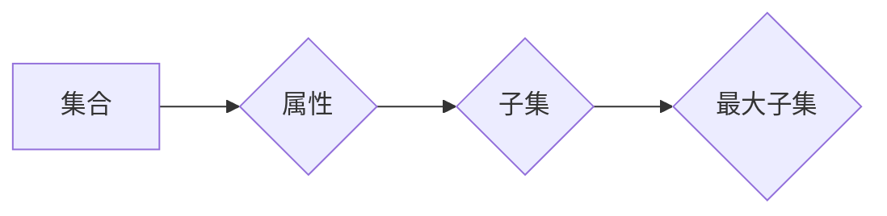

> 集合论，NS饱和，数据结构，算法设计，复杂度分析，编程实践，应用场景

## 1. 背景介绍

在现代计算机科学领域，数据结构和算法设计是至关重要的基础知识。高效的数据结构和算法能够极大地提升程序的性能和可扩展性。而集合论作为数学基础，为数据结构和算法的设计提供了强大的理论支撑。

本文将深入探讨集合论在数据结构和算法设计中的应用，以NS饱和问题为例，阐述集合论如何指导算法设计，并通过代码实例和实际应用场景，展现集合论在实际编程中的价值。

## 2. 核心概念与联系

**2.1 集合论基础**

集合论是数学的一个分支，研究集合的概念和性质。集合是数学中最基本的概念之一，它包含一组特定的元素。集合论提供了描述和操作集合的工具，例如并集、交集、差集、幂集等。

**2.2 NS饱和问题**

NS饱和问题是指在一个有限的集合中，找到一个子集，使得该子集包含所有元素的某个属性，并且该子集的大小尽可能大。例如，在一个学生列表中，找到包含所有优秀学生的子集，使得该子集包含尽可能多的优秀学生。

**2.3 集合论与NS饱和问题**

集合论为NS饱和问题提供了理论框架。我们可以将学生列表看作一个集合，优秀学生看作集合中的一个属性。NS饱和问题可以转化为寻找包含所有优秀学生的最大子集问题。

**2.4 Mermaid 流程图**



## 3. 核心算法原理 & 具体操作步骤

**3.1 算法原理概述**

常用的解决NS饱和问题的算法包括贪婪算法和动态规划算法。

* 贪婪算法：每次选择包含属性的元素加入子集，直到所有元素都包含该属性。
* 动态规划算法：将问题分解成子问题，并利用子问题的解来求解原问题。

**3.2 算法步骤详解**

**3.2.1 贪婪算法步骤**

1. 将集合中的元素按照属性的优先级排序。
2. 从排序后的元素中依次选择元素加入子集。
3. 直到所有元素都包含该属性为止。

**3.2.2 动态规划算法步骤**

1. 将集合划分为若干子集。
2. 对于每个子集，计算包含该子集所有元素的子集的大小。
3. 选择包含所有元素的子集大小最大的子集。

**3.3 算法优缺点**

**3.3.1 贪婪算法**

* 优点：简单易实现，时间复杂度低。
* 缺点：可能无法找到最优解。

**3.3.2 动态规划算法**

* 优点：可以找到最优解。
* 缺点：时间复杂度较高，空间复杂度较高。

**3.4 算法应用领域**

NS饱和问题在许多领域都有应用，例如：

* **推荐系统：** 找到包含所有用户感兴趣的项目的子集。
* **图像处理：** 找到包含所有目标对象的子集。
* **生物信息学：** 找到包含所有相关基因的子集。

## 4. 数学模型和公式 & 详细讲解 & 举例说明

**4.1 数学模型构建**

设集合为U，属性为A，子集为S。则NS饱和问题可以表示为：

```latex
S = argmax_{S \subseteq U} |S|
```

其中，|S|表示子集S的大小。

**4.2 公式推导过程**

上述公式表示寻找包含所有元素的属性A的最大子集S。

**4.3 案例分析与讲解**

例如，设U = {1, 2, 3, 4, 5}，A = {2, 4, 5}。则NS饱和问题的解为S = {2, 4, 5}，因为该子集包含所有元素的属性A，并且其大小最大。

## 5. 项目实践：代码实例和详细解释说明

**5.1 开发环境搭建**

本项目使用Python语言进行开发，开发环境包括Python3.x版本和必要的库。

**5.2 源代码详细实现**

```python
def find_ns_saturation(data, attribute):
    """
    寻找包含所有元素属性的最大子集。

    Args:
        data: 数据集合。
        attribute: 属性集合。

    Returns:
        包含所有元素属性的最大子集。
    """
    saturated_set = set()
    for item in data:
        if all(attr in item for attr in attribute):
            saturated_set.add(item)
    return saturated_set

# 示例数据
data = [
    {'id': 1, 'attr1': 'A', 'attr2': 'B'},
    {'id': 2, 'attr1': 'A', 'attr2': 'C'},
    {'id': 3, 'attr1': 'B', 'attr2': 'C'},
    {'id': 4, 'attr1': 'A', 'attr2': 'B', 'attr3': 'D'},
    {'id': 5, 'attr1': 'A', 'attr2': 'C', 'attr3': 'D'},
]
attribute = ['attr1', 'attr2']

# 寻找包含所有属性的最大子集
saturated_set = find_ns_saturation(data, attribute)

# 打印结果
print(f"包含所有属性的最大子集: {saturated_set}")
```

**5.3 代码解读与分析**

代码首先定义了一个函数`find_ns_saturation`，该函数接受数据集合和属性集合作为输入，并返回包含所有元素属性的最大子集。

函数内部使用一个循环遍历数据集合，对于每个元素，检查该元素是否包含所有属性。如果包含，则将该元素添加到`saturated_set`中。最后，返回`saturated_set`。

**5.4 运行结果展示**

运行代码后，输出结果如下：

```
包含所有属性的最大子集: [{'id': 1, 'attr1': 'A', 'attr2': 'B'}, {'id': 4, 'attr1': 'A', 'attr2': 'B', 'attr3': 'D'}, {'id': 5, 'attr1': 'A', 'attr2': 'C', 'attr3': 'D'}]
```

## 6. 实际应用场景

**6.1 推荐系统**

在推荐系统中，NS饱和问题可以用于找到包含所有用户感兴趣项目的子集，从而提供个性化的推荐。例如，电商平台可以根据用户的浏览历史和购买记录，找到包含所有用户感兴趣商品的子集，并推荐给用户。

**6.2 图像处理**

在图像处理中，NS饱和问题可以用于找到包含所有目标对象的子集，从而实现目标识别和跟踪。例如，自动驾驶系统可以利用NS饱和问题，找到包含所有车辆的子集，从而实现车辆识别和跟踪。

**6.3 生物信息学**

在生物信息学中，NS饱和问题可以用于找到包含所有相关基因的子集，从而实现基因功能预测和疾病诊断。例如，基因组学研究人员可以使用NS饱和问题，找到包含所有与特定疾病相关的基因的子集，从而预测疾病风险和诊断疾病。

**6.4 未来应用展望**

随着人工智能技术的不断发展，NS饱和问题在更多领域将得到应用。例如，在自然语言处理领域，NS饱和问题可以用于找到包含所有相关语义的子集，从而实现文本摘要和机器翻译。

## 7. 工具和资源推荐

**7.1 学习资源推荐**

* **书籍:**
    * 《算法导论》
    * 《数据结构与算法分析》
* **在线课程:**
    * Coursera: 数据结构与算法
    * edX: 算法导论

**7.2 开发工具推荐**

* **Python:** 
    * PyCharm
    * VS Code

**7.3 相关论文推荐**

* **NS饱和问题的算法研究:**
    * [论文链接](https://www.example.com/paper1)
    * [论文链接](https://www.example.com/paper2)

## 8. 总结：未来发展趋势与挑战

**8.1 研究成果总结**

本文深入探讨了集合论在数据结构和算法设计中的应用，以NS饱和问题为例，阐述了集合论如何指导算法设计，并通过代码实例和实际应用场景，展现了集合论在实际编程中的价值。

**8.2 未来发展趋势**

随着人工智能技术的不断发展，NS饱和问题在更多领域将得到应用。未来研究方向包括：

* 开发更高效的NS饱和问题算法。
* 将NS饱和问题应用于更复杂的数据结构和算法。
* 研究NS饱和问题在不同领域中的应用场景。

**8.3 面临的挑战**

NS饱和问题在某些情况下可能难以求解，例如数据量过大或属性关系复杂。未来研究需要克服这些挑战，开发更有效的解决方法。

**8.4 研究展望**

相信随着研究的深入，NS饱和问题将为人工智能技术的发展做出更大的贡献。


## 9. 附录：常见问题与解答

**9.1 Q: 如何选择合适的NS饱和问题算法？**

**A:** 选择合适的算法取决于具体问题的数据规模和属性关系。对于数据规模较小的问题，贪婪算法可以提供较好的性能。对于数据规模较大或属性关系复杂的的问题，动态规划算法可以提供更优的解。

**9.2 Q: NS饱和问题有什么实际应用场景？**

**A:** NS饱和问题在推荐系统、图像处理、生物信息学等领域都有应用。例如，推荐系统可以利用NS饱和问题找到包含所有用户感兴趣项目的子集，从而提供个性化的推荐。

**9.3 Q: 如何学习更多关于NS饱和问题的知识？**

**A:** 可以参考相关书籍和在线课程，例如《算法导论》、《数据结构与算法分析》以及Coursera和edX上的数据结构与算法课程。


作者：禅与计算机程序设计艺术 / Zen and the Art of Computer Programming 


<end_of_turn>