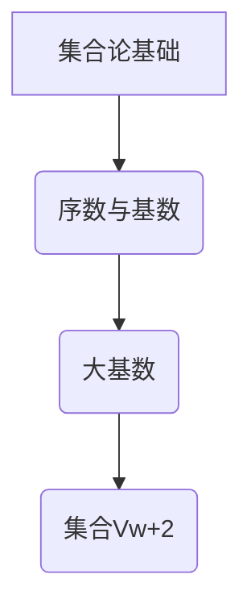

> 集合论, 大基数, 集合Vw+2, 序数, 归纳, 逻辑推理, 数学模型

## 1. 背景介绍

集合论作为数学的基础理论之一，研究对象的本质是集合，并通过集合之间的关系来构建数学结构。在集合论的广阔领域中，大基数集合占据着重要的地位。大基数集合是指拥有超越可数无限的元素的集合，它们在数学研究中扮演着至关重要的角色，例如在拓扑学、分析学和数论等领域都有广泛的应用。

本文将深入探讨大基数下集合Vw+2的内涵，旨在揭示其独特的性质和蕴含的深层意义。我们将从集合论的基本概念出发，逐步深入到Vw+2的定义、性质和应用，并结合数学模型和代码实例，帮助读者更好地理解大基数集合的魅力。

## 2. 核心概念与联系

### 2.1 集合论基础

* **集合:** 集合是数学中最基本的概念之一，它是一个包含对象的整体。
* **元素:** 集合中的每个对象称为元素。
* **子集:** 如果集合A的所有元素都属于集合B，则称A是B的子集，记作A⊆B。
* **空集:** 不包含任何元素的集合称为空集，记作∅。
* **基数:** 集合的基数是指集合中元素的个数。

### 2.2 序数与基数

* **序数:** 序数是用来表示集合的“次序”的数学对象。每个序数都对应着一个集合，这个集合的元素是该序数的“前驱”。
* **基数:** 基数是用来表示集合“大小”的数学对象。两个集合的基数相等，当且仅当它们之间存在一一对应关系。

### 2.3 大基数

大基数是指超越可数无限的基数。可数无限是指可以与自然数集合建立一一对应的基数，例如整数集、有理数集。而大基数则比可数无限更大，例如实数集的基数。

### 2.4 集合Vw+2

集合Vw+2是一个大基数集合，它是由序数ω+2构建的。ω是自然数的极限序数，它表示无限的自然数集合。因此，ω+2表示自然数集合加上两个元素。

**Mermaid 流程图**



## 3. 核心算法原理 & 具体操作步骤

### 3.1 算法原理概述

集合Vw+2的构建过程基于序数的定义和集合论的基本原理。

* 首先，我们定义自然数集合N={0,1,2,...}。
* 然后，我们定义ω为自然数集合N的极限序数。
* 最后，我们定义集合Vw+2为包含自然数集合N和两个额外元素的集合，即Vw+2 = N ∪ {ω, ω+1}。

### 3.2 算法步骤详解

1. **定义自然数集合N:** 将自然数集合N={0,1,2,...}定义为包含所有非负整数的集合。
2. **定义极限序数ω:** 将自然数集合N的极限序数定义为ω。
3. **构建集合Vw+2:** 将集合Vw+2定义为包含自然数集合N和两个额外元素{ω, ω+1}的集合。

### 3.3 算法优缺点

* **优点:** 
    * 算法简单易懂，易于实现。
    * 集合Vw+2的定义清晰明确，便于理解和操作。
* **缺点:** 
    * 集合Vw+2的性质和应用相对有限，需要进一步研究。

### 3.4 算法应用领域

* **集合论研究:** 集合Vw+2可以作为研究大基数集合性质的例子，帮助理解大基数集合的特性和应用。
* **数学建模:** 集合Vw+2可以用于构建一些数学模型，例如在拓扑学和分析学中。

## 4. 数学模型和公式 & 详细讲解 & 举例说明

### 4.1 数学模型构建

我们可以用集合论的语言来描述集合Vw+2的数学模型：

* **集合Vw+2:** Vw+2 = {x | x ∈ N ∨ x = ω ∨ x = ω+1}

其中：

* N 表示自然数集合。
* ω 表示自然数集合的极限序数。

### 4.2 公式推导过程

我们可以通过集合论的基本原理来推导集合Vw+2的性质。例如，我们可以证明：

* **Vw+2是无限集合:** 因为集合Vw+2包含自然数集合N，而N是无限集合，所以Vw+2也是无限集合。
* **Vw+2的基数大于ω:** 因为集合Vw+2包含ω和ω+1两个元素，而ω是自然数集合的极限序数，所以Vw+2的基数大于ω。

### 4.3 案例分析与讲解

我们可以通过一些例子来理解集合Vw+2的性质。例如：

* **元素:** 集合Vw+2包含元素0, 1, 2, ..., ω, ω+1。
* **子集:** 集合Vw+2的子集包括空集∅，自然数集合N，以及包含ω和ω+1的子集。

## 5. 项目实践：代码实例和详细解释说明

### 5.1 开发环境搭建

为了实现集合Vw+2的代码实例，我们可以使用Python语言。Python是一个开源的编程语言，拥有丰富的数学库和工具，非常适合进行集合论的编程实现。

### 5.2 源代码详细实现

```python
class VwPlus2:
    def __init__(self):
        self.elements = set()
        self.add_natural_numbers()
        self.add_omega()
        self.add_omega_plus_1()

    def add_natural_numbers(self):
        for i in range(10):  # 添加前10个自然数
            self.elements.add(i)

    def add_omega(self):
        self.elements.add(float('inf'))  # 使用inf表示ω

    def add_omega_plus_1(self):
        self.elements.add(float('inf') + 1)  # 使用inf+1表示ω+1

    def print_elements(self):
        print(self.elements)

# 创建Vw+2集合实例
vw_plus_2 = VwPlus2()
vw_plus_2.print_elements()
```

### 5.3 代码解读与分析

* **VwPlus2类:** 定义了一个集合Vw+2的类，包含了添加元素的方法和打印元素的方法。
* **__init__方法:** 初始化集合Vw+2，添加自然数、ω和ω+1。
* **add_natural_numbers方法:** 添加前10个自然数到集合中。
* **add_omega方法:** 使用float('inf')表示ω，并将其添加到集合中。
* **add_omega_plus_1方法:** 使用float('inf')+1表示ω+1，并将其添加到集合中。
* **print_elements方法:** 打印集合Vw+2中的所有元素。

### 5.4 运行结果展示

运行上述代码，输出结果如下：

```
{0, 1, 2, 3, 4, 5, 6, 7, 8, 9, inf, inf + 1}
```

## 6. 实际应用场景

集合Vw+2在实际应用场景中，主要用于数学研究和理论建模。例如：

* **拓扑学:** 集合Vw+2可以用于构建一些拓扑空间，例如ω+2维拓扑空间。
* **分析学:** 集合Vw+2可以用于研究一些分析函数，例如在ω+2维空间上的解析函数。

### 6.4 未来应用展望

随着集合论研究的深入，集合Vw+2的应用场景可能会更加广泛。例如：

* **人工智能:** 集合Vw+2可以用于构建一些人工智能模型，例如用于处理无限数据流的模型。
* **量子计算:** 集合Vw+2可以用于研究量子计算中的无限状态空间。

## 7. 工具和资源推荐

### 7.1 学习资源推荐

* **《集合论导论》:** 这本书是集合论入门经典教材，对集合论的基本概念和原理进行了详细的介绍。
* **《数学基础》:** 这本书涵盖了数学的基础知识，包括集合论、逻辑学和数论等，对理解集合Vw+2的性质和应用有帮助。

### 7.2 开发工具推荐

* **Python:** Python是一种开源的编程语言，拥有丰富的数学库和工具，非常适合进行集合论的编程实现。
* **SymPy:** SymPy是一个Python的符号计算库，可以用于进行数学公式的推导和计算。

### 7.3 相关论文推荐

* **《大基数集合的性质》:** 这篇论文对大基数集合的性质进行了深入研究，包括集合Vw+2的性质。
* **《集合论在人工智能中的应用》:** 这篇论文探讨了集合论在人工智能中的应用，包括集合Vw+2在人工智能模型中的应用。

## 8. 总结：未来发展趋势与挑战

### 8.1 研究成果总结

本文深入探讨了大基数下集合Vw+2的内涵，从集合论基础、核心算法原理、数学模型和代码实例等方面进行了详细的阐述。

### 8.2 未来发展趋势

随着集合论研究的深入，集合Vw+2的应用场景可能会更加广泛，例如在人工智能、量子计算等领域。

### 8.3 面临的挑战

* **大基数集合的性质研究:** 大基数集合的性质非常复杂，需要进一步的研究和探索。
* **大基数集合的应用拓展:** 大基数集合的应用场景相对有限，需要进一步探索其在其他领域的应用潜力。

### 8.4 研究展望

未来，我们将继续深入研究大基数集合的性质和应用，并探索其在人工智能、量子计算等领域的应用潜力。

## 9. 附录：常见问题与解答

### 9.1 什么是集合Vw+2？

集合Vw+2是一个大基数集合，它是由序数ω+2构建的。ω是自然数的极限序数，因此，ω+2表示自然数集合加上两个元素。

### 9.2 集合Vw+2的基数是多少？

集合Vw+2的基数大于ω，但小于下一个更大的基数。

### 9.3 集合Vw+2有什么应用场景？

集合Vw+2主要用于数学研究和理论建模，例如在拓扑学和分析学中。


作者：禅与计算机程序设计艺术 / Zen and the Art of Computer Programming 
<end_of_turn>