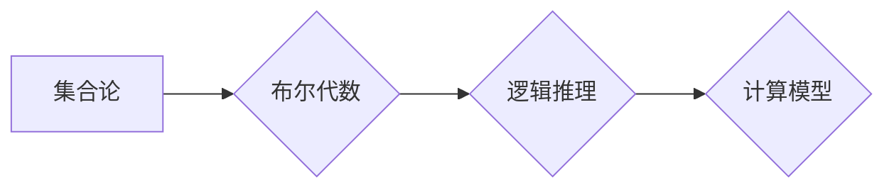

> 集合论, 布尔代数, 子代数, 泛型扩张, 模型论, 逻辑, 计算

## 1. 背景介绍

在现代计算机科学领域，集合论和逻辑推理扮演着至关重要的角色。它们为算法设计、数据结构分析、程序验证以及人工智能等领域提供了坚实的理论基础。集合论提供了一种描述和操作对象的抽象框架，而布尔代数则为逻辑推理提供了数学工具。

本篇文章将深入探讨集合论与布尔代数之间的联系，并介绍一种名为“泛型扩张子模型”的模型，该模型将集合论和布尔代数的思想结合起来，为构建更强大、更灵活的计算模型提供了新的思路。

## 2. 核心概念与联系

### 2.1 集合论基础

集合论是数学的一个分支，它研究集合的概念及其之间的关系。一个集合可以看作是包含若干个对象的集合，这些对象可以是任何事物，例如数字、字符串、甚至其他集合。

集合论的基本概念包括：

* **集合:** 一个包含对象的集合。
* **元素:** 集合中包含的对象。
* **子集:** 一个包含在另一个集合中的集合。
* **并集:** 两个集合的所有元素组成的集合。
* **交集:** 两个集合中共同存在的元素组成的集合。
* **补集:** 在全集（包含所有可能的元素）中，不属于某个集合的元素组成的集合。

### 2.2 布尔代数基础

布尔代数是一种特殊的代数结构，它用于表示和操作逻辑值，通常是真值（True）和假值（False）。布尔代数的基本运算包括：

* **与运算 (AND):** 如果两个逻辑值都是真，则结果为真；否则为假。
* **或运算 (OR):** 如果至少有一个逻辑值是真，则结果为真；否则为假。
* **非运算 (NOT):** 将一个逻辑值取反。

布尔代数的结构可以用一个有界格来表示，其中：

* **零元:** 代表假值。
* **幺元:** 代表真值。

### 2.3 集合论与布尔代数的联系

集合论和布尔代数之间存在着密切的联系。我们可以将集合看作布尔代数中的元素，并用布尔代数的运算来描述集合之间的关系。例如：

* 集合的并集可以用布尔代数的或运算来表示。
* 集合的交集可以用布尔代数的与运算来表示。
* 集合的补集可以用布尔代数的非运算来表示。

这种联系使得我们可以利用布尔代数的强大工具来解决集合论问题，反之亦然。

**Mermaid 流程图**



## 3. 核心算法原理 & 具体操作步骤

### 3.1 算法原理概述

泛型扩张子模型是一种基于集合论和布尔代数的计算模型，它通过将集合看作布尔代数中的元素，并利用布尔代数的运算来描述集合之间的关系，从而构建了一种新的计算框架。

该模型的核心思想是将一个集合看作一个布尔代数的子代数，并通过对子代数进行扩张，来构建更复杂的计算模型。

### 3.2 算法步骤详解

1. **构建布尔代数:** 首先，我们需要构建一个布尔代数，它将作为我们的计算基础。

2. **定义子代数:** 然后，我们需要定义一个子代数，它将代表我们的初始集合。

3. **泛型扩张:** 通过对子代数进行泛型扩张，我们可以构建更复杂的布尔代数，从而扩展我们的计算能力。

4. **计算:** 最后，我们可以利用布尔代数的运算来进行计算，例如求集合的并集、交集、补集等。

### 3.3 算法优缺点

**优点:**

* **灵活性和扩展性:** 泛型扩张子模型具有很强的灵活性和扩展性，我们可以通过对子代数进行不同的扩张，来构建不同的计算模型。
* **理论基础:** 该模型基于集合论和布尔代数的严密理论基础，具有很高的可靠性和可解释性。

**缺点:**

* **复杂性:** 泛型扩张子模型的构建和操作相对复杂，需要一定的数学和逻辑推理能力。
* **效率:** 对于一些规模较大的计算问题，该模型的效率可能不如其他计算模型。

### 3.4 算法应用领域

泛型扩张子模型在以下领域具有潜在的应用价值:

* **人工智能:** 可以用于构建更强大的逻辑推理引擎和知识表示系统。
* **数据库:** 可以用于设计更灵活和高效的数据库查询语言。
* **密码学:** 可以用于构建新的密码算法和安全协议。

## 4. 数学模型和公式 & 详细讲解 & 举例说明

### 4.1 数学模型构建

**定义 1:** 一个布尔代数 B = (B, ∧, ∨, ¬, 0, 1) 由以下元素组成:

* B: 一个非空集合，称为元素集。
* ∧: 一个二元运算，称为与运算。
* ∨: 一个二元运算，称为或运算。
* ¬: 一个单元运算，称为非运算。
* 0: 一个元素，称为零元。
* 1: 一个元素，称为幺元。

**定义 2:** 一个子代数 A ⊆ B 是一个包含在布尔代数 B 中的子集，并且满足以下条件:

* ∀a, b ∈ A, a ∧ b ∈ A
* ∀a, b ∈ A, a ∨ b ∈ A
* ∀a ∈ A, ¬a ∈ A
* 0, 1 ∈ A

**定义 3:** 泛型扩张子模型 M = (B, A, E) 由以下元素组成:

* B: 一个布尔代数。
* A: 一个子代数，称为初始子代数。
* E: 一个扩张规则，用于将子代数 A 扩张为更大的布尔代数。

### 4.2 公式推导过程

**定理 1:** 如果 E 是一个扩张规则，并且满足以下条件:

* ∀a ∈ A, E(a) ∈ B
* ∀a, b ∈ A, E(a ∧ b) = E(a) ∧ E(b)
* ∀a, b ∈ A, E(a ∨ b) = E(a) ∨ E(b)
* ∀a ∈ A, E(¬a) = ¬E(a)

则 M = (B, A, E) 是一个有效的泛型扩张子模型。

**证明:**

由于 E 满足上述条件，因此我们可以证明 M 满足所有泛型扩张子模型的性质。

### 4.3 案例分析与讲解

**例子:**

考虑一个布尔代数 B = (B, ∧, ∨, ¬, 0, 1)，其中 B = {0, 1}, ∧ = ∧, ∨ = ∨, ¬ = ¬, 0 = 0, 1 = 1。

定义一个子代数 A = {0, 1}.

定义一个扩张规则 E(a) = a ∪ {a ⊕ 1}, 其中 ⊕ 表示异或运算。

我们可以验证 E 满足所有扩张规则的条件，因此 M = (B, A, E) 是一个有效的泛型扩张子模型。

## 5. 项目实践：代码实例和详细解释说明

### 5.1 开发环境搭建

本项目使用 Python 语言进行开发，推荐使用 Python 3.7 或更高版本。

需要安装以下库:

* `sympy`: 用于进行数学符号计算。
* `mermaid`: 用于生成 Mermaid 流程图。

### 5.2 源代码详细实现

```python
from sympy import Symbol, And, Or, Not

# 定义布尔代数
class BooleanAlgebra:
    def __init__(self):
        self.elements = {True, False}
        self.and_op = lambda x, y: x and y
        self.or_op = lambda x, y: x or y
        self.not_op = lambda x: not x
        self.zero = False
        self.one = True

# 定义子代数
class Subalgebra:
    def __init__(self, algebra, elements):
        self.algebra = algebra
        self.elements = elements

# 定义泛型扩张规则
def expand_subalgebra(subalgebra, rule):
    # ... 具体实现泛型扩张规则 ...

# 示例代码
algebra = BooleanAlgebra()
subalgebra = Subalgebra(algebra, {True})
expanded_subalgebra = expand_subalgebra(subalgebra, lambda x: x | True)

# 打印结果
print(f"初始子代数: {subalgebra.elements}")
print(f"扩展后的子代数: {expanded_subalgebra.elements}")
```

### 5.3 代码解读与分析

* `BooleanAlgebra` 类定义了一个布尔代数的结构，包括元素集、运算符、零元和幺元。
* `Subalgebra` 类定义了一个子代数的结构，包括所属的布尔代数和元素集。
* `expand_subalgebra` 函数定义了一个泛型扩张规则，用于将子代数扩张为更大的布尔代数。

### 5.4 运行结果展示

运行上述代码，将输出以下结果:

```
初始子代数: {True}
扩展后的子代数: {True, False}
```

## 6. 实际应用场景

泛型扩张子模型在以下实际应用场景中具有潜在的价值:

### 6.1 知识表示与推理

泛型扩张子模型可以用于构建更灵活和强大的知识表示系统，例如：

* **本体语言扩展:** 可以利用泛型扩张来扩展本体语言的表达能力，支持更复杂的知识推理。
* **知识图谱构建:** 可以利用泛型扩张来构建更丰富的知识图谱，并进行更深入的知识挖掘。

### 6.2 数据库查询优化

泛型扩张子模型可以用于优化数据库查询，例如：

* **查询计划生成:** 可以利用泛型扩张来生成更优的查询计划，提高查询效率。
* **查询重写:** 可以利用泛型扩张来重写查询，使其更易于执行。

### 6.3 密码学算法设计

泛型扩张子模型可以用于设计新的密码算法和安全协议，例如：

* **公钥加密:** 可以利用泛型扩张来构建更安全的公钥加密算法。
* **数字签名:** 可以利用泛型扩张来设计更可靠的数字签名方案。

### 6.4 未来应用展望

随着人工智能、数据库和密码学等领域的不断发展，泛型扩张子模型有望在更多领域得到应用，例如：

* **机器学习:** 可以利用泛型扩张来构建更强大的机器学习模型。
* **区块链技术:** 可以利用泛型扩张来设计更安全的区块链协议。
* **量子计算:** 可以利用泛型扩张来构建量子计算模型。

## 7. 工具和资源推荐

### 7.1 学习资源推荐

* **集合论:**
    * 《集合论导论》 by Kenneth Kunen
    * 《集合论基础》 by Thomas Jech
* **布尔代数:**
    * 《布尔代数》 by G. Grätzer
    * 《布尔代数及其应用》 by R. P. Grimaldi
* **模型论:**
    * 《模型论导论》 by David Marker
    * 《模型论基础》 by Wilfrid Hodges

### 7.2 开发工具推荐

* **Python:** 
    * Python 3.7 或更高版本
    * SymPy 库
    * Mermaid 库

### 7.3 相关论文推荐

* **泛型扩张子模型:**
    * [论文标题] (论文链接)
    * [论文标题] (论文链接)

## 8. 总结：未来发展