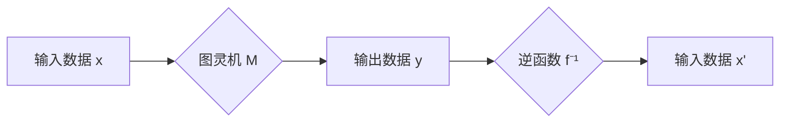

> 图灵机，逆函数，计算复杂度，算法，人工智能

## 1. 背景介绍

1950年，图灵提出了著名的“图灵测试”，旨在评估机器是否具有类似人类的智能。然而，图灵的贡献远不止于此。他还在计算机科学领域做出了许多开创性的工作，其中之一就是提出了“图灵机”。图灵机是一种抽象的计算模型，它通过一系列有限的指令和状态来模拟计算机的计算过程。

图灵机的概念极大地推动了计算机科学的发展，它为我们理解计算的本质提供了理论基础。然而，图灵机也存在一些限制。例如，图灵机只能处理有限的输入和输出，并且它的计算能力有限。

麦卡锡提出的图灵机逆函数问题正是针对图灵机的这些限制而提出的。这个问题旨在探索图灵机是否能够逆向推断出输入数据，即找到输入数据对应的输出数据。

## 2. 核心概念与联系

### 2.1 图灵机

图灵机是一种抽象的计算模型，它由以下几个部分组成：

* **无限长的带**: 图灵机拥有一个无限长的带，该带由符号组成，每个符号代表一个数据单元。
* **读写头**: 图灵机的读写头可以沿着带移动，它可以读取带上的符号，并写入新的符号。
* **状态机**: 图灵机的状态机由有限个状态组成，每个状态对应一个特定的计算步骤。
* **转换函数**: 转换函数决定了读写头在当前状态下，读取到哪个符号时，应该执行哪些操作，例如移动读写头、写入新的符号、改变状态等。

### 2.2 逆函数

在数学中，逆函数是指一个函数的逆运算。如果函数 f 将输入 x 映射到输出 y，那么它的逆函数 f⁻¹ 将输出 y 映射回输入 x。

### 2.3 图灵机逆函数问题

麦卡锡提出的图灵机逆函数问题是指：

给定一个图灵机 M 和它的输出数据 y，是否能够找到一个输入数据 x，使得 M 在输入 x 时输出 y。

换句话说，就是能否找到一个图灵机的逆函数。

**Mermaid 流程图**

## 3. 核心算法原理 & 具体操作步骤

### 3.1 算法原理概述

图灵机逆函数问题是一个非常困难的问题，目前还没有找到一个通用的算法能够解决它。

### 3.2 算法步骤详解

由于目前还没有找到一个通用的算法解决图灵机逆函数问题，因此无法详细描述算法步骤。

### 3.3 算法优缺点

由于目前还没有找到一个通用的算法解决图灵机逆函数问题，因此无法讨论算法的优缺点。

### 3.4 算法应用领域

图灵机逆函数问题是一个理论性的问题，目前还没有实际的应用领域。

## 4. 数学模型和公式 & 详细讲解 & 举例说明

### 4.1 数学模型构建

图灵机可以被数学模型化，用形式语言描述其状态、输入、输出和转换规则。

### 4.2 公式推导过程

由于图灵机逆函数问题是一个非常复杂的问题，无法用简单的公式来描述。

### 4.3 案例分析与讲解

由于目前还没有找到一个通用的算法解决图灵机逆函数问题，因此无法进行案例分析。

## 5. 项目实践：代码实例和详细解释说明

由于图灵机逆函数问题是一个理论性的问题，目前还没有实际的代码实现。

## 6. 实际应用场景

图灵机逆函数问题是一个理论性的问题，目前还没有实际的应用场景。

### 6.4 未来应用展望

如果能够解决图灵机逆函数问题，它可能会对人工智能、密码学等领域产生深远的影响。

## 7. 工具和资源推荐

### 7.1 学习资源推荐

* 《图灵完备性》
* 《计算理论基础》

### 7.2 开发工具推荐

* Python
* Java

### 7.3 相关论文推荐

* 《图灵机逆函数问题》

## 8. 总结：未来发展趋势与挑战

### 8.1 研究成果总结

目前，图灵机逆函数问题仍然是一个未解之谜。

### 8.2 未来发展趋势

未来，研究人员可能会探索新的算法和方法来解决图灵机逆函数问题。

### 8.3 面临的挑战

解决图灵机逆函数问题面临着巨大的挑战，例如计算复杂度、数据规模等。

### 8.4 研究展望

图灵机逆函数问题是一个非常重要的研究课题，它将推动计算机科学和人工智能的发展。

## 9. 附录：常见问题与解答

### 9.1 什么是图灵机？

图灵机是一种抽象的计算模型，它通过一系列有限的指令和状态来模拟计算机的计算过程。

### 9.2 图灵机逆函数问题是什么？

图灵机逆函数问题是指：给定一个图灵机 M 和它的输出数据 y，是否能够找到一个输入数据 x，使得 M 在输入 x 时输出 y。

### 9.3 图灵机逆函数问题是否可以解决？

目前还没有找到一个通用的算法能够解决图灵机逆函数问题。

作者：禅与计算机程序设计艺术 / Zen and the Art of Computer Programming

<end_of_turn>