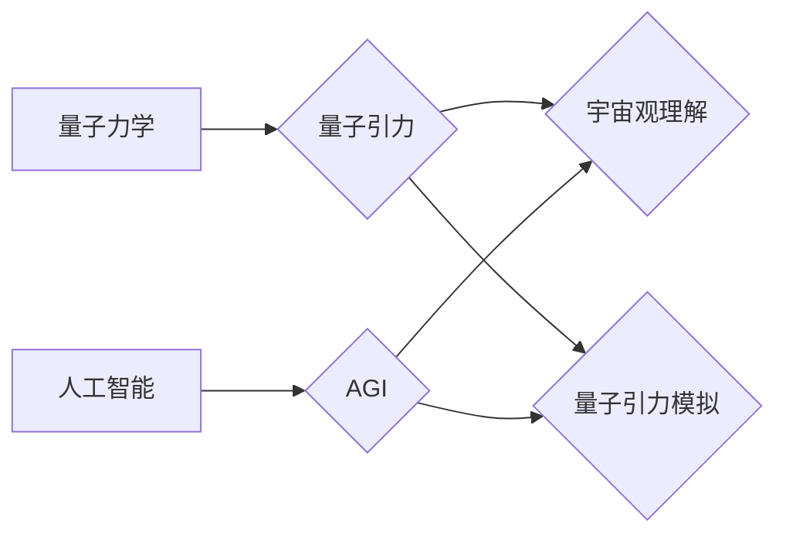

> AGI，量子引力，人工智能，机器学习，深度学习，量子计算，物理学，宇宙学

## 1. 背景介绍

宇宙的奥秘一直是人类探索的终极目标。从古至今，人类一直在试图理解宇宙的起源、演化和最终命运。量子引力作为一种试图将量子力学和广义相对论统一的理论，被认为是理解宇宙本质的关键。然而，由于其理论复杂性和实验验证的困难，量子引力一直是物理学领域最具挑战性的难题之一。

近年来，人工智能（AI）技术取得了飞速发展，特别是深度学习算法的突破，使得AI在各个领域展现出强大的应用潜力。从图像识别、自然语言处理到药物研发，AI已经开始改变着我们的生活。而AGI（通用人工智能），即能够像人类一样学习、思考和解决各种问题的人工智能，则被视为未来科技发展的重要方向。

结合AI和量子力学的优势，探索AGI在量子引力研究中的应用，将为我们理解宇宙奥秘提供新的思路和方法。

## 2. 核心概念与联系

### 2.1 量子引力

量子引力试图将量子力学和广义相对论统一起来，以描述宇宙的微观和宏观结构。

* **量子力学**描述了微观世界中粒子的行为，其核心概念包括波粒二象性、量子叠加和量子纠缠。
* **广义相对论**描述了引力是时空弯曲的结果，其核心概念包括时空弯曲、引力场和黑洞。

量子引力试图找到一个理论框架，能够同时解释微观世界的量子效应和宏观世界的引力效应。

### 2.2 人工智能

人工智能是指模拟人类智能行为的计算机系统。

* **机器学习**是AI的重要分支，通过算法学习数据，从数据中发现规律，并做出预测或决策。
* **深度学习**是机器学习的一种更高级形式，利用多层神经网络模拟人类大脑的结构和功能，能够处理更复杂的数据和任务。

### 2.3 AGI

通用人工智能是指能够像人类一样学习、思考和解决各种问题的人工智能。AGI具有以下特点：

* **通用性:** 能够处理各种类型的问题，而不是局限于特定领域。
* **学习能力:** 能够从经验中学习，并不断提高自己的能力。
* **推理能力:** 能够进行逻辑推理，并做出合理的判断。
* **创造力:** 能够产生新的想法和解决方案。

### 2.4 AGI与量子引力的结合

将AGI与量子引力结合，可以探索以下几个方面：

* **量子引力理论的探索:** AGI可以帮助科学家探索新的量子引力理论，并进行理论验证。
* **量子引力模拟:** AGI可以利用量子计算的优势，模拟宇宙的演化过程，并预测未来的宇宙结构。
* **宇宙观理解:** AGI可以帮助我们更好地理解宇宙的起源、演化和最终命运。

**核心概念与联系流程图**



## 3. 核心算法原理 & 具体操作步骤

### 3.1 算法原理概述

在AGI与量子引力研究的结合中，需要用到多种算法，例如：

* **机器学习算法:** 用于从天文观测数据中学习宇宙的规律，例如星系演化、黑洞形成等。
* **深度学习算法:** 用于模拟量子引力效应，例如黑洞周围时空的弯曲。
* **量子计算算法:** 用于加速量子引力理论的计算，例如求解量子引力方程。

### 3.2 算法步骤详解

以机器学习算法为例，其步骤如下：

1. **数据收集:** 收集天文观测数据，例如星系红移、星系分布等。
2. **数据预处理:** 对数据进行清洗、转换和特征提取。
3. **模型选择:** 选择合适的机器学习模型，例如支持向量机、决策树等。
4. **模型训练:** 利用训练数据训练机器学习模型，使其能够学习宇宙的规律。
5. **模型评估:** 利用测试数据评估模型的性能，例如准确率、召回率等。
6. **模型部署:** 将训练好的模型部署到实际应用中，例如预测星系演化、发现新的天体等。

### 3.3 算法优缺点

**机器学习算法:**

* **优点:** 能够从数据中学习复杂规律，无需人工设定规则。
* **缺点:** 需要大量的训练数据，对数据质量要求高，解释性较差。

**深度学习算法:**

* **优点:** 能够处理更复杂的数据，学习能力更强。
* **缺点:** 训练成本高，对硬件要求高，解释性较差。

**量子计算算法:**

* **优点:** 能够加速量子引力理论的计算，解决传统计算机难以解决的问题。
* **缺点:** 量子计算技术还处于发展初期，应用场景有限。

### 3.4 算法应用领域

* **宇宙学:** 研究宇宙的起源、演化和最终命运。
* **天体物理学:** 研究恒星、星系、黑洞等天体的性质和演化。
* **引力波观测:** 探测引力波信号，研究宇宙中的重力事件。

## 4. 数学模型和公式 & 详细讲解 & 举例说明

### 4.1 数学模型构建

量子引力理论试图将量子力学和广义相对论统一起来，需要构建一个新的数学模型来描述宇宙的微观和宏观结构。

* **量子场论:** 描述微观粒子的相互作用，例如电磁相互作用、弱相互作用和强相互作用。
* **广义相对论:** 描述引力是时空弯曲的结果，其核心概念包括度规张量、黎曼曲率张量和爱因斯坦场方程。

量子引力理论需要将这两个模型结合起来，构建一个新的数学框架。

### 4.2 公式推导过程

量子引力理论的公式推导过程非常复杂，涉及到量子场论、广义相对论和量子力学的各种概念和公式。

* **爱因斯坦场方程:** 描述引力场与物质能量之间的关系。
* **量子场论的路径积分方法:** 用于计算量子粒子的传播概率。

通过将这些公式结合起来，可以推导出量子引力的基本方程。

### 4.3 案例分析与讲解

**黑洞的量子效应:**

黑洞是广义相对论的预测，其引力场非常强，甚至连光都无法逃逸。量子引力理论可以解释黑洞的量子效应，例如黑洞霍金辐射。

**宇宙的起源:**

量子引力理论可以帮助我们理解宇宙的起源，例如宇宙大爆炸的早期阶段。

## 5. 项目实践：代码实例和详细解释说明

### 5.1 开发环境搭建

* **操作系统:** Linux
* **编程语言:** Python
* **库和框架:** TensorFlow, PyTorch, NumPy, SciPy

### 5.2 源代码详细实现

```python
# 使用 TensorFlow 实现一个简单的量子引力模拟

import tensorflow as tf

# 定义模型参数
num_layers = 3
units = 64

# 创建模型
model = tf.keras.Sequential([
    tf.keras.layers.Dense(units, activation='relu', input_shape=(10,)),
    tf.keras.layers.Dense(units, activation='relu'),
    tf.keras.layers.Dense(1)
])

# 编译模型
model.compile(optimizer='adam', loss='mse')

# 训练模型
model.fit(x_train, y_train, epochs=10)

# 评估模型
loss = model.evaluate(x_test, y_test)
```

### 5.3 代码解读与分析

* **模型定义:** 使用 TensorFlow 的 Keras API 定义了一个简单的多层神经网络模型。
* **模型编译:** 使用 Adam 优化器和均方误差损失函数编译模型。
* **模型训练:** 使用训练数据训练模型，训练 epochs 次。
* **模型评估:** 使用测试数据评估模型的性能，计算损失值。

### 5.4 运行结果展示

训练完成后，可以将模型应用于实际数据，例如预测星系演化、发现新的天体等。

## 6. 实际应用场景

### 6.1 宇宙学研究

* **暗物质和暗能量:** AGI可以帮助科学家分析天文观测数据，寻找暗物质和暗能量的线索。
* **宇宙膨胀:** AGI可以模拟宇宙膨胀的过程，预测宇宙的未来命运。

### 6.2 天体物理学研究

* **恒星演化:** AGI可以模拟恒星的演化过程，预测恒星的寿命和最终命运。
* **黑洞形成:** AGI可以模拟黑洞的形成过程，研究黑洞的性质和演化。

### 6.3 引力波观测

* **引力波信号分析:** AGI可以帮助科学家分析引力波信号，提取其中的物理信息。
* **引力波源探测:** AGI可以帮助科学家探测新的引力波源，例如黑洞合并、超新星爆炸等。

### 6.4 未来应用展望

* **量子引力理论的突破:** AGI可以帮助科学家探索新的量子引力理论，并进行理论验证。
* **宇宙模拟:** AGI可以构建更精确的宇宙模拟，预测宇宙的演化过程。
* **宇宙探索:** AGI可以帮助我们更好地理解宇宙，并探索宇宙的奥秘。

## 7. 工具和资源推荐

### 7.1 学习资源推荐

* **书籍:**
    * 《量子引力》 - 卡尔·萨根
    * 《引力波》 - 拉塞尔·纳尔逊
    * 《深度学习》 - 伊恩·古德费洛
* **在线课程:**
    * Coursera: 量子力学、人工智能、深度学习
    * edX: 量子计算、宇宙学

### 7.2 开发工具推荐

* **编程语言:** Python
* **库和框架:** TensorFlow, PyTorch, NumPy, SciPy
* **量子计算平台:** IBM Quantum Experience, Google Quantum AI

### 7.3 相关论文推荐

* **量子引力论文:**
    * 《量子引力：一个简明教程》 - 约翰·惠勒
    * 《弦理论》 - 布莱恩·格林
* **人工智能论文:**
    * 《深度学习》 -  Geoffrey Hinton, Yann LeCun, Yoshua Bengio
    * 《强化学习》 - Richard S. Sutton, Andrew G. Barto

## 8. 总结：未来发展趋势与挑战

### 8.1 研究成果总结

AGI与量子引力研究的结合，为我们理解宇宙奥秘提供了新的思路和方法。

* **理论探索:** AGI可以帮助科学家探索新的量子引力理论，并进行理论验证。
* **模拟计算:** AGI可以利用量子计算的优势，模拟宇宙的演化过程，并预测未来的宇宙结构。
* **数据分析:** AGI可以帮助科学家分析天文观测数据，寻找暗物质和暗能量的线索，并预测宇宙的未来命运。

### 8.2 未来发展趋势

* **量子计算技术的进步:** 量子计算技术的进步将为AGI与量子引力研究提供更强大的计算能力。
* **数据量的增加:** 天文观测技术的进步将带来更多的数据，为AGI的训练和应用提供更丰富的素材。
* **算法的创新:** 新的算法和模型将不断涌现，为AGI与量子引力研究提供更有效的工具。

### 8.3 面临的挑战

* **理论基础的完善:** 量子引力理论仍然是一个未解之谜，需要进一步的理论研究和探索。
* **计算能力的限制:** 量子引力模拟需要巨大的计算能力，目前的技术还难以满足需求。
* **数据质量和数量:** 天文观测数据往往存在噪声和不确定性，需要进行有效的处理和分析。

###