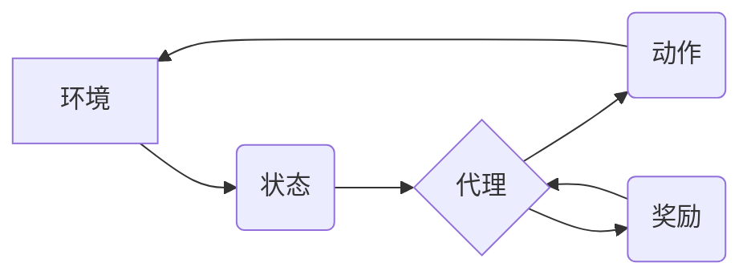

> AI Agent, 智能代理, 强化学习, 决策理论, 状态空间, 行动空间, 奖励函数, 策略

## 1. 背景介绍

在人工智能领域，智能代理 (AI Agent) 作为一种能够感知环境、做出决策并采取行动的智能体，扮演着至关重要的角色。从自动驾驶汽车到个性化推荐系统，AI 代理正在各个领域发挥着越来越重要的作用。

传统的代理模型主要基于规则或专家知识，但随着环境复杂度的增加，这种方法逐渐显得力不从心。近年来，基于机器学习的AI代理模型，特别是基于强化学习 (Reinforcement Learning, RL) 的模型，取得了显著的进展，展现出强大的学习和适应能力。

## 2. 核心概念与联系

**2.1 核心概念**

* **智能代理 (AI Agent):** 能够感知环境、做出决策并采取行动的智能体。
* **环境 (Environment):** 代理所处的外部世界，包括状态和奖励信号。
* **状态 (State):** 环境在特定时刻的描述，例如自动驾驶汽车的位置、速度和周围车辆信息。
* **动作 (Action):** 代理可以采取的行动，例如自动驾驶汽车加速、减速或转向。
* **奖励 (Reward):** 环境对代理动作的反馈，可以是正向奖励或负向惩罚。
* **策略 (Policy):** 代理根据当前状态选择动作的规则，可以是确定性策略或概率性策略。

**2.2 架构图**



**2.3 核心联系**

AI 代理通过感知环境的状态，选择合适的动作，并根据环境的奖励信号调整策略，最终实现目标。

## 3. 核心算法原理 & 具体操作步骤

**3.1 算法原理概述**

强化学习 (RL) 是一种机器学习方法，通过代理与环境的交互，学习最优的策略。RL 算法的核心思想是通过不断尝试和学习，最大化累积的奖励。

**3.2 算法步骤详解**

1. **初始化:** 设置代理的初始策略和学习参数。
2. **感知环境:** 代理感知环境当前的状态。
3. **选择动作:** 根据当前策略，代理选择一个动作。
4. **执行动作:** 代理执行选择的动作，并观察环境的变化。
5. **获得奖励:** 环境根据代理的动作提供奖励信号。
6. **更新策略:** 根据奖励信号，更新代理的策略，使其在未来能够选择更优的动作。
7. **重复步骤2-6:** 代理不断与环境交互，更新策略，直到达到预设的目标或终止条件。

**3.3 算法优缺点**

* **优点:**
    * 可以学习复杂环境中的最优策略。
    * 不需要明确的规则或专家知识。
    * 能够适应不断变化的环境。
* **缺点:**
    * 训练过程可能需要大量的时间和资源。
    * 容易陷入局部最优解。
    * 需要设计合适的奖励函数，否则可能导致代理学习到不期望的行为。

**3.4 算法应用领域**

* 自动驾驶
* 机器人控制
* 游戏人工智能
* 个性化推荐
* 金融交易

## 4. 数学模型和公式 & 详细讲解 & 举例说明

**4.1 数学模型构建**

我们可以用一个四元组 (S, A, R, γ) 来描述强化学习模型，其中：

* S: 状态空间，表示所有可能的环境状态。
* A: 动作空间，表示代理可以采取的所有动作。
* R: 奖励函数，将状态-动作对映射到奖励值。
* γ: 折扣因子，控制未来奖励的权重。

**4.2 公式推导过程**

强化学习的目标是找到一个策略 π，使得代理在与环境交互的过程中获得最大的累积奖励。

我们可以用价值函数 V(s) 来表示状态 s 的价值，即代理从状态 s 开始执行最优策略的预期累积奖励。

价值函数的更新公式为：

```latex
V(s) = \max_a \sum_{s'} P(s' | s, a) [R(s, a, s') + \gamma V(s')]
```

其中：

* a: 代理在状态 s 下采取的动作。
* s': 环境从状态 s 经过动作 a 之后到达的状态。
* P(s' | s, a): 从状态 s 执行动作 a 达到状态 s' 的概率。
* R(s, a, s'): 状态 s 下执行动作 a 达到状态 s' 的奖励。

**4.3 案例分析与讲解**

例如，在一个简单的迷宫环境中，代理的目标是找到通往出口的状态。我们可以将迷宫的状态空间定义为所有可能的迷宫位置，动作空间定义为向上、向下、向左、向右四个方向。

奖励函数可以设计为：

* 当代理到达出口时，奖励为 1。
* 当代理撞到墙壁时，奖励为 -1。
* 其他情况下，奖励为 0。

通过使用价值函数更新公式，代理可以学习到最优的路径，从而找到通往出口的路线。

## 5. 项目实践：代码实例和详细解释说明

**5.1 开发环境搭建**

* Python 3.x
* TensorFlow 或 PyTorch

**5.2 源代码详细实现**

```python
import tensorflow as tf

# 定义状态空间和动作空间
state_space = 4
action_space = 4

# 定义神经网络模型
model = tf.keras.Sequential([
    tf.keras.layers.Dense(128, activation='relu', input_shape=(state_space,)),
    tf.keras.layers.Dense(action_space, activation='softmax')
])

# 定义损失函数和优化器
loss_fn = tf.keras.losses.CategoricalCrossentropy()
optimizer = tf.keras.optimizers.Adam()

# 训练循环
for episode in range(num_episodes):
    state = env.reset()
    done = False
    while not done:
        # 选择动作
        action = model.predict(state.reshape(1, -1))[0]
        # 执行动作
        next_state, reward, done, _ = env.step(action)
        # 更新模型
        with tf.GradientTape() as tape:
            # 计算损失
            target = tf.one_hot(action, depth=action_space)
            loss = loss_fn(target, model.predict(state.reshape(1, -1)))
        # 反向传播
        gradients = tape.gradient(loss, model.trainable_variables)
        optimizer.apply_gradients(zip(gradients, model.trainable_variables))
        # 更新状态
        state = next_state

```

**5.3 代码解读与分析**

* 代码首先定义了状态空间和动作空间。
* 然后定义了一个神经网络模型，用于预测代理在每个状态下采取的动作。
* 训练循环中，代理与环境交互，根据环境的奖励信号更新模型的权重。
* 使用 TensorFlow 或 PyTorch 等深度学习框架可以实现更复杂的强化学习算法。

**5.4 运行结果展示**

训练完成后，代理可以根据学习到的策略与环境交互，并完成预设的任务。例如，在迷宫环境中，代理可以找到通往出口的路线。

## 6. 实际应用场景

**6.1 自动驾驶**

强化学习可以用于训练自动驾驶汽车，使其能够感知周围环境、做出安全合理的驾驶决策。

**6.2 机器人控制**

强化学习可以用于训练机器人完成各种任务，例如抓取物体、导航、组装等。

**6.3 游戏人工智能**

强化学习可以用于训练游戏人工智能，使其能够学习游戏规则并取得高分。

**6.4 个性化推荐**

强化学习可以用于个性化推荐系统，根据用户的行为历史推荐更符合用户偏好的内容。

**6.5 金融交易**

强化学习可以用于开发自动交易系统，根据市场数据做出交易决策。

## 7. 工具和资源推荐

**7.1 学习资源推荐**

* **书籍:**
    * Reinforcement Learning: An Introduction by Richard S. Sutton and Andrew G. Barto
    * Deep Reinforcement Learning Hands-On by Maxim Lapan
* **在线课程:**
    * Deep Reinforcement Learning Specialization by DeepLearning.AI
    * Reinforcement Learning by David Silver (University of DeepMind)

**7.2 开发工具推荐**

* **TensorFlow:** https://www.tensorflow.org/
* **PyTorch:** https://pytorch.org/
* **OpenAI Gym:** https://gym.openai.com/

**7.3 相关论文推荐**

* Deep Q-Network (DQN)
* Policy Gradient
* Proximal Policy Optimization (PPO)

## 8. 总结：未来发展趋势与挑战

**8.1 研究成果总结**

近年来，强化学习取得了显著的进展，在许多领域取得了成功应用。

**8.2 未来发展趋势**

* **更强大的算法:** 研究更强大的强化学习算法，能够解决更复杂的环境问题。
* **更有效的训练方法:** 研究更有效的训练方法，降低训练成本和时间。
* **更安全的代理:** 研究更安全的代理，能够在现实世界中安全可靠地运行。

**8.3 面临的挑战**

* **样本效率:** 强化学习算法通常需要大量的样本数据进行训练，这在现实世界中可能难以实现。
* **可解释性:** 强化学习模型的决策过程往往难以解释，这可能导致信任问题。
* **安全性和可靠性:** 强化学习代理在现实世界中的应用需要保证安全性和可靠性，这仍然是一个挑战。

**8.4 研究展望**

未来，强化学习将继续是人工智能领域的重要研究方向，并将在更多领域发挥重要作用。


## 9. 附录：常见问题与解答

**9.1 Q: 强化学习和监督学习有什么区别？**

**A:** 强化学习和监督学习都是机器学习方法，但它们的目标和训练方式不同。监督学习的目标是学习一个函数，将输入映射到输出，而强化学习的目标是学习一个策略，使得代理在与环境交互的过程中获得最大的累积奖励。

**9.2 Q: 强化学习的奖励函数如何设计？**

**A:** 奖励函数的设计是强化学习的关键，它决定了代理的行为目标。奖励函数应该能够准确地反映代理的行为目标，并能够引导代理学习到最优策略。

**9.3 Q: 强化学习的训练过程需要多长时间？**

**A:** 强化学习的训练时间取决于许多因素，例如环境复杂度、算法选择、训练数据量等。一般来说，训练时间可能需要几天、几周甚至几个月。


作者：禅与计算机程序设计艺术 / Zen and the Art of Computer Programming 
<end_of_turn>