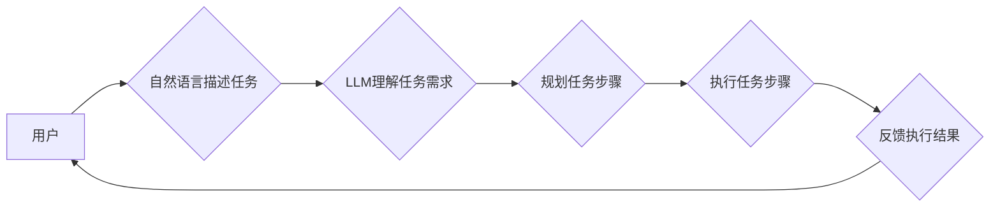

> AutoGPT, AI Agent, 自然语言处理, 自动化任务, 递归调用, 

## 1. 背景介绍

近年来，人工智能（AI）技术取得了飞速发展，特别是大语言模型（LLM）的出现，为AI应用带来了革命性的变革。LLM能够理解和生成人类语言，具备强大的文本处理能力，为构建更智能、更人性化的AI应用提供了基础。

然而，现有的LLM主要局限于文本生成、翻译等特定任务，缺乏执行复杂任务的能力。为了突破这一瓶颈，AutoGPT应运而生。AutoGPT是一种基于LLM的AI代理，它能够通过自然语言的需求描述执行自动化任务，并具备自我规划、决策和执行的能力。

## 2. 核心概念与联系

AutoGPT的核心概念是将AI代理的概念与LLM技术相结合。

**AI代理**是指能够感知环境、做出决策并执行行动的智能体。传统的AI代理通常需要复杂的编程和规则定义，而AutoGPT则通过LLM的自然语言理解能力，使得用户能够用自然语言描述任务需求，无需编写复杂的代码。

**LLM**（Large Language Model）是大规模语言模型，通过训练海量文本数据，能够理解和生成人类语言。AutoGPT利用LLM的文本处理能力，实现以下功能：

* **理解用户需求:**  AutoGPT能够理解用户用自然语言描述的任务需求。
* **规划任务步骤:**  AutoGPT能够根据任务需求，规划出执行任务所需的步骤。
* **执行任务步骤:**  AutoGPT能够调用外部工具和API，执行任务步骤。
* **反馈结果:**  AutoGPT能够将执行结果反馈给用户。

**AutoGPT的架构**



## 3. 核心算法原理 & 具体操作步骤

### 3.1  算法原理概述

AutoGPT的核心算法原理是基于递归调用LLM的思想。

当用户输入任务需求时，AutoGPT首先会使用LLM理解任务需求，然后根据任务需求规划出执行任务所需的步骤。每个步骤都可能是一个子任务，需要进一步分解。AutoGPT会递归地调用LLM，对每个子任务进行理解、规划和执行，直到完成所有子任务，最终完成整个任务。

### 3.2  算法步骤详解

1. **用户输入任务需求:** 用户使用自然语言描述需要执行的任务。
2. **LLM理解任务需求:** AutoGPT使用LLM对用户输入的任务需求进行理解，并将其转化为可执行的步骤。
3. **规划任务步骤:** AutoGPT根据任务需求，规划出执行任务所需的步骤。每个步骤可能是一个子任务，需要进一步分解。
4. **执行任务步骤:** AutoGPT调用外部工具和API，执行每个步骤。
5. **反馈执行结果:** AutoGPT将执行结果反馈给用户。

### 3.3  算法优缺点

**优点:**

* **易于使用:** 用户可以使用自然语言描述任务需求，无需编写复杂的代码。
* **可扩展性强:** AutoGPT可以轻松扩展到处理更复杂的任务，只需添加新的工具和API。
* **自主性强:** AutoGPT能够自我规划和执行任务，无需人工干预。

**缺点:**

* **依赖LLM性能:** AutoGPT的性能取决于LLM的性能，如果LLM的理解和生成能力不足，AutoGPT的执行效果也会受到影响。
* **安全风险:** AutoGPT能够调用外部工具和API，如果这些工具和API存在安全漏洞，可能会导致安全风险。
* **可解释性差:** AutoGPT的决策过程是基于LLM的内部机制，难以解释其决策逻辑。

### 3.4  算法应用领域

AutoGPT的应用领域非常广泛，包括：

* **自动化办公:** 自动化邮件回复、日程安排、文档处理等任务。
* **软件开发:** 自动生成代码、测试用例、文档等。
* **数据分析:** 自动收集、整理、分析数据。
* **客户服务:** 自动回答客户问题、提供技术支持。

## 4. 数学模型和公式 & 详细讲解 & 举例说明

AutoGPT的算法原理可以抽象为一个递归的决策过程，可以使用数学模型和公式来描述。

### 4.1  数学模型构建

假设任务T可以分解成多个子任务T1, T2, ..., Tn。每个子任务Ti都可以进一步分解成更小的子任务。AutoGPT的决策过程可以表示为一个树形结构，其中根节点是任务T，每个分支节点代表一个子任务，叶子节点代表最小的操作单元。

### 4.2  公式推导过程

AutoGPT的决策过程可以抽象为以下公式：

```latex
T = f(T1, T2, ..., Tn)
```

其中，f()是一个函数，代表AutoGPT根据子任务Ti的执行结果，决定下一步的行动。

### 4.3  案例分析与讲解

例如，假设用户想要完成一个任务“写一篇关于AutoGPT的文章”。AutoGPT可以将这个任务分解成以下子任务：

* T1: 搜集关于AutoGPT的信息
* T2: 撰写文章框架
* T3: 撰写文章内容
* T4: 修改和校对文章

AutoGPT会根据每个子任务的执行结果，决定下一步的行动。例如，如果T1执行成功，AutoGPT会执行T2，如果T2执行失败，AutoGPT会重新规划T2的执行步骤。

## 5. 项目实践：代码实例和详细解释说明

### 5.1  开发环境搭建

AutoGPT的开发环境需要包含以下软件：

* Python 3.8+
* PyTorch 或 TensorFlow
* OpenAI API

### 5.2  源代码详细实现

AutoGPT的源代码可以从GitHub上获取。

### 5.3  代码解读与分析

AutoGPT的源代码主要包含以下部分：

* **LLM接口:** 用于调用LLM模型，进行文本理解和生成。
* **任务规划模块:** 用于根据任务需求，规划出执行任务所需的步骤。
* **任务执行模块:** 用于调用外部工具和API，执行任务步骤。
* **结果反馈模块:** 用于将执行结果反馈给用户。

### 5.4  运行结果展示

AutoGPT的运行结果可以根据用户输入的任务需求而有所不同。

## 6. 实际应用场景

### 6.1  自动化办公

AutoGPT可以自动化办公中的许多任务，例如：

* 自动回复邮件
* 自动安排日程
* 自动整理文档

### 6.2  软件开发

AutoGPT可以帮助软件开发人员自动化代码生成、测试用例编写等任务，提高开发效率。

### 6.3  数据分析

AutoGPT可以帮助数据分析师自动收集、整理、分析数据，发现数据中的隐藏规律。

### 6.4  未来应用展望

AutoGPT的应用场景非常广泛，未来将会在更多领域得到应用，例如：

* **教育:** 自动生成个性化学习内容
* **医疗:** 自动诊断疾病、辅助医生治疗
* **金融:** 自动分析市场趋势、进行投资决策

## 7. 工具和资源推荐

### 7.1  学习资源推荐

* **AutoGPT官方文档:** https://github.com/Significant-Gravitas/Auto-GPT
* **OpenAI API文档:** https://platform.openai.com/docs/api-reference

### 7.2  开发工具推荐

* **Python:** https://www.python.org/
* **PyTorch:** https://pytorch.org/
* **TensorFlow:** https://www.tensorflow.org/

### 7.3  相关论文推荐

* **Language Models are Few-Shot Learners:** https://arxiv.org/abs/2005.14165
* **GPT-3: Language Models are Few-Shot Learners:** https://arxiv.org/abs/2005.14165

## 8. 总结：未来发展趋势与挑战

### 8.1  研究成果总结

AutoGPT代表了AI代理领域的新进展，它将LLM技术与自动化任务执行相结合，为构建更智能、更人性化的AI应用提供了新的思路。

### 8.2  未来发展趋势

未来，AutoGPT将会朝着以下方向发展：

* **更强大的LLM模型:** 更强大的LLM模型将使AutoGPT能够理解和执行更复杂的任务。
* **更丰富的工具和API:** 更丰富的工具和API将使AutoGPT能够处理更多类型的任务。
* **更强的自主性:** AutoGPT将能够更加自主地规划和执行任务，减少对人工干预的依赖。

### 8.3  面临的挑战

AutoGPT也面临着一些挑战，例如：

* **安全风险:** AutoGPT能够调用外部工具和API，如果这些工具和API存在安全漏洞，可能会导致安全风险。
* **可解释性差:** AutoGPT的决策过程是基于LLM的内部机制，难以解释其决策逻辑。
* **伦理问题:** AutoGPT的应用可能会引发一些伦理问题，例如数据隐私、算法偏见等。

### 8.4  研究展望

未来，研究者将继续探索AutoGPT的应用场景，并解决其面临的挑战，使其成为更安全、更可靠、更智能的AI代理。

## 9. 附录：常见问题与解答

### 9.1  AutoGPT需要哪些硬件资源？

AutoGPT的硬件资源需求取决于LLM模型的大小和任务的复杂度。一般来说，需要至少配备一个高性能CPU和GPU。

### 9.2  AutoGPT的开源代码在哪里可以找到？

AutoGPT的开源代码可以在GitHub上找到：https://github.com/Significant-Gravitas/Auto-GPT

### 9.3  AutoGPT是否可以用于商业用途？

AutoGPT的开源许可证允许其用于商业用途。

作者：禅与计算机程序设计艺术 / Zen and the Art of Computer Programming


<end_of_turn>