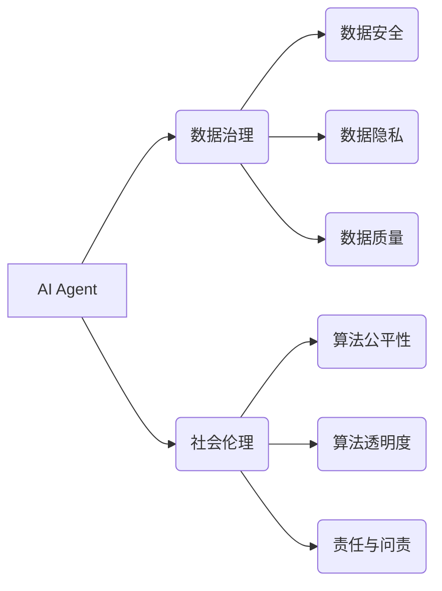

> AI Agent, 数据治理, 社会伦理, 知识图谱, 联邦学习, 隐私保护, 可解释性, 监管框架

## 1. 背景介绍

人工智能（AI）技术近年来发展迅速，从语音识别、图像识别到自然语言处理等领域取得了突破性进展。然而，随着AI技术的应用范围不断扩大，其带来的伦理和社会问题也日益凸显。如何确保AI技术的安全、可靠、公平和可解释性，以及如何有效地治理AI数据，成为全球范围内亟待解决的关键问题。

AI Agent作为AI技术的下一代发展方向，将赋予AI更强的自主性和适应性，使其能够在更复杂的环境中进行决策和行动。然而，AI Agent的强大能力也带来了新的挑战，例如：

* **数据安全和隐私保护:** AI Agent需要大量的数据进行训练和运行，这可能会导致数据泄露和隐私侵犯的风险。
* **算法偏见和歧视:** AI Agent的训练数据可能包含社会偏见，导致AI Agent产生歧视性决策，加剧社会不平等。
* **责任和问责:** 当AI Agent做出错误决策时，如何界定责任和进行问责？
* **透明度和可解释性:** AI Agent的决策过程往往是复杂的，难以理解，这可能会导致公众对AI技术的信任度下降。

## 2. 核心概念与联系

**2.1 AI Agent的概念**

AI Agent是一种能够感知环境、做出决策并采取行动的智能体。它通常由以下几个核心组件组成：

* **感知模块:** 用于收集环境信息，例如传感器数据、文本数据、图像数据等。
* **推理模块:** 用于分析环境信息，做出决策。
* **行动模块:** 用于执行决策，例如控制机器人的运动、发送邮件、生成文本等。

**2.2 数据治理与社会伦理**

数据治理是指对数据生命周期的各个阶段进行管理和控制，以确保数据的质量、安全性和合规性。社会伦理则关注AI技术对社会的影响，并提出相应的道德准则和规范。

AI Agent的应用需要结合数据治理和社会伦理的原则，才能确保其安全、可靠、公平和可解释。

**2.3 核心概念关系图**



## 3. 核心算法原理 & 具体操作步骤

**3.1 算法原理概述**

AI Agent的决策通常基于机器学习算法，例如强化学习、深度学习等。这些算法通过学习大量的训练数据，建立模型，并根据模型预测做出决策。

**3.2 算法步骤详解**

1. **数据收集和预处理:** 收集相关数据，并进行清洗、转换、特征提取等预处理操作。
2. **模型选择和训练:** 选择合适的机器学习算法，并根据训练数据进行模型训练。
3. **模型评估和优化:** 使用测试数据评估模型性能，并根据评估结果进行模型优化。
4. **部署和运行:** 将训练好的模型部署到实际应用场景中，并进行持续监控和维护。

**3.3 算法优缺点**

* **优点:**

    * 能够学习复杂的数据模式，并做出准确的预测。
    * 能够适应不断变化的环境，并不断改进决策。

* **缺点:**

    * 需要大量的训练数据，且数据质量对模型性能有很大影响。
    * 训练过程可能耗时和耗能。
    * 模型的决策过程往往是复杂的，难以理解。

**3.4 算法应用领域**

* **机器人控制:** 训练AI Agent控制机器人完成各种任务，例如导航、抓取、组装等。
* **自动驾驶:** 训练AI Agent感知道路环境，并做出驾驶决策。
* **医疗诊断:** 训练AI Agent分析医疗影像数据，辅助医生进行诊断。
* **金融风险管理:** 训练AI Agent识别金融风险，并进行风险控制。

## 4. 数学模型和公式 & 详细讲解 & 举例说明

**4.1 数学模型构建**

AI Agent的决策过程可以抽象为一个数学模型，其中：

* **状态空间:** 表示AI Agent所能处在的各种状态。
* **动作空间:** 表示AI Agent可以采取的各种动作。
* **奖励函数:** 用于评估AI Agent在不同状态下采取不同动作的奖励。

**4.2 公式推导过程**

强化学习算法的目标是找到一个策略，使得AI Agent在长期的互动过程中获得最大的总奖励。常用的强化学习算法包括Q学习、SARSA等。这些算法通过迭代更新策略参数，最终找到最优策略。

**4.3 案例分析与讲解**

例如，训练一个AI Agent玩游戏，我们可以将游戏状态表示为游戏棋盘的布局，动作表示为玩家可以采取的各种操作，奖励函数则表示玩家获得的分数。通过强化学习算法，AI Agent可以学习到最优策略，从而获得更高的分数。

## 5. 项目实践：代码实例和详细解释说明

**5.1 开发环境搭建**

可以使用Python语言和相关的机器学习库，例如TensorFlow、PyTorch等，搭建AI Agent的开发环境。

**5.2 源代码详细实现**

```python
# 这是一个简单的AI Agent代码示例

import random

class Agent:
    def __init__(self):
        self.state = None
        self.action_space = ['up', 'down', 'left', 'right']

    def perceive(self, state):
        self.state = state

    def act(self):
        action = random.choice(self.action_space)
        return action

# 使用示例
agent = Agent()
agent.perceive('initial_state')
action = agent.act()
print(f'Agent took action: {action}')
```

**5.3 代码解读与分析**

这个代码示例定义了一个简单的AI Agent类，它可以感知环境状态，并随机选择一个动作进行执行。

**5.4 运行结果展示**

运行代码后，会输出类似于以下的输出结果：

```
Agent took action: up
```

## 6. 实际应用场景

AI Agent在各个领域都有着广泛的应用场景，例如：

* **智能客服:** AI Agent可以模拟人类客服人员，与用户进行对话，解答问题，提供服务。
* **个性化推荐:** AI Agent可以根据用户的行为数据，推荐个性化的商品、服务或内容。
* **自动交易:** AI Agent可以根据市场数据，自动进行股票、期货等金融交易。

**6.4 未来应用展望**

随着AI技术的不断发展，AI Agent的应用场景将会更加广泛，例如：

* **医疗辅助:** AI Agent可以辅助医生进行诊断、治疗方案制定等工作。
* **教育辅助:** AI Agent可以提供个性化的学习辅导，帮助学生提高学习效率。
* **城市管理:** AI Agent可以帮助城市管理者优化交通流量、能源消耗等。

## 7. 工具和资源推荐

**7.1 学习资源推荐**

* **书籍:**
    * 《Reinforcement Learning: An Introduction》
    * 《Deep Learning》
* **在线课程:**
    * Coursera: Reinforcement Learning Specialization
    * Udacity: Deep Learning Nanodegree

**7.2 开发工具推荐**

* **TensorFlow:** 开源深度学习框架
* **PyTorch:** 开源深度学习框架
* **OpenAI Gym:** 强化学习环境库

**7.3 相关论文推荐**

* **Deep Reinforcement Learning with Double Q-learning**
* **Proximal Policy Optimization Algorithms**

## 8. 总结：未来发展趋势与挑战

**8.1 研究成果总结**

近年来，AI Agent领域取得了显著的进展，例如：

* 强化学习算法取得了突破性进展，能够解决更复杂的任务。
* 深度学习技术使得AI Agent能够处理更复杂的数据，并获得更高的性能。
* 联邦学习等技术使得AI Agent能够在保护数据隐私的前提下进行训练和运行。

**8.2 未来发展趋势**

* **更强大的AI Agent:** 未来AI Agent将更加智能、更加自主，能够在更复杂的环境中进行决策和行动。
* **更广泛的应用场景:** AI Agent将应用于更多领域，例如医疗、教育、城市管理等。
* **更安全的AI Agent:** 如何确保AI Agent的安全、可靠、公平和可解释性，将成为未来研究的重点。

**8.3 面临的挑战**

* **数据安全和隐私保护:** AI Agent的训练和运行需要大量的数据，如何保护数据安全和隐私，是一个重要的挑战。
* **算法偏见和歧视:** AI Agent的训练数据可能包含社会偏见，导致AI Agent产生歧视性决策，需要采取措施解决这个问题。
* **责任和问责:** 当AI Agent做出错误决策时，如何界定责任和进行问责？这是一个需要进一步探讨的问题。

**8.4 研究展望**

未来，AI Agent领域的研究将更加注重以下几个方面：

* **可解释性:** 如何使AI Agent的决策过程更加透明和可解释，提高公众对AI技术的信任度。
* **安全性:** 如何确保AI Agent的安全性和可靠性，防止其被恶意利用。
* **伦理规范:** 如何制定相应的伦理规范，引导AI Agent的健康发展。


## 9. 附录：常见问题与解答

**9.1 如何确保AI Agent的安全性和可靠性？**

* 使用安全的开发环境和工具。
* 对训练数据进行严格的清洗和预处理。
* 使用可靠的机器学习算法和模型。
* 对AI Agent的决策过程进行监控和评估。
* 定期更新AI Agent的模型和代码。

**9.2 如何解决AI Agent的算法偏见和歧视问题？**

* 使用更加公平和代表性的训练数据。
* 使用算法公平性评估指标，监测和评估模型的偏见。
* 开发算法去偏见的方法，例如数据重新加权、对抗训练等。

**9.3 如何界定AI Agent的责任和问责？**

这是一个复杂的问题，需要社会各界共同探讨和解决。

作者：禅与计算机程序设计艺术 / Zen and the Art of Computer Programming


<end_of_turn>