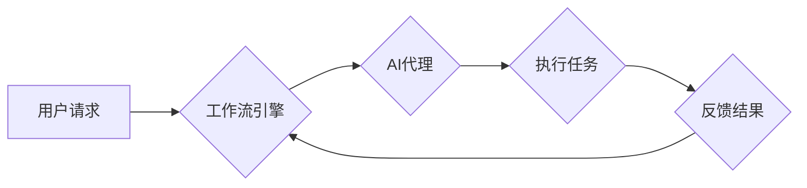

> AI代理，工作流，自动化，智能化，流程引擎，机器学习，自然语言处理

## 1. 背景介绍

在当今数字化时代，企业和组织面临着日益复杂的业务流程和任务。传统的手动处理方式效率低下，容易出错，难以满足快速变化的需求。人工智能（AI）技术的快速发展为解决这些问题提供了新的解决方案。AI代理作为一种智能化的自动化技术，能够自动执行预定义的业务流程，提高效率、降低成本，并释放人力资源用于更具创造性和战略性的工作。

AI代理的工作流（AI Agent WorkFlow）是指利用AI技术构建和管理自动化工作流程的系统。它将AI代理作为执行单元，通过定义规则、流程和决策逻辑，实现对业务流程的智能化控制和自动化执行。

## 2. 核心概念与联系

### 2.1 AI代理

AI代理是一种能够感知环境、做出决策并执行行动的智能体。它通常由以下几个核心组件组成：

* **感知模块:** 收集环境信息，例如数据、事件、用户输入等。
* **推理模块:** 分析感知到的信息，做出决策和计划行动。
* **执行模块:** 执行决策，与外部系统交互，完成任务。

### 2.2 工作流

工作流是一种描述业务流程的模型，它定义了任务、活动、数据流和控制逻辑。工作流引擎负责管理和执行工作流，确保流程的顺利进行。

### 2.3 AI代理工作流

AI代理工作流将AI代理与工作流引擎结合起来，实现对业务流程的智能化自动化。

**AI代理工作流架构**



## 3. 核心算法原理 & 具体操作步骤

### 3.1  算法原理概述

AI代理工作流的核心算法通常基于以下几个方面：

* **规则引擎:** 根据预定义的规则，判断AI代理应该执行哪些操作。
* **机器学习:** 利用机器学习算法，从历史数据中学习，改进AI代理的决策和执行能力。
* **自然语言处理:** 理解和处理用户自然语言输入，引导AI代理执行相应的任务。

### 3.2  算法步骤详解

1. **定义工作流:** 使用工作流设计工具，定义业务流程的各个步骤、任务和数据流。
2. **配置AI代理:** 为每个步骤配置相应的AI代理，并定义代理的感知模块、推理模块和执行模块。
3. **训练机器学习模型:** 如果需要使用机器学习算法，需要先训练模型，使其能够准确地识别和处理相关数据。
4. **部署工作流引擎:** 将工作流引擎部署到生产环境中，并连接到相应的系统和数据源。
5. **启动工作流:** 当用户触发工作流时，工作流引擎会启动相应的AI代理，执行预定义的步骤。
6. **监控和优化:** 持续监控AI代理的工作状态和执行效果，并根据需要调整规则、模型和配置，优化工作流的性能。

### 3.3  算法优缺点

**优点:**

* **自动化:** 自动化执行重复性任务，提高效率。
* **智能化:** 利用AI技术，提高决策和执行的准确性和效率。
* **可扩展性:** 可以根据需要灵活扩展工作流和AI代理。
* **可维护性:** 工作流定义清晰，易于维护和修改。

**缺点:**

* **开发成本:** 开发AI代理工作流需要一定的技术和资源投入。
* **数据依赖:** AI代理的性能依赖于训练数据的质量。
* **安全风险:** AI代理可能存在安全漏洞，需要采取相应的安全措施。

### 3.4  算法应用领域

AI代理工作流广泛应用于以下领域:

* **客户服务:** 自动化处理客户咨询、投诉和订单等任务。
* **金融服务:** 自动化处理贷款申请、风险评估和交易结算等任务。
* **医疗保健:** 自动化处理病历记录、预约挂号和诊断分析等任务。
* **制造业:** 自动化处理生产计划、设备监控和质量控制等任务。

## 4. 数学模型和公式 & 详细讲解 & 举例说明

### 4.1  数学模型构建

AI代理工作流的数学模型通常基于状态机和决策树等模型。

* **状态机:** 描述AI代理在不同状态下执行的动作和状态转换规则。
* **决策树:** 描述AI代理根据输入信息做出决策的逻辑关系。

### 4.2  公式推导过程

例如，在客户服务领域，AI代理可以根据用户输入的自然语言，识别用户意图，并根据预定义的规则，选择相应的回复。

假设用户输入的自然语言为“我想查询我的订单状态”。

AI代理可以利用自然语言处理技术，识别用户意图为“查询订单状态”。

然后，AI代理可以根据预定义的规则，查询数据库，获取用户的订单状态信息，并返回相应的回复。

### 4.3  案例分析与讲解

例如，在金融服务领域，AI代理可以根据用户的风险偏好和投资目标，自动构建投资组合，并进行定期调整。

AI代理可以利用机器学习算法，从历史数据中学习，识别不同风险偏好和投资目标的用户群体，并构建相应的投资组合策略。

然后，AI代理可以根据用户的实时资产情况和市场变化，自动调整投资组合，以实现用户的投资目标。

## 5. 项目实践：代码实例和详细解释说明

### 5.1  开发环境搭建

* 操作系统: Ubuntu 20.04
* Python 版本: 3.8
* 依赖库:

    * Flask: Web框架
    * NLTK: 自然语言处理库
    * scikit-learn: 机器学习库

### 5.2  源代码详细实现

```python
from flask import Flask, request, jsonify
from nltk.tokenize import word_tokenize
from sklearn.linear_model import LogisticRegression

app = Flask(__name__)

# 训练数据
training_data = [
    ("查询订单状态", "订单查询"),
    ("退货申请", "退货申请"),
    ("投诉问题", "投诉处理"),
]

# 训练模型
model = LogisticRegression()
X = [word_tokenize(text) for text, label in training_data]
y = [label for text, label in training_data]
model.fit(X, y)

@app.route('/api/intent', methods=['POST'])
def intent_recognition():
    data = request.get_json()
    user_input = data['text']
    tokens = word_tokenize(user_input)
    prediction = model.predict([tokens])[0]
    return jsonify({'intent': prediction})

if __name__ == '__main__':
    app.run(debug=True)
```

### 5.3  代码解读与分析

* **数据预处理:** 使用NLTK库对用户输入进行分词，将文本转换为词向量。
* **模型训练:** 使用scikit-learn库的LogisticRegression模型，训练意图识别模型。
* **API接口:** 使用Flask框架构建API接口，接收用户输入，并返回识别出的意图。

### 5.4  运行结果展示

当用户向API接口发送“查询订单状态”的请求时，API接口会识别出用户的意图为“订单查询”，并返回相应的回复。

## 6. 实际应用场景

### 6.1  客户服务

AI代理可以自动处理客户咨询、投诉和订单等任务，提高客户服务效率，降低人工成本。

### 6.2  金融服务

AI代理可以自动处理贷款申请、风险评估和交易结算等任务，提高金融服务效率，降低风险。

### 6.3  医疗保健

AI代理可以自动处理病历记录、预约挂号和诊断分析等任务，提高医疗服务效率，降低医疗成本。

### 6.4  未来应用展望

随着AI技术的不断发展，AI代理工作流将在更多领域得到应用，例如教育、娱乐、交通等。

## 7. 工具和资源推荐

### 7.1  学习资源推荐

* **书籍:**

    * 《人工智能：一种现代方法》
    * 《深度学习》

* **在线课程:**

    * Coursera: 人工智能
    * edX: 深度学习

### 7.2  开发工具推荐

* **工作流引擎:**

    * Apache Airflow
    * Camunda

* **AI平台:**

    * Google AI Platform
    * Amazon SageMaker

### 7.3  相关论文推荐

* **论文:**

    * 《Reinforcement Learning: An Introduction》
    * 《Deep Learning》

## 8. 总结：未来发展趋势与挑战

### 8.1  研究成果总结

AI代理工作流技术取得了显著的进展，在多个领域得到了应用。

### 8.2  未来发展趋势

* **更智能的AI代理:** 利用更先进的AI算法，提高AI代理的决策和执行能力。
* **更灵活的工作流:** 支持更复杂的业务逻辑和动态调整。
* **更安全的AI代理:** 加强AI代理的安全防护，防止恶意攻击。

### 8.3  面临的挑战

* **数据质量:** AI代理的性能依赖于训练数据的质量。
* **模型解释性:** 难以解释AI代理的决策过程，导致信任问题。
* **伦理问题:** AI代理可能存在偏见和歧视问题，需要进行伦理规范的制定和监管。

### 8.4  研究展望

未来，AI代理工作流技术将继续发展，并应用于更多领域，为人类社会带来更多便利和价值。

## 9. 附录：常见问题与解答

### 9.1  常见问题

* **AI代理工作流和传统工作流有什么区别？**

* **如何训练AI代理？**

* **如何保证AI代理的安全？**

### 9.2  解答

* **AI代理工作流和传统工作流的区别:**

传统工作流是基于规则和流程定义的，而AI代理工作流则利用AI技术，能够根据环境变化和用户需求进行智能化调整。

* **如何训练AI代理:**

需要准备训练数据，并使用机器学习算法训练AI代理模型。

* **如何保证AI代理的安全:**

需要采取相应的安全措施，例如身份验证、数据加密和安全审计。


作者：禅与计算机程序设计艺术 / Zen and the Art of Computer Programming 
<end_of_turn>