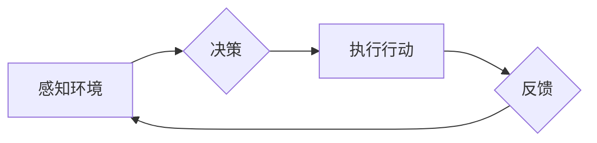

> AI代理，工作流，智能交通，交通管理，路径规划，机器学习，深度学习

## 1. 背景介绍

随着城市化进程的加速和人口的不断增长，交通拥堵问题日益突出，给人们的生活和经济发展带来了巨大的压力。传统的交通管理模式难以有效应对日益复杂的交通环境，因此，智能交通系统 (ITS) 应运而生。智能交通系统利用先进的传感器、通信技术和人工智能技术，对交通流量进行实时监测和分析，并根据分析结果，对交通信号灯、车辆导航等进行智能控制，以优化交通流量，缓解拥堵，提高交通效率。

在智能交通系统中，人工智能代理 (AI Agent) 作为一种重要的智能实体，能够自主学习、决策和执行任务，在交通管理中发挥着越来越重要的作用。AI代理可以根据实时路况信息，规划最优的路径，避免交通拥堵；可以根据交通信号灯的控制策略，优化车辆的通行速度；还可以根据驾驶员的行为模式，提供个性化的驾驶建议。

## 2. 核心概念与联系

**2.1 AI代理 (AI Agent)**

AI代理是一种能够感知环境、做出决策并执行行动的智能实体。它通常由以下几个核心组件组成：

* **感知模块:** 用于获取环境信息，例如道路状况、交通流量、车辆位置等。
* **决策模块:** 用于根据感知到的环境信息，制定最优的行动策略。
* **执行模块:** 用于执行决策模块制定的行动，例如控制车辆方向、速度等。

**2.2 工作流 (Workflow)**

工作流是一种描述业务流程的模型，它将一系列任务按照一定的顺序和逻辑关系连接起来，形成一个完整的业务流程。在智能交通系统中，AI代理的工作流可以描述AI代理在不同场景下执行的任务，例如：

* **路径规划工作流:** AI代理根据实时路况信息，规划最优的路径，避免交通拥堵。
* **交通信号灯控制工作流:** AI代理根据交通流量情况，优化交通信号灯的控制策略，提高车辆通行效率。
* **驾驶辅助工作流:** AI代理根据驾驶员的行为模式，提供个性化的驾驶建议，例如提醒驾驶员注意安全、避免疲劳驾驶等。

**2.3 AI代理工作流 (AI Agent Workflow)**

AI代理工作流将AI代理和工作流的概念结合起来，描述AI代理在智能交通系统中执行任务的流程。它可以将AI代理的感知、决策和执行过程，以及与其他系统和组件的交互过程，以图形化的方式进行描述，方便理解和管理。

**2.4 Mermaid 流程图**



## 3. 核心算法原理 & 具体操作步骤

**3.1 算法原理概述**

AI代理工作流的实现需要依赖于多种算法，例如路径规划算法、交通信号灯控制算法、机器学习算法等。这些算法的原理和实现方式，直接影响到AI代理的工作效率和决策质量。

**3.2 算法步骤详解**

* **路径规划算法:**

    1. **构建路网图:** 将道路网络表示为图结构，其中节点代表道路交叉口，边代表道路连接。
    2. **定义目标:** 设置AI代理的目标位置，例如目的地、最近的加油站等。
    3. **搜索最优路径:** 使用路径规划算法，例如 Dijkstra 算法、A* 算法等，从起点到目标位置搜索最优路径。
    4. **路径优化:** 根据实时路况信息，对搜索到的路径进行优化，例如避开拥堵路段、选择更短的路径等。

* **交通信号灯控制算法:**

    1. **收集交通流量数据:** 使用传感器收集道路上的车辆流量数据。
    2. **分析交通流量:** 使用机器学习算法，例如回归模型、分类模型等，分析交通流量的趋势和模式。
    3. **优化信号灯控制策略:** 根据分析结果，调整交通信号灯的绿灯时间、红灯时间等，以优化交通流量。

* **机器学习算法:**

    1. **数据收集:** 收集驾驶员的行为数据，例如驾驶速度、转向角度、刹车距离等。
    2. **数据预处理:** 对收集到的数据进行清洗、转换等预处理操作。
    3. **模型训练:** 使用机器学习算法，例如深度神经网络、支持向量机等，训练驾驶行为预测模型。
    4. **模型评估:** 使用测试数据评估模型的性能，例如准确率、召回率等。

**3.3 算法优缺点**

* **路径规划算法:**

    * **优点:** 可以快速找到最优路径，提高车辆通行效率。
    * **缺点:** 难以应对动态路况变化，例如突发事故、道路施工等。

* **交通信号灯控制算法:**

    * **优点:** 可以优化交通流量，缓解拥堵。
    * **缺点:** 需要大量的传感器数据支持，部署成本较高。

* **机器学习算法:**

    * **优点:** 可以学习驾驶员的行为模式，提供个性化的驾驶建议。
    * **缺点:** 需要大量的训练数据，模型训练时间较长。

**3.4 算法应用领域**

* **路径规划算法:** 导航系统、无人驾驶汽车、物流配送等。
* **交通信号灯控制算法:** 智能交通信号灯、交通流量管理等。
* **机器学习算法:** 驾驶辅助系统、车辆安全监测等。

## 4. 数学模型和公式 & 详细讲解 & 举例说明

**4.1 数学模型构建**

在智能交通系统中，可以使用数学模型来描述交通流量、车辆速度、信号灯控制策略等。例如，可以使用以下数学模型来描述交通流量：

* **流量密度:**  ρ = N/L，其中 N 为车辆数量，L 为道路长度。
* **流量速度:** v = Q/ρ，其中 Q 为流量，ρ 为流量密度。

**4.2 公式推导过程**

交通流量的模型可以进一步推导，例如，可以使用卡曼滤波算法来估计车辆位置和速度，可以使用马尔科夫决策过程来优化交通信号灯控制策略。

**4.3 案例分析与讲解**

例如，可以使用交通流量模型来分析交通拥堵的原因，并根据分析结果，提出相应的缓解措施。例如，如果分析结果表明，某个路段的流量密度过高，则可以考虑增加道路容量、优化交通信号灯控制策略等。

## 5. 项目实践：代码实例和详细解释说明

**5.1 开发环境搭建**

* 操作系统: Ubuntu 20.04 LTS
* Python 版本: 3.8.10
* 必要的库: numpy, pandas, matplotlib, scikit-learn

**5.2 源代码详细实现**

```python
import numpy as np
from sklearn.linear_model import LinearRegression

# 训练数据
X = np.array([[10, 20], [15, 30], [20, 40], [25, 50]])
y = np.array([12, 18, 24, 30])

# 创建线性回归模型
model = LinearRegression()

# 训练模型
model.fit(X, y)

# 预测新的数据
new_data = np.array([[30, 60]])
prediction = model.predict(new_data)

# 打印预测结果
print(f"预测结果: {prediction}")
```

**5.3 代码解读与分析**

这段代码演示了如何使用 scikit-learn 库中的线性回归模型来预测交通流量。

* 首先，定义训练数据 X 和目标变量 y。
* 然后，创建线性回归模型实例。
* 使用 `fit()` 方法训练模型，将训练数据输入模型。
* 使用 `predict()` 方法预测新的数据。
* 最后，打印预测结果。

**5.4 运行结果展示**

运行这段代码后，会输出预测结果，例如：

```
预测结果: [36.]
```

这表示，当车辆数量为 30 辆，道路长度为 60 米时，预测的流量为 36 辆/分钟。

## 6. 实际应用场景

**6.1 智能交通信号灯控制**

AI代理可以根据实时交通流量数据，优化交通信号灯的控制策略，例如，在高峰时段延长绿灯时间，在非高峰时段缩短绿灯时间，以提高交通流量效率。

**6.2 自动驾驶汽车路径规划**

AI代理可以根据实时路况信息，规划最优的路径，避免交通拥堵，提高自动驾驶汽车的安全性。

**6.3 交通拥堵预测与预警**

AI代理可以根据历史交通数据和实时路况信息，预测未来交通拥堵情况，并向驾驶员发出预警，帮助驾驶员避开拥堵路段。

**6.4 未来应用展望**

随着人工智能技术的不断发展，AI代理在智能交通领域的应用将更加广泛和深入。例如，未来可能出现：

* **个性化交通服务:** AI代理可以根据驾驶员的出行习惯和需求，提供个性化的交通服务，例如推荐最佳路线、预订停车位等。
* **智能交通管理平台:** AI代理可以集成到智能交通管理平台中，实现对整个交通系统的实时监控和管理。
* **无人驾驶交通系统:** AI代理将成为无人驾驶交通系统的核心组成部分，负责车辆的路径规划、决策和执行。

## 7. 工具和资源推荐

**7.1 学习资源推荐**

* **书籍:**
    * 《人工智能：现代方法》
    * 《深度学习》
    * 《机器学习》
* **在线课程:**
    * Coursera: 人工智能课程
    * edX: 深度学习课程
    * Udacity: 机器学习工程师课程

**7.2 开发工具推荐**

* **Python:** 广泛应用于人工智能开发，拥有丰富的库和框架。
* **TensorFlow:** Google 开发的深度学习框架。
* **PyTorch:** Facebook 开发的深度学习框架。
* **OpenCV:** 图像处理和计算机视觉库。

**7.3 相关论文推荐**

* **Deep Reinforcement Learning for Autonomous Driving**
* **Traffic Flow Prediction Using Deep Learning**
* **A Survey of AI-Based Traffic Management Systems**

## 8. 总结：未来发展趋势与挑战

**8.1 研究成果总结**

AI代理在智能交通领域的应用取得了显著的成果，例如，在交通信号灯控制、路径规划、交通拥堵预测等方面取得了突破。

**8.2 未来发展趋势**

未来，AI代理在智能交通领域的应用将更加广泛和深入，例如，将应用于无人驾驶汽车、智能交通管理平台、个性化交通服务等领域。

**8.3 面临的挑战**

* **数据安全和隐私保护:** AI代理需要大量的数据进行训练和运行，如何保证数据的安全和隐私保护是一个重要的挑战。
* **算法鲁棒性和安全性:** AI代理的算法需要能够应对复杂和动态的交通环境，保证算法的鲁棒性和安全性。
* **伦理和法律问题:** AI代理的应用可能会带来一些伦理和法律问题，例如，责任归属、算法偏见等，需要进行深入的探讨和研究。

**8.4 研究展望**

未来，需要进一步研究AI代理在智能交通领域的应用，例如，开发更鲁棒、更安全的算法，解决数据安全和隐私保护问题，探讨AI代理的伦理和法律问题。


## 9. 附录：常见问题与解答

**9.1 如何选择合适的AI代理工作流模型？**

选择合适的AI代理工作流模型需要根据具体的应用场景和需求进行考虑。例如，对于路径规划问题，可以使用 Dijkstra 算法或 A* 算法；对于交通信号灯控制问题，可以使用马尔科夫决策过程或强化学习算法。

**9.2 如何保证AI代理的安全性？**

保证AI代理的安全性需要从多个方面进行考虑，例如：

* 使用安全的算法和