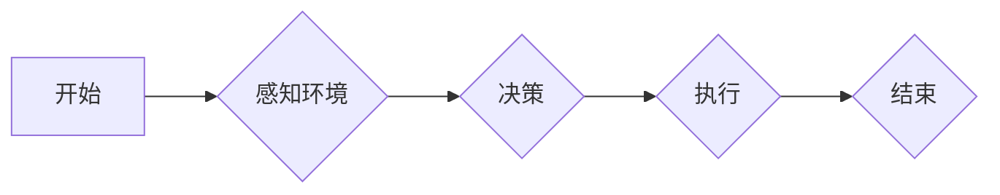

> AI代理，工作流，游戏设计，人工智能，游戏开发，游戏机制，玩家体验

## 1. 背景介绍

游戏行业近年来蓬勃发展，玩家对游戏体验的要求也越来越高。传统的游戏设计模式难以满足玩家个性化需求和不断变化的游戏环境。人工智能（AI）技术作为一种强大的工具，为游戏设计带来了新的可能性。其中，AI代理工作流（AI Agent WorkFlow）作为一种新的游戏设计理念，正在逐渐受到关注。

AI代理工作流是指利用人工智能技术，构建能够自主学习、决策和执行任务的虚拟代理，并通过工作流机制，将这些代理的行动串联起来，形成一个完整的游戏流程。这种设计模式能够为游戏带来以下优势：

* **增强游戏沉浸感：** AI代理能够模拟人类的行为模式，与玩家进行更自然的互动，提升游戏沉浸感。
* **提高游戏可玩性：** AI代理可以根据玩家的行为和游戏状态进行动态调整，提供更具挑战性和趣味性的游戏体验。
* **降低游戏开发成本：** AI代理可以自动化完成一些重复性的游戏任务，例如NPC对话、场景生成等，降低游戏开发成本。
* **实现游戏内容的动态更新：** AI代理可以根据玩家反馈和游戏数据进行学习和进化，实现游戏内容的动态更新，延长游戏的生命周期。

## 2. 核心概念与联系

### 2.1 AI代理

AI代理是指能够自主学习、决策和执行任务的虚拟角色。它通常由以下几个部分组成：

* **感知模块：**负责收集游戏环境的信息，例如玩家位置、游戏状态等。
* **决策模块：**根据感知到的信息，做出相应的决策，例如移动方向、攻击目标等。
* **执行模块：**执行决策，控制角色的行为，例如移动、攻击、对话等。

### 2.2 工作流

工作流是一种用于描述和管理业务流程的模型。它将业务流程分解成一系列的步骤，并定义了每个步骤之间的关系。在游戏设计中，工作流可以用来描述AI代理的行为序列，例如NPC的对话流程、任务的完成流程等。

### 2.3 AI代理工作流

AI代理工作流将AI代理和工作流的概念结合起来，构建了一个能够自主执行任务的虚拟代理系统。它将AI代理作为工作流中的执行者，通过工作流的定义，控制AI代理的行为序列，实现游戏中的各种功能。

**Mermaid 流程图**



## 3. 核心算法原理 & 具体操作步骤

### 3.1 算法原理概述

AI代理工作流的核心算法通常基于以下几个方面：

* **状态机：**状态机是一种用于描述系统状态和状态转换的模型。AI代理的工作流程可以被表示为一个状态机，每个状态代表一个特定的行为模式，状态转换则代表行为的切换。
* **行为树：**行为树是一种树形结构，用于表示AI代理的行为决策树。每个节点代表一个行为，叶子节点代表具体的行动。行为树可以根据游戏状态和玩家行为进行动态选择，实现更灵活的行为决策。
* **强化学习：**强化学习是一种机器学习算法，通过奖励和惩罚机制，训练AI代理学习最佳的行为策略。在游戏设计中，可以利用强化学习训练AI代理，使其能够根据游戏环境和玩家行为做出更智能的决策。

### 3.2 算法步骤详解

1. **环境感知：**AI代理首先需要感知游戏环境，收集玩家位置、游戏状态等信息。
2. **状态转换：**根据感知到的信息，AI代理根据状态机或行为树的规则，进行状态转换，选择相应的行为模式。
3. **行为决策：**AI代理根据当前状态，选择具体的行动，例如移动、攻击、对话等。
4. **行为执行：**AI代理执行决策，控制角色的行为，并反馈游戏环境。
5. **奖励机制：**根据AI代理的行为结果，给予相应的奖励或惩罚，用于强化学习算法的训练。

### 3.3 算法优缺点

**优点：**

* **智能化：**AI代理能够自主学习和决策，提升游戏智能化程度。
* **可扩展性：**AI代理工作流可以灵活扩展，支持多种游戏类型和功能。
* **可定制化：**游戏开发者可以根据游戏需求，定制AI代理的行为模式和工作流程。

**缺点：**

* **复杂性：**AI代理工作流的开发和维护相对复杂，需要专业的技术人员。
* **计算资源：**AI代理的运行需要一定的计算资源，可能会对游戏性能造成影响。
* **伦理问题：**AI代理的智能化可能会引发伦理问题，例如AI代理的决策是否符合人类道德规范。

### 3.4 算法应用领域

AI代理工作流在游戏设计领域有着广泛的应用，例如：

* **NPC行为设计：**模拟NPC的对话、行动和决策，提升游戏沉浸感。
* **任务设计：**构建动态的任务流程，根据玩家行为进行调整，提供更具挑战性和趣味性的游戏体验。
* **游戏世界生成：**利用AI代理生成游戏场景、物品和事件，实现游戏世界的动态更新。
* **游戏平衡设计：**通过AI代理模拟玩家行为，分析游戏平衡性，进行调整和优化。

## 4. 数学模型和公式 & 详细讲解 & 举例说明

### 4.1 数学模型构建

AI代理工作流的数学模型通常基于状态机、行为树或强化学习算法。

**状态机模型：**

状态机可以用状态转移图表示，其中每个状态代表一个特定的行为模式，状态转换则代表行为的切换。状态转移的条件可以由数学公式表示，例如：

```
状态转换条件 = 条件表达式
```

**行为树模型：**

行为树可以用树形结构表示，每个节点代表一个行为，叶子节点代表具体的行动。行为树的决策规则可以由数学公式表示，例如：

```
选择行为 = argmax(行为得分)
```

**强化学习模型：**

强化学习模型通常使用Bellman方程来更新价值函数，例如：

```
V(s) = max_a [R(s, a) + γ * V(s')]
```

其中：

* V(s) 是状态s的价值函数
* R(s, a) 是在状态s执行动作a得到的奖励
* γ 是折扣因子
* V(s') 是状态s'的价值函数

### 4.2 公式推导过程

公式推导过程根据具体的数学模型而有所不同。例如，状态机模型的公式推导过程主要涉及状态转移条件的定义和验证，行为树模型的公式推导过程主要涉及行为得分计算和最大化选择，强化学习模型的公式推导过程主要涉及Bellman方程的迭代更新。

### 4.3 案例分析与讲解

**案例：NPC对话设计**

可以使用状态机模型设计NPC的对话流程。例如，一个简单的NPC对话流程可以定义如下：

* **状态1：初始状态**

  * 条件：NPC刚进入游戏场景
  * 行为：向玩家打招呼

* **状态2：询问状态**

  * 条件：玩家询问NPC问题
  * 行为：回答玩家问题

* **状态3：告别状态**

  * 条件：玩家离开NPC附近
  * 行为：向玩家告别

**公式：**

```
状态转换条件 = 条件表达式
```

例如，从状态1到状态2的转换条件可以定义为：

```
玩家询问问题
```

## 5. 项目实践：代码实例和详细解释说明

### 5.1 开发环境搭建

* 操作系统：Windows/macOS/Linux
* 编程语言：Python
* 开发工具：PyCharm/VS Code
* 游戏引擎：Unity/Unreal Engine

### 5.2 源代码详细实现

```python
class NPC:
    def __init__(self, name, state):
        self.name = name
        self.state = state

    def update(self, player):
        if self.state == "初始状态":
            if player.distance < 5:
                print(f"{self.name}: 您好，欢迎来到这里！")
                self.state = "询问状态"
        elif self.state == "询问状态":
            if player.ask_question():
                print(f"{self.name}: {self.answer_question()}")
            else:
                print(f"{self.name}: 没什么事，再见！")
                self.state = "告别状态"
        elif self.state == "告别状态":
            if player.distance > 10:
                print(f"{self.name}: 再见！")

# 示例使用
npc = NPC("小明", "初始状态")
player = Player()

while True:
    npc.update(player)
```

### 5.3 代码解读与分析

* `NPC` 类定义了NPC的基本属性和行为。
* `update()` 方法根据NPC当前状态和玩家行为，更新NPC的状态和行为。
* `Player` 类定义了玩家的基本属性和行为，例如距离、询问问题等。
* 主循环不断更新NPC的状态和行为，模拟NPC与玩家的互动。

### 5.4 运行结果展示

当玩家靠近NPC时，NPC会打招呼；当玩家询问问题时，NPC会回答问题；当玩家离开NPC时，NPC会告别。

## 6. 实际应用场景

### 6.1 游戏NPC设计

AI代理工作流可以用于设计更智能、更具互动性的游戏NPC。例如，可以训练AI代理模拟不同性格的NPC，例如友善、凶恶、狡猾等，并根据玩家行为进行动态调整，提供更丰富的游戏体验。

### 6.2 游戏任务设计

AI代理工作流可以用于设计更动态、更具挑战性的游戏任务。例如，可以利用AI代理根据玩家行为和游戏状态，动态调整任务目标和难度，提供更个性化的游戏体验。

### 6.3 游戏世界生成

AI代理工作流可以用于生成更丰富、更具随机性的游戏世界。例如，可以利用AI代理生成游戏场景、物品和事件，并根据玩家行为进行动态更新，实现游戏世界的动态变化。

### 6.4 未来应用展望

AI代理工作流在游戏设计领域还有很大的发展潜力，未来可能应用于以下方面：

* **更智能的AI敌人：**AI代理可以学习玩家的战斗策略，并根据玩家行为进行动态调整，提供更具挑战性的战斗体验。
* **更沉浸式的游戏世界：**AI代理可以模拟更复杂的社会关系和文化现象，构建更沉浸式的游戏世界。
* **更个性化的游戏体验：**AI代理可以根据玩家的喜好和行为，定制游戏内容和游戏流程，提供更个性化的游戏体验。

## 7. 工具和资源推荐

### 7.1 学习资源推荐

* **书籍：**
    * 《人工智能：现代方法》
    * 《深度学习》
    * 《游戏人工智能》
* **在线课程：**
    * Coursera：人工智能课程
    * Udacity：深度学习课程
    * edX：游戏人工智能课程

### 7.2 开发工具推荐

* **游戏引擎：**
    * Unity
    * Unreal Engine
* **AI开发框架：**
    * TensorFlow
    * PyTorch
    * OpenAI Gym

### 7.3 相关论文推荐

* **Reinforcement Learning: An Introduction**
* **Deep Reinforcement Learning**
* **Procedural Content Generation in Games**

## 8. 总结：未来发展趋势与挑战

### 8.1 研究成果总结

AI代理工作流在游戏设计领域取得了显著的成果，为游戏设计带来了新的可能性。它能够提升游戏智能化程度、可玩性和沉浸感，并降低游戏开发成本。

### 8.2 未来发展趋势

未来，AI代理工作流的发展趋势包括：

* **更智能的AI代理：**利用更先进的AI算法，训练更智能的AI代理，使其能够更好地理解玩家行为