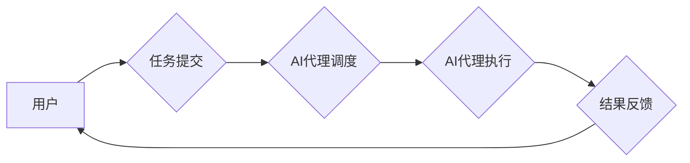

> AI代理，工作流，智能任务处理，流程自动化，机器学习，自然语言处理

## 1. 背景介绍

在当今数字化时代，企业和组织面临着日益复杂的业务流程和任务处理需求。传统的手动处理方式效率低下，容易出错，难以满足快速变化的市场环境。人工智能（AI）技术的快速发展为智能化任务处理提供了新的解决方案。

AI代理（AI Agent）作为一种智能化的软件实体，能够自主地感知环境、理解任务、制定计划并执行操作，从而自动化处理各种复杂的任务。AI代理工作流（AI Agent WorkFlow）则是将多个AI代理集成到一个协同工作流程中，实现更复杂、更智能的任务处理。

## 2. 核心概念与联系

**2.1 AI代理（AI Agent）**

AI代理是一种能够感知环境、理解任务、制定计划并执行操作的智能软件实体。它通常具有以下特征：

* **自主性:** AI代理能够独立地执行任务，无需人工干预。
* **智能性:** AI代理能够使用机器学习、自然语言处理等技术，理解和处理复杂的信息。
* **交互性:** AI代理能够与用户、其他代理或外部系统进行交互。

**2.2 工作流（Workflow）**

工作流是一种描述业务流程的模型，它定义了任务的顺序、依赖关系和执行规则。工作流可以帮助企业自动化流程，提高效率和准确性。

**2.3 AI代理工作流（AI Agent WorkFlow）**

AI代理工作流将AI代理集成到工作流中，实现智能化任务处理。它将多个AI代理按照特定的顺序和规则连接起来，形成一个协同工作流程。

**2.4 架构图**



## 3. 核心算法原理 & 具体操作步骤

**3.1 算法原理概述**

AI代理工作流的核心算法通常包括以下几个方面：

* **任务分解:** 将复杂的业务任务分解成多个小的、可执行的任务。
* **代理选择:** 根据任务类型和代理能力，选择合适的AI代理执行任务。
* **任务调度:** 根据任务依赖关系和代理可用性，调度AI代理执行任务。
* **结果处理:** 收集代理执行结果，进行汇总和分析，并反馈给用户。

**3.2 算法步骤详解**

1. **任务接收:** 系统接收用户提交的任务请求。
2. **任务分解:** 将任务分解成多个子任务，并为每个子任务分配相应的代理。
3. **代理选择:** 根据子任务类型和代理能力，选择合适的代理执行子任务。
4. **任务调度:** 根据子任务依赖关系和代理可用性，调度代理执行子任务。
5. **代理执行:** 代理执行子任务，并返回执行结果。
6. **结果处理:** 系统收集代理执行结果，进行汇总和分析，并反馈给用户。

**3.3 算法优缺点**

**优点:**

* **自动化:** 可以自动化处理复杂的业务流程，提高效率和准确性。
* **智能化:** 可以利用AI代理的智能能力，处理更复杂的任务。
* **可扩展性:** 可以根据需要添加新的代理和任务，扩展工作流程。

**缺点:**

* **复杂性:** 设计和维护AI代理工作流需要一定的技术复杂度。
* **数据依赖:** AI代理需要大量数据进行训练和学习，数据质量会影响代理性能。
* **安全风险:** AI代理可能存在安全风险，需要采取相应的安全措施。

**3.4 算法应用领域**

AI代理工作流在各个领域都有广泛的应用，例如：

* **金融服务:** 自动化理财、贷款审批、风险控制等任务。
* **医疗保健:** 自动化病历分析、诊断辅助、预约挂号等任务。
* **制造业:** 自动化生产调度、质量控制、设备维护等任务。
* **电商:** 自动化商品推荐、订单处理、客户服务等任务。

## 4. 数学模型和公式 & 详细讲解 & 举例说明

**4.1 数学模型构建**

我们可以使用状态机模型来描述AI代理工作流的执行过程。状态机由状态和转换规则组成。每个状态代表代理执行过程中的一个阶段，转换规则描述了在满足特定条件时，代理如何从一个状态转换到另一个状态。

**4.2 公式推导过程**

状态机的转换规则可以表示为以下公式：

```
状态转换 = 条件函数(当前状态, 输入信息)
```

其中：

* 状态转换: 表示代理从一个状态转换到另一个状态的操作。
* 条件函数: 表示判断代理是否满足转换条件的函数。
* 当前状态: 表示代理当前执行的状态。
* 输入信息: 表示代理接收到的外部信息。

**4.3 案例分析与讲解**

例如，一个简单的AI代理工作流用于处理客户投诉。状态机可以定义以下状态：

* **等待投诉:** 代理处于等待状态，等待接收客户投诉。
* **分析投诉:** 代理接收投诉信息，进行分析和分类。
* **提供解决方案:** 代理根据投诉内容，提供相应的解决方案。
* **关闭投诉:** 代理完成处理，关闭投诉记录。

状态转换规则可以定义如下：

* 从等待投诉状态到分析投诉状态的条件是接收客户投诉信息。
* 从分析投诉状态到提供解决方案状态的条件是分析出投诉内容。
* 从提供解决方案状态到关闭投诉状态的条件是客户确认解决方案。

## 5. 项目实践：代码实例和详细解释说明

**5.1 开发环境搭建**

* Python 3.x
* TensorFlow 或 PyTorch
* Flask 或 Django

**5.2 源代码详细实现**

```python
# AI代理工作流示例代码

class AI_Agent:
    def __init__(self, name, task_type):
        self.name = name
        self.task_type = task_type

    def execute_task(self, task_data):
        # 代理执行任务逻辑
        print(f"{self.name} is executing task: {task_data}")

class Workflow:
    def __init__(self):
        self.agents = []

    def add_agent(self, agent):
        self.agents.append(agent)

    def execute_workflow(self, task_data):
        # 工作流执行逻辑
        for agent in self.agents:
            if agent.task_type == task_data['type']:
                agent.execute_task(task_data)
                break

# 示例使用
workflow = Workflow()
workflow.add_agent(AI_Agent("Agent1", "complaint"))
workflow.add_agent(AI_Agent("Agent2", "order"))

task_data = {"type": "complaint", "content": "产品质量问题"}
workflow.execute_workflow(task_data)
```

**5.3 代码解读与分析**

* `AI_Agent` 类代表一个AI代理，包含代理名称和处理的任务类型。
* `execute_task` 方法模拟代理执行任务的逻辑。
* `Workflow` 类代表一个工作流，包含多个AI代理。
* `add_agent` 方法添加代理到工作流中。
* `execute_workflow` 方法执行工作流，根据任务类型选择合适的代理执行任务。

**5.4 运行结果展示**

运行上述代码，输出结果如下：

```
Agent1 is executing task: {'type': 'complaint', 'content': '产品质量问题'}
```

## 6. 实际应用场景

**6.1 金融服务**

* **自动化的理财服务:** AI代理可以根据用户的风险偏好和投资目标，自动进行资产配置和投资决策。
* **智能化的贷款审批:** AI代理可以自动分析用户的信用记录和财务状况，快速审批贷款申请。
* **精准的风险控制:** AI代理可以实时监控市场风险，并采取相应的措施进行风险控制。

**6.2 医疗保健**

* **智能化的病历分析:** AI代理可以自动分析病历信息，辅助医生进行诊断。
* **精准的医疗诊断:** AI代理可以根据患者的症状和检查结果，提供精准的医疗诊断建议。
* **高效的预约挂号:** AI代理可以帮助患者在线预约挂号，提高医疗服务的效率。

**6.3 制造业**

* **智能化的生产调度:** AI代理可以根据生产计划和设备状态，自动进行生产调度，提高生产效率。
* **精准的质量控制:** AI代理可以实时监控生产过程，进行质量检测，确保产品质量。
* **高效的设备维护:** AI代理可以根据设备运行数据，预测设备故障，并进行提前维护。

**6.4 电商**

* **智能化的商品推荐:** AI代理可以根据用户的购买历史和浏览记录，推荐个性化的商品。
* **高效的订单处理:** AI代理可以自动处理订单信息，提高订单处理效率。
* **智能化的客户服务:** AI代理可以提供24小时在线客服，解答客户疑问，提高客户满意度。

**6.5 未来应用展望**

随着AI技术的不断发展，AI代理工作流将在更多领域得到应用，例如：

* **教育:** 自动化教学、个性化学习辅导。
* **交通:** 智能交通管理、自动驾驶。
* **能源:** 智能能源管理、可再生能源利用。

## 7. 工具和资源推荐

**7.1 学习资源推荐**

* **书籍:**
    * 《人工智能：现代方法》
    * 《深度学习》
    * 《机器学习》
* **在线课程:**
    * Coursera: AI for Everyone
    * edX: Artificial Intelligence
    * Udacity: Intro to Artificial Intelligence

**7.2 开发工具推荐**

* **Python:** 广泛应用于AI开发，拥有丰富的库和框架。
* **TensorFlow:** Google开发的开源深度学习框架。
* **PyTorch:** Facebook开发的开源深度学习框架。
* **Keras:** TensorFlow的高级API，简化深度学习模型开发。

**7.3 相关论文推荐**

* **Reinforcement Learning: An Introduction**
* **Deep Learning**
* **Generative Adversarial Networks**

## 8. 总结：未来发展趋势与挑战

**8.1 研究成果总结**

AI代理工作流技术近年来取得了显著进展，在各个领域都有广泛的应用。

**8.2 未来发展趋势**

* **更智能的代理:** 利用更先进的AI算法，开发更智能、更灵活的AI代理。
* **更协同的工作流:** 构建更复杂的、更协同的工作流，实现更复杂的业务流程自动化。
* **更安全的代理:** 加强AI代理的安全防护，防止恶意攻击和数据泄露。

**8.3 面临的挑战**

* **数据质量:** AI代理需要大量高质量的数据进行训练和学习，数据质量直接影响代理性能。
* **算法复杂性:** 设计和训练复杂的AI算法需要强大的计算能力和专业知识。
* **伦理问题:** AI代理的应用可能会带来一些伦理问题，例如算法偏见、隐私泄露等，需要引起重视和解决。

**8.4 研究展望**

未来，AI代理工作流技术将继续发展，并应用于更多领域。研究者将继续探索更智能、更安全、更可解释的AI代理，并解决相关技术挑战，推动AI技术向更广泛的应用领域扩展。

## 9. 附录：常见问题与解答

**9.1 如何选择合适的AI代理？**

选择合适的AI代理需要根据任务类型、代理能力和数据资源等因素进行综合考虑。

**9.2 如何保证AI代理的安全？**

可以采取以下措施保证AI代理的安全：

* 使用安全的开发环境和工具。
* 对代理代码进行严格的测试和审查。
* 对代理数据进行加密和保护。
* 定期更新代理软件，修复安全漏洞。

**9.3 如何解决AI代理的算法偏见问题？**

可以采取以下措施解决AI代理的算法偏见