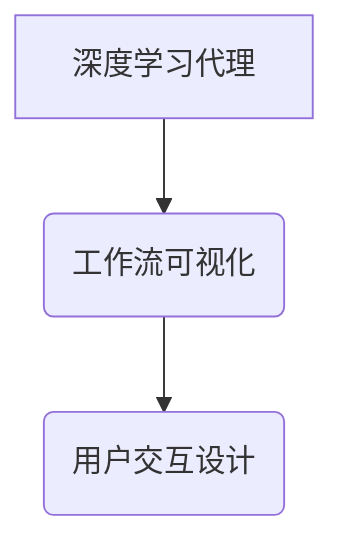

> 深度学习、智能代理、工作流可视化、用户交互设计、AI应用

## 1. 背景介绍

随着人工智能技术的飞速发展，深度学习算法在各个领域取得了显著的成果。从图像识别、自然语言处理到语音合成，深度学习模型展现出强大的学习和推理能力。然而，深度学习模型的复杂性和黑盒属性也带来了新的挑战。如何更好地理解和解释深度学习模型的决策过程，以及如何将深度学习模型应用于实际场景中，成为当前研究的热点问题。

智能代理作为一种能够自主学习和决策的软件系统，在解决复杂问题和自动化任务方面具有重要意义。将深度学习算法与智能代理相结合，可以构建出更智能、更灵活的代理系统。

工作流可视化技术可以帮助用户直观地理解和管理复杂的工作流程。将工作流可视化与深度学习代理相结合，可以使用户更直观地了解代理系统的决策过程，并能够根据需要调整代理系统的行为。

用户交互设计是构建用户友好型人工智能系统的关键。如何设计合理的交互方式，使用户能够方便地与深度学习代理进行交互，是需要认真考虑的问题。

## 2. 核心概念与联系

**2.1 深度学习代理**

深度学习代理是一种利用深度学习算法进行决策和执行任务的智能代理。它可以学习从数据中提取特征，并根据学习到的知识做出决策。

**2.2 工作流可视化**

工作流可视化是一种将复杂的工作流程以图形化的方式呈现的技术。它可以帮助用户直观地理解工作流程的各个步骤，以及步骤之间的关系。

**2.3 用户交互设计**

用户交互设计是指设计用户与计算机系统交互的方式。它包括用户界面设计、交互模型设计、用户体验设计等方面。

**2.4 核心概念关系图**



## 3. 核心算法原理 & 具体操作步骤

**3.1 算法原理概述**

深度学习代理的工作流程可视化与用户交互设计主要基于以下核心算法原理：

* **深度学习模型训练:** 利用深度学习算法从数据中学习特征，构建一个能够进行决策的模型。
* **工作流建模:** 将代理系统的决策过程以图形化的方式表示出来，包括各个步骤、条件和决策节点。
* **用户交互设计:** 设计合理的交互方式，使用户能够方便地与代理系统进行交互，例如：
    * **可视化工作流:** 用户可以直观地看到代理系统的决策过程。
    * **参数调整:** 用户可以根据需要调整代理系统的参数，例如学习率、隐藏层数量等。
    * **反馈机制:** 用户可以对代理系统的决策进行反馈，帮助代理系统不断学习和改进。

**3.2 算法步骤详解**

1. **数据收集和预处理:** 收集与代理系统相关的训练数据，并进行预处理，例如：数据清洗、特征提取等。
2. **深度学习模型训练:** 利用深度学习算法训练模型，使模型能够从数据中学习特征，并进行决策。
3. **工作流建模:** 将代理系统的决策过程以图形化的方式表示出来，包括各个步骤、条件和决策节点。
4. **用户交互设计:** 设计合理的交互方式，使用户能够方便地与代理系统进行交互，例如：可视化工作流、参数调整、反馈机制等。
5. **系统部署和测试:** 将训练好的模型和工作流可视化系统部署到实际环境中，并进行测试和评估。

**3.3 算法优缺点**

**优点:**

* **可解释性:** 工作流可视化可以帮助用户直观地理解代理系统的决策过程。
* **可定制性:** 用户可以根据需要调整代理系统的参数和工作流程。
* **用户友好性:** 合理的交互设计可以使用户更容易地与代理系统进行交互。

**缺点:**

* **复杂度:** 工作流建模和用户交互设计需要一定的专业知识和经验。
* **可扩展性:** 当代理系统变得越来越复杂时，工作流可视化和用户交互设计也需要相应的调整。

**3.4 算法应用领域**

深度学习代理的工作流可视化与用户交互设计在以下领域具有广泛的应用前景：

* **自动化决策:** 例如，在金融领域，可以利用深度学习代理自动进行信用评估、风险管理等决策。
* **智能客服:** 例如，可以利用深度学习代理构建智能客服系统，自动回答用户的问题，提供个性化的服务。
* **医疗诊断:** 例如，可以利用深度学习代理辅助医生进行疾病诊断，提高诊断准确率。

## 4. 数学模型和公式 & 详细讲解 & 举例说明

**4.1 数学模型构建**

深度学习代理的工作流程可视化与用户交互设计可以基于以下数学模型构建：

* **决策树模型:** 决策树是一种树形结构的模型，用于表示决策过程。每个节点代表一个决策，每个分支代表一个可能的决策结果。
* **贝叶斯网络模型:** 贝叶斯网络是一种概率图模型，用于表示变量之间的依赖关系。
* **强化学习模型:** 强化学习是一种机器学习方法，用于训练代理系统在环境中进行决策，以获得最大奖励。

**4.2 公式推导过程**

具体公式推导过程取决于所选用的数学模型。例如，决策树模型的构建过程涉及信息增益、熵等概念，而强化学习模型的训练过程涉及价值函数、策略梯度等公式。

**4.3 案例分析与讲解**

假设我们构建一个深度学习代理用于自动识别图像中的物体。我们可以使用决策树模型来表示代理系统的决策过程。

* 根节点代表输入图像。
* 子节点代表图像特征，例如颜色、形状、纹理等。
* 叶节点代表识别结果，例如“猫”、“狗”、“车”等。

通过训练决策树模型，代理系统可以学习到不同特征与物体识别的关系，并能够根据输入图像的特征进行准确的识别。

## 5. 项目实践：代码实例和详细解释说明

**5.1 开发环境搭建**

* 操作系统: Ubuntu 20.04
* Python 版本: 3.8
* 深度学习框架: TensorFlow 2.0

**5.2 源代码详细实现**

```python
# 导入必要的库
import tensorflow as tf

# 定义模型结构
model = tf.keras.models.Sequential([
    tf.keras.layers.Conv2D(32, (3, 3), activation='relu', input_shape=(28, 28, 1)),
    tf.keras.layers.MaxPooling2D((2, 2)),
    tf.keras.layers.Conv2D(64, (3, 3), activation='relu'),
    tf.keras.layers.MaxPooling2D((2, 2)),
    tf.keras.layers.Flatten(),
    tf.keras.layers.Dense(10, activation='softmax')
])

# 编译模型
model.compile(optimizer='adam',
              loss='sparse_categorical_crossentropy',
              metrics=['accuracy'])

# 训练模型
model.fit(x_train, y_train, epochs=5)

# 评估模型
loss, accuracy = model.evaluate(x_test, y_test)
print('Test loss:', loss)
print('Test accuracy:', accuracy)
```

**5.3 代码解读与分析**

这段代码定义了一个简单的卷积神经网络模型，用于识别手写数字。

* `tf.keras.models.Sequential` 创建了一个顺序模型，即层级结构。
* `tf.keras.layers.Conv2D` 定义了一个卷积层，用于提取图像特征。
* `tf.keras.layers.MaxPooling2D` 定义了一个最大池化层，用于降低特征图的维度。
* `tf.keras.layers.Flatten` 将多维特征图转换为一维向量。
* `tf.keras.layers.Dense` 定义了一个全连接层，用于分类。
* `model.compile` 编译模型，指定优化器、损失函数和评价指标。
* `model.fit` 训练模型，使用训练数据进行训练。
* `model.evaluate` 评估模型，使用测试数据进行评估。

**5.4 运行结果展示**

训练完成后，模型可以用于识别新的手写数字图像。

## 6. 实际应用场景

**6.1 智能客服系统**

深度学习代理可以用于构建智能客服系统，自动回答用户的问题，提供个性化的服务。

**6.2 自动化决策系统**

深度学习代理可以用于构建自动化决策系统，例如在金融领域，可以利用深度学习代理自动进行信用评估、风险管理等决策。

**6.3 医疗诊断辅助系统**

深度学习代理可以用于构建医疗诊断辅助系统，辅助医生进行疾病诊断，提高诊断准确率。

**6.4 未来应用展望**

随着深度学习技术的不断发展，深度学习代理的工作流可视化与用户交互设计将在更多领域得到应用，例如：

* **个性化教育:** 根据学生的学习情况，提供个性化的学习内容和辅导。
* **智能家居:** 控制家居设备，提供更加智能化的家居体验。
* **自动驾驶:** 辅助驾驶员进行决策，提高驾驶安全性和效率。

## 7. 工具和资源推荐

**7.1 学习资源推荐**

* **书籍:**
    * 深度学习
    * 人工智能：一种现代方法
* **在线课程:**
    * Coursera: 深度学习
    * Udacity: 深度学习工程师
* **博客和网站:**
    * TensorFlow 官方博客
    * PyTorch 官方博客

**7.2 开发工具推荐**

* **深度学习框架:** TensorFlow, PyTorch
* **可视化工具:** Matplotlib, Seaborn
* **工作流管理工具:** Airflow, Luigi

**7.3 相关论文推荐**

* **深度学习代理的最新研究进展**
* **工作流可视化与用户交互设计在深度学习代理中的应用**

## 8. 总结：未来发展趋势与挑战

**8.1 研究成果总结**

深度学习代理的工作流可视化与用户交互设计取得了显著的成果，为构建更智能、更灵活的代理系统提供了新的思路和方法。

**8.2 未来发展趋势**

* **更强大的深度学习模型:** 随着深度学习技术的不断发展，将会有更强大的深度学习模型出现，能够解决更复杂的问题。
* **更智能的用户交互设计:** 将会更加注重用户体验，设计更加智能、更加人性化的交互方式。
* **更广泛的应用场景:** 深度学习代理的工作流可视化与用户交互设计将在更多领域得到应用。

**8.3 面临的挑战**

* **模型解释性:** 深度学习模型的复杂性使得其决策过程难以解释，这对于用户信任和应用推广是一个挑战。
* **数据安全:** 深度学习代理需要大量的数据进行训练，数据安全是一个需要认真考虑的问题。
* **伦理问题:** 深度学习代理的应用可能会带来一些伦理问题，例如：算法偏见、隐私泄露等，需要进行深入的探讨和研究。

**8.4 研究展望**

未来，我们将继续致力于深度学习代理的工作流可视化与用户交互设计的研究，努力解决上述挑战，推动深度学习代理技术的发展和应用。

## 9. 附录：常见问题与解答

**9.1 如何选择合适的深度学习模型？**

选择合适的深度学习模型取决于具体的应用场景和数据特点。例如，对于图像识别任务，卷积神经网络是比较常用的模型；对于文本分类任务，循环神经网络或Transformer模型是比较合适的。

**9.2 如何进行工作流可视化？**

可以使用一些工作流可视化工具，例如：

* **Draw.io:** 在线工作流可视化工具
* **Lucidchart:** 在线工作流可视化工具
* **PlantUML:** 基于文本的 UML 图表生成工具

**9.3 如何设计合理的用户交互方式？