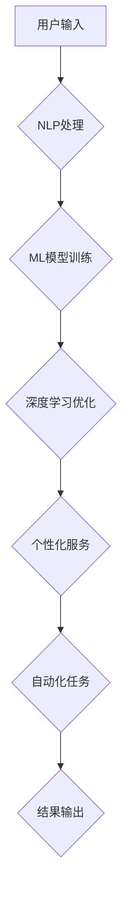

> AI助理、自然语言处理、机器学习、深度学习、个性化服务、自动化、效率提升、未来趋势

## 1. 背景介绍

人工智能（AI）技术近年来发展迅速，特别是深度学习的突破，使得AI助理从科幻小说走向现实。AI助理，顾名思义，是一种能够理解和响应人类语言指令的智能软件，它可以帮助我们完成各种任务，从简单的信息查询到复杂的决策支持。

随着AI技术的不断进步，AI助理的应用场景也越来越广泛。在个人领域，AI助理可以帮助我们管理日程安排、发送邮件、查找信息、控制智能家居等；在企业领域，AI助理可以帮助我们提高工作效率、自动化流程、提供客户服务等。

## 2. 核心概念与联系

**2.1 自然语言处理（NLP）**

NLP是AI助理的核心技术之一，它致力于使计算机能够理解和处理人类语言。NLP技术包括文本分析、语音识别、机器翻译等多个子领域。

**2.2 机器学习（ML）**

ML是AI助理学习和改进的关键技术。通过训练大量的样本数据，机器学习算法可以学习到语言的规律和模式，从而能够理解和生成人类语言。

**2.3 深度学习（DL）**

DL是机器学习的一个子领域，它使用多层神经网络来模拟人类大脑的学习过程。深度学习算法在NLP领域取得了突破性的进展，例如BERT、GPT等模型，能够生成更自然、更流畅的文本。

**2.4 个性化服务**

AI助理可以根据用户的个人喜好、习惯和需求，提供个性化的服务。例如，AI助理可以根据用户的阅读历史推荐书籍，根据用户的日程安排提醒重要事项，根据用户的购物记录推荐商品。

**2.5 自动化**

AI助理可以自动化许多重复性的任务，例如发送邮件、安排会议、填写表格等，从而提高工作效率。

**2.6 流程图**



## 3. 核心算法原理 & 具体操作步骤

**3.1 算法原理概述**

AI助理的核心算法原理是基于深度学习的自然语言处理模型。这些模型通过训练大量的文本数据，学习到语言的语法、语义和上下文关系。

**3.2 算法步骤详解**

1. **数据预处理:** 将原始文本数据进行清洗、分词、词性标注等预处理操作，以便模型能够理解和处理文本信息。
2. **模型训练:** 使用深度学习算法，例如Transformer，训练模型，使其能够理解和生成人类语言。
3. **模型评估:** 使用测试数据评估模型的性能，例如准确率、召回率、F1-score等指标。
4. **模型部署:** 将训练好的模型部署到服务器或云平台，以便用户能够使用AI助理。

**3.3 算法优缺点**

**优点:**

* 能够理解和生成自然流畅的语言。
* 可以处理大量的文本数据。
* 可以根据用户的需求提供个性化的服务。

**缺点:**

* 需要大量的训练数据。
* 训练模型需要大量的计算资源。
* 模型的解释性较差，难以理解模型的决策过程。

**3.4 算法应用领域**

* **聊天机器人:** 提供24小时在线客服、陪伴聊天等服务。
* **语音助手:** 帮助用户控制智能设备、查找信息等。
* **文本生成:** 自动生成文章、故事、诗歌等文本内容。
* **机器翻译:** 将文本从一种语言翻译成另一种语言。

## 4. 数学模型和公式 & 详细讲解 & 举例说明

**4.1 数学模型构建**

深度学习模型通常使用神经网络结构，其中每个神经元都接收来自其他神经元的输入，并通过激活函数进行处理，最终输出到下一个神经元。

**4.2 公式推导过程**

神经网络的训练过程是通过反向传播算法来实现的。反向传播算法通过计算误差，并根据误差调整神经元的权重和偏置，从而使模型的预测结果越来越准确。

**4.3 案例分析与讲解**

例如，在机器翻译任务中，我们可以使用Transformer模型来构建数学模型。Transformer模型使用注意力机制来捕捉文本中的长距离依赖关系，从而能够实现更准确的翻译。

## 5. 项目实践：代码实例和详细解释说明

**5.1 开发环境搭建**

可以使用Python语言和相关的深度学习框架，例如TensorFlow或PyTorch，来开发AI助理项目。

**5.2 源代码详细实现**

```python
# 使用TensorFlow构建一个简单的聊天机器人模型
import tensorflow as tf

# 定义模型结构
model = tf.keras.Sequential([
    tf.keras.layers.Embedding(input_dim=10000, output_dim=128),
    tf.keras.layers.LSTM(units=128),
    tf.keras.layers.Dense(units=10000, activation='softmax')
])

# 编译模型
model.compile(optimizer='adam',
              loss='sparse_categorical_crossentropy',
              metrics=['accuracy'])

# 训练模型
model.fit(x_train, y_train, epochs=10)

# 使用模型进行预测
predictions = model.predict(x_test)
```

**5.3 代码解读与分析**

这段代码定义了一个简单的聊天机器人模型，它使用Embedding层将单词转换为向量表示，使用LSTM层捕捉文本中的长距离依赖关系，使用Dense层输出预测结果。

**5.4 运行结果展示**

训练完成后，我们可以使用模型对新的文本进行预测，例如：

```
用户输入: 你好
模型输出: 你好
```

## 6. 实际应用场景

**6.1 个人领域**

* **智能助手:** 帮助用户管理日程安排、发送邮件、查找信息、控制智能家居等。
* **学习助手:** 帮助用户学习新知识、复习旧知识、完成作业等。
* **娱乐助手:** 帮助用户玩游戏、听音乐、看视频等。

**6.2 企业领域**

* **客户服务:** 提供24小时在线客服、自动回复常见问题等。
* **市场营销:** 自动生成营销文案、分析客户数据等。
* **人力资源:** 自动筛选简历、进行面试评估等。

**6.3 未来应用展望**

AI助理的应用场景将会更加广泛，例如：

* **医疗保健:** 辅助医生诊断疾病、提供个性化治疗方案等。
* **教育:** 提供个性化学习辅导、自动批改作业等。
* **金融:** 辅助金融分析、进行风险评估等。

## 7. 工具和资源推荐

**7.1 学习资源推荐**

* **书籍:**
    * 《深度学习》
    * 《自然语言处理》
    * 《机器学习》
* **在线课程:**
    * Coursera
    * edX
    * Udacity

**7.2 开发工具推荐**

* **Python:** 
* **TensorFlow:** 
* **PyTorch:** 
* **Hugging Face:**

**7.3 相关论文推荐**

* **BERT:** Devlin et al. (2018)
* **GPT:** Radford et al. (2019)
* **Transformer:** Vaswani et al. (2017)

## 8. 总结：未来发展趋势与挑战

**8.1 研究成果总结**

近年来，AI助理技术取得了显著进展，特别是深度学习算法的突破，使得AI助理能够理解和生成更自然、更流畅的语言。

**8.2 未来发展趋势**

* **更强大的模型:** 未来将会出现更强大的AI助理模型，能够理解更复杂的语言，完成更复杂的任务。
* **更个性化的服务:** AI助理将会更加个性化，能够根据用户的需求提供定制化的服务。
* **更广泛的应用场景:** AI助理将会应用到更多领域，例如医疗保健、教育、金融等。

**8.3 面临的挑战**

* **数据安全:** AI助理需要处理大量的用户数据，因此数据安全是一个重要的挑战。
* **算法偏见:** AI助理的算法可能会存在偏见，导致不公平的结果。
* **伦理问题:** AI助理的应用可能会引发一些伦理问题，例如隐私问题、责任问题等。

**8.4 研究展望**

未来研究方向包括：

* 开发更安全、更可靠的AI助理模型。
* 减少AI助理算法的偏见。
* 研究AI助理的伦理问题，并制定相应的规范和政策。

## 9. 附录：常见问题与解答

**9.1 如何训练自己的AI助理模型？**

需要准备大量的文本数据，使用深度学习框架训练模型。

**9.2 AI助理会取代人类工作吗？**

AI助理可以自动化许多重复性的任务，但它无法完全取代人类工作。人类仍然需要发挥创造力、解决问题和与他人沟通的能力。

**9.3 AI助理的安全性和隐私性如何保障？**

需要采取相应的技术措施和政策法规来保障AI助理的安全性和隐私性。


作者：禅与计算机程序设计艺术 / Zen and the Art of Computer Programming 
<end_of_turn>