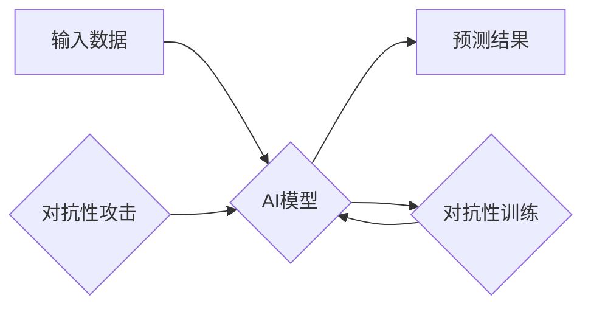

> AI鲁棒性，对抗性训练，模型攻击，防御机制，泛化能力，深度学习

## 1. 背景介绍

人工智能（AI）技术近年来取得了飞速发展，在各个领域展现出强大的应用潜力。然而，随着AI模型的复杂性和应用场景的广泛化，其鲁棒性问题日益受到关注。鲁棒性是指AI模型在面对噪声、异常数据或恶意攻击时，能够保持稳定性能和正确输出的能力。

对抗性攻击是AI模型鲁棒性面临的一大挑战。对抗性攻击是指通过对输入数据进行微小的扰动，以欺骗AI模型做出错误预测。这些扰动通常对人类感知不可察觉，但对模型的决策却产生显著影响。对抗性攻击的成功表明，现有的AI模型在现实世界中可能存在安全漏洞，其可靠性和安全性需要进一步提升。

## 2. 核心概念与联系

**2.1 核心概念**

* **鲁棒性:** AI模型在面对噪声、异常数据或恶意攻击时，能够保持稳定性能和正确输出的能力。
* **对抗性攻击:** 通过对输入数据进行微小的扰动，以欺骗AI模型做出错误预测。
* **对抗性训练:** 通过对抗性攻击来训练AI模型，使其能够抵抗对抗性攻击。

**2.2 核心概念联系**

对抗性训练是一种增强AI模型鲁棒性的重要方法。其核心思想是通过模拟对抗性攻击，训练模型能够识别和抵抗这些攻击。

**2.3 Mermaid 流程图**



## 3. 核心算法原理 & 具体操作步骤

**3.1 算法原理概述**

对抗性训练的核心算法原理是利用梯度下降算法，通过反向传播的方式，学习对抗性扰动，并更新模型参数，使其能够抵抗这些扰动。

**3.2 算法步骤详解**

1. **生成对抗性样本:** 使用梯度上升算法，对原始输入数据进行微小的扰动，生成对抗性样本，使得模型预测结果发生错误。
2. **训练模型:** 使用对抗性样本和原始样本进行训练，更新模型参数。
3. **重复步骤1和2:** 重复上述步骤，直到模型能够抵抗大多数对抗性攻击。

**3.3 算法优缺点**

* **优点:** 能够有效提高模型的鲁棒性，使其能够抵抗对抗性攻击。
* **缺点:** 训练过程复杂，计算量大，需要大量的对抗性样本。

**3.4 算法应用领域**

* **图像识别:** 提高图像识别模型的鲁棒性，使其能够抵抗图像篡改和恶意攻击。
* **自然语言处理:** 提高自然语言处理模型的鲁棒性，使其能够抵抗文本攻击和恶意评论。
* **语音识别:** 提高语音识别模型的鲁棒性，使其能够抵抗语音攻击和噪音干扰。

## 4. 数学模型和公式 & 详细讲解 & 举例说明

**4.1 数学模型构建**

假设我们有一个分类模型f(x)，其中x是输入数据，f(x)是模型预测的类别。对抗性攻击的目标是找到一个微小的扰动ε，使得模型预测结果发生错误，即：

```latex
f(x + ε) ≠ f(x)
```

**4.2 公式推导过程**

对抗性训练的目标是找到一个对抗性扰动ε，使得模型在对抗性样本上预测错误的概率最小化。可以使用以下公式来表示：

```latex
min_{ε} ||ε||_2^2 s.t. f(x + ε) ≠ f(x)
```

其中，||ε||_2^2表示对抗性扰动的L2范数。

**4.3 案例分析与讲解**

例如，在图像识别任务中，对抗性攻击可以添加微小的噪声到图像上，使得模型将猫识别为狗。

## 5. 项目实践：代码实例和详细解释说明

**5.1 开发环境搭建**

* Python 3.7+
* TensorFlow 2.0+
* PyTorch 1.0+

**5.2 源代码详细实现**

```python
import tensorflow as tf

# 定义模型
model = tf.keras.models.Sequential([
    tf.keras.layers.Conv2D(32, (3, 3), activation='relu', input_shape=(28, 28, 1)),
    tf.keras.layers.MaxPooling2D((2, 2)),
    tf.keras.layers.Flatten(),
    tf.keras.layers.Dense(10, activation='softmax')
])

# 定义损失函数和优化器
loss_fn = tf.keras.losses.SparseCategoricalCrossentropy()
optimizer = tf.keras.optimizers.Adam()

# 定义对抗性训练函数
def adversarial_training(model, images, labels, epsilon=0.01):
    with tf.GradientTape() as tape:
        predictions = model(images)
        loss = loss_fn(labels, predictions)
    gradients = tape.gradient(loss, model.trainable_variables)
    perturbation = epsilon * tf.sign(gradients)
    adversarial_images = images + perturbation
    adversarial_predictions = model(adversarial_images)
    adversarial_loss = loss_fn(labels, adversarial_predictions)
    return adversarial_loss

# 训练模型
for epoch in range(10):
    for batch in dataset.batch(32):
        images, labels = batch
        adversarial_loss = adversarial_training(model, images, labels)
        optimizer.minimize(adversarial_loss, model.trainable_variables)

```

**5.3 代码解读与分析**

* 代码首先定义了模型、损失函数和优化器。
* 然后定义了对抗性训练函数，该函数利用梯度上升算法生成对抗性样本，并计算对抗性损失。
* 最后，使用对抗性训练函数训练模型。

**5.4 运行结果展示**

训练完成后，可以评估模型在对抗性样本上的性能，例如使用攻击方法生成对抗性样本，并测试模型在这些样本上的准确率。

## 6. 实际应用场景

**6.1 医疗诊断**

对抗性训练可以提高医疗诊断模型的鲁棒性，使其能够抵抗恶意攻击和数据噪声，从而提高诊断的准确性和安全性。

**6.2 自动驾驶**

对抗性训练可以提高自动驾驶系统的鲁棒性，使其能够抵抗图像篡改和环境干扰，从而提高驾驶安全性和可靠性。

**6.3 金融欺诈检测**

对抗性训练可以提高金融欺诈检测模型的鲁棒性，使其能够抵抗欺诈者利用对抗性样本进行攻击，从而提高金融安全的可靠性。

**6.4 未来应用展望**

随着AI技术的不断发展，对抗性训练将在更多领域得到应用，例如：

* **网络安全:** 提高网络安全系统的鲁棒性，抵抗恶意攻击。
* **生物识别:** 提高生物识别系统的鲁棒性，抵抗身份盗窃和欺诈。
* **工业控制:** 提高工业控制系统的鲁棒性，防止恶意攻击导致安全事故。

## 7. 工具和资源推荐

**7.1 学习资源推荐**

* **论文:**
    * Goodfellow, I., Shlens, J., & Szegedy, C. (2014). Explaining and harnessing adversarial examples.
    * Kurakin, A., Goodfellow, I., & Bengio, S. (2016). Adversarial machine learning at scale.
* **博客:**
    * https://blog.openai.com/
    * https://towardsdatascience.com/

**7.2 开发工具推荐**

* **TensorFlow:** https://www.tensorflow.org/
* **PyTorch:** https://pytorch.org/

**7.3 相关论文推荐**

* **Adversarial Examples in the Physical World**
* **Generating Adversarial Examples for Deep Learning Models**
* **Robustness of Deep Learning Models to Adversarial Attacks**

## 8. 总结：未来发展趋势与挑战

**8.1 研究成果总结**

对抗性训练取得了显著的成果，有效提高了AI模型的鲁棒性。

**8.2 未来发展趋势**

* **更有效的对抗性训练方法:** 研究更有效的对抗性训练方法，提高模型的鲁棒性。
* **对抗性攻击的自动化:** 研究自动化对抗性攻击方法，提高攻击效率。
* **鲁棒性评估标准:** 建立统一的鲁棒性评估标准，方便比较不同模型的鲁棒性。

**8.3 面临的挑战**

* **黑盒攻击:** 针对黑盒模型的对抗性攻击仍然是一个挑战。
* **数据稀缺:** 训练鲁棒性模型需要大量的对抗性样本，而这些样本往往稀缺。
* **计算成本:** 对抗性训练的计算成本较高，需要更高效的算法和硬件支持。

**8.4 研究展望**

未来，对抗性训练将继续是AI安全研究的重要方向，需要进一步探索更有效的训练方法、更强大的攻击方法以及更完善的评估标准，以确保AI技术的安全可靠发展。

## 9. 附录：常见问题与解答

**9.1 Q: 对抗性训练的训练过程复杂吗？**

**A:** 对抗性训练的训练过程确实比传统的训练过程复杂，需要更多的步骤和计算资源。

**9.2 Q: 对抗性训练的训练时间长吗？**

**A:** 对抗性训练的训练时间取决于模型的复杂度、数据集的大小以及使用的硬件资源。一般来说，对抗性训练需要比传统的训练过程更长的时间。

**9.3 Q: 对抗性训练的训练成本高吗？**

**A:** 对抗性训练的训练成本较高，需要更多的计算资源和时间。

**9.4 Q: 对抗性训练可以保证模型的绝对鲁棒性吗？**

**A:** 任何训练方法都不能保证模型的绝对鲁棒性。对抗性训练可以提高模型的鲁棒性，但仍然存在被攻击的风险。


作者：禅与计算机程序设计艺术 / Zen and the Art of Computer Programming 
<end_of_turn>