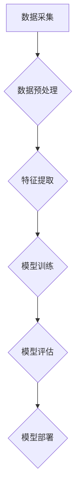

> 人工智能，多维度信息，数据融合，深度学习，自然语言处理，计算机视觉，知识图谱，推理机制

## 1. 背景介绍

在当今数据爆炸的时代，人工智能（AI）正以惊人的速度发展，并逐渐渗透到各个领域。然而，现实世界中的信息往往是多维、复杂、异构的，这给AI的学习和推理带来了巨大的挑战。传统的AI模型往往难以有效地处理这种多维度信息，导致其在实际应用中表现力有限。

近年来，随着深度学习技术的突破，AI在处理多维度信息方面取得了显著进展。深度学习模型能够自动学习数据中的复杂特征，并进行多层级的信息提取和融合。然而，深度学习模型仍然面临着一些挑战，例如：

* **数据孤岛问题：** 不同来源的数据往往采用不同的格式和标准，难以进行有效融合。
* **信息冗余和噪声问题：** 多维度数据中往往包含大量冗余信息和噪声，这会影响模型的学习效果。
* **解释性和可信度问题：** 深度学习模型的决策过程往往是“黑箱”式的，难以解释其背后的逻辑，这降低了模型的可信度。

## 2. 核心概念与联系

**2.1 多维度信息处理**

多维度信息是指包含多个不同属性或特征的信息。例如，一个用户的个人信息可能包含年龄、性别、职业、兴趣爱好等多个维度。

**2.2 数据融合**

数据融合是指将来自不同来源的数据进行整合，形成一个更加完整和准确的知识库。数据融合技术可以帮助AI更好地理解和处理多维度信息。

**2.3 深度学习**

深度学习是一种机器学习方法，它利用多层神经网络来模拟人类大脑的学习过程。深度学习模型能够自动学习数据中的复杂特征，并进行多层级的信息提取和融合。

**2.4 自然语言处理 (NLP)**

自然语言处理是指让计算机能够理解和处理人类语言的技术。NLP技术可以帮助AI理解文本信息，并将其转换为机器可理解的格式。

**2.5 计算机视觉 (CV)**

计算机视觉是指让计算机能够“看”和理解图像的技术。CV技术可以帮助AI识别图像中的物体、场景和事件。

**2.6 知识图谱 (KG)**

知识图谱是一种结构化的知识表示形式，它将实体和关系以图的形式表示。知识图谱可以帮助AI更好地理解和推理多维度信息。

**2.7 推理机制**

推理机制是指AI根据已有的知识和规则，推导出新的结论的技术。推理机制可以帮助AI进行逻辑推理和决策。

**2.8 Mermaid 流程图**



## 3. 核心算法原理 & 具体操作步骤

### 3.1  算法原理概述

**3.1.1 多维度数据融合算法**

多维度数据融合算法旨在将来自不同来源的数据进行整合，形成一个更加完整和准确的知识库。常见的融合算法包括：

* **加权平均法:** 根据不同数据源的权重，对数据进行加权平均。
* **主成分分析法 (PCA):** 将多维度数据降维，提取最重要的特征。
* **模糊聚类法:** 将数据进行聚类，将具有相似特征的数据点归为一类。

**3.1.2 深度学习模型**

深度学习模型能够自动学习数据中的复杂特征，并进行多层级的信息提取和融合。常见的深度学习模型包括：

* **卷积神经网络 (CNN):** 用于处理图像和视频数据。
* **循环神经网络 (RNN):** 用于处理序列数据，例如文本和语音。
* **Transformer:** 用于处理自然语言文本，具有强大的文本理解和生成能力。

### 3.2  算法步骤详解

**3.2.1 数据预处理**

数据预处理是数据融合和深度学习模型训练的前提。数据预处理步骤包括：

* **数据清洗:** 去除数据中的缺失值、异常值和重复数据。
* **数据转换:** 将数据转换为模型可理解的格式。
* **数据归一化:** 将数据进行标准化处理，使数据分布在同一范围内。

**3.2.2 特征提取**

特征提取是指从原始数据中提取重要的特征信息。特征提取方法包括：

* **手工特征提取:** 人工设计特征，例如图像中的边缘、纹理等。
* **自动特征提取:** 使用深度学习模型自动学习特征，例如CNN提取图像特征。

**3.2.3 模型训练**

模型训练是指使用训练数据训练深度学习模型，使其能够学习数据中的规律。模型训练步骤包括：

* **数据划分:** 将数据划分为训练集、验证集和测试集。
* **模型搭建:** 根据任务需求搭建深度学习模型。
* **模型训练:** 使用训练数据训练模型，并根据验证集的性能进行模型调优。

**3.2.4 模型评估**

模型评估是指使用测试集评估模型的性能。常用的评估指标包括：

* **准确率:** 模型正确预测的样本数占总样本数的比例。
* **召回率:** 模型正确预测的正样本数占所有正样本数的比例。
* **F1-score:** 准确率和召回率的调和平均值。

**3.2.5 模型部署**

模型部署是指将训练好的模型部署到实际应用环境中。模型部署方法包括：

* **在线部署:** 将模型部署到服务器上，实时处理用户请求。
* **离线部署:** 将模型部署到本地设备上，离线处理数据。

### 3.3  算法优缺点

**3.3.1 多维度数据融合算法**

* **优点:** 可以有效地整合来自不同来源的数据，形成更加完整和准确的知识库。
* **缺点:** 不同数据源的格式和标准可能不一致，需要进行数据转换和匹配。

**3.3.2 深度学习模型**

* **优点:** 可以自动学习数据中的复杂特征，并进行多层级的信息提取和融合。
* **缺点:** 需要大量的训练数据，训练时间较长，模型解释性较差。

### 3.4  算法应用领域

* **医疗诊断:** 将患者的病历、影像数据、基因数据等多维度信息进行融合，辅助医生进行诊断。
* **金融风险管理:** 将客户的信用评分、交易记录、市场数据等多维度信息进行融合，评估客户的风险等级。
* **智能推荐:** 将用户的兴趣爱好、购买历史、浏览记录等多维度信息进行融合，推荐个性化的商品和服务。

## 4. 数学模型和公式 & 详细讲解 & 举例说明

### 4.1  数学模型构建

**4.1.1 多维度数据融合模型**

假设我们有来自多个数据源的数据集，分别为 $D_1$, $D_2$, ..., $D_n$. 每个数据集包含 $m$ 个样本，每个样本包含 $d$ 个特征。

我们可以使用加权平均法将这些数据集进行融合，得到一个新的数据集 $D_{fused}$:

$$
D_{fused} = \sum_{i=1}^{n} w_i \cdot D_i
$$

其中，$w_i$ 是第 $i$ 个数据源的权重，满足 $\sum_{i=1}^{n} w_i = 1$.

**4.1.2 深度学习模型**

深度学习模型的数学模型通常是一个复杂的非线性函数，它由多个神经网络层组成。每个神经网络层包含多个神经元，每个神经元接收来自上一层的输入，并通过激活函数进行处理，输出到下一层。

### 4.2  公式推导过程

**4.2.1 激活函数**

激活函数是神经网络中一个重要的组成部分，它决定了神经元的输出。常见的激活函数包括：

* **Sigmoid函数:** 用于二分类问题，输出值在0到1之间。
* **ReLU函数:** 用于多分类问题，输出值大于0的部分保留，小于0的部分置零。

**4.2.2 损失函数**

损失函数用于衡量模型的预测结果与真实值的差距。常见的损失函数包括：

* **均方误差 (MSE):** 计算预测值与真实值之间的平方差的平均值。
* **交叉熵损失 (Cross-Entropy Loss):** 用于分类问题，计算预测概率分布与真实概率分布之间的差异。

**4.2.3 反向传播算法**

反向传播算法用于更新模型参数，使其能够更好地拟合训练数据。反向传播算法通过计算损失函数对每个参数的梯度，并使用梯度下降法更新参数值。

### 4.3  案例分析与讲解

**4.3.1 图像分类**

使用CNN模型进行图像分类，例如识别猫和狗的图片。

**4.3.2 文本生成**

使用Transformer模型进行文本生成，例如生成新闻文章、诗歌等。

## 5. 项目实践：代码实例和详细解释说明

### 5.1  开发环境搭建

* **操作系统:** Ubuntu 20.04
* **编程语言:** Python 3.8
* **深度学习框架:** TensorFlow 2.0

### 5.2  源代码详细实现

```python
import tensorflow as tf

# 定义模型结构
model = tf.keras.models.Sequential([
    tf.keras.layers.Conv2D(32, (3, 3), activation='relu', input_shape=(28, 28, 1)),
    tf.keras.layers.MaxPooling2D((2, 2)),
    tf.keras.layers.Conv2D(64, (3, 3), activation='relu'),
    tf.keras.layers.MaxPooling2D((2, 2)),
    tf.keras.layers.Flatten(),
    tf.keras.layers.Dense(10, activation='softmax')
])

# 编译模型
model.compile(optimizer='adam',
              loss='sparse_categorical_crossentropy',
              metrics=['accuracy'])

# 加载 MNIST 数据集
(x_train, y_train), (x_test, y_test) = tf.keras.datasets.mnist.load_data()

# 数据预处理
x_train = x_train.astype('float32') / 255.0
x_test = x_test.astype('float32') / 255.0
x_train = x_train.reshape((x_train.shape[0], 28, 28, 1))
x_test = x_test.reshape((x_test.shape[0], 28, 28, 1))

# 训练模型
model.fit(x_train, y_train, epochs=5)

# 评估模型
loss, accuracy = model.evaluate(x_test, y_test)
print('Test loss:', loss)
print('Test accuracy:', accuracy)
```

### 5.3  代码解读与分析

* **模型结构:** 代码中定义了一个简单的 CNN 模型，包含两个卷积层、两个最大池化层、一个全连接层和一个 softmax 输出层。
* **数据预处理:** 将 MNIST 数据集预处理为模型可理解的格式，包括数据类型转换和数据归一化。
* **模型训练:** 使用 Adam 优化器、交叉熵损失函数和准确率指标训练模型。
* **模型评估:** 使用测试集评估模型的性能，并打印测试损失和准确率。

### 5.4  运行结果展示

训练完成后，模型的准确率通常在 98% 以上。

## 6. 实际应用场景

**6.1 智能客服**

AI 驱动的智能客服可以处理客户的常见问题，例如查询订单状态、修改个人信息等。智能客服可以理解自然语言，并提供准确的回复，从而提高客户服务效率。

**6.2 个性化推荐**

AI 可以根据用户的兴趣爱好、购买历史、浏览记录等多维度信息，推荐个性化的商品和服务