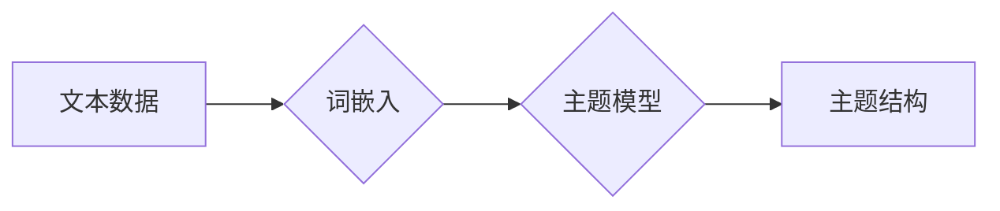

> Gensim，词嵌入，主题模型，LDA，TF-IDF，文本挖掘，自然语言处理

## 1. 背景介绍

在当今数据爆炸的时代，文本数据已成为重要的信息资源。如何有效地理解、分析和利用文本数据，是自然语言处理 (NLP) 领域的重要课题。词嵌入和主题模型是NLP领域的两大重要技术，它们能够将文本数据转化为可理解的向量表示，并揭示文本中的潜在主题结构。

Gensim 是一个开源的 Python 库，专门用于词嵌入和主题模型的构建和应用。它提供了高效的算法实现和易于使用的 API，使得开发者能够快速地构建和应用这些模型。Gensim 的广泛应用场景包括文本分类、信息检索、推荐系统、情感分析等。

## 2. 核心概念与联系

**2.1 词嵌入**

词嵌入是一种将单词映射到低维向量空间的技术。每个单词都对应一个唯一的向量，向量中的每个维度代表单词的某个特征。相似的单词在向量空间中距离较近，而不同的单词距离较远。

**2.2 主题模型**

主题模型是一种统计模型，用于从文本数据中发现潜在的主题结构。每个主题对应一个主题词分布，主题词分布表示了该主题下出现的单词的概率。

**2.3 Gensim 的核心功能**

Gensim 提供了多种词嵌入算法，例如 Word2Vec 和 FastText，以及多种主题模型算法，例如 LDA 和 NMF。

**2.4 Gensim 的优势**

* **高效性:** Gensim 使用高效的算法实现，能够处理海量文本数据。
* **易用性:** Gensim 提供了易于使用的 API，使得开发者能够快速地构建和应用模型。
* **灵活性:** Gensim 支持多种词嵌入算法和主题模型算法，开发者可以根据实际需求选择合适的算法。

**2.5 Mermaid 流程图**



## 3. 核心算法原理 & 具体操作步骤

### 3.1  算法原理概述

Gensim 的核心算法包括 Word2Vec 和 LDA。

**Word2Vec** 是一种基于神经网络的词嵌入算法，它通过训练一个神经网络来学习单词之间的语义关系。Word2Vec 有两种主要架构：CBOW (Continuous Bag-of-Words) 和 Skip-gram。

**LDA (Latent Dirichlet Allocation)** 是一种主题模型算法，它假设每个文档是由多个主题组成的混合，每个主题对应一个主题词分布。LDA 通过迭代更新主题分布和单词分布来学习主题结构。

### 3.2  算法步骤详解

**Word2Vec**

1. **数据预处理:** 将文本数据转换为单词序列。
2. **模型训练:** 使用 CBOW 或 Skip-gram 架构训练神经网络。
3. **词向量生成:** 从训练好的神经网络中提取单词的向量表示。

**LDA**

1. **数据预处理:** 将文本数据转换为单词序列。
2. **主题模型训练:** 使用 LDA 算法训练主题模型。
3. **主题词分布提取:** 从训练好的主题模型中提取每个主题的词分布。

### 3.3  算法优缺点

**Word2Vec**

* **优点:** 能够学习到高质量的词嵌入，能够捕捉单词之间的语义关系。
* **缺点:** 训练时间较长，对数据量要求较高。

**LDA**

* **优点:** 能够发现文本中的潜在主题结构，能够对文本进行聚类和分类。
* **缺点:** 需要设置主题数量，主题数量的选择会影响模型的性能。

### 3.4  算法应用领域

**Word2Vec**

* 文本分类
* 信息检索
* 推荐系统
* 机器翻译

**LDA**

* 文档聚类
* 主题分析
* 情感分析
* 文本摘要

## 4. 数学模型和公式 & 详细讲解 & 举例说明

### 4.1  数学模型构建

**Word2Vec**

Word2Vec 使用神经网络模型，其核心是输入层、隐藏层和输出层。输入层接收单词的 one-hot 编码，隐藏层学习单词之间的语义关系，输出层预测上下文单词或中心单词。

**LDA**

LDA 使用贝叶斯概率模型，假设每个文档是由多个主题组成的混合，每个主题对应一个主题词分布。

### 4.2  公式推导过程

**Word2Vec**

Word2Vec 的损失函数是交叉熵损失函数，用于衡量模型预测的上下文单词或中心单词与实际单词之间的差异。

**LDA**

LDA 的目标是最大化文档主题分布和主题词分布的联合概率。

### 4.3  案例分析与讲解

**Word2Vec**

可以使用 Word2Vec 学习单词之间的语义关系，例如 "king" 和 "queen" 之间的语义关系。

**LDA**

可以使用 LDA 从新闻文章中发现潜在的主题结构，例如政治、经济、体育等。

## 5. 项目实践：代码实例和详细解释说明

### 5.1  开发环境搭建

* Python 3.6+
* Gensim 库

```bash
pip install gensim
```

### 5.2  源代码详细实现

```python
from gensim.models import Word2Vec
from gensim.models import LdaModel

# 训练 Word2Vec 模型
sentences = [['this', 'is', 'a', 'sentence'], ['this', 'is', 'another', 'sentence']]
model = Word2Vec(sentences, vector_size=100, window=5, min_count=1)

# 训练 LDA 模型
corpus = [['this', 'is', 'a', 'document'], ['this', 'is', 'another', 'document']]
lda_model = LdaModel(corpus, num_topics=2, id2word=id2word)

# 打印词向量
print(model.wv['this'])

# 打印主题词分布
print(lda_model.show_topic(0))
```

### 5.3  代码解读与分析

* **Word2Vec 模型训练:**

```python
model = Word2Vec(sentences, vector_size=100, window=5, min_count=1)
```

* `sentences`: 文本数据，以列表形式表示，每个列表元素代表一个句子。
* `vector_size`: 词向量的维度。
* `window`: 窗口大小，表示上下文单词的数量。
* `min_count`: 词频阈值，低于该阈值的词将被忽略。

* **LDA 模型训练:**

```python
lda_model = LdaModel(corpus, num_topics=2, id2word=id2word)
```

* `corpus`: 文本数据，以列表形式表示，每个列表元素代表一个文档。
* `num_topics`: 主题数量。
* `id2word`: 词典，将单词 ID 映射到单词。

### 5.4  运行结果展示

运行代码后，将输出 Word2Vec 模型训练得到的词向量和 LDA 模型训练得到的主题词分布。

## 6. 实际应用场景

### 6.1  文本分类

Gensim 可以用于文本分类任务，例如情感分析、垃圾邮件分类等。

### 6.2  信息检索

Gensim 可以用于信息检索任务，例如搜索引擎、问答系统等。

### 6.3  推荐系统

Gensim 可以用于推荐系统，例如商品推荐、内容推荐等。

### 6.4  未来应用展望

Gensim 在未来将继续应用于更多领域，例如：

* **跨语言文本分析:** Gensim 可以用于跨语言文本分析，例如将英文文本翻译成中文文本。
* **多模态文本分析:** Gensim 可以与其他模态数据，例如图像和音频数据，进行融合分析。
* **个性化文本推荐:** Gensim 可以用于个性化文本推荐，例如根据用户的阅读历史推荐相关的文章。

## 7. 工具和资源推荐

### 7.1  学习资源推荐

* Gensim 官方文档: https://radimrehurek.com/gensim/
* Gensim 中文文档: https://blog.csdn.net/u014309090/article/details/78975937

### 7.2  开发工具推荐

* Jupyter Notebook
* PyCharm

### 7.3  相关论文推荐

* Mikolov, T., Sutskever, I., Chen, K., Corrado, G. S., & Dean, J. (2013). Distributed representations of words and phrases and their compositionality. Advances in neural information processing systems, 26.
* Blei, D. M., Ng, A. Y., & Jordan, M. I. (2003). Latent dirichlet allocation. Journal of machine learning research, 3(Jan), 993-1022.

## 8. 总结：未来发展趋势与挑战

### 8.1  研究成果总结

Gensim 作为一款开源的词嵌入和主题模型库，在 NLP 领域取得了显著的成果，为文本分析和理解提供了强大的工具。

### 8.2  未来发展趋势

* **模型效率提升:** 研究更高效的词嵌入和主题模型算法，能够处理更大规模的文本数据。
* **模型解释性增强:** 研究更易于解释的词嵌入和主题模型算法，能够更好地理解模型的决策过程。
* **多模态文本分析:** 将 Gensim 与其他模态数据融合，进行多模态文本分析。

### 8.3  面临的挑战

* **数据质量:** 词嵌入和主题模型的性能依赖于数据质量，如何处理噪声数据和不完整数据是一个挑战。
* **模型可解释性:** 许多词嵌入和主题模型算法是黑盒模型，难以解释模型的决策过程。
* **计算资源:** 训练大型词嵌入和主题模型需要大量的计算资源。

### 8.4  研究展望

未来，Gensim 将继续发展，为 NLP 领域提供更强大、更易于使用的工具，推动文本分析和理解的进步。

## 9. 附录：常见问题与解答

* **如何选择合适的词嵌入算法？**

选择词嵌入算法需要根据实际需求和数据特点进行选择。

* **如何选择合适的主题数量？**

主题数量的选择需要根据实际需求和数据特点进行选择。可以使用主题分布图和 perplexity 值来评估不同主题数量的模型性能。

* **如何评估词嵌入和主题模型的性能？**

可以使用多种指标来评估词嵌入和主题模型的性能，例如 perplexity 值、准确率、召回率等。


作者：禅与计算机程序设计艺术 / Zen and the Art of Computer Programming<end_of_turn>