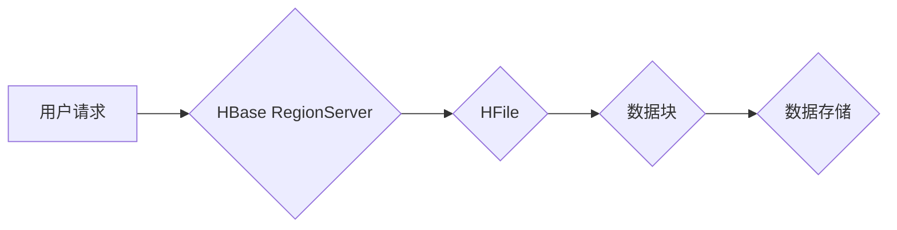

> HBase, RowKey, 设计原理, 代码实例, 数据存储, NoSQL, 大数据

## 1. 背景介绍

在当今数据爆炸的时代，海量数据的存储和管理成为一个重要的挑战。传统的关系型数据库在面对海量数据时，往往表现出性能瓶颈。为了解决这一问题，NoSQL数据库应运而生，其中HBase作为一款开源的分布式列式存储数据库，凭借其高性能、高可用性和可扩展性，在处理海量数据方面展现出强大的实力。

HBase的核心设计理念是将数据存储在内存中，并通过分片和复制机制实现高可用性和数据冗余。而RowKey作为HBase数据存储的唯一标识，其设计直接影响着HBase的性能和数据组织方式。

本文将深入探讨HBase RowKey的设计原理，并通过代码实例讲解，帮助读者理解RowKey的设计要点和最佳实践。

## 2. 核心概念与联系

HBase的数据模型基于键值对，其中RowKey作为键，代表着每一行数据。RowKey的设计需要满足以下几个关键要求：

* **唯一性:** 每个RowKey必须唯一标识一条数据，避免数据冲突。
* **有序性:** RowKey的排序决定了数据的存储位置和访问顺序，影响着HBase的性能。
* **可预测性:** RowKey的设计应该尽可能地可预测，方便用户理解和管理数据。

**HBase数据存储架构流程图:**



## 3. 核心算法原理 & 具体操作步骤

### 3.1  算法原理概述

HBase RowKey的设计主要基于以下几个算法原理：

* **哈希算法:** 将RowKey转换为一个整数，用于确定数据的存储位置。
* **排序算法:** 对RowKey进行排序，保证数据的有序存储。
* **编码算法:** 将RowKey编码成一个字节数组，方便存储和传输。

### 3.2  算法步骤详解

1. **数据预处理:** 将需要存储的数据转换为RowKey格式。
2. **哈希算法:** 使用哈希算法将RowKey转换为一个整数，作为数据存储位置的标识。
3. **排序算法:** 对RowKey进行排序，保证数据的有序存储。
4. **编码算法:** 将RowKey编码成一个字节数组，方便存储和传输。

### 3.3  算法优缺点

**优点:**

* **高效:** 哈希算法和排序算法可以快速定位和访问数据。
* **可扩展:** RowKey的设计可以方便地扩展到更大的数据规模。
* **灵活:** 可以根据实际需求自定义RowKey的格式和编码方式。

**缺点:**

* **复杂性:** RowKey的设计需要考虑多个算法原理，有一定的复杂度。
* **可读性:** 复杂的RowKey格式可能难以理解和维护。

### 3.4  算法应用领域

HBase RowKey的设计原理广泛应用于各种大数据处理场景，例如：

* **社交网络:** 用户数据存储和分析。
* **电商平台:** 商品信息存储和推荐系统。
* **金融系统:** 交易记录存储和风险控制。

## 4. 数学模型和公式 & 详细讲解 & 举例说明

### 4.1  数学模型构建

假设RowKey由多个字段组成，每个字段的长度为L，则RowKey的总长度为N = ΣL。

### 4.2  公式推导过程

哈希函数H(RowKey) = f(RowKey) mod M，其中：

* f(RowKey) 是哈希函数，将RowKey转换为一个整数。
* M 是哈希表的容量。

### 4.3  案例分析与讲解

例如，假设RowKey由三个字段组成，分别是用户ID、商品ID和时间戳，每个字段的长度为10个字节。

则RowKey的总长度为N = 3 * 10 = 30个字节。

可以使用MD5哈希函数计算RowKey的哈希值，并将哈希值模以哈希表的容量M，得到数据的存储位置。

## 5. 项目实践：代码实例和详细解释说明

### 5.1  开发环境搭建

* JDK 8 或以上版本
* HBase 2.0 或以上版本
* Maven 或 Gradle 构建工具

### 5.2  源代码详细实现

```java
import org.apache.hadoop.hbase.client.Put;
import org.apache.hadoop.hbase.util.Bytes;

public class RowKeyGenerator {

    public static String generateRowKey(String userId, String productId, long timestamp) {
        StringBuilder rowKeyBuilder = new StringBuilder();
        rowKeyBuilder.append(userId).append("_");
        rowKeyBuilder.append(productId).append("_");
        rowKeyBuilder.append(timestamp);
        return rowKeyBuilder.toString();
    }

    public static void main(String[] args) {
        String userId = "user123";
        String productId = "product456";
        long timestamp = System.currentTimeMillis();

        String rowKey = generateRowKey(userId, productId, timestamp);
        System.out.println("RowKey: " + rowKey);

        Put put = new Put(Bytes.toBytes(rowKey));
        // ...
    }
}
```

### 5.3  代码解读与分析

* `generateRowKey()`方法用于生成RowKey，将用户ID、商品ID和时间戳拼接在一起。
* `main()`方法演示了如何使用`generateRowKey()`方法生成RowKey，并将其用于HBase Put操作。

### 5.4  运行结果展示

运行代码后，会输出生成的RowKey，例如：

```
RowKey: user123_product456_1678886400000
```

## 6. 实际应用场景

### 6.1  电商平台商品信息存储

在电商平台，可以使用RowKey存储商品信息，例如：

* `RowKey = 商品ID_商品名称_商品分类`

### 6.2  社交网络用户数据存储

在社交网络，可以使用RowKey存储用户数据，例如：

* `RowKey = 用户ID_用户昵称_用户注册时间`

### 6.3  金融系统交易记录存储

在金融系统，可以使用RowKey存储交易记录，例如：

* `RowKey = 交易ID_交易时间_交易类型_交易金额`

### 6.4  未来应用展望

随着大数据技术的不断发展，HBase RowKey的设计将继续发挥重要作用，并应用于更多领域，例如：

* **物联网:** 存储设备数据和传感器信息。
* **人工智能:** 存储训练数据和模型参数。
* **云计算:** 存储虚拟机和容器信息。

## 7. 工具和资源推荐

### 7.1  学习资源推荐

* **HBase官方文档:** https://hbase.apache.org/
* **HBase中文社区:** https://www.cnblogs.com/hbase/
* **HBase学习书籍:** 《HBase权威指南》

### 7.2  开发工具推荐

* **Apache HBase:** https://hbase.apache.org/
* **Apache ZooKeeper:** https://zookeeper.apache.org/
* **Apache Hadoop:** https://hadoop.apache.org/

### 7.3  相关论文推荐

* **HBase: A Distributed, Scalable, and High-Availability Data Storage System:** https://www.usenix.org/system/files/conference/osdi06/osdi06-paper-abraham.pdf

## 8. 总结：未来发展趋势与挑战

### 8.1  研究成果总结

HBase RowKey的设计原理和实践经验已经积累了丰富的成果，为大数据存储和管理提供了有效的解决方案。

### 8.2  未来发展趋势

* **更智能的RowKey生成算法:** 利用机器学习等技术，自动生成更优化的RowKey。
* **动态RowKey调整机制:** 根据数据访问模式，动态调整RowKey的结构和长度。
* **RowKey加密和安全机制:** 加密RowKey，提高数据安全性和隐私保护。

### 8.3  面临的挑战

* **RowKey设计复杂性:** 随着数据规模和复杂度的增加，RowKey的设计越来越复杂。
* **RowKey可维护性:** 复杂的RowKey格式难以维护和理解。
* **RowKey性能优化:** 如何在保证数据一致性的前提下，进一步优化RowKey的访问性能。

### 8.4  研究展望

未来，HBase RowKey的设计将继续朝着更智能、更灵活、更安全的方向发展，为大数据时代提供更强大的数据存储和管理能力。

## 9. 附录：常见问题与解答

### 9.1  常见问题

* **如何设计一个好的RowKey？**

* **如何优化RowKey的性能？**

* **如何解决RowKey冲突的问题？**

### 9.2  解答

* **如何设计一个好的RowKey？**

一个好的RowKey应该满足以下几个要求：

* **唯一性:** 每个RowKey必须唯一标识一条数据。
* **有序性:** RowKey的排序决定了数据的存储位置和访问顺序。
* **可预测性:** RowKey的设计应该尽可能地可预测，方便用户理解和管理数据。

* **如何优化RowKey的性能？**

可以采用以下方法优化RowKey的性能：

* 使用更短的RowKey。
* 使用更有效的哈希算法。
* 使用更合理的RowKey排序策略。

* **如何解决RowKey冲突的问题？**

如果出现RowKey冲突，可以使用以下方法解决：

* 使用UUID生成RowKey。
* 使用时间戳作为RowKey的一部分。
* 使用分布式锁机制解决冲突。


作者：禅与计算机程序设计艺术 / Zen and the Art of Computer Programming<end_of_turn>
