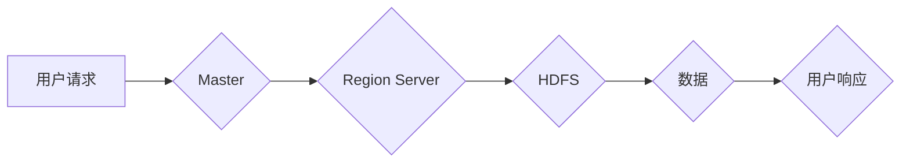

> HBase, NoSQL, Hadoop, Big Data, Column-Family, Distributed, Storage, Apache, Java

## 1. 背景介绍

在海量数据时代，传统的关系型数据库难以满足对高性能、高可用性和大规模存储的需求。NoSQL数据库应运而生，其中HBase作为一款基于Hadoop的开源分布式列式存储系统，凭借其高吞吐量、高可用性和可扩展性，在处理海量数据方面展现出强大的实力。

HBase的出现，为大数据处理领域提供了新的解决方案，它被广泛应用于社交网络、电商平台、金融交易等领域，为用户提供快速、高效的数据存储和查询服务。

## 2. 核心概念与联系

HBase基于Hadoop生态系统，其核心概念包括：

* **Hadoop Distributed File System (HDFS):** HBase依赖于HDFS进行数据存储，将数据分片存储在集群中的多个节点上，实现数据冗余和高可用性。
* **Region Server:** HBase的数据存储单元，负责管理和处理数据，每个Region Server负责管理一部分数据区域（Region）。
* **Region:** HBase将数据划分为多个Region，每个Region包含一系列行键，并存储在HDFS中。
* **ZooKeeper:** HBase使用ZooKeeper作为协调服务，用于管理Region Server的启动、停止和数据分配。
* **Master:** HBase的管理节点，负责协调Region Server的工作，管理Region的分配和数据均衡。

**HBase架构流程图:**



## 3. 核心算法原理 & 具体操作步骤

### 3.1  算法原理概述

HBase的核心算法原理是基于**列式存储**和**分片存储**的思想。

* **列式存储:** HBase将数据按照列进行存储，每个列族包含一系列列，每个行键对应一系列列族，从而实现高效的列查询。
* **分片存储:** HBase将数据划分为多个Region，每个Region存储在不同的Region Server上，实现数据分布式存储和并行处理。

### 3.2  算法步骤详解

1. **数据写入:** 用户向HBase写入数据时，首先需要指定行键、列族和列名。
2. **Region分配:** Master根据行键的哈希值将数据分配到相应的Region Server上。
3. **数据存储:** Region Server将数据写入HDFS中，并维护数据索引。
4. **数据查询:** 用户查询数据时，首先需要指定行键、列族和列名。
5. **Region查找:** Master根据行键的哈希值查找相应的Region Server。
6. **数据读取:** Region Server从HDFS中读取数据，并返回给用户。

### 3.3  算法优缺点

**优点:**

* 高吞吐量: 列式存储和分片存储能够提高数据读写速度。
* 高可用性: 数据分布式存储和冗余机制能够保证数据可用性。
* 可扩展性: HBase能够轻松扩展到更大的集群规模。

**缺点:**

* 数据模型限制: HBase的数据模型相对简单，不适合复杂的数据关系。
* 查询复杂度: 对跨多个Region的查询操作性能较低。

### 3.4  算法应用领域

HBase广泛应用于以下领域:

* 社交网络: 用户数据存储和分析
* 电商平台: 商品信息存储和推荐系统
* 金融交易: 交易记录存储和风险控制
* 物联网: 设备数据存储和分析

## 4. 数学模型和公式 & 详细讲解 & 举例说明

### 4.1  数学模型构建

HBase的数据存储模型可以抽象为一个二维矩阵，其中：

* 行键作为矩阵的行索引
* 列族作为矩阵的列索引
* 数据值作为矩阵的单元格值

### 4.2  公式推导过程

HBase的Region分配算法基于行键的哈希值，可以表示为：

```latex
RegionID = hash(RowKey) % NumberOfRegions
```

其中：

* `RegionID` 表示Region的ID
* `RowKey` 表示行键
* `NumberOfRegions` 表示Region的总数

### 4.3  案例分析与讲解

假设我们有一个HBase集群，包含3个Region Server，每个Region Server负责管理1/3的数据区域。

如果我们有一个行键为`user123`的数据，则其RegionID可以计算为：

```
RegionID = hash("user123") % 3
```

如果`hash("user123")`的结果为10，则`RegionID`为1，表示该数据应该存储在第一个Region Server上。

## 5. 项目实践：代码实例和详细解释说明

### 5.1  开发环境搭建

* Java Development Kit (JDK)
* Apache Hadoop
* Apache HBase

### 5.2  源代码详细实现

```java
// 创建HBase连接
Connection connection = ConnectionFactory.createConnection();

// 创建表
TableDescriptorBuilder tableDescriptorBuilder = TableDescriptorBuilder.newBuilder(TableName.valueOf("mytable"));
// 添加列族
tableDescriptorBuilder.setColumnFamily(ColumnFamilyDescriptorBuilder.newBuilder("cf1").build());
// 创建表
Admin.createTable(tableDescriptorBuilder.build(), new byte[][] {});

// 写入数据
Put put = new Put(Bytes.toBytes("row1"));
put.addColumn(Bytes.toBytes("cf1"), Bytes.toBytes("col1"), Bytes.toBytes("value1"));
connection.getAdmin().put(put);

// 查询数据
Get get = new Get(Bytes.toBytes("row1"));
get.addColumn(Bytes.toBytes("cf1"), Bytes.toBytes("col1"));
Result result = connection.get(get);
String value = Bytes.toString(result.getValue(Bytes.toBytes("cf1"), Bytes.toBytes("col1")));
System.out.println(value);

// 关闭连接
connection.close();
```

### 5.3  代码解读与分析

* 代码首先创建HBase连接。
* 然后创建表，并添加列族。
* 使用Put对象写入数据，指定行键、列族和列名。
* 使用Get对象查询数据，指定行键、列族和列名。
* 最后关闭连接。

### 5.4  运行结果展示

运行上述代码后，将输出以下结果：

```
value1
```

## 6. 实际应用场景

HBase在实际应用场景中展现出强大的性能和可扩展性，例如：

* **社交网络:** 存储用户数据、好友关系、帖子内容等，实现高效的用户查询和数据分析。
* **电商平台:** 存储商品信息、用户购买记录、订单信息等，实现商品推荐、库存管理和订单处理。
* **金融交易:** 存储交易记录、账户信息、风险控制数据等，实现实时交易监控、风险评估和数据分析。

### 6.4  未来应用展望

随着大数据时代的到来，HBase的应用场景将更加广泛，例如：

* **物联网:** 存储设备数据、传感器数据、环境数据等，实现设备管理、数据分析和智能决策。
* **人工智能:** 存储训练数据、模型参数等，实现机器学习、深度学习和人工智能应用。

## 7. 工具和资源推荐

### 7.1  学习资源推荐

* **HBase官方文档:** https://hbase.apache.org/book.html
* **HBase中文文档:** http://hbase.apache.org/zh-cn/book.html
* **HBase学习视频:** https://www.youtube.com/results?search_query=hbase+tutorial

### 7.2  开发工具推荐

* **Apache HBase Shell:** 命令行工具，用于管理HBase集群和数据。
* **HBase Java API:** Java编程接口，用于开发HBase应用程序。
* **HBase Web UI:** Web界面，用于监控HBase集群状态和数据。

### 7.3  相关论文推荐

* **HBase: A Distributed, Scalable, Big Data Storage System:** https://www.usenix.org/system/files/conference/osdi09/osdi09-paper-abraham.pdf

## 8. 总结：未来发展趋势与挑战

### 8.1  研究成果总结

HBase作为一款开源分布式列式存储系统，在处理海量数据方面展现出强大的实力，其核心算法原理和架构设计具有创新性，并得到了广泛的应用。

### 8.2  未来发展趋势

* **数据压缩和优化:** 进一步优化数据压缩算法，降低存储成本和提高查询效率。
* **查询性能提升:** 研究并实现更高效的跨Region查询算法，提高查询性能。
* **支持更多数据类型:** 支持更多数据类型，例如地理空间数据、时间序列数据等。

### 8.3  面临的挑战

* **数据一致性:** 在分布式环境下，保证数据一致性仍然是一个挑战。
* **数据安全:** 保护数据安全和隐私也是一个重要问题。
* **运维复杂度:** HBase集群的运维和管理相对复杂。

### 8.4  研究展望

未来，HBase将继续朝着更高性能、更高可用性和更易于管理的方向发展，并将在更多领域发挥其作用。

## 9. 附录：常见问题与解答

* **HBase和MySQL的区别是什么？**

HBase是分布式列式存储系统，而MySQL是关系型数据库。HBase更适合处理海量数据，而MySQL更适合处理结构化数据。

* **HBase的Region是什么？**

Region是HBase数据存储的最小单元，每个Region存储在不同的Region Server上。

* **如何配置HBase集群？**

HBase集群的配置需要根据实际需求进行调整，包括HDFS配置、Region Server配置、Master配置等。

* **如何监控HBase集群？**

可以使用HBase Web UI、JMX监控等工具监控HBase集群状态和数据。


作者：禅与计算机程序设计艺术 / Zen and the Art of Computer Programming 
<end_of_turn>